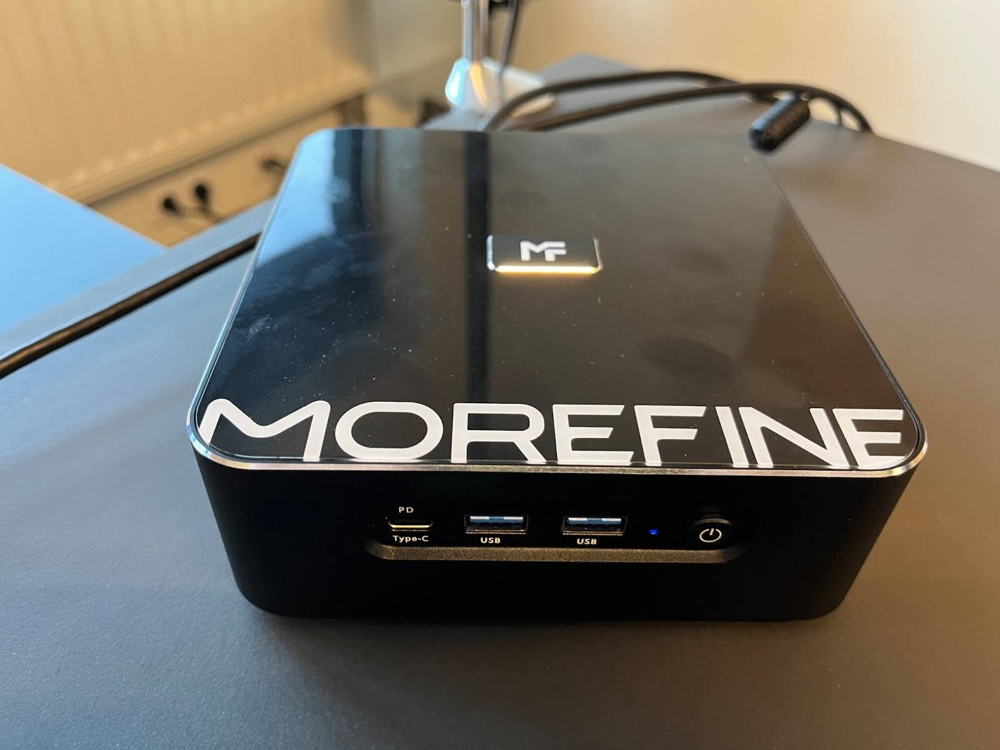
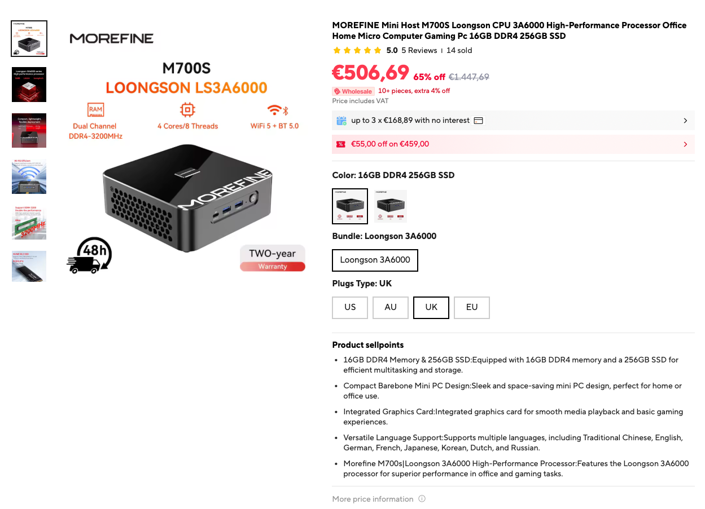
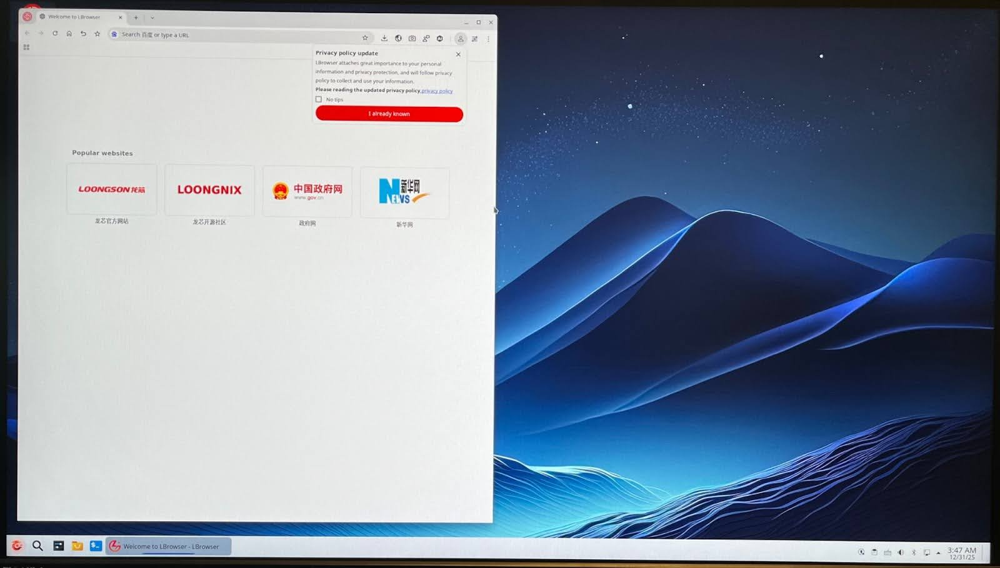

## 龙芯跑DuckDB被苹果芯片秒杀  
    
### 作者    
digoal    
    
### 日期    
2026-01-07    
    
### 标签    
PostgreSQL , DuckDB , 龙芯      
    
----    
    
## 背景    
在只有 Intel 和 AMD 的年代，我们似乎已经习惯了 CPU 市场的“波澜不惊”，直到这款带着“技术自主”光环的龙芯（LoongArch）杀到 DuckDB 创始人的办公桌上。  
  
创始人花了 500 欧元从阿里巴巴速卖通(AliExpress)搞到了这台 M700S，不仅是为了满足创始人的好奇心，更是要给 DuckDB 安排一场龙芯片下的“极限生存挑战”.  
  
面对比它贵得多的 M3 Max MacBook，这颗国产自研新星究竟是能出奇制胜，还是会被现实无情“打脸”？  
  
在这篇文章中，你会看到不仅有略显“复古”的系统槽点，更有真实到冒烟的 TPC-H 性能对决数据。相信我，测试结果可能会让你大吃一惊.  
  
无论你是觉得它“虽败犹荣”，还是觉得“路还很长”，这绝对是你读到最接地气的非主流CPU实测报告。  
  
提前剧透一下, **创始人最想吐槽的其实不是龙芯的性能, 而是那吵得让人头大的风扇**  
  
下面的内容翻译自: https://duckdb.org/2026/01/06/duckdb-on-loongarch-morefine  
  
## DuckDB on 龙芯 来了  
TL;DR：在今天的“你的桌面上有什么？”节目中，我们测试了一款采用 LoongArch 架构的 Loongson CPU。  
  
并非每天都能见到新的CPU架构出现在你的办公桌上。我成长于90年代初的Intel 486时代(这么说起来, 我都第一台电脑是win95, 台湾威盛的CPU, 内存才16MB.)。我还记得AMD在2000年发布了64位x86扩展架构。之后直到2020年苹果发布基于ARM的M1架构之前，CPU领域鲜有重大事件发生。但今天（对我来说）又是一个值得期待的日子，我们办公室终于迎来了期待已久的“MOREFINE M700S”。  
  
  
  
M700S 搭载了龙芯处理器。这款处理器也被称为“龙芯架构”或“神芯处理器”，由中国自主研发，基于（[略显深奥的](https://www.tomshardware.com/pc-components/cpus/chinese-chipmaker-loongson-wins-case-over-rights-to-mips-architecture-companys-new-cpu-architecture-heavily-resembles-existing-mips)）[MIPS架构](https://en.wikipedia.org/wiki/MIPS_architecture)。这是中国为实现技术自主而制定的“中国制造2025”计划的一部分，该计划由政府资助。  
  
鉴于目前贸易形势，可以合理推断，随着时间的推移，龙芯处理器在中国会越来越受欢迎。DuckDB 在中国已经拥有相当多的用户，因此我们自然希望确保 DuckDB 在龙芯处理器上能够良好运行。令人欣慰的是，我们的一位社区成员已经提交了一个[pull request](https://github.com/duckdb/duckdb/pull/19962)，其中只做了两处最小的改动，就足以让 DuckDB 编译通过。这让我们感到好奇。  
  
我们从速卖通上购买了这台 M700S，价格约为 500 欧元。除了龙芯 8 核 3A6000 CPU 外，它还配备了 16 GB 内存和 256 GB 固态硬盘。 (说实话挺贵的! 这个价格国内能买到16G的mac mini m4了吧?)     
  
  
  
插上电源启动后，除了风扇似乎一直运转、声音很大之外，一切都很正常。屏幕上显示的是一个名为[Loongnix](https://www.loongson.cn/EN/system/loongnix) 的 Debian 变体系统。图形用户界面似乎基于 KDE，并自带一个名为 “LBrowser” 的自定义浏览器，它是 Chromium 的一个分支。默认`root`密码是 `M700S`。此外，还有一个用户账户`m700s`也使用了相同的密码。  
  
  
  
总体而言，即使运行 `apt upgrade` 后，软件看起来也有些过时：Linux 内核版本似乎是 4.19，该版本发布于 2018 年，现已停止维护一年。GCC 版本为 8.3，同样发布于 2019 年。(看样子作者有些不懂企业市场, 企业级操作系统的内核都是很少变更的.)     
  
借助[上述补丁](https://github.com/duckdb/duckdb/pull/19962)，我们成功在 Loongnix 平台上编译了 DuckDB 1.4.3。过程中出现了一个小问题：CMake 文件 `append_metadata.cmake` 与 Loongnix 平台上的旧版本 CMake (3.13.4) 不兼容。不过，只需将该文件替换为空文件即可完成编译。当然，我们也可以更新 CMake，但时间有限。编译完成后，我们运行了 DuckDB 的大型单元测试套件 `make allunit` ，以确认我们的版本在 Loongson CPU 上运行正常。测试结果令人满意。  
  
为了进行性能对比，我们沿用了之前博文中在[树莓派](https://duckdb.org/2025/01/17/raspberryi-pi-tpch)上运行 DuckDB 的方法。简而言之，我们分别在“缩放因子”为 100 和 300 的情况下运行 22 个 TPC-H 基准测试查询，这在 DuckDB 格式中分别对应 25 GB 和 78 GB 的数据库文件。我们将这些结果与最接近的计算机进行比较，即我日常使用的配备 M3 Max CPU 的 MacBook Pro。为了公平起见，我们将两个平台上的 DuckDB 内存限制为 14 GB。所报告的运行时间为“热运行”时间，这意味着我们重新运行了查询集，并取第二次运行的时间。  
  
以下是结果，并不理想。我们先来看汇总时间：  
  
SF  | System  | Geometric mean  | Sum  
---|---|---|---  
SF100    | MacBook  | 0.6  | 16.9  
SF100    | MOREFINE     | 6.1 |  192.8  
SF300    | MacBook  | 2.8  | 78.8  
SF300    | MOREFINE    |  27.3   |   791.6  
  
我们可以看到，在这项基准测试中，MacBook 的速度大约是 MOREFINE 的 10 倍，无论是运行时间的几何平均值还是总和。  
  
各个查询的运行时间。  
  
Q   | SF100/MacBook   | SF100/MOREFINE  | SF300/MacBook   | SF300/MOREFINE  
---|---|---|---|---  
1   | 1.247   | 7.363   | 4.528   | 26.475  
2   | 0.117   | 1.058   | 0.474   | 4.101  
3   | 0.697   | 8.563   | 2.759   | 32.432  
4   | 0.570   | 7.348   | 2.331   | 27.185  
5   | 0.631   | 8.498   | 3.217   | 34.462  
6   | 0.180   | 1.236   | 1.395   | 13.225  
7   | 0.620   | 7.702   | 3.119   | 37.411  
8   | 0.640   | 5.593   | 3.611   | 29.914  
9   | 1.906   | 30.560  | 6.670   | 99.884  
10  | 0.923   | 11.755  | 4.036   | 40.412  
11  | 0.102   | 1.037   | 0.709   | 4.444  
12  | 0.535   | 6.422   | 2.918   | 31.501  
13  | 1.847   | 21.185  | 6.394   | 74.081  
14  | 0.408   | 5.616   | 3.240   | 26.613  
15  | 0.252   | 2.652   | 1.906   | 17.454  
16  | 0.273   | 3.108   | 0.879   | 11.480  
17  | 0.805   | 5.184   | 4.655   | 28.469  
18  | 1.538   | 15.492  | 7.619   | 71.845  
19  | 0.779   | 9.143   | 4.379   | 39.111  
20  | 0.441   | 4.993   | 3.234   | 25.967  
21  | 1.996   | 23.231  | 9.503   | 96.452  
22  | 0.441   | 5.036   | 1.237   | 18.709  
  
在新的平台上运行 DuckDB 总是令人兴奋的。当然，我们设计 DuckDB 的初衷就是使其具有极强的可移植性，并且能够兼容各种硬件环境，同时还能提供卓越的性能。因此，DuckDB 在配备了较新 CPU 的 MOREFINE 上运行起来并不困难，这并不令人意外。然而，在标准的 TPC-H 基准测试中，其性能表现并不尽如人意，MacBook 的速度大约是 MOREFINE 的 10 倍。  
  
当然，还有许多改进空间。首先，gccLoongArch 的 `gcc` 工具链与 x86/ARM 版本相比可能远不够成熟，因此这方面的改进可能会带来显著的性能提升。I/O 性能也是如此，我们尚未对其进行单独测试。不过，乐观的一面也足以证明，龙芯 CPU 完全可以完成 TPC-H SF300 测试！  
  
有人可能会说，MacBook Pro 比 500 欧元的 MOREFINE 贵得多。然而，配置相同的 M4 Mac Mini（内存和存储规格相同）售价约为 700 欧元，考虑到各方面因素，其实贵不了多少。它的性能远胜 MOREFINE，而且风扇也不会一直吵得你心烦。  
  
你怎么看?    
  
从芯片到编译器和系统, 这个是个庞大的生态, 要让软件跑得欢快, 还真是有很多路要走. 但是路走对了就不怕, 只是时间问题, 期待国产全生态的崛起.    
    
