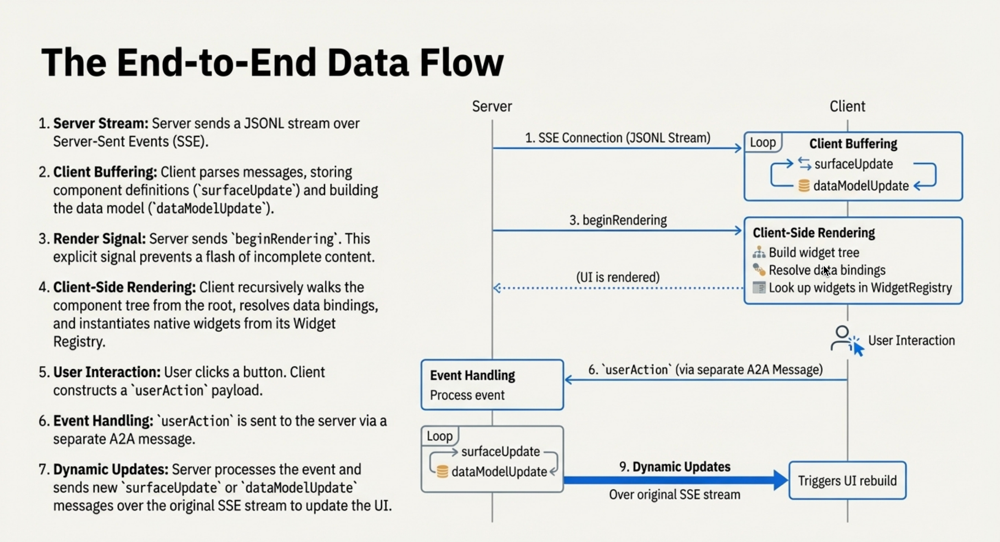
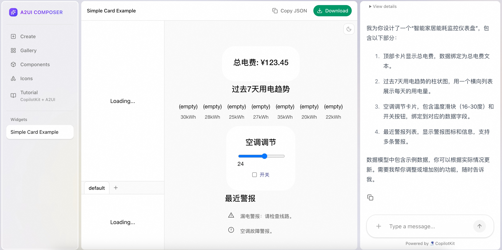

## 谷歌开源A2UI, AI交互进入下一阶段: 和冷冰冰的文字说拜拜  
              
### 作者              
digoal              
              
### 日期              
2026-01-07              
              
### 标签              
google , A2UI , 乐高零件 , 组装手册 , 组装工厂 , 可视化组建 , 渲染手册 , 渲染工具                 
              
----              
              
## 背景   
现在的AI和你沟通, 只有文字对吧, 顶多再一些markdown支持的表格、公式、或者mermaid渲染的可视化图形.   
  
俗话说一图胜千言!     
  
我们的前端渲染工具(例如web浏览器, flutter, react, vue, swiftui)很强大啊, 有没有可能让AI返回的是可以在前端工具上进行渲染的代码呢? 然后通过前端工具渲染出来, 图文并茂的返回.    
  
谷歌近期开源的A2UI就实现了这点, 返回JSON代码(可被各种前端进行渲染), 而且能通过A2A协议在多个Agent之间进行传递, 完成更加复杂的处理任务.    
  
因为大多数人并不懂设计, A2UI可能不是给最终用户直接使用的, 而是给更上层的AI使用的.  例如让上层AI理解用户意图, 然后根据A2UI的样式生成提示词, 然后再给A2UI进行生成.   
  
A2UI开源项目如下  
  
https://github.com/google/A2UI/blob/main/README.md  
  
可在如下地址中体验A2UI  
  
https://a2ui-composer.ag-ui.com/  
  
目前使用很广泛的genui在后端也使用了A2UI技术  
  
https://github.com/flutter/genui  
  
---  
  
## A2UI 介绍  
  
**A2UI**（Agent-to-User Interface）是 Google 发起的一个开源项目，它的目标是**让 AI 智能体（Agent）能够直接“变”出漂亮的网页界面或 APP 菜单，而不仅仅是回你一段文字。**  
  
如果把现在的 AI 聊天比作“发短信”，那么 A2UI 就像是让 AI 学会了“发一个小程序”。  
  
### 1. 它解决了什么痛点？  
  
现在的 AI（如 ChatGPT 或 Gemini）虽然很聪明，但它们主要擅长输出文字或代码。  
  
* **现在的尴尬**：如果你让 AI 帮订餐，它会回你一大堆文字描述。如果你想选菜，得一行行读文字，非常累。  
* **A2UI 的方案**：AI 直接在聊天窗口里弹出一个精美的“点餐列表”，带图片、滑动条、复选框和确认按钮。你点一下按钮，操作就完成了。  
  
### 2. A2UI 是怎么工作的？（三个关键词）  
  
* **“说”的是数据（JSON）**：AI 并不直接写复杂的网页代码（那太慢且危险），它只是发出一串简单的指令。例如：“给我画个按钮，文字写‘提交’，颜色是蓝色的。”  
* **“画”的是本地组件**：你的手机或浏览器（客户端）里预装了一套“零件库”。当它收到 AI 的指令时，会用本地最流畅、最安全的组件把界面画出来。  
* **安全第一**：因为 AI 发过来的是“说明书”而不是“可执行程序”，所以它不会像运行乱码或病毒那样搞坏你的电脑。  
  
### 3. A2UI 的“超能力”  
  
* **像搭积木一样高效**：AI 可以只更新界面的一小部分。比如你填完表单，AI 只把“确认”按钮变成“已发送”，而不需要刷新整个页面。  
* **跨平台通用**：同一套 AI 生成的指令，在 Android 手机上看起来像 Android 原生应用，在网页上看起来像网页，非常专业。  
* **随叫随到**：它可以根据你的聊天内容实时生成界面。比如你说“我要买机票”，它瞬间给你变出一个航班选择器；你说“我想看数据统计”，它立刻变出一个图表。  
  
### 4. 谁会用到它？  
  
* **开发者**：不需要为每种可能的情况写死代码，让 AI 灵活地为用户生成交互界面。  
* **普通用户**：以后跟 AI 沟通不再是“你一言我一语”的枯燥对话，而是像使用一个**会进化的超级 APP**，功能界面随你的需求实时生成。  
  
### 5. 类比理解  
  
* **普通 AI 聊天**：你给餐厅打电话订餐，服务员口头给你报菜单（纯文字）。  
* **A2UI 模式**：你跟服务员说要点餐，他立刻递给你一个可以勾选、带图的纸质菜单（交互式 UI）。  
  
A2UI 是给 AI 准备的一套**“UI 翻译官”**。它让 AI 能够以一种安全、快速、美观的方式，把复杂的信息变成你伸手就能点的按钮和表单。目前它还处于早期预览阶段（v0.8），但代表了未来 AI 交互的大趋势。  
  
## 用乐高工厂来理解A2UI  
可以这么理解a2ui吗? 类似于我有一堆乐高零件, A2UI根据我的需求, 返回的是组装手册, 我的UI工具根据这个组装手册完成了组装并展示给我最终的成品.  
  
这个理解**极其精准**，甚至可以直接作为 A2UI 的非官方标准比喻！  
  
为了让这个“乐高比喻”更加完整和深刻，我们可以顺着这个思路把几个核心技术概念对号入座：  
  
### 1. 乐高零件库 = 客户端组件库 (Client Catalog)  
  
你的设备（手机、浏览器）里预先存好了各种“零件”：按钮零件、输入框零件、卡片背景零件、图片展示零件。这些零件是**安全、可信且高质量**的。  
  
### 2. 组装手册 = A2UI JSON 数据 (Declarative JSON)  
  
AI 并不是直接寄给你一坨塑料（代码），而是寄给你一份 **JSON 格式的手册**。  
  
手册里会写：  
  
* 第一步：拿一个“蓝色按钮”零件。  
* 第二步：在零件上面贴上“确认订餐”的标签。  
* 第三步：把它放在屏幕右下角。  
  
### 3. 为什么这个“手册”模式很高级？  
  
* **安全（不夹带私货）**：如果你直接给代码（送成品），AI 可能会在成品里藏个“炸弹”（恶意脚本）。但现在 AI 只给手册，你用**自己家里**的零件组装，AI 没法掉包你的零件，所以非常安全。  
* **跨平台（说明书通用）**：这份“组装手册”是通用的。如果你用的是大号乐高（Web 网页），你就按手册拼大号的；如果你用的是小号乐高（手机 App），你就按手册拼个精致小巧的。**手册逻辑是一样的，但成品长相随平台自适应。**  
* **增量更新（改个零件不用拆全家）**：如果你想把“确认订餐”改成“取消订单”，AI 不需要重发整本手册，只需要发个“补丁”说：**“把第 3 步那个零件的标签换一下”**。这就实现了 A2UI 强调的“增量更新”。  
  
如果你以后要给别人介绍 A2UI，用你这个**“乐高零件 + 组装手册”**的说法，绝对能让人秒懂。  
   
A2UI 数据流如下:         
  
https://a2ui.org/concepts/data-flow/  
  
```
Agent (LLM) → A2UI Generator → Transport (SSE/WS/A2A)
                                      ↓
Client (Stream Reader) → Message Parser → Renderer → Native UI
```
  
   
  
---  
  
## 如何使用A2UI呢  
  
能看懂说明书的UI渲染工具有哪些?   
  
零件需要先进行预设吗?   
  
AI 知道我已经预设了哪些零件吗?   
  
最后给一段JSON代码看看.   
  
### 1. 能看懂“组装手册”的渲染工具有哪些？  
  
目前 A2UI 还是一个较新的标准（v0.8 预览版），官方和社区正在适配主流的开发框架。目前能“翻译”这份手册的工具主要有：  
  
* **Web 端（Lit/HTML）**：官方提供了基于 Lit 框架的渲染器，可以直接在浏览器里把 JSON 变成网页组件。  
* **Flutter (GenUI)**：这是目前最成熟的适配方案。Google 的 Flutter 团队推出了 **GenUI SDK**，专门用来把 A2UI 手册变成流畅的手机原生界面。  
* **React / Vue / SwiftUI**：这些框架的渲染器目前大多处于社区开发或 Roadmap 计划中，未来会像“多语言说明书”一样普及。  
  
### 2. 零件需要预设吗？  
  
**必须预设。** 在 A2UI 的世界里，这被称为 **“组件目录（Component Catalog）”**。  
  
* **为什么？** 出于**安全性**。如果 AI 能随便定义零件，它可能会造出一个带病毒的零件。  
* **做法**：你（开发者）需要先在你的 App 里写好真正的乐高零件（代码实现）。比如你写好了一个叫 `my-custom-button` 的按钮，并规定它接受“文字”和“颜色”两个参数。  
* **灵活性**：A2UI 允许你注册“智能包装器（Smart Wrapper）”，你可以把以前写好的旧组件“包装”成 A2UI 认识的零件。  
  
### 3. AI 知道我已经预设了哪些零件吗？  
  
**AI 默认是不知道的，你得“告诉”它。**  
  
这就是 AI 开发中的“Prompt Engineering（提示工程）”或“System Instruction（系统指令）”。  
  
通常的做法是：  
  
1. **传清单**：在对话开始前，你会给 AI 发一份“零件清单”（通常是 JSON Schema 格式），告诉它：“嘿，我这里只有红色的圆块、蓝色的方块和透明的底座，请只用这些零件给我写手册。”  
2. **约束输出**：通过技术手段强制要求 AI 输出的 JSON 必须符合这份清单的规范。如果 AI 调皮写了一个你没有的零件，渲染器就会报错或者忽略它。  
  
### 4. A2UI “组装手册”示例（JSON）  
  
这是一段典型的 A2UI 代码，它描述了一个简单的“餐厅卡片”：  
  
```json  
{  
  "version": "0.8",  
  "components": [  
    {  
      "id": "restaurant_card_01",  
      "type": "card",  
      "properties": {  
        "elevation": 2,  
        "padding": 16  
      },  
      "children": [  
        {  
          "id": "title_text",  
          "type": "text",  
          "properties": {  
            "value": "美味披萨店",  
            "style": "headline"  
          }  
        },  
        {  
          "id": "rating_row",  
          "type": "row",  
          "children": [  
            {  
              "id": "star_icon",  
              "type": "icon",  
              "properties": { "name": "star", "color": "#FFD700" }  
            },  
            {  
              "id": "score",  
              "type": "text",  
              "properties": { "value": "4.8 (200+ 评价)" }  
            }  
          ]  
        },  
        {  
          "id": "order_btn",  
          "type": "button",  
          "properties": {  
            "label": "立即下单",  
            "variant": "primary"  
          },  
          "events": {  
            "onTap": "action_order_pizza"  
          }  
        }  
      ]  
    }  
  ]  
}  
```  
  
**这段代码的意思是：**  
  
* **外壳**：我要一个带阴影的卡片（Card）。  
* **内部**：  
* 第一行是一个大标题“美味披萨店”。  
* 第二行是一个横向排列（Row），里面放一个星星图标和评分文字。  
* 第三行是一个蓝色按钮，上面写着“立即下单”，点击它会触发一个叫 `action_order_pizza` 的动作。  
  
  
**渲染工具看到这段 JSON 后，就会去寻找你预设好的 `card`、`text`、`row` 和 `button` 零件，把它们像乐高一样拼起来展示给用户。**  
  
## DEMO  
请为我设计一个“智能家居能耗监控仪表盘”。 要求包含：一个显示总电费的顶部卡片、一个显示过去 7 天用电趋势的柱状图、一个空调调节开关（包含温度滑块和开关按钮），以及一个最近警报列表。  
  
https://a2ui-composer.ag-ui.com/  
  
效果如下:  
  
  
  
JSON代码如下:  
```  
[  
  {  
    "id": "root",  
    "component": {  
      "Column": {  
        "children": {  
          "explicitList": [  
            "topCard",  
            "usageChart",  
            "acControl",  
            "alertList"  
          ]  
        },  
        "distribution": "start",  
        "alignment": "center"  
      }  
    }  
  },  
  {  
    "id": "topCard",  
    "component": {  
      "Card": {  
        "child": "totalCostText"  
      }  
    }  
  },  
  {  
    "id": "totalCostText",  
    "component": {  
      "Text": {  
        "text": {  
          "path": "/dashboard/totalCost"  
        },  
        "usageHint": "h2"  
      }  
    }  
  },  
  {  
    "id": "usageChart",  
    "component": {  
      "Column": {  
        "children": {  
          "explicitList": [  
            "chartTitle",  
            "chartBars"  
          ]  
        },  
        "distribution": "start",  
        "alignment": "center"  
      }  
    }  
  },  
  {  
    "id": "chartTitle",  
    "component": {  
      "Text": {  
        "text": {  
          "literalString": "过去7天用电趋势"  
        },  
        "usageHint": "h3"  
      }  
    }  
  },  
  {  
    "id": "chartBars",  
    "component": {  
      "List": {  
        "children": {  
          "template": {  
            "componentId": "barTemplate",  
            "dataBinding": "/dashboard/usageLast7Days"  
          }  
        },  
        "direction": "horizontal",  
        "alignment": "end"  
      }  
    }  
  },  
  {  
    "id": "barTemplate",  
    "component": {  
      "Column": {  
        "children": {  
          "explicitList": [  
            "barLabel",  
            "barValue"  
          ]  
        },  
        "distribution": "end",  
        "alignment": "center"  
      }  
    }  
  },  
  {  
    "id": "barLabel",  
    "component": {  
      "Text": {  
        "text": {  
          "path": "./label"  
        },  
        "usageHint": "caption"  
      }  
    }  
  },  
  {  
    "id": "barValue",  
    "component": {  
      "Text": {  
        "text": {  
          "path": "./value"  
        },  
        "usageHint": "body"  
      }  
    }  
  },  
  {  
    "id": "acControl",  
    "component": {  
      "Card": {  
        "child": "acControlContent"  
      }  
    }  
  },  
  {  
    "id": "acControlContent",  
    "component": {  
      "Column": {  
        "children": {  
          "explicitList": [  
            "acTitle",  
            "tempSlider",  
            "powerSwitch"  
          ]  
        },  
        "distribution": "start",  
        "alignment": "center"  
      }  
    }  
  },  
  {  
    "id": "acTitle",  
    "component": {  
      "Text": {  
        "text": {  
          "literalString": "空调调节"  
        },  
        "usageHint": "h3"  
      }  
    }  
  },  
  {  
    "id": "tempSlider",  
    "component": {  
      "Slider": {  
        "value": {  
          "path": "/dashboard/acTemperature"  
        },  
        "minValue": 16,  
        "maxValue": 30  
      }  
    }  
  },  
  {  
    "id": "powerSwitch",  
    "component": {  
      "CheckBox": {  
        "label": {  
          "literalString": "开关"  
        },  
        "value": {  
          "path": "/dashboard/acPower"  
        }  
      }  
    }  
  },  
  {  
    "id": "alertList",  
    "component": {  
      "Column": {  
        "children": {  
          "explicitList": [  
            "alertTitle",  
            "alerts"  
          ]  
        },  
        "distribution": "start",  
        "alignment": "start"  
      }  
    }  
  },  
  {  
    "id": "alertTitle",  
    "component": {  
      "Text": {  
        "text": {  
          "literalString": "最近警报"  
        },  
        "usageHint": "h3"  
      }  
    }  
  },  
  {  
    "id": "alerts",  
    "component": {  
      "List": {  
        "children": {  
          "template": {  
            "componentId": "alertItemTemplate",  
            "dataBinding": "/dashboard/alerts"  
          }  
        },  
        "direction": "vertical",  
        "alignment": "start"  
      }  
    }  
  },  
  {  
    "id": "alertItemTemplate",  
    "component": {  
      "Row": {  
        "children": {  
          "explicitList": [  
            "alertIcon",  
            "alertText"  
          ]  
        },  
        "distribution": "start",  
        "alignment": "center"  
      }  
    }  
  },  
  {  
    "id": "alertIcon",  
    "component": {  
      "Icon": {  
        "name": {  
          "path": "./iconName"  
        }  
      }  
    }  
  },  
  {  
    "id": "alertText",  
    "component": {  
      "Text": {  
        "text": {  
          "path": "./message"  
        }  
      }  
    }  
  }  
]  
```  
     
有点意思, 未来AI APP又要升级了.    
    
  
#### [PolarDB 学习图谱](https://www.aliyun.com/database/openpolardb/activity "8642f60e04ed0c814bf9cb9677976bd4")
  
  
#### [PostgreSQL 解决方案集合](../201706/20170601_02.md "40cff096e9ed7122c512b35d8561d9c8")
  
  
#### [德哥 / digoal's Github - 公益是一辈子的事.](https://github.com/digoal/blog/blob/master/README.md "22709685feb7cab07d30f30387f0a9ae")
  
  
#### [About 德哥](https://github.com/digoal/blog/blob/master/me/readme.md "a37735981e7704886ffd590565582dd0")
  
  

  
