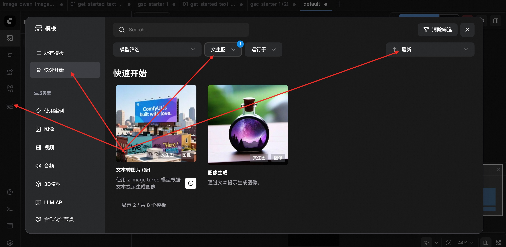
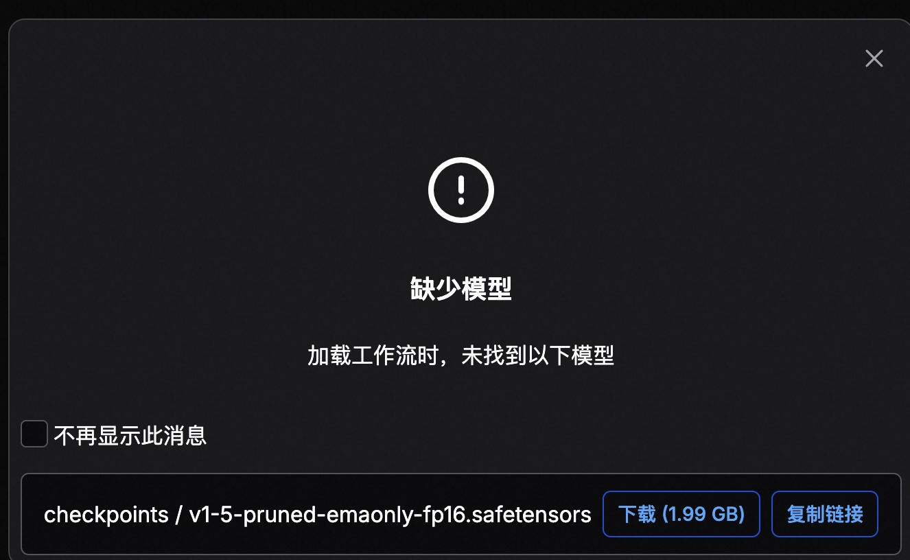
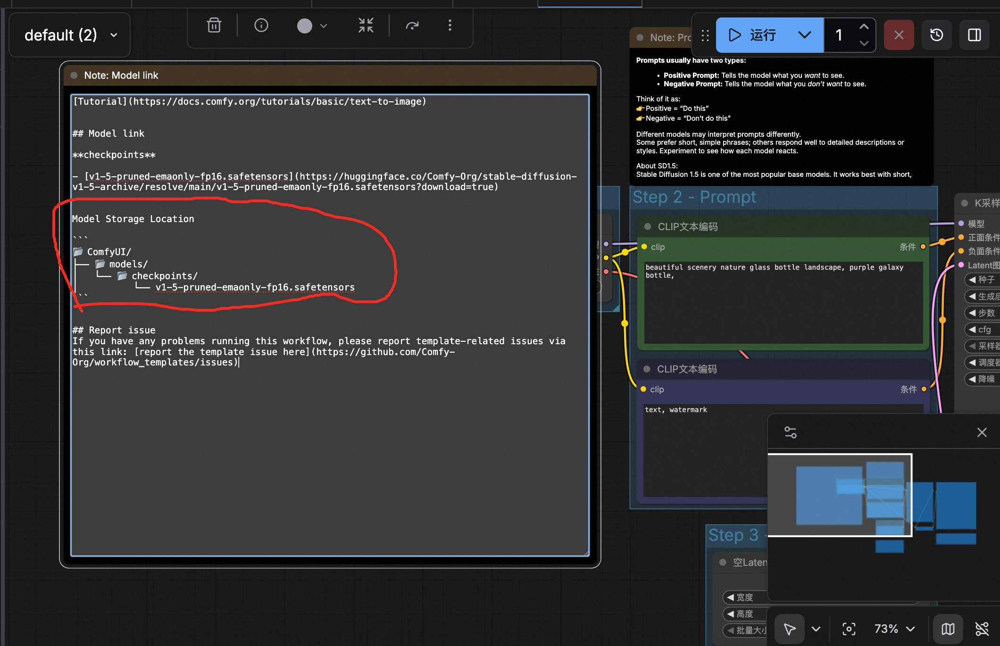
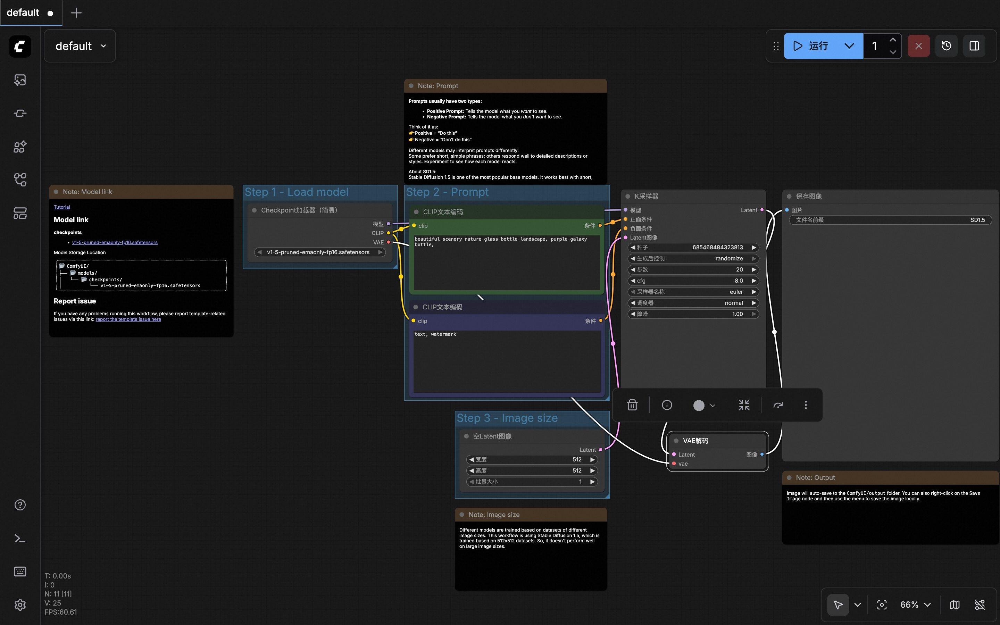
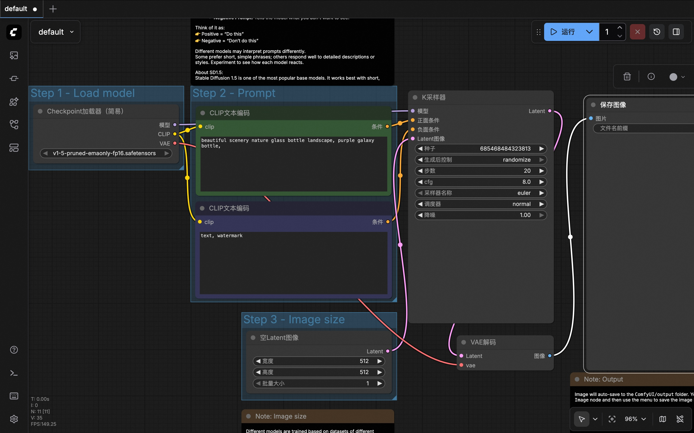

## macOS Apple silicon 音视图文多模态 AI 工具: ComfyUI     
                
### 作者                
digoal                
                
### 日期                
2026-01-08                
                
### 标签                
macOS , apple silicon , M系列芯片 , MPS , ComfyUI , 音视图文 , 多模态 , AI              
                
----                
                
## 背景     
昨天在 if club 直播间分享我 2025 年使用AI的总结, 其中提到了将blog转成音频播客, 2026年我想再进一步, 再次提升文章的阅读体验, 那就得上多模态了.   
  
2025年有几篇让我印象非常深刻的金仓的博客, 里面的漫画让人耳目一新, 当然传播量也非常的可观.  
  
终于找到一款可以在macOS apple silicon芯片上运行的多模态AI工具: ComfyUI.  
  
不仅能提升文章阅读体验, 同时还能学习一项新技能, 何乐不为?   
  
## 本地部署 ComfyUI  
1、假设你已经在macOS中安装了python 3最新版本.  
  
配置 pip 阿里云镜像  
  
```  
pip config set global.index-url https://mirrors.aliyun.com/pypi/simple/  
pip config list  
```  
  
2、下载最新 ComfyUI release  
  
```  
git clone --depth 1 -b v0.8.2 https://github.com/Comfy-Org/ComfyUI  
```  
  
3、安装 ComfyUI  
  
```  
cd ComfyUI  
  
pip install --force-reinstall torch torchvision torchaudio  
pip install -r requirements.txt  
```  
  
4、启动 ComfyUI  
```  
python main.py --force-fp16 --preview-method auto --lowvram  
```  
  
  
参数解释:   
```  
--lowvram 对 8GB/16GB 内存的 Mac 非常友好，能防止生成大图时系统卡死。  
  
--force-fp16: 强制使用半精度运算。M2 支持 fp16，这可以节省近一半的显存。  
  
--preview-method auto: 在生成过程中实时预览图片（可以看到生成的进度）。  
```  
  
启动日志解释:  
  
```  
$ python main.py --force-fp16 --preview-method auto --lowvram  
Checkpoint files will always be loaded safely.  
Total VRAM 16384 MB, total RAM 16384 MB  
pytorch version: 2.9.1  
Mac Version (15, 6, 1)  
Set vram state to: SHARED  
Device: mps  
Found comfy_kitchen backend cuda: {'available': False, 'disabled': True, 'unavailable_reason': 'Extension file not found: /Library/Frameworks/Python.framework/Versions/3.12/lib/python3.12/site-packages/comfy_kitchen/backends/cuda/_C.abi3.so', 'capabilities': []}  
Found comfy_kitchen backend eager: {'available': True, 'disabled': False, 'unavailable_reason': None, 'capabilities': ['apply_rope', 'apply_rope1', 'dequantize_nvfp4', 'dequantize_per_tensor_fp8', 'quantize_nvfp4', 'quantize_per_tensor_fp8', 'scaled_mm_nvfp4']}  
Found comfy_kitchen backend triton: {'available': False, 'disabled': True, 'unavailable_reason': "ImportError: No module named 'triton'", 'capabilities': []}  
Using sub quadratic optimization for attention, if you have memory or speed issues try using: --use-split-cross-attention  
Python version: 3.12.8 (v3.12.8:2dc476bcb91, Dec  3 2024, 14:43:19) [Clang 13.0.0 (clang-1300.0.29.30)]  
ComfyUI version: 0.8.2  
****** User settings have been changed to be stored on the server instead of browser storage. ******  
****** For multi-user setups add the --multi-user CLI argument to enable multiple user profiles. ******  
ComfyUI frontend version: 1.35.9  
[Prompt Server] web root: /Library/Frameworks/Python.framework/Versions/3.12/lib/python3.12/site-packages/comfyui_frontend_package/static  
Total VRAM 16384 MB, total RAM 16384 MB  
pytorch version: 2.9.1  
Mac Version (15, 6, 1)  
Set vram state to: SHARED  
Device: mps  
  
Import times for custom nodes:  
   0.0 seconds: /Users/digoal/ComfyUI/custom_nodes/websocket_image_save.py  
  
Context impl SQLiteImpl.  
Will assume non-transactional DDL.  
No target revision found.  
Starting server  
  
To see the GUI go to: http://127.0.0.1:8188  
```  
  
恭喜！这段信息标志着你的 ComfyUI 已经**完美启动**，并且成功吃到了 apple ARM 芯片的硬件加速。  
  
### 1. 核心运行环境（最关键的成功信号）  
  
* **`pytorch version: 2.9.1`** : 这个版本非常超前，能极好地支持后续的各种模型。  
* **`Device: mps`** : 重点！这说明 ComfyUI 已经成功调用了 Apple 的 **Metal Performance Shaders**。你的图片将由 apple 的 GPU 渲染，而不是慢吞吞的 CPU。  
* **`Set vram state to: SHARED`** : 这是 Mac 统一内存架构的典型特征。你的 16GB 内存是 CPU 和 GPU 共享的，ComfyUI 已经识别并准备动态分配。  
  
### 2. 算力后端 (comfy_kitchen) 的状态  
  
这是 ComfyUI 最新的优化层，它在扫描你的“武器库”：  
  
* **`cuda: False`** : 正常。这是 NVIDIA 显卡的专属。  
* **`eager: True`** : 这是你的 M2 在 Mac 上的“作战方式”。它显示支持 `quantize_per_tensor_fp8` 等能力。这意味着你以后可以使用 **FP8 量化模型**（在 16GB 内存上跑大模型不崩溃的神器）。  
* **`triton: False`** : 正常。Triton 目前主要在 Linux/NVIDIA 上运行。  
  
### 3. 性能优化提示  
  
* **`Using sub quadratic optimization for attention`** : 这是一个专门为显存有限的设备准备的优化算法。  
* **建议方案**：日志里提到如果速度慢，可以尝试在启动命令加 `--use-split-cross-attention`。但我建议你先保持现状，目前的配置已经很平衡了。  
  
### 4. 存储与界面  
  
* **`User settings stored on server`** : 你的设置现在保存在 Mac 本地文件夹里，而不是浏览器缓存。这意味着换个浏览器打开，配置依然在。  
* **`To see the GUI go to: http://127.0.0.1:8188`** : 你的本地服务器已就绪。  
  
  
## 使用 ComfyUI   
  
1. 打开浏览器：访问 `http://127.0.0.1:8188`。  
  
2. 选择模板  
  
  
  
3. 下载模板需要的模型文件  
  
  
  
4. 下载好的文件放到指定的目录中  
  
  
  
5. 面板信息/流水线工厂解读.  
  
所有的 Note 页都不用管它, 只是一些使用说明.  
  
下面对照面板介绍一下 ComfyUI  
  
  
  
  
  
## ComfyUI 流水线工厂介绍  
欢迎来到 ComfyUI 的核心世界！第一次看到这些密密麻麻的连线（Noodles）可能会觉得像在看集成电路板，但它的逻辑其实非常像 **“流水线工厂”** 。  
  
每一个方块（Node/节点）就是一个**车间**，连线就是**传送带**，把原材料加工成最终的图片。  
  
以下是默认模板中几个最核心节点的拆解：  
  
### 1. Load Model（模型仓库）  
  
这是你的**核心原材料库**。  
  
* **功能**：加载你下载的 `.safetensors` 模型文件。  
* **输出（三条传送带）** ：  
* **MODEL**：模型的灵魂，负责把噪声变成图像的“画笔”。  
* **CLIP**：翻译官，负责把你输入的“文字”翻译成模型能听懂的“机器语言”。  
* **VAE**：解码器，负责把模型生成的“数字信号”转换成我们可以看到的“像素图片”。  
  
  
### 2. CLIP Text Encode (Prompt / 提示词)  
  
这就是你**下指令的地方**。通常会有两个：  
  
* **正向提示词（上面的）** ：你想让画面里出现什么（例如：*A beautiful landscape, sunset*）。  
* **负向提示词（下面的）** ：你不想让画面里出现什么（例如：*blurry, low quality*）。  
* **连线逻辑**：它接收 **CLIP** 信号，输出 **CONDITIONING**（约束条件），告诉 AI “画画时别跑偏”。  
  
### 3. Empty Latent Image（空白画布）  
  
这是你的**初始画布**。  
  
* **注意**：AI 并不是直接在像素上画画，而是在一个叫 `Latent`（潜空间）的数学空间里画。  
* **参数**：这里设置图片的宽度（Width）和高度（Height）。  
* **连线逻辑**：输出一个“充满噪声的空白信号”给采样器。  
  
### 4. KSampler（采样器/核心画师）  
  
这是整个面板里**最忙碌的节点**，也是消耗你 M2 GPU 算力最多的地方。  
  
* **功能**：它根据你的 Prompt（约束），在 Empty Latent 的噪声上一点点“抠”出细节。  
* **关键参数**：  
* **Steps**：画多少笔。通常 20-30 步。  
* **CFG**：AI 有多听你的话。越高越死板，越低越放飞。  
* **Sampler/Scheduler**：画画的风格和算法技巧。  
  
  
* **连线逻辑**：它把上面所有的原材料（模型、正负提示词、空白画布）汇总，加工成一个有形状但还没“上色”的 Latent 信号。  
  
### 5. VAE Decode & Save Image（上色与成品）  
  
* **VAE Decode**：把采样器处理好的数学信号“翻译”回我们人类能看的彩色图片。  
* **Save Image**：把图片存到你的 `ComfyUI/output` 文件夹，并显示在屏幕上。  
  
  
### ComfyUI 快速上手小技巧：  
  
1. **颜色对齐**：ComfyUI 有个非常贴心的设计 —— **颜色相同才能连线**。紫色连紫色（MODEL），黄色连黄色（CONDITIONING），青色连青色（LATENT）。如果线连不上，说明零件不匹配。  
2. **右键大法**：在空白处点右键可以添加新节点；单击连线中间的小圆点可以创建一个“转接点（Reroute）”，让你的面板看起来不那么乱。  
  
---  
  
## MODEL 配置  
在 ComfyUI 的 `Load Model` 节点中，这三个输出口代表了一个 AI 绘图模型的**三大核心组件**。你可以把 Model 文件想象成一个“压缩包”，里面打包了这三个各司其职的“核心员工”。  
  
### 1. MODEL（模型：那个会画画的“大脑”）  
  
* **官方称呼**：UNet  
* **它的角色**：**具体的画师。**  
* **它的作用**：它掌握了图像的几何结构、光影和纹理。当你给它一堆乱七八糟的噪点时，它能根据指令，把噪点逐渐剔除，最后“抠”出物体的轮廓。  
* **在 ComfyUI 中**：它主要连接到 `KSampler`（采样器），负责执行具体的“去噪”绘画动作。  
  
### 2. CLIP（翻译：连接人类文字与机器视觉的“桥梁”）  
  
* **官方称呼**：Contrastive Language-Image Pre-training  
* **它的角色**：**翻译官兼创意总监。**  
* **它的作用**：AI 本身不懂中文或英文，它只懂数学向量。CLIP 的工作就是把你输入的“一个穿白袍的程序员”翻译成机器能理解的特征数据。  
* **在 ComfyUI 中**：它主要连接到 `CLIP Text Encode`（提示词节点）。如果没有它，画师（MODEL）就不知道该画什么，只能瞎画。  
  
### 3. VAE（编码/解码：图像与数学世界的“转换器”）  
  
* **官方称呼**：Variational Auto-Encoder  
* **它的角色**：**洗相片机的药水。**  
* **它的作用**：  
* 为了节省算力，AI 并不是直接在几百万个像素上画画，而是在一个缩小的、抽象的“潜空间（Latent Space）”里画。  
* **VAE Decode**：画师画完后，输出的是一堆数学信号，VAE 负责把这些信号“翻译”回我们人类肉眼能看到的彩色像素图片。  
  
  
* **在 ComfyUI 中**：你会发现它通常连到流程的最末端（`VAE Decode` 节点）。如果没有它，你看到的将是一团乱码。  
  
  
### 总结对照表  
  
| 组件名称 | 比喻角色 | 核心任务 | 连线去向 |  
| --- | --- | --- | --- |  
| **MODEL** | 蒙面画师 | 负责构图、光影、去噪绘画 | 连往 `KSampler` |  
| **CLIP** | 翻译官 | 把你的提示词转成画师能懂的指令 | 连往 `CLIP Text Encode` |  
| **VAE** | 转换插件 | 把数学层面的画作变回像素图片 | 连往 `VAE Decode` |  
  
  
  
### 进阶小贴士  
  
有时候你会发现有些高手会额外添加一个 `Load VAE` 节点，而不使用 Checkpoint 自带的 VAE。这是因为有些模型自带的 VAE 可能会导致色彩暗淡，换一个更好的 VAE（比如 `vae-ft-mse-840000-ema`）能让图片色彩更鲜艳、细节更清晰。  
  
  
---  
  
## KSampler（K采样器）  
  
你可以把 **KSampler（K采样器）** 想象成整条流水线的“**总装车间**”。  
  
在这里，原材料（模型）、生产指令（正面/负面条件）和胚料（Latent 图像）汇聚在一起，经过多次加工，最终产出半成品。  
  
  
### 1. 模型 (MODEL) —— “画师的大脑与技法”  
  
* **来源**：连自 `Load Model` 的 **MODEL** 输出。  
* **含义**：这是画师的“肌肉记忆”和“绘画风格”。它决定了 AI 知道怎么画出物体的质感（比如金属的冷光、皮肤的纹理）。  
* **作用**：在采样器工作时，它负责执行具体的“去噪”动作。  
  
### 2. 正面条件 / 负面条件 (Conditioning) —— “任务说明书”  
  
* **来源**：连自两个 `CLIP Text Encode` 节点的输出（这两个节点分别连着 **CLIP**）。  
* **含义**：  
* **正面条件 (Positive)** ：你想要什么。比如“一个穿西装的猫，赛博朋克风格”。  
* **负面条件 (Negative)** ：你**绝对不想要**什么。比如“模糊、断手指、低画质”。  
  
  
* **作用**：采样器在每一轮绘画时，都会对比这两份说明书，确保画出来的东西向“正面”靠近，并远离“负面”。  
  
### 3. Latent 图像 (Latent Image) —— “初始胚料”  
  
* **来源**：通常连自 `Empty Latent Image`。  
* **含义**：这其实是一张 **布满数字噪声的“雪花图”** 。  
* **作用**：AI 并不是凭空变出画作，它需要一个“混乱的开端”。采样器的工作就是从这堆乱七八糟的噪声中，根据提示词，一点点“扣”出有意义的形状。  
  
  
  
### 4. Latent (输出口) —— “尚未冲洗的底片”  
  
* **去向**：连到 `VAE Decode` 节点的 **samples** 输入口。  
* **含义**：这是采样器生成的**半成品**。  
* **重点**：此时它仍然存在于“潜空间（Latent Space）”中。如果你直接看这个数据，它是人类完全看不懂的数学矩阵。它就像一张已经曝光但还没经过药水冲洗的**胶卷底片**。  
  
### 5. 为什么它要连到 VAE？  
  
* **VAE 的角色**：它是“显影液”。  
* **逻辑**：因为 Latent 是数学层面的抽象信号，我们需要 `VAE Decode` 节点把这个“数学底片”翻译成我们屏幕能显示的“像素图片（RGB Image）”。  
  
  
  
### 整体逻辑串联图解：  
  
1. **准备**：你给画师（**MODEL**）下达了指令（**Positive/Negative**），并给了一张铺满灰尘的画布（**Latent Image**）。  
2. **加工**：**KSampler** 开始反复擦拭（采样迭代），把灰尘（噪声）擦掉，露出符合指令的图案。  
3. **产出**：擦完后，得到了一张精细的底片（**Latent**）。  
4. **显影**：**VAE** 负责把底片冲洗出来，变成一张漂亮的照片。  
  
  
### 实操建议：  
  
在你的 KSampler 上，你会看到一个 **Seed（种子值）** 。  
  
* 如果你保持其他连线不变，只改 Seed，就像是让同一个画师对同一个题目重画一张。  
* 如果你改了 **Steps（步数）** ，就像是让画师画得更细一些（但步数超过 50 往往收益就降低了）。  
  
**你的连环画创作通常需要很多格，你会用到“种子锁定”来保证人物在不同格子里的长相一致。**  
  
---   
  
## 采样器（KSampler）配置说明  
  
采样器（KSampler）是 ComfyUI 的“心脏”，它的这些参数决定了 AI 绘图的 **质量、风格以及是否会“翻车”** 。  
  
在 M2 Mac 上，理解这些参数能帮你更有效地分配算力。  
  
  
### 1. 种子 (Seed)  
  
* **含义**：这是生成图像的“随机数起点”。  
* **作用**：AI 绘图本质上是从一堆随机噪声中寻找图像。如果你固定了种子（Seed），并且所有其他参数都不变，AI 每次生成的图都会**完全一模一样**。  
* **应用场景**：当你觉得这张图的构图很好，只想微调提示词时，就固定种子；如果你想尝试不同的花样，就随机种子。  
  
### 2. 生成后控制 (control_after_generate)  
  
* **选项**：`randomize`（随机）、`increment`（递增）、`decrement`（递减）、`fixed`（固定）。  
* **作用**：决定你点击“生成”后，种子号怎么变。  
* **randomize**：每次都变，适合抽卡。  
* **fixed**：下次还用这个种子，适合精调。  
  
### 3. 步数 (Steps)  
  
* **含义**：画师对图像进行“去噪”的次数。  
* **作用**：步数越多，细节通常越丰富，但时间也越长。  
* **M2 建议**：  
* **SD 1.5 模型**：20 - 25 步。  
* **SDXL 模型**：25 - 35 步。  
* *注意：超过 50 步通常边际效应递减，画面反而可能变焦或崩坏。*  
  
### 4. CFG (Classifier Free Guidance)  
  
* **含义**：**提示词引导系数**，即“AI 有多听你的话”。  
* **作用**：  
* **低 CFG (1-5)** ：AI 比较自由发挥，画面柔和，但可能不符合你的描述。  
* **中 CFG (7-9)** ：默认值，平衡了质量和忠实度（**最推荐**）。  
* **高 CFG (12+)** ：强制符合提示词，色彩会变得非常浓烈、对比度极高，容易产生“烧焦”感。  
  
### 5. 采样器名称 (Sampler Name)  
  
* **含义**：去噪的**数学算法**（画师的绘画手法）。  
* **常用推荐**：  
* `euler / euler_ancestral`：最经典、速度快，画风比较干净。  
* `dpmpp_2m`：目前公认的综合质量最高，能兼顾细节和平衡。  
* `dpmpp_sde`：细节更丰富，但速度慢，适合画质党。  
  
### 6. 调度器 (Scheduler)  
  
* **含义**：控制每一步去噪过程中**噪声减少的节奏**（是先快后慢，还是匀速）。  
* **常用推荐**：  
* `normal`：标准节奏。  
* `karras`：非常流行，能显著提升生成质量，让画面更细腻。  
* `exponential`：指数级节奏，适合某些特定风格。  
  
  
* **黄金搭档**：目前最火的组合是 `dpmpp_2m` + `karras`。  
  
### 7. 降噪 (Denoise)  
  
* **含义**：**重绘幅度**（0.0 到 1.0）。  
* **作用**：它决定了 AI 在多大程度上改变初始的 Latent 图像。  
* **1.0（全重绘）** ：完全不看初始噪声，直接生成新图。在默认流程（从 `Empty Latent` 开始）中必须是 1.0。  
* **低分值（如 0.4-0.6）** ：常用于“图生图”。AI 会保留原图的大致轮廓，只做细节修改。  
* **极低分值（< 0.3）** ：画面几乎没变化，只修一点点纹理。  
  
  
### 💡 针对连环画创作的特别建议：  
  
如果你想做连环画，需要保持**人物一致性**：  
  
1. 找到一张满意的角色图后，把 **Seed** 设为 **fixed**。  
2. 只修改 **CLIP Text Encode** 里的动作（比如把 "standing" 改成 "running"）。  
3. 通过这种方式，人物的长相和穿着会得到最大程度的保留。  
  
**你可以试着改动一下 CFG 到 12，再改到 4，跑两张图对比一下，你就能直观感受到 AI “听话程度”的变化了！**  
  
  
#### [PolarDB 学习图谱](https://www.aliyun.com/database/openpolardb/activity "8642f60e04ed0c814bf9cb9677976bd4")
  
  
#### [PostgreSQL 解决方案集合](../201706/20170601_02.md "40cff096e9ed7122c512b35d8561d9c8")
  
  
#### [德哥 / digoal's Github - 公益是一辈子的事.](https://github.com/digoal/blog/blob/master/README.md "22709685feb7cab07d30f30387f0a9ae")
  
  
#### [About 德哥](https://github.com/digoal/blog/blob/master/me/readme.md "a37735981e7704886ffd590565582dd0")
  
  

  
