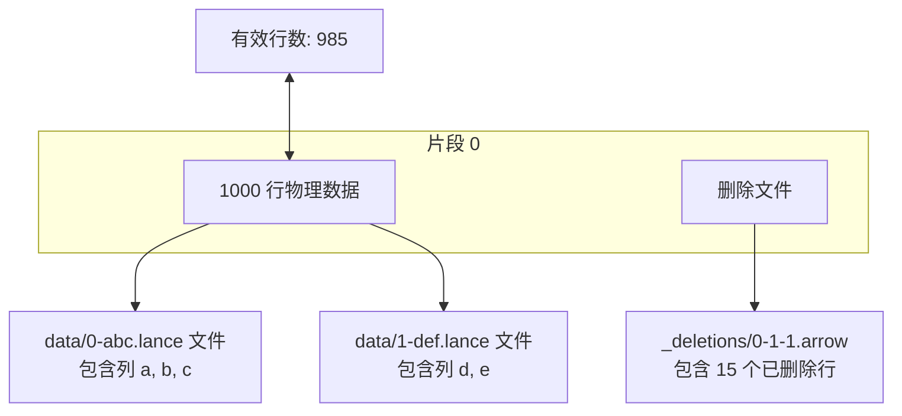
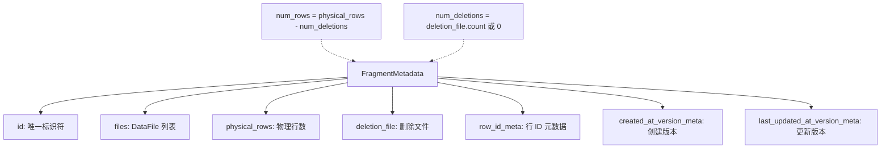
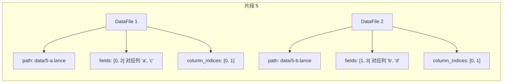
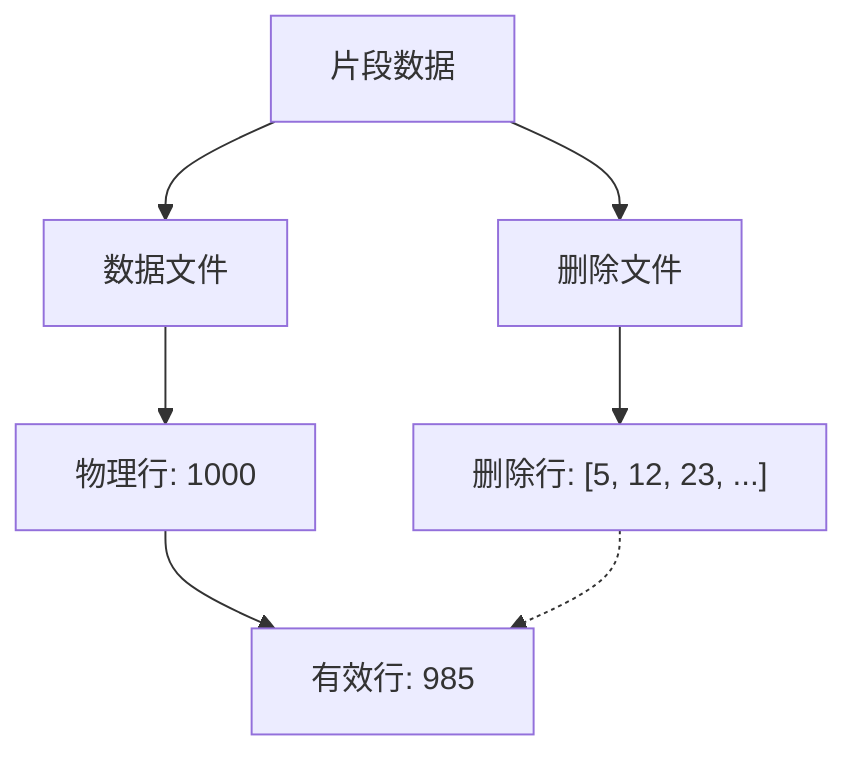
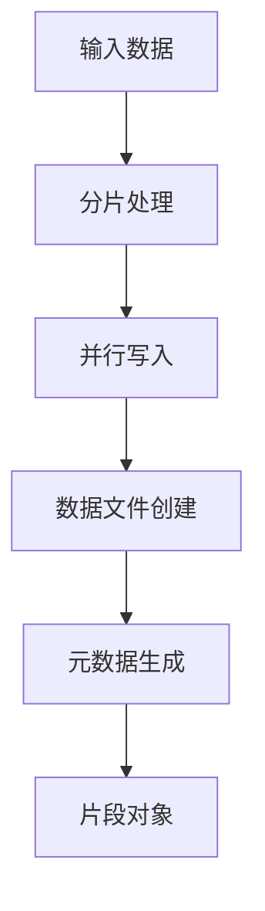
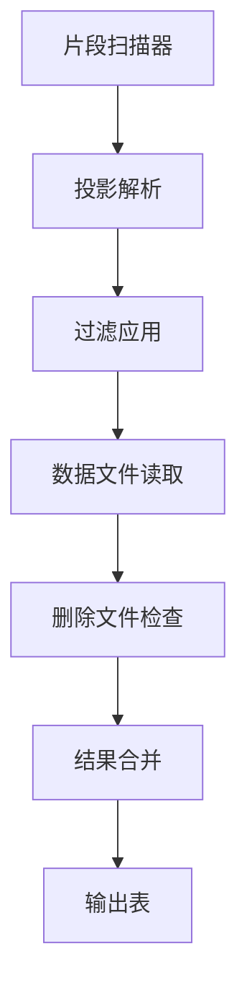
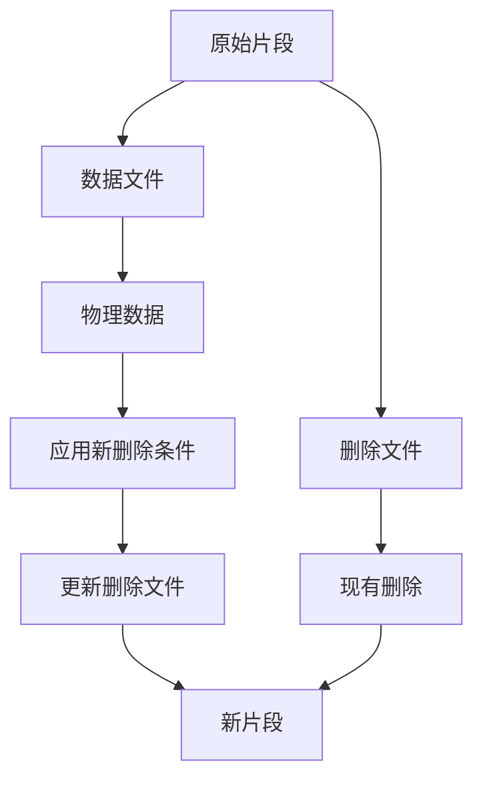
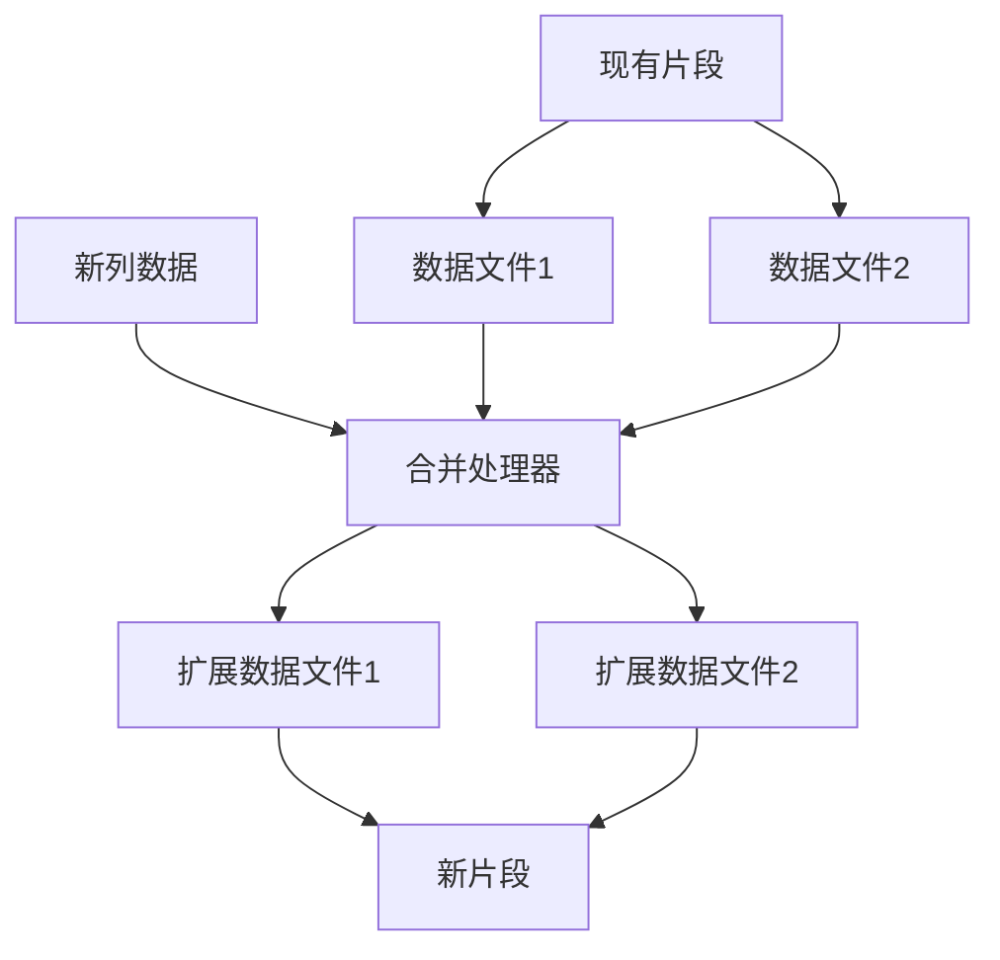

## Lance 源码学习: 6.1 片段（Fragments）  
                  
### 作者                  
digoal                  
                  
### 日期                  
2026-01-14                  
                  
### 标签                  
Lance , AI 数据存储与搜索引擎 , 存储引擎 , 向量索引 , 标量索引 , 全文检索 , 多模态支持 , 零拷贝 , 版本控制 , 时间旅行 , 源码学习 , 随机访问加速 , Parquet                  
                  
----                  
                  
## 背景            
  
Qwen Coder     
````  
获取此网页的内容以及网页源代码 https://deepwiki.com/lance-format/lance/6.1-fragments 将其翻译成中文, 翻译后的格式使用 markdown 格式保存.
注意链接要使用正常的链接进行转换:  
```  
Sources:   
[`rust/lance-table/src/format/fragment.rs` 271-303](填入正确链接)  
[`python/python/lance/fragment.py` 56-134](填入正确链接)  
```  
特定英文单词或指令等使用`符号包围.   
无需翻译的内容包括 mermaid 和 ```code example```, 
提取其中的 mermaid 和 ```code example``` 无需翻译原样将其填入到 markdown 对应位置.  
最终结果输出到 1.md 文件中.   
````  
    
# 片段（Fragments）  
  
片段是 Lance 数据集中数据组织的基本单位。一个片段代表数据集中的行的逻辑分区，并引用磁盘上的一个或多个物理数据文件。本页面涵盖片段结构、创建、读取和修改操作。  
  
## 目的和范围  
  
本文档解释了：  
  
- `Fragment` 和 `FragmentMetadata` 对象的结构  
- 片段如何引用物理 `DataFile` 和 `DeletionFile` 对象  
- 创建、读取和修改片段的 API  
- 片段会话以实现高效的重复访问  
- 片段内的行 ID 和版本跟踪  
  
片段作为数据集级操作（由清单管理）和物理存储（Lance 文件）之间的桥梁。理解片段对于分布式写入、自定义压缩策略和低级数据操作至关重要。  
  
## 片段架构概述  
  
一个片段是一个逻辑容器，将一组行组合在一起。物理上，一个片段由一个或多个 Lance 数据文件组成，每个文件存储相同行的不同列。  
  

  
在该示例中，片段 0 包含存储在两个数据文件中的 1000 个物理行（一个存储列 a, b, c，另一个存储列 d, e）。删除文件跟踪 15 个已删除的行，因此有效行数为 985。  
  
## 片段元数据结构  
  
`FragmentMetadata` 类（Python）和 `Fragment` 结构体（Rust）包含片段的核心元数据：  
  
| 字段类型 | 描述 |  
|----------|------|  
| `id` | int / u64 | 数据集内唯一的片段标识符 |  
| `files` | List[DataFile] | 构成此片段的数据文件 |  
| `physical_rows` | int / Option<usize> | 删除前的原始行数 |  
| `deletion_file` | Optional[DeletionFile] | 指向删除文件的引用（如果存在） |  
| `row_id_meta` | Optional[RowIdMeta] | 稳定行 ID 序列元数据 |  
| `created_at_version_meta` | Optional[RowDatasetVersionMeta] | 行创建的版本跟踪 |  
| `last_updated_at_version_meta` | Optional[RowDatasetVersionMeta] | 行更新的版本跟踪 |  
  
关键属性：  
  
- `num_rows`: 计算属性，返回 `physical_rows - num_deletions`  
- `num_deletions`: 如果存在则返回删除文件中的计数，否则返回 0  
  

  
## 数据文件结构  
  
`DataFile` 代表片段中的单个物理 Lance 文件。每个文件存储数据集列的一个子集：  
  
| 字段类型 | 描述 |  
|----------|------|  
| `path` | str | 数据文件的相对路径（例如，"data/0-abc.lance"） |  
| `fields` | List[int] | 存储在此文件中的字段 ID（列 ID） |  
| `column_indices` | List[int] | 文件内列的位置（v2 格式） |  
| `file_major_version` | int | Lance 文件格式的主要版本（0 或 2） |  
| `file_minor_version` | int | Lance 文件格式的次要版本 |  
| `file_size_bytes` | Optional[int] | 文件大小（字节），如果已知 |  
| `base_id` | Optional[int] | 当文件外部时引用基础路径 |  
  
旧版与现代文件：  
  
- 旧版（v1）：`file_major_version=0`, `file_minor_version < 3`, 字段排序，`column_indices` 为空  
- 现代（v2）：`file_major_version=2`, `fields` 和 `column_indices` 必须具有相等长度  
  

  
该示例显示了片段 5 的两个数据文件。第一个文件存储列 'a' 和 'c'（字段 ID 0 和 2），而第二个存储 'b' 和 'd'（字段 ID 1 和 3）。`column_indices` 数组将字段 ID 映射到每个物理文件内的位置。  
  
## 删除文件  
  
删除文件高效地跟踪已删除的行，而无需重写数据文件。Lance 支持两种删除文件类型：  
  
| 类型 | 格式 | 使用场景 |  
|------|------|----------|  
| Array | 带有排序 UInt64 数组的 Arrow 文件 | 少量删除 |  
| Bitmap | 二进制 RoaringBitmap | 大量删除 |  
  
删除文件结构：  
```  
@dataclass  
class DeletionFile:  
    read_version: int        # Version when deletion file was created  
    id: int                  # Unique deletion file ID  
    file_type: str           # "array" or "bitmap"  
    num_deleted_rows: int    # Count of deleted rows  
    base_id: Optional[int]   # Base path reference  
```  
  
删除文件路径：  
  
- Array 格式：`_deletions/{fragment_id}-{read_version}-{id}.arrow`  
- Bitmap 格式：`_deletions/{fragment_id}-{read_version}-{id}.bin`  
  

  
## 行 ID 管理  
  
片段可以选择性地跟踪稳定的行 ID，这些 ID 在压缩操作期间保持不变。这通过写入期间的 `enable_stable_row_ids` 参数启用。  
  
`RowIdMeta` 类型：  
  
- 内联（Inline）：小行 ID 序列直接存储在清单中  
- 外部（External）：大序列存储在单独的文件中  
  
```  
# RowIdMeta can be:  
RowIdMeta.Inline(bytes)          # Embedded in manifest  
RowIdMeta.External(ExternalFile)  # Separate file reference  
```  
  
优点：  
  
- 压缩期间不需要更新二级索引  
- 跨数据集版本的一致行引用  
- 支持高效的增量更新  
  
## 创建和写入片段  
  
### 单个片段创建  
  
`LanceFragment.create()` 方法将数据写入新片段：  
  
```python  
from lance import LanceFragment  
import pyarrow as pa  
  
data = pa.table({"a": [1, 2, 3], "b": [4, 5, 6]})  
fragment = LanceFragment.create(  
    dataset_uri="/path/to/dataset",  
    data=data,  
    fragment_id=0,  # Optional, defaults to 0  
    max_rows_per_group=1024,  
    data_storage_version="stable",  # Use v2.1 format  
)  
  
# fragment is a FragmentMetadata object  
print(f"Created fragment {fragment.id} with {fragment.physical_rows} rows")  
print(f"Data files: {[f.path for f in fragment.files]}")  
```  
  
### 批量片段写入  
  
对于分布式写入，使用 `write_fragments()` 来写入多个片段：  
  
```python  
from lance.fragment import write_fragments  
import pyarrow as pa  
  
# Large dataset  
batches = pa.RecordBatchReader.from_batches(  
    pa.schema([pa.field("a", pa.int64())]),  
    [pa.record_batch([pa.array(range(1000000))], names=["a"])]  
)  
  
fragments = write_fragments(  
    data=batches,  
    dataset_uri="/path/to/dataset",  
    max_rows_per_file=1024 * 1024,      # 1M rows per fragment  
    max_rows_per_group=1024,            # 1K rows per row group  
    max_bytes_per_file=90 * 1024**3,    # 90GB soft limit  
    mode="append",                       # Or "create"/"overwrite"  
)  
  
# Returns List[FragmentMetadata]  
print(f"Wrote {len(fragments)} fragments")  
```  
  
片段写入管道：  
  

  
### 两阶段分布式写入  
  
对于分布式系统，片段可以独立创建并在稍后提交：  
  
```python  
# Phase 1: Workers create fragments independently  
fragment1 = LanceFragment.create("/dataset", data1, fragment_id=0)  
fragment2 = LanceFragment.create("/dataset", data2, fragment_id=1)  
  
# Serialize for transfer  
import json  
fragment1_json = json.dumps(fragment1.to_json())  
fragment2_json = json.dumps(fragment2.to_json())  
  
# Phase 2: Coordinator collects and commits  
from lance import LanceOperation, LanceDataset, FragmentMetadata  
  
fragments = [  
    FragmentMetadata.from_json(fragment1_json),  
    FragmentMetadata.from_json(fragment2_json)  
]  
  
operation = LanceOperation.Overwrite(schema, fragments)  
dataset = LanceDataset.commit("/dataset", operation)  
```  
  
## 从片段读取  
  
### 直接片段访问  
  
通过数据集访问片段：  
  
```python  
dataset = lance.dataset("/path/to/dataset")  
fragments = dataset.get_fragments()  
  
# Get specific fragment  
fragment = dataset.get_fragment(0)  
print(f"Fragment {fragment.fragment_id} has {fragment.count_rows()} rows")  
  
# Read all data  
table = fragment.to_table()  
  
# Read with filters and projections  
table = fragment.to_table(  
    columns=["a", "b"],  
    filter="a > 10",  
    limit=100,  
    offset=50  
)  
```  
  
### 片段扫描器  
  
创建扫描器以获得更多的控制：  
  
```python  
scanner = fragment.scanner(  
    columns=["a", "b"],  
    filter="a > 10",  
    limit=100,  
    batch_size=1024,  
    with_row_id=True,           # Include _rowid column  
    with_row_address=True,      # Include _rowaddr column  
)  
  
# Iterate batches  
for batch in scanner.to_batches():  
    process(batch)  
```  
  
扫描器执行流程：  
  

  
### TAKE 操作  
  
通过索引高效读取特定行：  
  
```python  
# Take rows by local offset (within fragment)  
indices = [0, 5, 10, 15]  
batch = fragment.take(  
    indices=indices,  
    columns=["a", "b"]  
)  
```  
  
### 片段会话  
  
片段会话为具有相同投影的重复读取提供优化访问：  
  
```python  
# Open session with specific columns  
session = fragment.open_session(  
    columns=["a", "b"],  
    with_row_address=True  
)  
  
# Efficiently take multiple batches  
batch1 = session.take([0, 1, 2, 3])  
batch2 = session.take([10, 11, 12])  
batch3 = session.take([100, 101])  
  
# Session reuses I/O configuration and cached metadata  
```  
  
优点：  
  
- 重用投影和模式计算  
- 为重复的小规模读取优化  
- 更低的每次请求开销  
  
## 修改片段  
  
### 删除行  
  
`delete()` 方法添加或更新删除文件：  
  
```python  
# Delete rows matching predicate  
updated_fragment = fragment.delete("a > 100")  
  
if updated_fragment is None:  
    print("All rows deleted, fragment removed")  
else:  
    # Returns new FragmentMetadata with deletion file  
    print(f"Deleted {updated_fragment.num_deletions} rows")  
```  
  
删除操作：  
  

  
### 更新列  
  
使用连接操作更新现有列值：  
  
```python  
# Update data joined on _rowid  
update_data = pa.table({  
    "_rowid": pa.array([0, 5, 10], pa.uint64()),  
    "a": [100, 500, 1000]  # New values  
})  
  
updated_fragment, fields_modified = fragment.update_columns(  
    data_obj=update_data,  
    left_on="_rowid",    # Column in fragment  
    right_on="_rowid"    # Column in update_data  
)  
  
# fields_modified is list of field IDs that changed  
print(f"Modified fields: {fields_modified}")  
```  
  
### 合并新列  
  
向现有片段添加新列：  
  
```python  
# Merge using row IDs  
new_data = pa.table({  
    "_rowid": pa.array(range(1000), pa.uint64()),  
    "new_col": range(1000)  
})  
  
merged_fragment, new_schema = fragment.merge(  
    data_obj=new_data,  
    left_on="_rowid",  
    right_on="_rowid"  
)  
  
# Returns (FragmentMetadata, LanceSchema)  
print(f"New schema has {len(new_schema.fields)} fields")  
```  
  
合并操作流：  
  

  
### 添加带转换的列  
  
使用 SQL 表达式或 UDF 添加计算列：  
  
```python  
# Using SQL expressions  
merged_fragment, new_schema = fragment.merge_columns(  
    value_func={"c": "a + b"},  # SQL expression  
    batch_size=1024  
)  
  
# Using Python UDF  
def compute_new_col(batch: pa.RecordBatch) -> pa.RecordBatch:  
    return pa.record_batch([  
        batch["a"] * 2  
    ], names=["doubled"])  
  
merged_fragment, new_schema = fragment.merge_columns(  
    value_func=compute_new_col,  
    batch_size=1024  
)  
```  
  
## 高级主题  
  
### 片段验证  
  
数据文件在清单加载期间进行验证：  
  
```python  
# Validation checks:  
# 1. Legacy files: field IDs must be sorted, no duplicates  
# 2. Modern files: fields and column_indices same length  
# 3. File paths must be valid  
```  
  
### 版本检测  
  
Lance 自动检测文件格式版本：  
  
```python  
from lance_file.version import LanceFileVersion  
  
# Infer version from fragments  
version = Fragment.try_infer_version(fragments)  
  
# All files in a dataset must have the same version  
# Returns error if mixed versions detected  
```  
  
### 片段元数据序列化  
  
片段可以序列化用于存储或传输：  
  
```python  
# To JSON  
fragment_json = fragment.to_json()  
json_str = json.dumps(fragment_json)  
  
# From JSON  
fragment = FragmentMetadata.from_json(json_str)  
  
# Metadata includes all fields for reconstruction  
```  
  
### 进度跟踪  
  
使用自定义进度处理器监控片段创建：  
  
```python  
from lance.progress import FragmentWriteProgress  
  
class MyProgress(FragmentWriteProgress):  
    def begin(self, fragment_id: int):  
        print(f"Starting fragment {fragment_id}")  
      
    def complete(self, fragment_id: int):  
        print(f"Completed fragment {fragment_id}")  
  
fragments = write_fragments(  
    data,   
    dataset_uri,  
    progress=MyProgress()  
)  
```  
  
### 从现有文件创建  
  
为外部写入的文件创建片段元数据：  
  
```python  
from lance.file import LanceFileWriter  
import uuid  
  
# Write file manually  
filename = f"{uuid.uuid4()}.lance"  
with LanceFileWriter(f"/dataset/data/{filename}") as writer:  
    writer.write_batch(data)  
  
# Create fragment metadata  
fragment = LanceFragment.create_from_file(  
    filename=filename,  
    dataset=dataset,  
    fragment_id=0  
)  
  
# Commit to dataset  
operation = LanceOperation.Append([fragment])  
dataset = LanceDataset.commit("/dataset", operation)  
```  
  
Sources:   
[`rust/lance-table/src/format/fragment.rs` 271-303](https://github.com/lancedb/lance/blob/main/rust/lance-table/src/format/fragment.rs#L271-L303)  
[`python/python/lance/fragment.py` 56-134](https://github.com/lancedb/lance/blob/main/python/python/lance/fragment.py#L56-L134)  
  
  
摘要：片段是 Lance 中的核心组织单元，连接逻辑数据分区和物理存储文件。它们通过扫描器支持高效读取，通过删除文件和合并操作支持更新，并通过独立创建和批量提交实现分布式写入。理解片段结构对于高级 Lance 使用至关重要，包括自定义压缩、分布式处理和性能优化。  
  
  
