## Lance 源码学习: 6.2 Lance 文件格式    
                    
### 作者                    
digoal                    
                    
### 日期                    
2026-01-15                    
                    
### 标签                    
Lance , AI 数据存储与搜索引擎 , 存储引擎 , 向量索引 , 标量索引 , 全文检索 , 多模态支持 , 零拷贝 , 版本控制 , 时间旅行 , 源码学习 , 随机访问加速 , Parquet                    
                    
----                    
                    
## 背景              
    
Gemini CLI       
````    
获取此网页的内容以及网页源代码 https://deepwiki.com/lance-format/lance/6.2-lance-file-format 将其翻译成中文, 翻译后的格式使用 markdown 格式保存.  
注意链接要使用正常的链接进行转换:    
```    
Sources:     
[`rust/lance-table/src/format/fragment.rs` 271-303](填入正确链接)    
[`python/python/lance/fragment.py` 56-134](填入正确链接)    
```    
特定英文单词或指令等使用`符号包围.     
提取网页源代码中的 mermaid 和 code example, 将其填入到 markdown 对应的位置.   
注意 mermaid 和 code example 里的内容无需翻译保留原样, 并且要处理 mermaid 的内容: 将 unicode 转成字符、正确的处理换行符 `\n`、删除被转义的双引号`\"`里面的转义符`\` .  
markdown 的最终结果输出到当前目录的 2.md 文件中.   
  
基于翻译的最终结果, 从用户角度提出3个有深度的问题.    
将问题逐一发给 deepwiki mcp 工具(需带上该项目参数 `lance-format/lance`)进行咨询, 将得到的结果使用中文整理后追加到 2.md 的末尾.   
````    
    
Gemini CLI 的使用参考 [《Gemini CLI 对比 Qwen3 Coder 谁更强?》](../202601/20260115_05.md)     
      
# Lance 文件格式  
  
本页面解释了 **Lance 文件** (`.lance` 文件) 的**物理结构** —— 存储列式数据的磁盘格式。涵盖的主题包括文件布局、页组织、元数据结构以及格式版本差异。  
  
## 文件布局  
  
一个 Lance 文件在磁盘上由三个连续的部分组成：  
  
**Lance 文件的物理布局**  
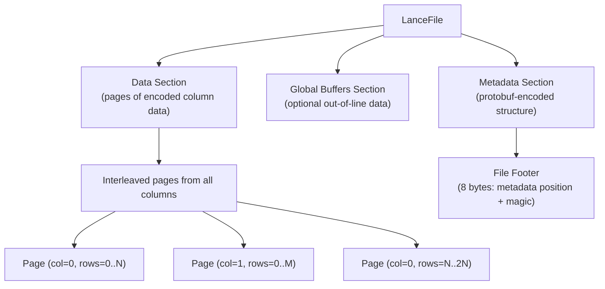
Sources:   
[`rust/lance-encoding/src/encoder.rs` 42-67](https://github.com/lance-format/lance/blob/0204e7e2/rust/lance-encoding/src/encoder.rs#L42-L67)   
[`rust/lance-encoding/src/decoder.rs` 292-321](https://github.com/lance-format/lance/blob/0204e7e2/rust/lance-encoding/src/decoder.rs#L292-L321)  
  
### 缓冲区对齐 (Buffer Alignment)  
  
所有缓冲区必须对齐到 `MIN_PAGE_BUFFER_ALIGNMENT` (8 字节)。这确保了高效的内存访问并允许零拷贝操作。写入器在缓冲区之间使用填充 (padding) 来维持此对齐。  
  
| 部分 | 内容 | 位置 |  
| --- | --- | --- |  
| Data Section (数据部分) | 来自所有列的编码页 | 文件开始处 (偏移量 0) |  
| Global Buffers (全局缓冲区) | 离线数据 (例如，大型二进制文件) | 数据部分之后 |  
| Metadata Section (元数据部分) | 列/页描述符 (protobuf) | 文件末尾 |  
| Footer (页脚) | 元数据偏移量 + 魔数 | 最后 8 字节 |  
  
Sources:   
[`rust/lance-encoding/src/encoder.rs` 42-67](https://github.com/lance-format/lance/blob/0204e7e2/rust/lance-encoding/src/encoder.rs#L42-L67)   
[`rust/lance-encoding/src/testing.rs` 42-43](https://github.com/lance-format/lance/blob/0204e7e2/rust/lance-encoding/src/testing.rs#L42-L43)  
  
## 列式存储布局  
  
Lance 文件使用**列式存储格式**，数据按列而非按行组织。每一列独立存储并分为多个页 (pages)。  
  
### 列组织  
  
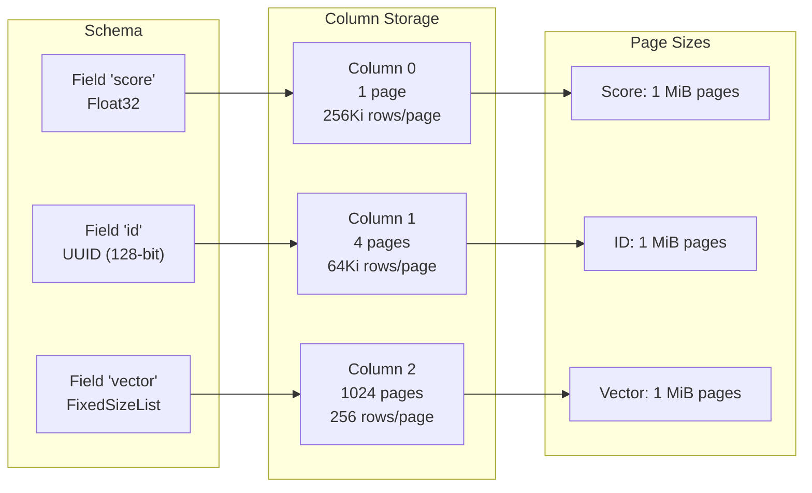
Sources:   
[`rust/lance-encoding/src/decoder.rs` 110-214](https://github.com/lance-format/lance/blob/0204e7e2/rust/lance-encoding/src/decoder.rs#L110-L214)  
  
### 基于页的存储 (Page-Based Storage)  
  
每一列由一个或多个**页 (pages)** 组成，其中一页是一块连续的编码数据。页的大小设计为在字节上大致相等 (通常为 1-32 MiB)，但包含的行数取决于列的数据类型。  
  
**关键特性：**  
* 页在读取期间独立调度，以实现 I/O 并行化  
* 跨页保留行优先顺序，以便进行高效的范围扫描  
* 页不能拆分 "顶级行" (对列表类型很重要)  
  
Sources:   
[`rust/lance-encoding/src/decoder.rs` 292-321](https://github.com/lance-format/lance/blob/0204e7e2/rust/lance-encoding/src/decoder.rs#L292-L321)   
[`rust/lance-encoding/src/encoder.rs` 42-67](https://github.com/lance-format/lance/blob/0204e7e2/rust/lance-encoding/src/encoder.rs#L42-L67)  
  
## 页结构  
  
每一页包含多个存储编码数据的**缓冲区 (buffers)** 。其结构因编码类型而异，但通常包括：  
  
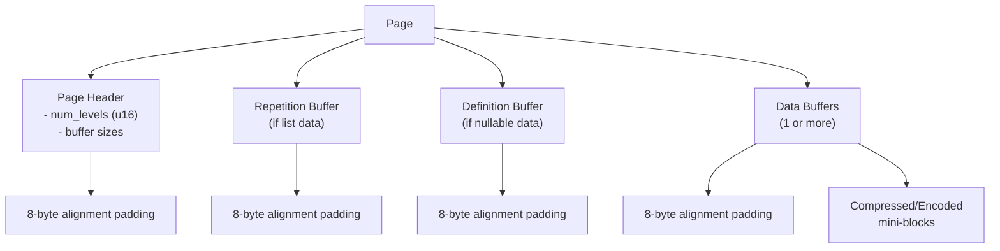
Sources:   
[`rust/lance-encoding/src/encodings/logical/primitive.rs` 428-511](https://github.com/lance-format/lance/blob/0204e7e2/rust/lance-encoding/src/encodings/logical/primitive.rs#L428-L511)  
  
### 缓冲区描述符 (Buffer Descriptors)  
  
页中的每个缓冲区由一个 `LanceBufferDescriptor` 描述，包含：  
  
| 字段 | 类型 | 描述 |  
| --- | --- | --- |  
| `position` | u64 | 缓冲区在文件中的字节偏移量 |  
| `size` | u64 | 缓冲区大小 (字节) |  
  
Sources:   
[`python/src/file.rs` 47-67](https://github.com/lance-format/lance/blob/0204e7e2/python/src/file.rs#L47-L67)  
  
### 页编码元数据 (Page Encoding Metadata)  
  
每一页的编码由 `PageEncoding` 枚举描述，该枚举封装了特定于格式的 protobuf 消息：  
  
**PageEncoding 类型**  
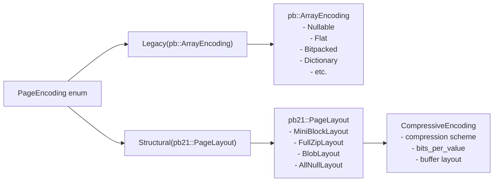
Sources:   
[`rust/lance-encoding/src/decoder.rs` 262-290](https://github.com/lance-format/lance/blob/0204e7e2/rust/lance-encoding/src/decoder.rs#L262-L290)   
[`rust/lance-encoding/src/format.rs` 1-60](https://github.com/lance-format/lance/blob/0204e7e2/rust/lance-encoding/src/format.rs#L1-L60)  
  
编码类型决定了实例化哪个解码器：  
* Legacy: 为 V1/V2.0 文件使用 `LogicalPageDecoder`  
* Structural: 为 V2.1+ 文件使用 `StructuralPageDecoder`  
  
Protobuf 工具提供构建这些消息的助手：  
* `ProtobufUtils`: 构建 `pb::ArrayEncoding` 消息  
* `ProtobufUtils21`: 构建 `pb21::PageLayout` 消息  
  
Sources:   
[`rust/lance-encoding/src/format.rs` 50-258](https://github.com/lance-format/lance/blob/0204e7e2/rust/lance-encoding/src/format.rs#L50-L258)   
[`rust/lance-encoding/src/decoder.rs` 262-290](https://github.com/lance-format/lance/blob/0204e7e2/rust/lance-encoding/src/decoder.rs#L262-L290)  
  
## 元数据层级 (Metadata Hierarchy)  
  
文件末尾的元数据部分使用分层格式描述了整个文件结构：  
  
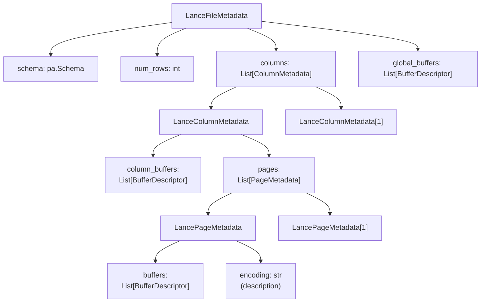
Sources:   
[`python/src/file.rs` 47-173](https://github.com/lance-format/lance/blob/0204e7e2/python/src/file.rs#L47-L173)   
[`python/python/lance/lance/__init__.pyi` 165-172](https://github.com/lance-format/lance/blob/0204e7e2/python/python/lance/lance/__init__.pyi#L165-L172)  
  
### 文件元数据结构 (File Metadata Structure)  
  
`LanceFileMetadata` 类 (在 Python 中通过 `LanceFileReader` 暴露) 提供了访问文件模式 (schema) 和结构的接口：  
  
**LanceFileMetadata 层级**  
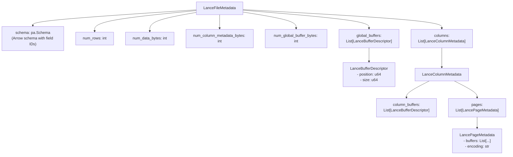
Sources:   
[`python/python/lance/lance/__init__.pyi` 165-172](https://github.com/lance-format/lance/blob/0204e7e2/python/python/lance/lance/__init__.pyi#L165-L172)   
[`python/src/file.rs` 47-173](https://github.com/lance-format/lance/blob/0204e7e2/python/src/file.rs#L47-L173)  
  
这些元数据被序列化为 protobuf 并存储在文件末尾。读取器通过读取最后 8 字节 (页脚) 来定位它，页脚包含元数据偏移量和魔数。  
  
Sources:   
[`python/src/file.rs` 156-224](https://github.com/lance-format/lance/blob/0204e7e2/python/src/file.rs#L156-L224)  
  
### 列元数据结构 (Column Metadata Structure)  
  
每一列的元数据描述了它的页和列范围内的缓冲区：  
  
```python  
class LanceColumnMetadata:  
 column_buffers: List[LanceBufferDescriptor]  
 pages: List[LancePageMetadata]  
```  
Sources:   
[`python/src/file.rs` 94-115](https://github.com/lance-format/lance/blob/0204e7e2/python/src/file.rs#L94-L115)  
  
### 页元数据结构 (Page Metadata Structure)  
  
每一页的元数据描述了它的缓冲区和编码：  
  
```python  
class LancePageMetadata:  
 buffers: List[LanceBufferDescriptor]  
 encoding: str # 人类可读的编码描述  
```  
Sources:   
[`python/src/file.rs` 69-91](https://github.com/lance-format/lance/blob/0204e7e2/python/src/file.rs#L69-L91)  
  
## 文件格式版本  
  
Lance 经历了多个格式版本，每个版本由存储在 `DataFile` 元数据中的 `file_major_version` 和 `file_minor_version` 字段标识。  
  
**DataFile 中的版本识别**  
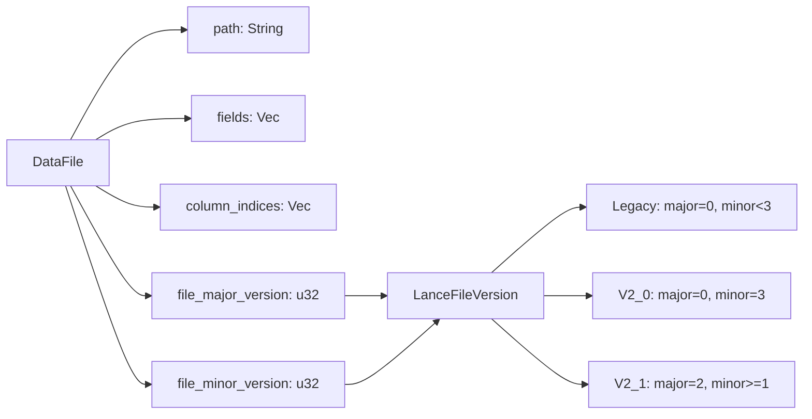
Sources:   
[`rust/lance-table/src/format/fragment.rs` 23-158](https://github.com/lance-format/lance/blob/0204e7e2/rust/lance-table/src/format/fragment.rs#L23-L158)   
[`rust/lance-file/src/version.rs`]()  
  
### V1 (遗留格式)  
  
* **标识符**: `file_major_version=0`, `file_minor_version<3`  
* **编码消息**: `pb::ArrayEncoding` protobuf 定义  
* **页编码**: `PageEncoding::Legacy(pb::ArrayEncoding)`  
* **特性**:  
    + 具有按列压缩的基本列式存储  
    + 写入时确定的固定页大小  
    + 没有重复/定义优化的更简单编码树  
  
### V2.0 格式  
  
* **标识符**: `file_major_version=0`, `file_minor_version=3`  
* **编码消息**: `pb::ArrayEncoding` protobuf 定义 (与 V1 相同)  
* **页编码**: `PageEncoding::Legacy(pb::ArrayEncoding)`  
* **特性**: 具有改进元数据处理能力的过渡格式  
  
### V2.1+ (结构化格式)  
  
* **标识符**: `file_major_version=2`, `file_minor_version>=1`  
* **编码消息**: `pb21::PageLayout` protobuf 定义  
* **页编码**: `PageEncoding::Structural(pb21::PageLayout)`  
* **特性**:  
    + 使用 `RepDefBuilder` 处理嵌套类型的结构化编码  
    + 用于小块数据的 Mini-block 编码 (`STRUCTURAL_ENCODING_MINIBLOCK`)  
    + 用于按值压缩的 Full-zip 编码 (`STRUCTURAL_ENCODING_FULLZIP`)  
    + 使用 `StructuralPageDecoder` 的延迟页解码  
    + 通过重复/定义级别实现更好的随机访问性能  
  
Sources:   
[`rust/lance-encoding/src/decoder.rs` 262-290](https://github.com/lance-format/lance/blob/0204e7e2/rust/lance-encoding/src/decoder.rs#L262-L290)   
[`rust/lance-encoding/src/encodings/logical/primitive.rs` 16-18](https://github.com/lance-format/lance/blob/0204e7e2/rust/lance-encoding/src/encodings/logical/primitive.rs#L16-L18)   
[`rust/lance-table/src/format/fragment.rs` 134-137](https://github.com/lance-format/lance/blob/0204e7e2/rust/lance-table/src/format/fragment.rs#L134-L137)  
  
**在代码中检测版本：**  
  
```python  
reader = LanceFileReader(path)  
metadata = reader.metadata()  
version = metadata.file_major_version  
  
if version == 0:  
 if metadata.file_minor_version < 3:  
 # V1 Legacy  
 else:  
 # V2.0  
elif version == 2:  
 # V2.1+ Structural  
```  
Sources:   
[`python/python/tests/test_file.py` 93-110](https://github.com/lance-format/lance/blob/0204e7e2/python/python/tests/test_file.py#L93-L110)   
[`rust/lance-table/src/format/fragment.rs` 134-137](https://github.com/lance-format/lance/blob/0204e7e2/rust/lance-table/src/format/fragment.rs#L134-L137)  
  
## 读取和写入文件  
  
### 读取文件：LanceFileReader  
  
`LanceFileReader` 类提供了对 Lance 文件的低级访问：  
  
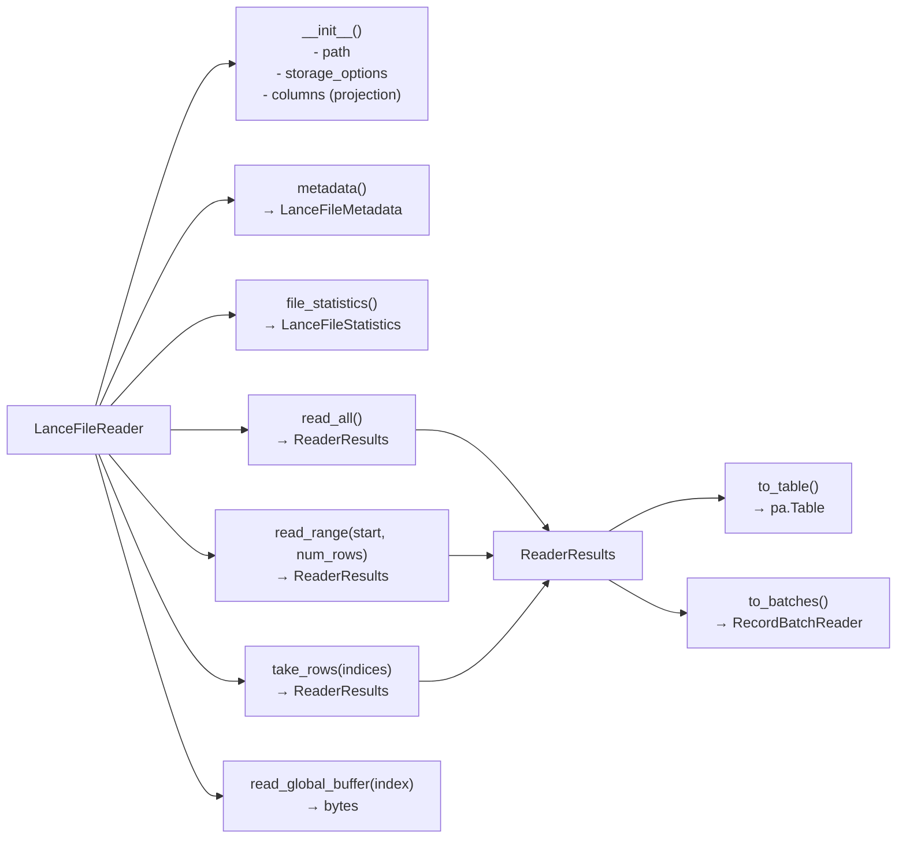
Sources:   
[`python/python/lance/file.py` 55-187](https://github.com/lance-format/lance/blob/0204e7e2/python/python/lance/file.py#L55-L187)   
[`python/src/file.rs` 156-431](https://github.com/lance-format/lance/blob/0204e7e2/python/src/file.rs#L156-L431)  
  
**关键操作：**  
  
| 方法 | 用途 |  
| --- | --- |  
| `read_all(batch_size)` | 顺序读取整个文件 |  
| `read_range(start, num_rows)` | 读取特定的行范围 |  
| `take_rows(indices)` | 通过索引读取特定行 (随机访问) |  
| `read_global_buffer(index)` | 读取离线缓冲区 |  
| `metadata()` | 访问文件元数据 |  
| `file_statistics()` | 获取列统计信息 |  
  
Sources:   
[`python/python/lance/file.py` 55-187](https://github.com/lance-format/lance/blob/0204e7e2/python/python/lance/file.py#L55-L187)  
  
### 写入文件：LanceFileWriter  
  
`LanceFileWriter` 类用于创建 Lance 文件：  
  
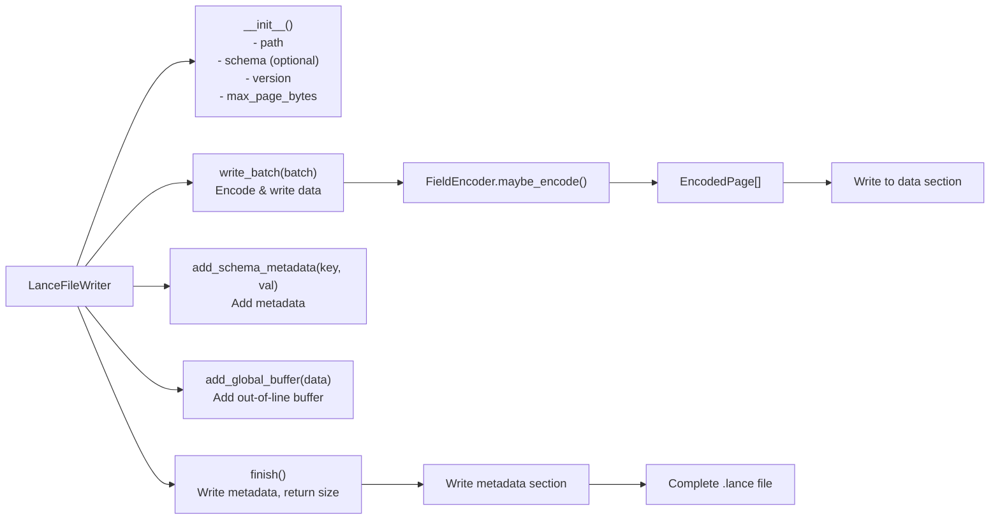
Sources:   
[`python/python/lance/file.py` 190-310](https://github.com/lance-format/lance/blob/0204e7e2/python/python/lance/file.py#L190-L310)   
[`python/src/file.rs` 225-306](https://github.com/lance-format/lance/blob/0204e7e2/python/src/file.rs#L225-L306)  
  
**用法示例：**  
  
```python  
# 使用上下文管理器 (推荐)  
with LanceFileWriter(path, schema, version="2.1") as writer:  
 writer.write_batch(batch1)  
 writer.write_batch(batch2)  
 # 自动调用 finish()  
  
# 手动控制  
writer = LanceFileWriter(path, schema)  
writer.write_batch(batch)  
writer.add_schema_metadata("key", "value")  
num_bytes = writer.finish()  
```  
Sources:   
[`python/python/tests/test_file.py` 15-40](https://github.com/lance-format/lance/blob/0204e7e2/python/python/tests/test_file.py#L15-L40)  
  
### 文件会话：LanceFileSession  
  
`LanceFileSession` 为多个文件操作提供连接池和资源管理：  
  
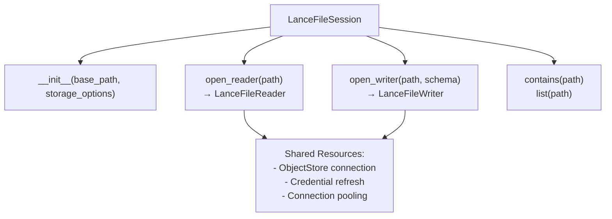
Sources:   
[`python/python/lance/file.py` 313-410](https://github.com/lance-format/lance/blob/0204e7e2/python/python/lance/file.py#L313-L410)   
[`python/src/file.rs` 434-531](https://github.com/lance-format/lance/blob/0204e7e2/python/src/file.rs#L434-L531)  
  
当在同一位置处理许多文件时，会话非常有用：  
  
```python  
session = LanceFileSession(base_path, storage_options)  
  
# 在多个读取器之间共享连接  
reader1 = session.open_reader("file1.lance")  
reader2 = session.open_reader("file2.lance")  
  
# 检查文件是否存在  
if session.contains("file3.lance"):  
 reader3 = session.open_reader("file3.lance")  
```  
Sources:   
[`python/python/tests/test_file.py` 169-196](https://github.com/lance-format/lance/blob/0204e7e2/python/python/tests/test_file.py#L169-L196)  
  
## I/O 调度和解码管道  
  
Lance 使用两阶段管道将 I/O 调度与 CPU 密集型解码分开。这是通过 `DecodeBatchScheduler` 和解码流实现的。  
  
**两阶段解码管道**  
```mermaid  
graph TB  
 subgraph Phase1["Phase 1: Scheduling Thread"]  
 Scheduler["DecodeBatchScheduler::try_new()"]  
 Scheduler --> FieldSchedulers["FieldScheduler instances<br/>(one per root field)"]  
 FieldSchedulers --> StructSched["StructuralStructScheduler<br/>(for struct fields)"]  
 FieldSchedulers --> PrimSched["StructuralPrimitiveFieldScheduler<br/>(for primitive fields)"]  
 FieldSchedulers --> ListSched["StructuralListScheduler<br/>(for list fields)"]  
   
 PrimSched --> ScheduleRanges["schedule_ranges(ranges, filter)"]  
 ScheduleRanges --> IORequest["EncodingsIo::submit_request()<br/>(Vec<Range<u64>>, priority)"]  
 IORequest --> DecoderTask["Create DecodePageTask futures"]  
 end  
   
 subgraph Phase2["Phase 2: Decode Thread Pool"]  
 DecoderTask --> Wait["Wait for I/O<br/>(async)"]  
 Wait --> Loaded["LoadedPageShard"]  
 Loaded --> PageDec["StructuralPageDecoder::drain()"]  
 PageDec --> Decompress["Decompress buffers<br/>(BlockDecompressor)"]  
 Decompress --> Decode["Decode into DataBlock"]  
 Decode --> RepDef["RepDefUnraveler::unravel()"]  
 Arrow["Arrow RecordBatch"]  
 end  
   
 DecoderTask -.->|channel| Wait  
```  
Sources:   
[`rust/lance-encoding/src/decoder.rs` 369-451](https://github.com/lance-format/lance/blob/0204e7e2/rust/lance-encoding/src/decoder.rs#L369-L451)   
[`rust/lance-encoding/src/encodings/logical/primitive.rs` 94-122](https://github.com/lance-format/lance/blob/0204e7e2/rust/lance-encoding/src/encodings/logical/primitive.rs#L94-L122)  
  
**关键优势：**  
* 调度线程发出所有 I/O 请求，而无需等待完成  
* 多个页通过 `EncodingsIo` 异步请求并行加载  
* CPU 解码发生在单独的任务中 (通过 `spawn_cpu` 或 tokio)  
* 优先级字段确保较早的行首先被解码 (行优先顺序)  
  
`SchedulerContext` 跟踪当前字段路径和列索引，用于调试和确定优先级。  
  
Sources:   
[`rust/lance-encoding/src/decoder.rs` 108-214](https://github.com/lance-format/lance/blob/0204e7e2/rust/lance-encoding/src/decoder.rs#L108-L214)   
[`rust/lance-encoding/src/testing.rs` 159-254](https://github.com/lance-format/lance/blob/0204e7e2/rust/lance-encoding/src/testing.rs#L159-L254)  
  
## 全局缓冲区 (Global Buffers)  
  
全局缓冲区存储**离线数据 (out-of-line data)** ，这些数据无法高效地放入页内。目前主要用于 blob 编码中的大型二进制数据。  
  
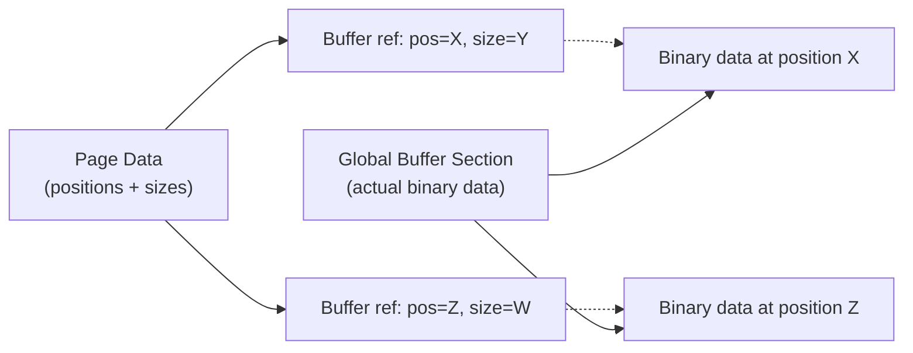
Sources:   
[`rust/lance-encoding/src/encoder.rs` 88-130](https://github.com/lance-format/lance/blob/0204e7e2/rust/lance-encoding/src/encoder.rs#L88-L130)  
  
写入器可以添加全局缓冲区并接收位置索引：  
  
```python  
writer = LanceFileWriter(path)  
position = writer.add_global_buffer(large_data)  
# 存储位置在页数据中以便后续查找  
```  
  
读取器可以通过索引检索它们：  
  
```python  
reader = LanceFileReader(path)  
data = reader.read_global_buffer(position)  
```  
Sources:   
[`python/src/file.rs` 300-306](https://github.com/lance-format/lance/blob/0204e7e2/python/src/file.rs#L300-L306)   
[`python/python/lance/file.py` 95-104](https://github.com/lance-format/lance/blob/0204e7e2/python/python/lance/file.py#L95-L104)  
  
  
### 核心要点 (Key Takeaways):  
  
* **Lance 文件采用列式布局（Columnar Layout）并划分为页（Pages），以实现高效的 I/O。**  
* *解析：* 这种设计类似 Parquet，但更强调随机访问性能。  
  
  
* **元数据（Metadata）存储在文件末尾，用于描述文件的完整结构。**  
* *解析：* 这种“尾部存储”设计允许在写入数据后一次性写入结构信息，方便快速定位数据。  
  
  
* **存在两个格式版本：旧版 Legacy (2.0) 和 结构化版 Structural (2.1+)。**  
* *解析：* 2.1 版本引入了更复杂的嵌套结构支持和性能优化。  
  
  
* **读取操作支持随机访问（Random Access）和高效的范围扫描（Range Scans）。**  
* *解析：* 这使得 Lance 非常适合向量检索，因为向量检索通常需要根据索引快速跳转到特定行。  
  
  
* **写入过程使用字段编码器（Field Encoders）生成带压缩的页面。**  
* *解析：* 通过针对不同数据类型定制的编码方式，在保证压缩率的同时减少 CPU 解压开销。  
  
  
* **会话（Sessions）为跨多文件的操作提供连接池（Connection Pooling）。**  
* *解析：* 优化了在处理大规模分布式数据集时的资源复用。  
  
  
---  
  
## 深度咨询 (DeepWiki)  
  
### 问题 1：Lance V2.1+ 的 `Structural` 编码相比 V1 的 `Legacy` 编码，在处理嵌套数据类型（Nested Types）时的核心性能优势是如何通过 `RepDefBuilder` 实现的？  
  
**整理结果：**  
`RepDefBuilder` 是 Lance V2.1+ 结构化编码的核心，其性能优势主要体现在通过**重复级别（Repetition Levels）** 和**定义级别（Definition Levels）** 对嵌套数据的压缩与整合：  
*   **信息合并**：在 V1 遗留格式中，嵌套结构的每一层通常需要独立的有效性位图（validity bitmaps）和偏移数组（offset arrays）。`RepDefBuilder` 将这些信息整合进单一的级别缓冲区，减少了存储开销。  
*   **减少 I/O 次数**：结构化编码可以将重复/定义级别与实际值“拉链式”地压缩进单个缓冲区（如 Full-zip 布局）。这意味着读取一个嵌套值可能只需一次磁盘 I/O，而不再需要读取多个分散的元数据缓冲区。  
*   **高效处理 Null**：定义级别编码了 Null 发生的“深度”，使得编码器能跳过无效层级；重复级别则以密集方式表示列表边界，避免了稀疏偏移数组带来的处理负担。  
  
### 问题 2：在两阶段解码管道（Two-Phase Decode Pipeline）中，`DecodeBatchScheduler` 如何在调度 I/O 请求时平衡行优先排序（row-major ordering）和最大化 I/O 并行度？  
  
**整理结果：**  
Lance 通过将“调度”与“解码”解耦，在保证行有序的同时实现了高效并行：  
*   **行优先调度**：`DecodeBatchScheduler` 按照行优先顺序逐页扫描文件，并将 I/O 请求异步提交给底层 I/O 服务（如 `EncodingsIo`），而不会阻塞等待完成。  
*   **优先级机制**：每个 I/O 请求都带有一个优先级（通常对应其包含数据的最低行号）。这确保了靠近当前扫描位置的数据、以及解码嵌套数据所需的关键元数据（如列表偏移量）能被优先加载。  
*   **异步管道化**：调度线程不断产生解码任务并放入通道，解码线程池则从通道中获取任务。当所需页面的 I/O 完成后，CPU 密集型的解码工作会立即在线程池中并行开展。这种设计防止了慢速 I/O 阻塞后续页面的处理。  
  
### 问题 3：`Global Buffers` 在 Lance 格式中专门用于存储 Blob 数据，这种设计在处理 PB 级的大规模二进制数据时，如何通过偏移量索引机制避免传统页缓存（Page Cache）的抖动并保持高性能的随机访问？  
  
**整理结果：**  
Lance 针对大规模二进制数据采用了**离线存储（Out-of-line storage）** 策略，结合 `BlobLayout` 实现高性能访问：  
*   **描述符机制**：在页数据（Page Data）中，Lance 不直接存储 Blob 内容，而是存储一个包含 `position`（绝对文件偏移）和 `size`（字节大小）的轻量级描述符。  
*   **精确读取**：当应用程序需要访问特定 Blob 时，读取器先从页中读取描述符，然后直接向 I/O 调度器发起特定字节范围的读取请求。  
*   **避免缓存抖动**：由于不需要为了读取少量 Blob 而扫描整个数据页或加载无关的二进制块，系统仅将请求的数据加载进内存。这在 PB 级规模下极其重要，因为它防止了海量二进制数据冲刷掉页缓存中的热点元数据，确保了随机访问的高效性。  
  
* Lance 文件使用带页的列式布局以实现高效 I/O  
* 元数据存储在文件末尾，描述了所有结构  
* 存在两个格式版本：遗留 (2.0) 和结构化 (2.1+)  
* 读取支持随机访问和高效的范围扫描  
* 写入使用生成带压缩页的字段编码器  
* 会话为多文件操作提供连接池  
  
    
