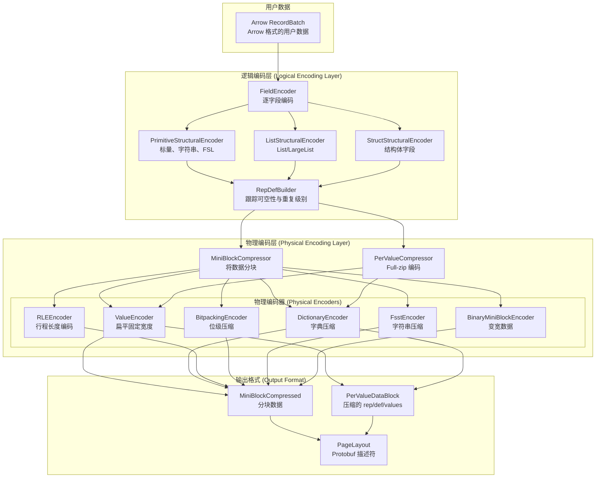
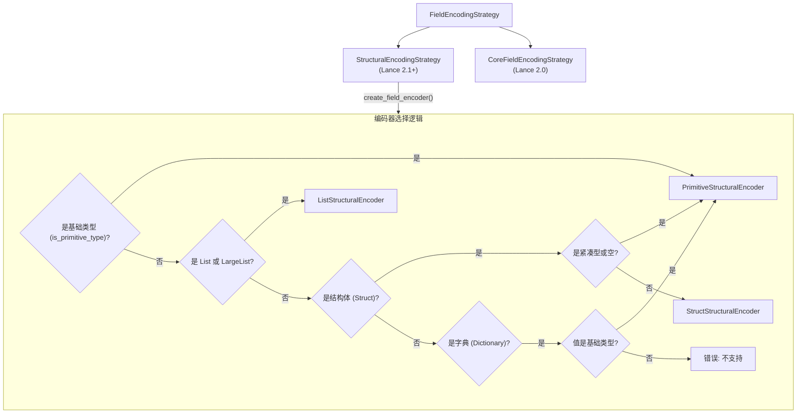
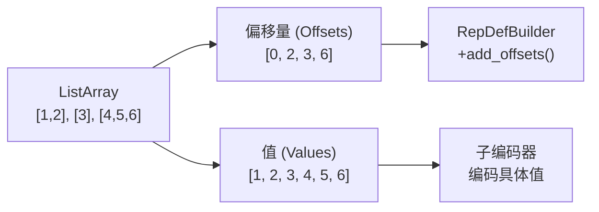
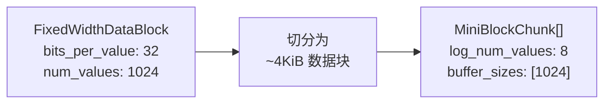
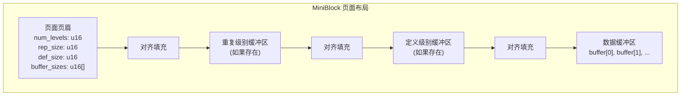
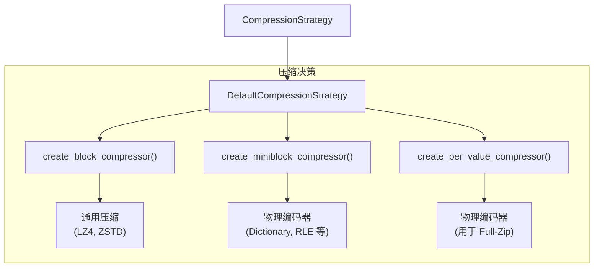
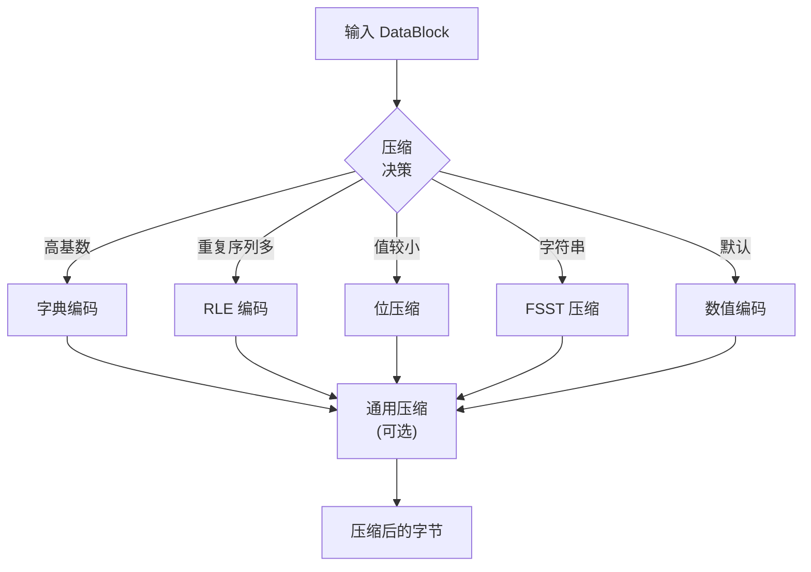
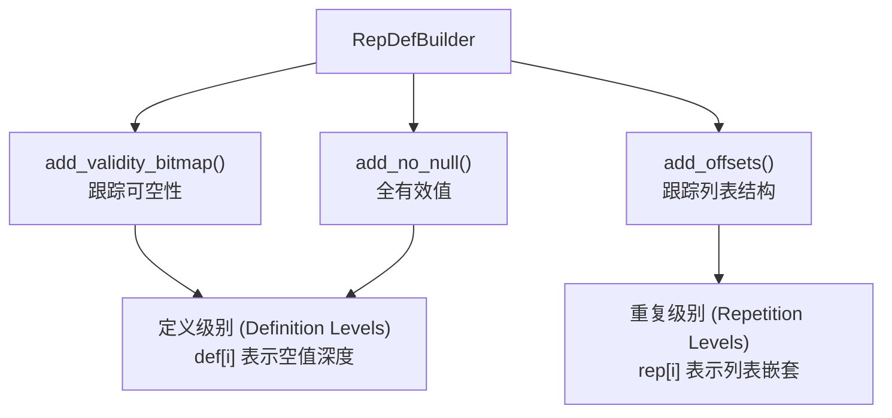
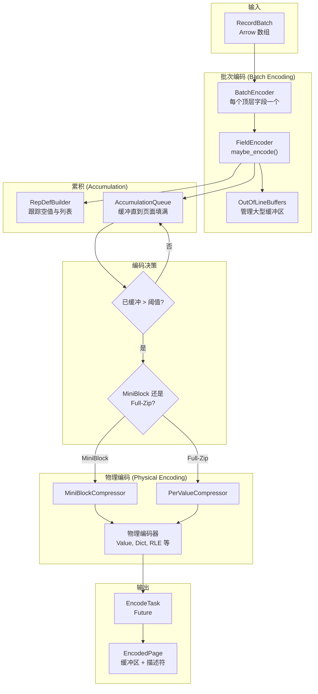

## Lance 源码学习: 6.3 编码与压缩 (Encoding and Compression)  
  
### 作者  
digoal  
  
### 日期  
2026-01-16  
  
### 标签  
Lance , AI 数据存储与搜索引擎 , 存储引擎 , 向量索引 , 标量索引 , 全文检索 , 多模态支持 , 零拷贝 , 版本控制 , 时间旅行 , 源码学习 , 随机访问加速 , Parquet  
  
----  
  
## 背景  
  
Gemini CLI  
````  
将 @page_source.html 的网页内容转换为 markdown 格式.  
表格、code example 和 mermaid 需填入到 markdown 对应的位置. (注意: 它们可能藏在一些非常非常非常长的行里面, 请小心处理)  
将处理好的 markdown 翻译成中文(关键术语请同时保留中英文), 不需要翻译 code example 和 mermaid 里面的内容.  
链接请使用正常的链接进行转换:  
```  
Sources:  
[`rust/lance-table/src/format/fragment.rs` 271-303](填入正确链接)  
[`python/python/lance/fragment.py` 56-134](填入正确链接)  
```  
特定英文单词或指令等使用`符号包围.  
  
基于翻译的最终结果, 从用户角度使用中文提出 3 个有深度的问题.  
将中文的问题逐一发给 deepwiki mcp 工具(需带上该项目参数 `lance-format/lance`)进行咨询, 将问题以及从 deepwiki mcp 工具返回的结果保持原样追加到 markdown 的末尾.   
最终结果输出到当前目录的 3.md 文件  
````  
  
Gemini CLI 的使用参考 [《Gemini CLI 对比 Qwen3 Coder 谁更强?》](../202601/20260115_05.md)  
  
# 编码与压缩 (Encoding and Compression)  
  
## 目的与范围 (Purpose and Scope)  
  
本页面记录了 Lance 的编码与压缩系统，该系统将 `Arrow` 数组转换为高效存储的列式数据。内容涵盖了编码策略、物理与逻辑编码、压缩技术，以及 Lance 2.1+ 文件中使用的 `MiniBlock`/`Full-Zip` 格式。  
  
## 编码架构 (Encoding Architecture)  
  
Lance 使用两层编码架构，将 **逻辑编码** (Logical Encoding，处理 `Arrow` 数据类型和可空性) 与 **物理编码** (Physical Encoding，压缩与高效存储) 分离。  
  
### 编码策略层 (Encoding Strategy Layers)  
  

  
Sources:  
[`rust/lance-encoding/src/encoder.rs` 1-497](https://github.com/lance-format/lance/blob/0204e7e2/rust/lance-encoding/src/encoder.rs#L1-L497)  
[`rust/lance-encoding/src/encodings/logical/primitive.rs` 1-200](https://github.com/lance-format/lance/blob/0204e7e2/rust/lance-encoding/src/encodings/logical/primitive.rs#L1-L200)  
  
### 编码策略选择 (Encoding Strategy Selection)  
  
Lance 使用 `FieldEncodingStrategy` trait 来确定每个字段使用的编码器。对于 Lance 2.1+ 文件，主要的策略是 `StructuralEncodingStrategy`。  
  

  
Sources:  
[`rust/lance-encoding/src/encoder.rs` 254-496](https://github.com/lance-format/lance/blob/0204e7e2/rust/lance-encoding/src/encoder.rs#L254-L496)  
[`rust/lance-encoding/src/encoder.rs` 333-477](https://github.com/lance-format/lance/blob/0204e7e2/rust/lance-encoding/src/encoder.rs#L333-L477)  
  
## 逻辑编码 (Logical Encodings)  
  
逻辑编码处理 `Arrow` 数据类型，并将嵌套结构的编码委托给子编码器。它们管理重复和定义级别 (repetition and definition levels)，以支持可空性和列表结构。  
  
### 结构化编码 (Structural Encodings - Lance 2.1+)  
  
#### PrimitiveStructuralEncoder  
  
处理所有基础类型、固定大小列表 (`FixedSizeList`)、字符串和二进制数据。这是最复杂的编码器，因为它会累积数据并在 `MiniBlock` 和 `Full-Zip` 布局之间进行选择。  
  
| 类型类别 | 示例 | 编码方式 |  
|--------------|----------|-------------------|  
| 固定宽度基础类型 | `Int32`, `Float64`, `Boolean` | 扁平或位压缩值 |  
| 变宽类型 | `String`, `Binary` | 偏移量 + 数据缓冲区 |  
| 字典类型 | `Dictionary<UInt32, String>` | 索引 + 字典值 |  
| 固定大小列表 | `FixedSizeList<Int32, 128>` | 带有有效性层的扁平化存储 |  
  
Sources:  
[`rust/lance-encoding/src/encodings/logical/primitive.rs` 1-300](https://github.com/lance-format/lance/blob/0204e7e2/rust/lance-encoding/src/encodings/logical/primitive.rs#L1-L300)  
  
#### ListStructuralEncoder  
  
通过提取偏移量并将值委托给子编码器来处理 `List` 和 `LargeList` 类型。  
  

  
Sources:  
[`rust/lance-encoding/src/encodings/logical/list.rs` 23-97](https://github.com/lance-format/lance/blob/0204e7e2/rust/lance-encoding/src/encodings/logical/list.rs#L23-L97)  
  
#### StructStructuralEncoder  
  
通过向 `rep/def` 添加有效性并独立编码每个子字段来处理 `Struct` 类型。  
  
Sources:  
[`rust/lance-encoding/src/encodings/logical/struct.rs` 370-459](https://github.com/lance-format/lance/blob/0204e7e2/rust/lance-encoding/src/encodings/logical/struct.rs#L370-L459)  
  
## 物理编码 (Physical Encodings)  
  
物理编码将数据压缩为高效的字节表示。它们是编码树中的叶子编码器。  
  
### 数值编码 (Value Encoding - Flat)  
  
最简单的编码：固定宽度数据按原样写入，不进行压缩。用作基准，也用于压缩效果不佳的数据。  
  

  
`ValueEncoder` 将数据切分为 `MiniBlock`，通常每个块的目标大小为 4KiB：  
  
Sources:  
[`rust/lance-encoding/src/encodings/physical/value.rs` 25-109](https://github.com/lance-format/lance/blob/0204e7e2/rust/lance-encoding/src/encodings/physical/value.rs#L25-L109)  
  
### 字典编码 (Dictionary Encoding)  
  
将重复值替换为整数索引和单独的字典。对于低基数 (low-cardinality) 数据非常有效。  
  
| 组件 | 描述 |  
|-----------|-------------|  
| 字典 (Dictionary) | 唯一值只存储一次 |  
| 索引 (Indices) | 引用字典的短整数 |  
| 编码阈值 | 通常在 基数 < 总大小 * 0.5 时启用 |  
  
Sources:  
[`rust/lance-encoding/src/encodings/logical/primitive.rs` 68-70](https://github.com/lance-format/lance/blob/0204e7e2/rust/lance-encoding/src/encodings/logical/primitive.rs#L68-L70)  
  
### RLE 编码 (RLE Encoding)  
  
行程长度编码 (Run-Length Encoding) 将连续相同的序列压缩为 (值, 重复长度) 对。  
  
Sources:  
[`rust/lance-encoding/src/encodings/physical/rle.rs`]() (已引用但不在提供的文件中)  
  
### 位压缩 (Bitpacking)  
  
通过仅使用表示最大值所需的最小位数来压缩整数。  
  
**类型：**  
- **内联位压缩 (Inline Bitpacking)** : 直接将值打包进缓冲区。  
- **带外位压缩 (Out-of-line Bitpacking)** : 将打包后的值 with 元数据分开存储。  
  
Sources:  
[`rust/lance-encoding/src/encodings/physical/bitpacking.rs`](https://github.com/lance-format/lance/blob/0204e7e2/rust/lance-encoding/src/encodings/physical/bitpacking.rs)     
  
### FSST 字符串压缩 (FSST String Compression)  
  
快速静态符号表 (Fast Static Symbol Table, FSST) 通过构建常用子串的字典来压缩字符串。  
  

  
Sources:  
[`rust/lance-encoding/src/encodings/physical/fsst.rs`]() (已引用)  
  
### 二进制/变宽编码 (Binary/Variable-Width Encoding)  
  
对于变长数据（字符串、二进制），编码器分别存储偏移量和数据。  
  
**二进制数据的 MiniBlock 结构：**  
  
```  
| num_values * offset_size | data_bytes | padding |  
```  
  
每个 `MiniBlock` 根据偏移量宽度进行 4 字节或 8 字节对齐。  
  
Sources:  
[`rust/lance-encoding/src/encodings/physical/binary.rs` 35-203](https://github.com/lance-format/lance/blob/0204e7e2/rust/lance-encoding/src/encodings/physical/binary.rs#L35-L203)  
  
## MiniBlock 格式 (MiniBlock Format)  
  
`MiniBlock` 是 Lance 2.1+ 中的主要编码格式。它将数据切分为小块（约 4KiB），以实现高效的随机访问。  
  
### MiniBlock 结构  
  

  
Sources:  
[`rust/lance-encoding/src/encodings/logical/primitive.rs` 428-511](https://github.com/lance-format/lance/blob/0204e7e2/rust/lance-encoding/src/encodings/logical/primitive.rs#L428-L511)  
  
### MiniBlock 元数据  
  
每个 `MiniBlockChunk` 包含：  
  
```rust  
struct MiniBlockChunk {  
    log_num_values: u8,        // 值的数量的对数 (log2)，末尾不足一块时为 0  
    buffer_sizes: Vec<u16>,    // 每个缓冲区的字节大小  
}  
```  
  
`log_num_values` 允许解码器快速计算值的数量 (2^log)，而无需显式存储，除了最后一个部分块 (`log_num_values = 0`)。  
  
Sources:  
[`rust/lance-encoding/src/encodings/logical/primitive.rs` 15-18](https://github.com/lance-format/lance/blob/0204e7e2/rust/lance-encoding/src/encodings/logical/primitive.rs#L15-L18)  
  
### MiniBlock 的优势  
  
| 优势 | 描述 |  
|-----------|-------------|  
| 随机访问 | 小数据块支持高效检索 |  
| 流式处理 | 无需加载整个页面即可增量解码 |  
| 压缩 | 每个块可以使用不同的压缩方式 |  
| 对齐 | 块经过对齐，支持 SIMD 操作 |  
  
## Full-Zip 格式 (Full-Zip Format)  
  
`Full-Zip` 是 `MiniBlock` 的替代方案，它将重复级别、定义级别和值交错存储，以便在稀疏数据上获得更好的压缩效果。  
  
### Full-Zip 结构  
  

  
**何时使用 Full-Zip：**  
- 数据具有高稀疏性 (许多空值)  
- 列表结构高度嵌套  
- 对于特定模式，压缩率优于 `MiniBlock`  
  
Sources:  
[`rust/lance-encoding/src/encodings/logical/primitive/fullzip.rs`]() (已引用)  
  
## 压缩策略 (Compression Strategies)  
  
Lance 通过 `CompressionStrategy` trait 提供可插拔的压缩策略.  
  
### CompressionStrategy Trait  
  

  
Sources:  
[`rust/lance-encoding/src/compression.rs`]() (已引用)  
[`rust/lance-encoding/src/encoder.rs` 307-331](https://github.com/lance-format/lance/blob/0204e7e2/rust/lance-encoding/src/encoder.rs#L307-L331)  
  
### 压缩层级 (Compression Hierarchy)  
  

  
### 压缩配置 (Compression Configuration)  
  
`CompressionConfig` 结构体控制压缩行为：  
  
```rust  
struct CompressionConfig {  
    scheme: CompressionScheme,  // LZ4, ZSTD, 无  
    level: Option<i32>,         // 压缩级别  
}  
```  
  
Sources:  
[`rust/lance-encoding/src/encodings/physical/block.rs`]() (已引用)  
  
## 重复与定义级别 (Repetition and Definition Levels)  
  
重复与定义级别 (`rep/def`) 以列式格式编码可空性和列表嵌套，类似于 Parquet。  
  
### RepDefBuilder  
  
`RepDefBuilder` 在编码过程中累积 `rep/def` 信息：  
  

  
Sources:  
[`rust/lance-encoding/src/repdef.rs`]() (已引用)  
[`rust/lance-encoding/src/encodings/logical/list.rs` 49-78](https://github.com/lance-format/lance/blob/0204e7e2/rust/lance-encoding/src/encodings/logical/list.rs#L49-L78)  
  
### 定义级别解释 (Definition Interpretations)  
  
`DefinitionInterpretation` 枚举描述了每个定义级别的含义：  
  
| 解释 | 含义 |  
|----------------|---------|  
| `AllValidItem` | 此级别没有空值 |  
| `NullableItem` | 元素可以为空 |  
| `AllValidList` | 列表总是有元素 (但元素可以为空) |  
| `NullableList` | 列表本身可以为空 |  
| `EmptyableList` | 列表可以为空列表 |  
| `NullableAndEmptyableList` | 列表可以为空值或空列表 |  
  
Sources:  
[`rust/lance-encoding/src/repdef.rs`]() (已引用)  
[`rust/lance-encoding/src/format.rs` 479-529](https://github.com/lance-format/lance/blob/0204e7e2/rust/lance-encoding/src/format.rs#L479-L529)  
  
### RepDef 示例  
  
对于数据：`[[1, 2], NULL, [3]]`  
  
```  
Repetition: [1, 0, 1, 1]     // 1 = 列表开始, 0 = 延续  
Definition:  [0, 0, 1, 0]     // 0 = 有效, 1 = 空列表  
Values:      [1, 2, 3]        // 仅存储非空值  
```  
  
## 编码选项与配置 (Encoding Options and Configuration)  
  
### EncodingOptions  
  
`EncodingOptions` 结构体控制编码行为：  
  
```rust  
struct EncodingOptions {  
    cache_bytes_per_column: u64,  // 刷新前的缓冲区大小  
    max_page_bytes: u64,           // 最大页面大小  
    keep_original_array: bool,     // 是否进行数组深拷贝  
    buffer_alignment: u64,         // 缓冲区对齐要求  
}  
```  
  
**默认值：**  
- `cache_bytes_per_column`: 8 MiB  
- `max_page_bytes`: 32 MiB  
- `buffer_alignment`: 64 字节 (必须是 2 的幂，最小为 8)  
  
Sources:  
[`rust/lance-encoding/src/encoder.rs` 217-247](https://github.com/lance-format/lance/blob/0204e7e2/rust/lance-encoding/src/encoder.rs#L217-L247)  
  
### 列索引序列 (Column Index Sequencing)  
  
`ColumnIndexSequence` 为每个字段分配顺序的列索引：  
  
```rust  
struct ColumnIndexSequence {  
    current_index: u32,  
    mapping: Vec<(field_id, column_index)>,  
}  
```  
  
此映射允许 Lance 将字段 ID 对应到文件中的列位置。  
  
Sources:  
[`rust/lance-encoding/src/encoder.rs` 198-215](https://github.com/lance-format/lance/blob/0204e7e2/rust/lance-encoding/src/encoder.rs#L198-L215)  
  
## 编码流水线 (Encoding Pipeline)  
  
从 `Arrow` 数组到编码页面的完整流水线：  
  

  
Sources:  
[`rust/lance-encoding/src/encoder.rs` 499-669](https://github.com/lance-format/lance/blob/0204e7e2/rust/lance-encoding/src/encoder.rs#L499-L669)  
[`rust/lance-encoding/src/encodings/logical/primitive.rs` 1-300](https://github.com/lance-format/lance/blob/0204e7e2/rust/lance-encoding/src/encodings/logical/primitive.rs#L1-L300)  
  
## 解码架构 (Decoding Architecture)  
  
解码是编码的逆过程，在 [查询执行流水线 (Query Execution Pipeline)](#4.2) 中有详细介绍。关键解码器包括：  
  
| 解码器 | 目的 |  
|---------|---------|  
| `DecodeBatchScheduler` | 调度 I/O 与解码任务 |  
| `StructuralFieldScheduler` | 调度字段级解码 |  
| `StructuralPageDecoder` | 解码单个页面 |  
| `MiniBlockDecoder` | 解码 `MiniBlock` 格式 |  
| `RepDefUnraveler` | 从 `rep/def` 重建 `Arrow` 数组 |  
  
Sources:  
[`rust/lance-encoding/src/decoder.rs` 1-257](https://github.com/lance-format/lance/blob/0204e7e2/rust/lance-encoding/src/decoder.rs#L1-L257)  
[`rust/lance-encoding/src/encodings/logical/primitive.rs` 655-720](https://github.com/lance-format/lance/blob/0204e7e2/rust/lance-encoding/src/encodings/logical/primitive.rs#L655-L720)  
  
## 深度问答 (Deep Q&A)  
  
### 1. Lance 2.1+ 引入的 `StructuralEncodingStrategy` 与之前的编码策略相比，在处理嵌套数据结构（如嵌套 List 和 Struct）时有哪些核心改进？  
  
**回答：**  
Lance 2.1+ 中引入的 `StructuralEncodingStrategy` 的核心改进在于其对**数据结构与压缩的解耦处理**，以及引入了**重复级别 (Repetition Levels)** 和**定义级别 (Definition Levels)** 的概念：  
  
*   **结构与值的解耦：** 之前的编码策略没有明确区分结构和值。`StructuralEncodingStrategy` 首先处理 `List` 和 `Struct` 的结构信息（如有效性和偏移量），然后将实际的叶子节点数据传递给底层的压缩器。这使得压缩库可以专注于高效压缩，而无需处理复杂的嵌套逻辑。  
*   **引入 Rep/Def Levels：** 之前的版本通常使用独立的有效性位图和偏移量数组。2.1+ 版本借鉴了类似 Parquet 的设计，将这些信息合并到一个缓冲区中，显著减少了 I/O 操作次数。  
*   **专用的嵌套编码器：** 提供了专门的 `ListStructuralEncoder` 和 `StructStructuralEncoder`。`ListStructuralEncoder` 负责将列表偏移量添加到 `RepDefBuilder` 并递归处理子数组；`StructStructuralEncoder` 则独立编码每个子字段，极大地提升了处理嵌套结构的灵活性。  
*   **灵活的压缩参数：** 允许用户通过 `CompressionParams` 为不同特性的字段配置不同的压缩策略（如 RLE 阈值等），这是早期版本所不支持的。  
  
### 2. `MiniBlock` 格式是如何平衡随机访问性能和压缩率的？其内部的 `log_num_values` 设计起到了什么作用？  
  
**回答：**  
`MiniBlock` 格式通过**细粒度分块**和**元数据优化**来平衡性能与压缩率：  
  
*   **小块存储减少放大：** 数据被分割成小的 `mini-block`（通常小于 32KiB）。读取单个值时，只需加载该值所属的 `mini-block` 而非整个数据页，从而大幅降低了读取放大，提升了随机访问性能。  
*   **log_num_values 的作用：**  
    *   **极致压缩元数据：** `log_num_values` 存储的是块内值数量的以 2 为底的对数。由于块内值的数量通常是 2 的幂次方，使用对数存储可以显著减小元数据体积（例如 4 bits 就能表示多达 16Ki 个值）。  
    *   **简化解码计算：** 在解码时，可以通过位移操作 `1 << log_num_values` 极速计算出块内值的数量，这对于追求极致性能的向量搜索和过滤操作至关重要。  
    *   **标识部分块：** 对于文件末尾不足一个完整块的情况，`log_num_values` 被设为 0，以此通知解码器该块需要使用特殊逻辑处理。  
*   **对齐与填充：** `MiniBlock` 强制进行 8 字节对齐，确保了多字节数据类型在进行零拷贝读取时的安全性。  
  
### 3. `Full-Zip` 布局与 `MiniBlock` 布局在什么样的数据分布特征下表现差异最明显？Lance 是如何自动在两者之间做出选择的？  
  
**回答：**  
`Full-Zip` 和 `MiniBlock` 的表现差异主要取决于 **数据的“宽度”** （单个值的大小）和**结构的复杂度**：  
  
*   **表现差异：**  
    *   **MiniBlock：** 适用于“窄”数据（如整数、浮点数、短字符串）。它将结构信息（`Rep/Def`）与值分开存储，适合需要频繁读取大量小值的场景。  
    *   **Full-Zip：** 专门为“宽”数据（如 1536 维的向量嵌入）和复杂嵌套结构设计。它将 `Rep/Def` 和值压缩进同一个缓冲区。当单个值的字节数超过一定阈值（通常为 256 字节）时，`Full-Zip` 在压缩率和 I/O 效率上优于 `MiniBlock`。  
*   **自动选择逻辑：**  
Lance 在编码时由 `PrimitiveStructuralEncoder` 根据以下规则自动选择：  
1.  **空数据检测：** 若全为 NULL 或为空，使用 `AllNullLayout`。  
2.  **复杂结构强制：** 若结构体包含变长子字段，为保证效率，强制使用 **Full-Zip**。  
3.  **字典编码优先：** 若数据已被字典编码（通常意味着低基数），则倾向于使用 **MiniBlock**。  
4.  **数据宽度判断：** `prefers_miniblock` 函数会检查 `Stat::MaxLength` 统计信息。如果最大长度小于 256 字节，选择 **MiniBlock**；否则默认选择 **Full-Zip**。  
5.  **用户覆盖：** 用户也可以通过在 Schema 的元数据中设置 `STRUCTURAL_ENCODING_META_KEY` 来人工强制指定某种布局。  
  
  
