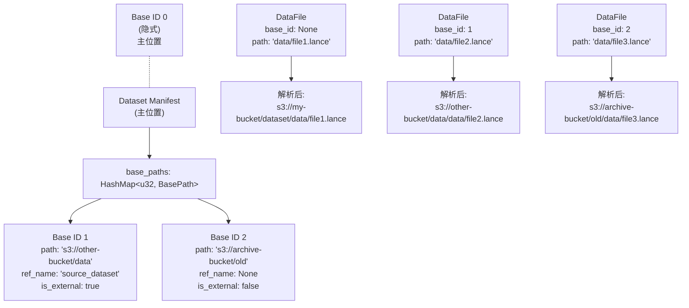
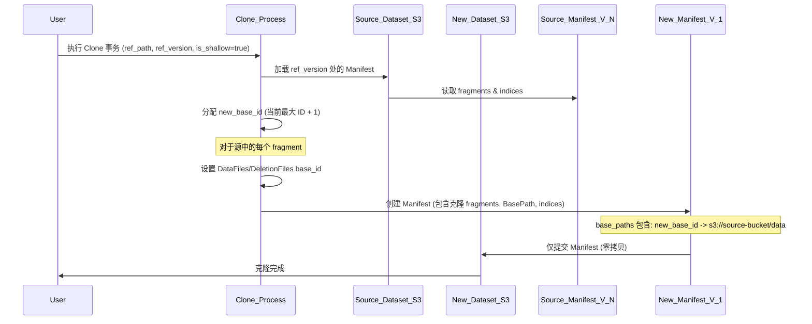
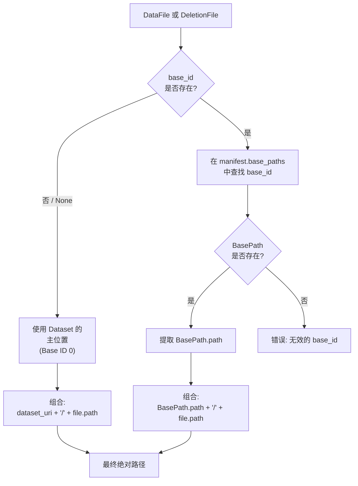
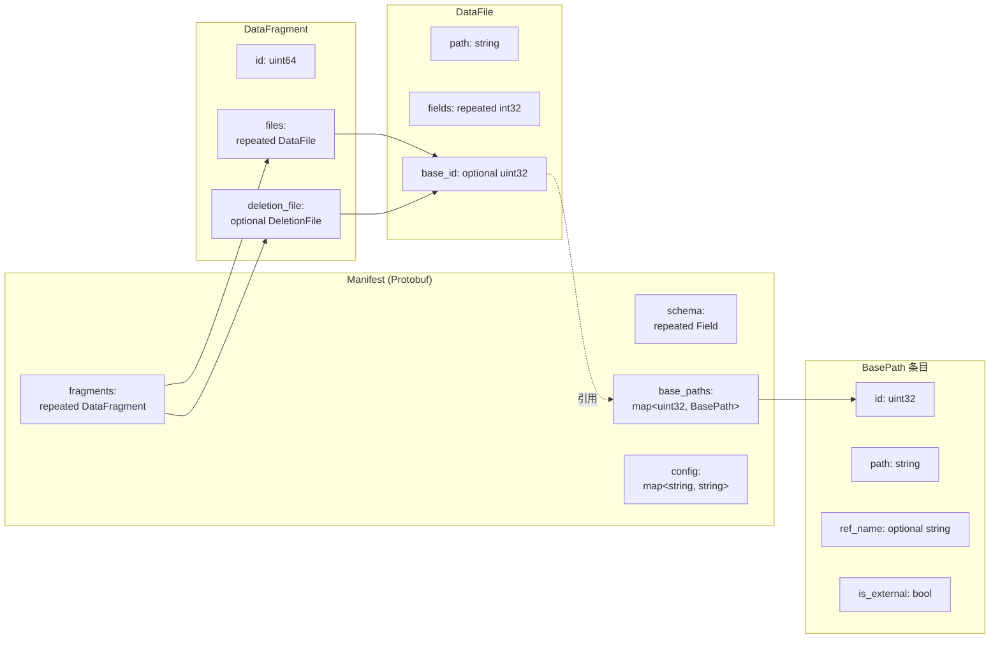
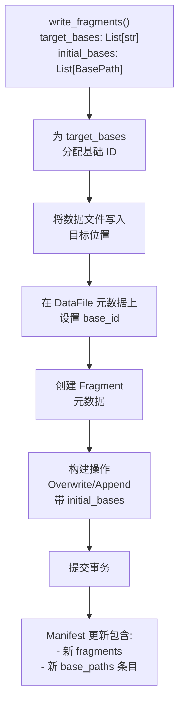

## Lance 源码学习: 6.4 Multi-Base Storage (多基础存储)  
    
### 作者    
digoal    
    
### 日期    
2026-01-16    
    
### 标签    
Lance , AI 数据存储与搜索引擎 , 存储引擎 , 向量索引 , 标量索引 , 全文检索 , 多模态支持 , 零拷贝 , 版本控制 , 时间旅行 , 源码学习 , 随机访问加速 , Parquet    
    
----    
    
## 背景    
下载网页源码     
```  
all_proxy=socks5h://host.docker.internal:11111 curl -L https://deepwiki.com/lance-format/lance/6.4-multi-base-storage -o ./page_source.html  
```  
    
Gemini CLI   
````    
将 @page_source.html 的网页内容转换为 markdown 格式.    
表格、code example 和 mermaid 需填入到 markdown 对应的位置. (注意: 它们可能藏在一些非常非常非常长的行里面, 请小心处理)    
将处理好的 markdown 翻译成中文(关键术语请同时保留中英文), 不需要翻译 code example 和 mermaid 里面的内容.    
链接请使用正常的链接进行转换:    
```    
Sources:    
[`rust/lance-table/src/format/fragment.rs` 271-303](填入正确链接)    
[`python/python/lance/fragment.py` 56-134](填入正确链接)    
```    
特定英文单词或指令等使用`符号包围.    
    
基于翻译的最终结果, 从用户角度使用中文提出 3 个有深度的问题.    
将中文的问题逐一发给 deepwiki mcp 工具(需带上该项目参数 `lance-format/lance`)进行咨询, 将问题以及从 deepwiki mcp 工具返回的结果保持原样追加到 markdown 的末尾.     
最终结果输出到当前目录的 4.md 文件    
````    
    
Gemini CLI 的使用参考 [《Gemini CLI 对比 Qwen3 Coder 谁更强?》](../202601/20260115_05.md)    
    
# Multi-Base Storage (多基础存储)  
  
Multi-Base Storage 是 Lance 的系统，用于在单个 Dataset 中跨多个存储位置存储数据文件。这实现了高效的 Shallow Cloning (浅层克隆)、Tiered Storage (分层存储) 架构，以及无需数据复制的逐步 Dataset 迁移。  
  
本页面涵盖 Lance 如何跨多个存储位置跟踪和解析文件路径。  
  
## 目的与用例 (Purpose and Use Cases)  
  
Multi-Base Storage 允许一个 Dataset 的数据文件和删除文件存在于不同的存储位置，同时保持统一的逻辑视图。每个文件可以可选地引用一个 **Base Path (基础路径)** ，该路径决定了文件的物理存储位置。  
  
### 主要用例 (Primary Use Cases)  
  
| 用例 | 描述 | 核心优势 |  
|----------|-------------|-------------|  
| **Shallow Cloning** | 创建一个新的 Dataset，引用现有 Dataset 的文件而不复制数据 | 几乎瞬时的 Dataset 复制，存储开销极小 |  
| **Tiered Storage** | 将热数据存储在高性能存储（如 SSD）中，将冷数据存储在更便宜的存储（如 S3 Glacier）中 | 根据数据访问模式优化成本和性能 |  
| **Dataset Migration** | 随着时间的推移，逐步将数据文件移动到新位置 | 避免存储迁移期间的停机时间 |  
| **Cross-Region References** | 引用多个云区域 Dataset 中的数据 | 实现跨区域的数据架构 |  
  
## 核心概念 (Core Concepts)  
  
### 基础路径结构 (Base Path Structure)  
  
**基础路径概念图**  
  

  
**来源**: [rust/lance-table/src/format/manifest.rs:102-104](https://github.com/lance-format/lance/blob/0204e7e2/rust/lance-table/src/format/manifest.rs#L102-L104), [protos/table.proto:190-235](https://github.com/lance-format/lance/blob/0204e7e2/protos/table.proto#L190-L235)  
  
### 基础路径组件 (Base Path Components)  
  
每个 `BasePath` 包含：  
  
| 字段 | 类型 | 目的 |  
|-------|------|---------|  
| `id` | `u32` | 该基础路径在 Dataset 内的唯一标识符 |  
| `path` | `String` | 存储位置的绝对 URI (例如 `s3://bucket/path`) |  
| `ref_name` | `Option<String>` | 可选的引用名称 (例如克隆的源分支/标签) |  
| `is_external` | `bool` | 该基础路径是否指向外部 Dataset 位置 |  
  
**Base ID 0** 保留给 Dataset 的主位置，并且从不显式存储在 `base_paths` 映射中。当文件的 `base_id` 为 `None` 时，它隐式使用 Base ID 0。  
  
**来源**: [protos/table.proto:190-202](https://github.com/lance-format/lance/blob/0204e7e2/protos/table.proto#L190-L202), [rust/lance-table/src/format/manifest.rs:103](https://github.com/lance-format/lance/blob/0204e7e2/rust/lance-table/src/format/manifest.rs#L103)  
  
### 文件基础引用 (File Base References)  
  
`DataFile` 和 `DeletionFile` 结构都包含一个可选的 `base_id` 字段：  
  
```rust  
pub struct DataFile {  
    pub path: String,              // 基础路径内的相对路径  
    pub fields: Vec<i32>,  
    // ... 其他字段  
    pub base_id: Option<u32>,      // 如果存在，引用 BasePath  
}  
  
pub struct DeletionFile {  
    pub read_version: u64,  
    pub id: u64,  
    // ... 其他字段  
    pub base_id: Option<u32>,      // 如果存在，引用 BasePath  
}  
```  
  
**来源**: [rust/lance-table/src/format/fragment.rs:52-55](https://github.com/lance-format/lance/blob/0204e7e2/rust/lance-table/src/format/fragment.rs#L52-L55), [rust/lance-table/src/format/fragment.rs:214](https://github.com/lance-format/lance/blob/0204e7e2/rust/lance-table/src/format/fragment.rs#L214)  
  
  
## 浅层克隆架构 (Shallow Cloning Architecture)  
  
Shallow Cloning 创建一个新的 Dataset，它引用现有源 Dataset 的数据文件，而无需复制实际数据。  
  
**浅层克隆创建流程**  
  

  
**来源**: [rust/lance-table/src/format/manifest.rs:237-293](https://github.com/lance-format/lance/blob/0204e7e2/rust/lance-table/src/format/manifest.rs#L237-L293), [rust/lance/src/io/commit.rs:119-176](https://github.com/lance-format/lance/blob/0204e7e2/rust/lance/src/io/commit.rs#L119-L176)  
  
### 浅层克隆实现 (Shallow Clone Implementation)  
  
`Manifest` 上的 `shallow_clone` 方法执行核心转换：  
  
```rust  
pub fn shallow_clone(  
    &self,  
    ref_name: Option<String>,  
    ref_path: String,  
    ref_base_id: u32,  
    branch_name: Option<String>,  
    transaction_file: String,  
) -> Self  
```  
  
关键步骤：  
1. **克隆 fragments**: 遍历源 fragments，将 `ref_base_id` 分配给任何尚未具有 `base_id` 的 `DataFile` 或 `DeletionFile`。  
2. **创建 BasePath 条目**: 在 `base_paths` 映射中添加一个新条目，其中包含源 Dataset 的绝对路径。  
3. **更新 indices**: 在所有 index 元数据上设置 `base_id` 以引用源位置。  
4. **保留元数据**: 复制 schema、配置和其他 Manifest 属性。  
  
**来源**: [rust/lance-table/src/format/manifest.rs:237-293](https://github.com/lance-format/lance/blob/0204e7e2/rust/lance-table/src/format/manifest.rs#L237-L293)  
  
  
## 事务操作 (Transaction Operations)  
  
### 克隆操作 (Clone Operation)  
  
`Clone` 事务操作发起浅层或深层克隆：  
  
```rust  
Operation::Clone {  
    is_shallow: bool,           // 浅层为 true，深层复制为 false  
    ref_name: Option<String>,   // 源分支/标签名称  
    ref_version: u64,           // 要克隆的源版本  
    ref_path: String,           // 源 Dataset 的绝对路径  
    branch_name: Option<String>,// 如果创建分支，则为目标分支名称  
}  
```  
  
**深层 vs 浅层**:  
- **浅层** (`is_shallow: true`): 创建基础路径引用，不复制数据。  
- **深层** (`is_shallow: false`): 使用对象存储原生复制 API 来复制文件。  
  
**来源**: [rust/lance/src/dataset/transaction.rs:273-280](https://github.com/lance-format/lance/blob/0204e7e2/rust/lance/src/dataset/transaction.rs#L273-L280), [protos/transaction.proto:165-185](https://github.com/lance-format/lance/blob/0204e7e2/protos/transaction.proto#L165-L185)  
  
### UpdateBases 操作 (UpdateBases Operation)  
  
`UpdateBases` 操作向现有 Dataset 添加新的基础路径：  
  
```rust  
Operation::UpdateBases {  
    new_bases: Vec<BasePath>,  
}  
```  
  
此操作用于：  
- 为分层存储添加新的存储位置  
- 更新基础路径元数据  
- 支持逐步迁移场景  
  
**目前仅支持添加新的基础路径**，不支持修改或删除现有的路径。  
  
**来源**: [rust/lance/src/dataset/transaction.rs:282-286](https://github.com/lance-format/lance/blob/0204e7e2/rust/lance/src/dataset/transaction.rs#L282-L286), [protos/transaction.proto:237-242](https://github.com/lance-format/lance/blob/0204e7e2/protos/transaction.proto#L237-L242)  
  
   
  
## 文件路径解析 (File Path Resolution)  
  
**文件路径解析流程**  
  

  
**来源**: [rust/lance-table/src/format/manifest.rs:102-104](https://github.com/lance-format/lance/blob/0204e7e2/rust/lance-table/src/format/manifest.rs#L102-L104), [rust/lance-table/src/format/fragment.rs:52-55](https://github.com/lance-format/lance/blob/0204e7e2/rust/lance-table/src/format/fragment.rs#L52-L55)  
  
### 解析算法 (Resolution Algorithm)  
  
对于 Fragment 中的任何文件：  
  
1. **检查 `base_id`** :  
   - 如果为 `None`: 文件相对于 Dataset 的主位置。  
   - 如果为 `Some(id)`: 文件相对于具有该 ID 的基础路径。  
  
2. **解析基础路径**:  
   - 如果 `base_id == 0` (或 `None`): 使用 Dataset URI。  
   - 否则: 查找 `manifest.base_paths[base_id]` 并使用 `BasePath.path`。  
  
3. **构建完整路径**:  
   - 拼接: `<base_path> / <file.path>`  
  
4. **验证**:  
   - 如果 `base_id` 引用了不存在的条目：报错。  
   - 路径必须解析为有效的 Object Store URI。  
  
   
  
## Manifest 结构 (Manifest Structure)  
  
**Manifest 基础路径存储**  
  

  
**来源**: [rust/lance-table/src/format/manifest.rs:34-104](https://github.com/lance-format/lance/blob/0204e7e2/rust/lance-table/src/format/manifest.rs#L34-L104), [protos/table.proto:12-235](https://github.com/lance-format/lance/blob/0204e7e2/protos/table.proto#L12-L235)  
  
### Manifest 字段 (Manifest Fields)  
  
`Manifest` 结构包括：  
  
```rust  
pub struct Manifest {  
    pub schema: Schema,  
    pub fragments: Arc<Vec<Fragment>>,  
    // ...  
    pub base_paths: HashMap<u32, BasePath>,  // 多基础存储  
}  
```  
  
**基础路径映射属性**:  
- **键**: Base ID (`u32`)  
- **值**: `BasePath` 结构  
- **Base ID 0**: 永不显式存储（保留给主位置）  
- **持久化**: 在 Manifest Protobuf 消息中序列化  
- **继承**: 除非显式修改，否则在版本间保留  
  
**来源**: [rust/lance-table/src/format/manifest.rs:102-104](https://github.com/lance-format/lance/blob/0204e7e2/rust/lance-table/src/format/manifest.rs#L102-L104), [protos/table.proto:219-234](https://github.com/lance-format/lance/blob/0204e7e2/protos/table.proto#L219-L234)  
  
   
  
## 使用多个基础进行写入 (Writing with Multiple Bases)  
  
在创建应存储在备用位置的 fragments 时，可以指定目标基础：  
  
**使用基础路径进行 Fragment 写入**  
  

  
**Python API 示例参数**:  
  
```python  
def write_fragments(  
    data: ReaderLike,  
    dataset_uri: str,  
    # ...  
    target_bases: Optional[List[str]] = None,      # 备用存储的 URI  
    initial_bases: Optional[List[DatasetBasePath]] = None,  # BasePath 对象  
) -> List[FragmentMetadata]:  
```  
  
**来源**: [python/python/lance/fragment.py:851-893](https://github.com/lance-format/lance/blob/0204e7e2/python/python/lance/fragment.py#L851-L893), [python/src/fragment.rs:396-416](https://github.com/lance-format/lance/blob/0204e7e2/python/src/fragment.rs#L396-L416)  
  
   
  
## 用例示例 (Use Case Examples)  
  
### 分层存储策略 (Tiered Storage Strategy)  
  
**场景**: 将近期数据存储在快速的 SSD 支持存储中，将旧数据归档在更便宜的对象存储中。  
  
1. **初始写入**: 数据写入主位置（SSD 支持的 S3 存储桶）。  
2. **后台归档**: 定期将冷 fragments 移动到归档存储。  
3. **更新 Manifest**: 将归档存储添加为新的基础路径，更新 fragment 元数据。  
4. **查询**: 透明地访问热数据和冷数据。  
  
### 逐步迁移 (Gradual Migration)  
  
**场景**: 在不停机的情况下，将 Dataset 从一个云提供商迁移到另一个。  
  
1. **开始**: Dataset 完全在提供商 A 上。  
2. **添加基础路径**: 将提供商 B 存储注册为新基础。  
3. **写入新数据**: 使用 `target_bases` 将新写入指向提供商 B。  
4. **复制旧数据**: 在后台逐步将 fragments 从 A 复制到 B。  
5. **更新 fragments**: 在复制 fragments 时更新 `base_id`。  
6. **完成**: 所有数据都在提供商 B 上，删除提供商 A 的基础路径。  
  
### 开发环境 (Development Environments)  
  
**场景**: 创建引用生产数据的隔离开发 Dataset。  
  
1. **克隆生产**: 将生产 Dataset 浅层克隆到开发环境。  
2. **即时可用性**: 开发 Dataset 立即可以使用（引用生产数据）。  
3. **隔离写入**: 新数据写入开发存储，不影响生产。  
4. **存储效率**: 开发环境仅存储增量数据。  
  
   
  
## 实现细节 (Implementation Details)  
  
### Fragment 元数据更新 (Fragment Metadata Updates)  
  
当修改 fragments 以使用不同的基础路径时：  
  
```rust  
// 在浅层克隆期间  
for file in &mut cloned_fragment.files {  
    if file.base_id.is_none() {  
        file.base_id = Some(ref_base_id);  
    }  
}  
  
if let Some(deletion) = &mut cloned_fragment.deletion_file {  
    if deletion.base_id.is_none() {  
        deletion.base_id = Some(ref_base_id);  
    }  
}  
```  
  
**规则**:  
- 现有的 `base_id` 值 **绝不会被覆盖**。  
- 在克隆操作期间仅分配 `None` 值。  
- 允许链式克隆（克隆的克隆）。  
  
**来源**: [rust/lance-table/src/format/manifest.rs:246-263](https://github.com/lance-format/lance/blob/0204e7e2/rust/lance-table/src/format/manifest.rs#L246-L263)  
  
### Index 元数据 (Index Metadata)  
  
Index 文件也支持 `base_id` 引用：  
  
```rust  
pub struct IndexMetadata {  
    pub uuid: Uuid,  
    pub name: String,  
    // ...  
    pub base_id: Option<u32>,  // Index 文件的位置  
}  
```  
  
在浅层克隆期间，索引会被更新以引用源 Dataset 的基础：  
  
```rust  
section.indices  
    .into_iter()  
    .map(|index_pb| {  
        let mut index = IndexMetadata::try_from(index_pb)?;  
        index.base_id = Some(new_base_id);  // 指向源位置  
        Ok(index)  
    })  
```  
  
**来源**: [rust/lance/src/io/commit.rs:155-167](https://github.com/lance-format/lance/blob/0204e7e2/rust/lance/src/io/commit.rs#L155-L167)  
  
### 冲突解决 (Conflict Resolution)  
  
Multi-Base Storage 与 Lance 的事务系统兼容：  
  
- **克隆操作**: 与并发追加兼容（添加新的基础路径）。  
- **UpdateBases 操作**: 与大多数操作兼容（仅修改基础路径映射）。  
- **Fragment 重写**: 如果它们修改了引用外部基础的 fragments，可能会产生冲突。  
  
**来源**: [rust/lance/src/io/commit/conflict_resolver.rs:44-61](https://github.com/lance-format/lance/blob/0204e7e2/rust/lance/src/io/commit/conflict_resolver.rs#L44-L61)  
  
   
  
## 限制与注意事项 (Limitations and Considerations)  
  
### 当前限制 (Current Limitations)  
  
| 限制 | 描述 | 解决方法 |  
|------------|-------------|------------|  
| **仅限添加基础路径** | 无法删除或修改现有的基础路径 | 如果需要更改基础路径，需创建新的 Dataset 版本 |  
| **无自动归档** | 用户必须手动移动文件并更新元数据以实现归档策略 | 使用 `UpdateBases` 构建自定义归档流水线 |  
| **跨账户复杂性** | 需要所有基础路径位置的权限 | 确保一致的 IAM/凭证配置 |  
  
### 性能考量 (Performance Considerations)  
  
- **浅层克隆**: 几乎瞬时创建，存储开销最小。  
- **跨区域访问**: 访问远程基础的数据时延迟会增加。  
- **元数据大小**: 大型 `base_paths` 映射会略微增加 Manifest 大小。  
- **对象存储成本**: 可能产生跨区域数据传输费用。  
  
### 最佳实践 (Best Practices)  
  
1. **Base ID 分配**: 使用顺序 ID 以便于管理。  
2. **引用命名**: 使用描述性的 `ref_name` 值以实现可追溯性。  
3. **清理**: 在删除源 Dataset 之前跟踪基础路径的使用情况。  
4. **权限**: 确保对所有基础路径位置具有读取权限。  
5. **测试**: 在多基础配置中验证文件解析。  
  
   
  
**引用的关键来源**:   
- [rust/lance-table/src/format/manifest.rs:102-104, 237-293](https://github.com/lance-format/lance/blob/0204e7e2/rust/lance-table/src/format/manifest.rs#L102-L104)  
- [rust/lance-table/src/format/fragment.rs:52-55, 214](https://github.com/lance-format/lance/blob/0204e7e2/rust/lance-table/src/format/fragment.rs#L52-L55)  
- [rust/lance/src/dataset/transaction.rs:273-286](https://github.com/lance-format/lance/blob/0204e7e2/rust/lance/src/dataset/transaction.rs#L273-L286)  
- [rust/lance/src/io/commit.rs:119-176](https://github.com/lance-format/lance/blob/0204e7e2/rust/lance/src/io/commit.rs#L119-L176)  
- [protos/table.proto:190-235](https://github.com/lance-format/lance/blob/0204e7e2/protos/table.proto#L190-L235)  
- [python/python/lance/fragment.py:851-893](https://github.com/lance-format/lance/blob/0204e7e2/python/python/lance/fragment.py#L851-L893)  
  
   
  
## 常见问题解答 (Q&A)  
  
### Q1: Multi-Base Storage 如何在不复制数据的情况下实现 Shallow Cloning？其核心元数据修改逻辑是什么？  
  
**A1**: Multi-Base Storage 通过修改数据集的元数据（`Manifest`）来实现浅层克隆（Shallow Cloning），而无需复制实际数据文件。核心逻辑在于，新的克隆数据集的 `Manifest` 会引用源数据集的数据文件，而不是创建新的数据文件副本。  
  
**实现机制：**  
当执行浅层克隆时，`Operation::Clone` 事务被触发，其中 `is_shallow` 字段设置为 `true`。`Dataset::shallow_clone` 方法会创建一个新的数据集，并将其 `Manifest` 中的 `base_paths` 字段更新，以指向源数据集的 URI。  
  
**核心元数据修改逻辑发生在 `Manifest::shallow_clone` 方法中：**  
1. **克隆 Fragments**: 遍历源 `Manifest` 中的所有 `Fragment`。  
2. **更新 `base_id`** : 对于每个 `Fragment` 中的 `DataFile` 和 `DeletionFile`，如果其 `base_id` 为 `None`，则将其设置为一个新的 `ref_base_id`。这个 `ref_base_id` 关联到源数据集的路径。  
3. **添加 `BasePath` 条目**: 在新的 `Manifest` 的 `base_paths` 映射中，添加一个 `BasePath` 条目，其 `id` 为 `ref_base_id`，`path` 为源数据集的绝对 URI (`ref_path`)，`is_dataset_root` 设置为 `true`。  
4. **保留其他元数据**: 源 `Manifest` 的 `schema`、`config` 和其他元数据会被克隆到新的 `Manifest` 中。  
  
通过这种方式，新的数据集的 `Manifest` 包含了对源数据集数据文件的引用，而不是复制这些文件，从而实现了浅层克隆。  
  
### Q2: 在 Multi-Base Storage 系统中，文件路径解析（File Path Resolution）的具体算法是如何处理 Base ID 和 Base Path 的？  
  
**A2**: 在 Multi-Base Storage 系统中，文件路径解析算法通过 `base_id` 和 `BasePath` 来确定数据文件或删除文件的实际存储位置。  
  
**解析算法步骤：**  
1. **检查 `base_id`** :  
   - 如果 `base_id` 为 `None`，则文件位于数据集的主存储位置（隐式 `base_id` 为 0）。  
   - 如果 `base_id` 为 `Some(id)`，则文件相对于具有该 `ID` 的 `BasePath`。  
2. **解析 `BasePath`** :  
   - 如果 `base_id` 为 0（或 `None`），则使用数据集的 URI 作为基础路径。  
   - 否则，通过 `manifest.base_paths[base_id]` 查找对应的 `BasePath` 结构，并使用其 `path` 字段作为基础路径。`BasePath` 结构包含 `id`、`path`、`name` 和 `is_dataset_root` 字段。  
3. **构建完整路径**: 将解析出的基础路径与文件自身的相对路径 (`file.path`) 拼接起来，形成完整的绝对路径。例如，`dataset.data_file_dir(data_file)` 方法会根据 `data_file.base_id` 来确定数据文件所在的目录。  
4. **验证**: 如果 `base_id` 引用了一个不存在的 `BasePath` 条目，则会返回错误。  
  
`Dataset` 结构体中的 `data_file_dir` 方法展示了这一逻辑。它首先检查 `data_file.base_id`，如果存在，则从 `self.manifest.base_paths` 中获取对应的 `BasePath`，并使用其 `path` 来构建最终的文件路径。如果 `is_dataset_root` 为 `true`，则会在 `BasePath.path` 后追加 `DATA_DIR`。  
  
### Q3: Multi-Base Storage 在分层存储（Tiered Storage）和数据迁移（Dataset Migration）场景下有哪些优势和局限性？  
  
**A3**: Multi-Base Storage 为分层存储和数据迁移提供了显著优势，但也存在一些局限性。  
  
**优势：**  
* **分层存储 (Tiered Storage)** :  
  - **成本优化**: 可以将“热”数据存储在高性能、高成本的存储（如 SSD）中，而将“冷”数据存储在低成本、低性能的存储（如 S3 Glacier）中，从而优化存储成本。  
  - **性能优化**: 根据数据访问模式，将常用数据放置在访问速度更快的存储层，提高查询性能。  
  - **透明访问**: 应用程序可以透明地访问不同存储层的数据，无需感知底层存储位置的差异。  
* **数据迁移 (Dataset Migration)** :  
  - **零停机迁移**: 可以在不中断服务的情况下，逐步将数据集从一个存储位置迁移到另一个位置。  
  - **灵ivalence**: 允许将新写入的数据直接写入新的存储位置，同时逐步迁移旧数据。  
  - **减少风险**: 逐步迁移可以降低一次性大规模迁移带来的风险。  
  
**局限性：**  
* **当前限制**:  
  - **仅支持添加 `base_paths`** : 目前只能添加新的 `base_paths`，不支持修改或删除现有的 `base_paths`。如果需要更改 `base_paths`，可能需要创建新的数据集版本。  
  - **无自动归档**: 不提供自动归档功能，用户需要手动移动文件并更新元数据以实现归档策略。  
  - **跨账户复杂性**: 如果 `base_paths` 涉及不同的云账户或存储凭证，需要确保所有位置的权限配置正确且一致。  
* **性能考量**:  
  - **跨区域访问延迟**: 如果 `base_paths` 引用了不同地理区域的存储，数据访问可能会引入额外的网络延迟。  
  - **元数据大小**: 大量的 `base_paths` 可能会略微增加 `Manifest` 的大小。  
  - **对象存储成本**: 跨区域数据传输可能会产生额外的费用。  
  
   
  
#### [PolarDB 学习图谱](https://www.aliyun.com/database/openpolardb/activity "8642f60e04ed0c814bf9cb9677976bd4")
  
  
#### [PostgreSQL 解决方案集合](../201706/20170601_02.md "40cff096e9ed7122c512b35d8561d9c8")
  
  
#### [德哥 / digoal's Github - 公益是一辈子的事.](https://github.com/digoal/blog/blob/master/README.md "22709685feb7cab07d30f30387f0a9ae")
  
  
#### [About 德哥](https://github.com/digoal/blog/blob/master/me/readme.md "a37735981e7704886ffd590565582dd0")
  
  

  
