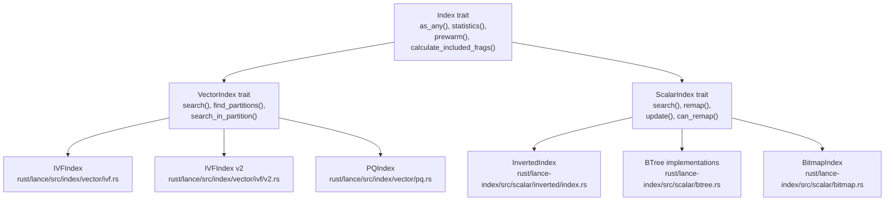
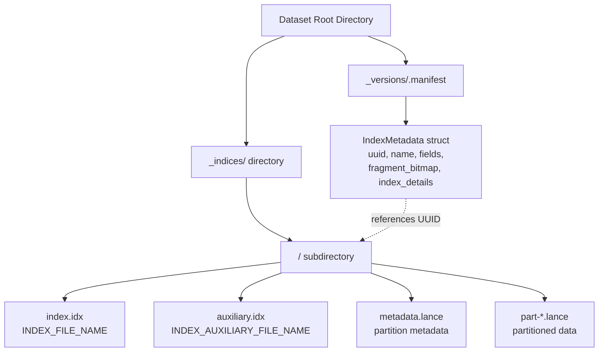
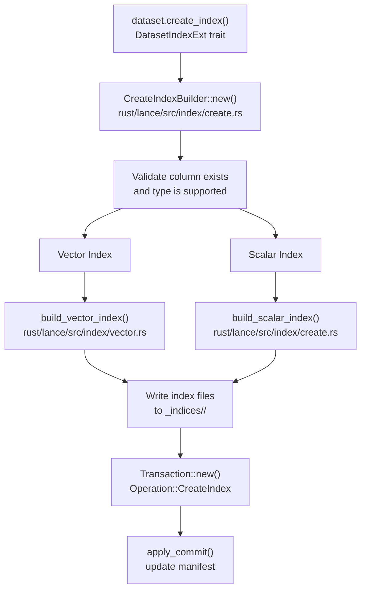
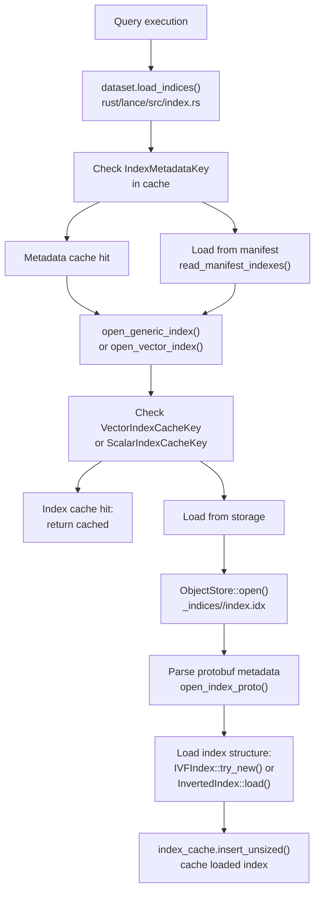
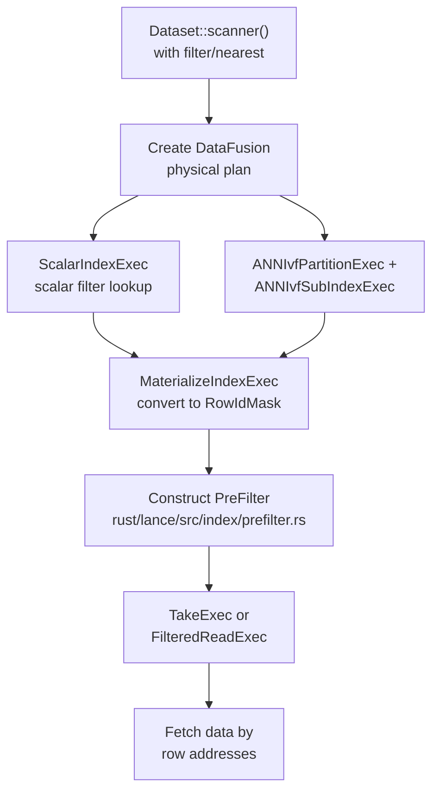
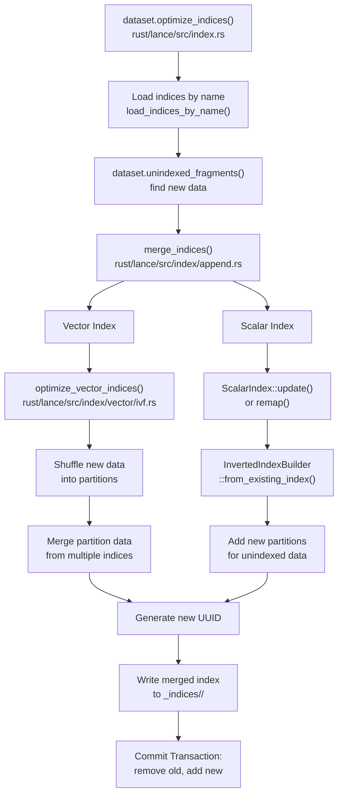
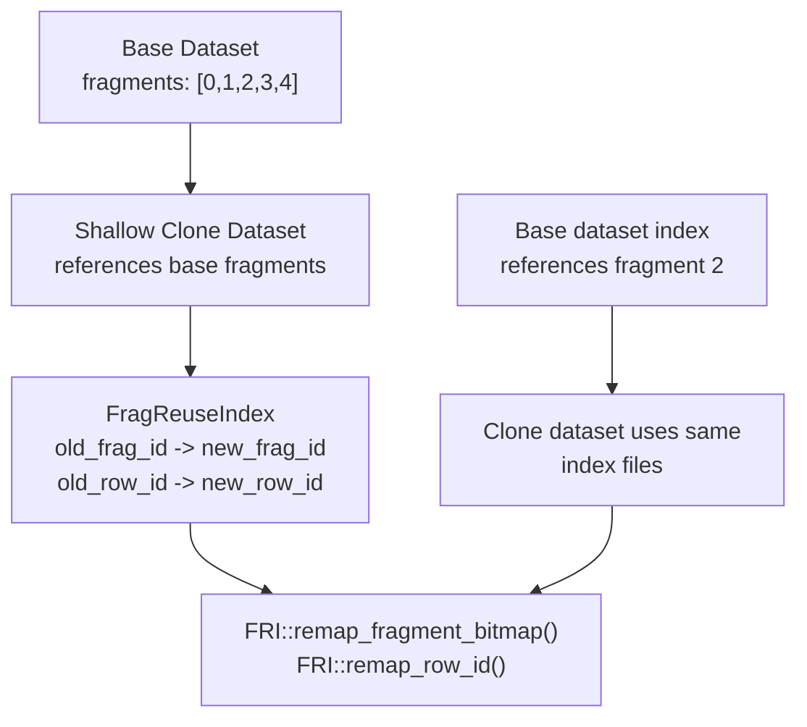

## Lance 源码学习: 7 索引 (Indexing)    
      
### 作者      
digoal      
      
### 日期      
2026-01-16      
      
### 标签      
Lance , AI 数据存储与搜索引擎 , 存储引擎 , 向量索引 , 标量索引 , 全文检索 , 多模态支持 , 零拷贝 , 版本控制 , 时间旅行 , 源码学习 , 随机访问加速 , Parquet      
      
----      
      
## 背景      
下载网页源码       
```    
all_proxy=socks5h://host.docker.internal:11111 curl -L https://deepwiki.com/lance-format/lance/7-indexing -o ./page_source.html    
```    
      
Gemini CLI     
````      
将 @page_source.html 的网页内容转换为 markdown 格式.      
表格、code example 和 mermaid 需填入到 markdown 对应的位置. (注意: 它们可能藏在一些非常非常非常长的行里面, 请小心处理)      
将处理好的 markdown 翻译成中文(关键术语请同时保留中英文), 不需要翻译 code example 和 mermaid 里面的内容.      
链接请使用正常的链接进行转换:      
```      
Sources:      
[`rust/lance-table/src/format/fragment.rs` 271-303](填入正确链接)      
[`python/python/lance/fragment.py` 56-134](填入正确链接)      
```      
特定英文单词或指令等使用`符号包围.      
      
基于翻译的最终结果, 从用户角度使用中文提出 3 个高价值且有深度的问题.      
将中文的问题逐一发给 deepwiki mcp 工具(需带上该项目参数 `lance-format/lance`)进行咨询, 将问题以及从 deepwiki mcp 工具返回的结果保持原样追加到 markdown 的末尾.       
最终结果输出到当前目录的 5.md 文件      
````      
      
Gemini CLI 的使用参考 [《Gemini CLI 对比 Qwen3 Coder 谁更强?》](../202601/20260115_05.md)      
      
# 索引 (Indexing)  
  
## 目的和范围 (Purpose and Scope)  
  
Lance 提供了一个双重索引系统，以加速向量相似度搜索 (vector similarity search) 和标量过滤 (scalar filtering) 操作。索引是独立于主数据存储的二级数据结构，通过版本化的元数据系统进行管理，支持并发访问和增量更新。  
  
本页面概述了索引架构，包括：  
  
* 核心索引特征 (Traits) 和类型层次结构  
* 索引存储和生命周期管理  
* 与查询执行管道 (query execution pipeline) 的集成  
* 索引优化和维护  
  
## 索引架构 (Index Architecture)  
  
Lance 实现了一个可插拔的索引系统，主要包含两个索引家族：用于近似最近邻 (ANN) 搜索的向量索引和用于过滤操作的标量索引。所有索引都实现了定义在 [`rust/lance-index/src/lib.rs` 68-95](https://github.com/lance-format/lance/blob/0204e7e2/rust/lance-index/src/lib.rs#L68-L95) 中的 `Index` 特征 (trait)。  
  
### 核心索引特征层次结构 (Core Index Trait Hierarchy)  
  

  
**索引特征层次结构**  
  
所有索引都实现了基础 `Index` 特征，该特征提供了通用操作：  
  
* `as_any()`：类型转换为具体实现  
* `statistics()`：返回 JSON 格式的索引元数据  
* `prewarm()`：将频繁访问的数据加载到缓存中  
* `calculate_included_frags()`：确定哪些片段 (fragments) 已被索引  
  
向量和标量索引通过特定领域的特征扩展了这一点：  
  
* `VectorIndex`：添加了感知分区的搜索方法和量化支持  
* `ScalarIndex`：添加了重映射 (remapping) 和增量更新功能  
  
Sources:  
[`rust/lance-index/src/lib.rs` 68-95](https://github.com/lance-format/lance/blob/0204e7e2/rust/lance-index/src/lib.rs#L68-L95)  
[`rust/lance/src/index.rs` 1-206](https://github.com/lance-format/lance/blob/0204e7e2/rust/lance/src/index.rs#L1-L206)  
[`rust/lance-index/src/vector.rs` 1-50](https://github.com/lance-format/lance/blob/0204e7e2/rust/lance-index/src/vector.rs#L1-L50)  
[`rust/lance-index/src/scalar.rs` 1-100](https://github.com/lance-format/lance/blob/0204e7e2/rust/lance-index/src/scalar.rs#L1-L100)  
  
### 支持的索引类型 (Supported Index Types)  
  
Lance 支持由 [`rust/lance-index/src/lib.rs` 97-158](https://github.com/lance-format/lance/blob/0204e7e2/rust/lance-index/src/lib.rs#L97-L158) 中定义的 `IndexType` 枚举标识的多种索引类型：  
  
**向量索引类型：**  
  
| Index Type | Purpose | Key Components |  
| --- | --- | --- |  
| `IvfFlat` | 分区精确向量搜索 | IVF 分区 + 平面存储 (flat storage) |  
| `IvfPq` | 分区量化向量搜索 | IVF + 乘积量化 (Product Quantization) |  
| `IvfSq` | 分区标量量化 | IVF + 标量量化 (Scalar Quantization) |  
| `IvfRq` | 分区残差量化 | IVF + 残差量化 (Residual Quantization) |  
| `IvfHnswFlat` | IVF + HNSW 图，无压缩 | IVF + HNSW 子索引 |  
| `IvfHnswPq` | IVF + HNSW + PQ | IVF + HNSW + 乘积量化 |  
| `IvfHnswSq` | IVF + HNSW + SQ | IVF + HNSW + 标量量化 |  
  
参见 向量索引 (7.1) 了解详细文档。  
  
**标量索引类型：**  
  
| Index Type | Purpose | Use Cases |  
| --- | --- | --- |  
| `BTree` | 有序键值索引 | 范围查询，等值谓词 |  
| `Bitmap` | 集合成员测试 | 低基数过滤 |  
| `LabelList` | 列表/数组操作 | 数组包含查询 |  
| `Inverted` | 全文搜索 | 使用 BM25 评分的文本搜索 |  
| `NGram` | 模式匹配 | 子串搜索 |  
  
Sources:  
[`rust/lance-index/src/lib.rs` 97-158](https://github.com/lance-format/lance/blob/0204e7e2/rust/lance-index/src/lib.rs#L97-L158)  
[`rust/lance/src/index/vector.rs` 272-286](https://github.com/lance-format/lance/blob/0204e7e2/rust/lance/src/index/vector.rs#L272-L286)  
  
### 索引存储组织 (Index Storage Organization)  
  

  
**索引文件组织**  
  
索引存储在 `_indices/` 目录中，每个索引位于一个以 UUID 命名的子目录中。关键文件包括：  
  
* `index.idx` (`INDEX_FILE_NAME`)：包含质心 (centroids)、码本 (codebooks) 或索引结构的主索引文件  
* `auxiliary.idx` (`INDEX_AUXILIARY_FILE_NAME`)：可选的辅助数据（例如，用于 IVF_HNSW 的量化存储）  
* `metadata.lance`：对于分片索引 (sharded indices)，包含分区元数据  
* 分区文件 (Partition files)：大型索引的独立分区数据  
  
`_versions/` 中的清单 (manifest) 文件包含 `IndexMetadata` 结构体，用于跟踪：  
  
* `uuid`：索引的唯一标识符  
* `name`：用户指定的索引名称  
* `fields`：被索引的字段 ID  
* `fragment_bitmap`：该索引覆盖了哪些片段  
* `index_details`：特定类型的配置 (protobuf Any)  
  
Sources:  
[`rust/lance-index/src/lib.rs` 36-42](https://github.com/lance-format/lance/blob/0204e7e2/rust/lance-index/src/lib.rs#L36-L42)  
[`rust/lance-table/src/format.rs` 200-250](https://github.com/lance-format/lance/blob/0204e7e2/rust/lance-table/src/format.rs#L200-L250)  
[`rust/lance/src/index.rs` 295-299](https://github.com/lance-format/lance/blob/0204e7e2/rust/lance/src/index.rs#L295-L299)  
  
## 索引创建 (Index Creation)  
  
创建索引涉及数据准备、可选训练（针对向量索引）、索引结构构建和事务提交。该过程通过 [`rust/lance/src/index/create.rs` 1-400](https://github.com/lance-format/lance/blob/0204e7e2/rust/lance/src/index/create.rs#L1-L400) 中定义的 `CreateIndexBuilder` API 进行管理。  
  
### 高层创建流程 (High-Level Creation Flow)  
  

  
**索引创建管道**  
  
无论类型如何，索引创建都遵循一个通用模式：验证、构建、写入和原子提交。向量索引和标量索引的具体细节有所不同。  
  
Sources:  
[`rust/lance/src/index/create.rs` 1-400](https://github.com/lance-format/lance/blob/0204e7e2/rust/lance/src/index/create.rs#L1-L400)  
[`rust/lance/src/index.rs` 539-565](https://github.com/lance-format/lance/blob/0204e7e2/rust/lance/src/index.rs#L539-L565)  
[`rust/lance/src/index/vector.rs` 298-400](https://github.com/lance-format/lance/blob/0204e7e2/rust/lance/src/index/vector.rs#L298-L400)  
  
有关包括 IVF 训练、量化器训练和分区构建在内的详细向量索引创建信息，请参见 构建和优化向量索引 (7.1.3)。  
  
有关包括分词、树构建和插件架构在内的详细标量索引创建信息，请参见 标量索引 (7.2)。  
  
## 索引加载和缓存 (Index Loading and Caching)  
  
Lance 采用多级缓存策略来最大限度地减少 I/O 并提高查询性能。索引在首次使用时延迟加载 (lazily loaded)，并使用 `LanceCache` 系统进行缓存。  
  
### 索引加载管道 (Index Loading Pipeline)  
  

  
**采用多级缓存的索引加载**  
  
索引在两个级别进行缓存：  
  
1. **元数据缓存 (Metadata cache)**：存储每个数据集版本的 `IndexMetadata` 列表  
2. **索引缓存 (Index cache)**：存储已加载的索引结构（完整索引或分区）  
  
对于向量索引，分区可以使用 `LegacyIVFPartitionKey`（传统格式）单独缓存，也可以集成到主索引结构（v2 格式）中。  
  
Sources:  
[`rust/lance/src/index.rs` 649-694](https://github.com/lance-format/lance/blob/0204e7e2/rust/lance/src/index.rs#L649-L694)  
[`rust/lance/src/index.rs` 353-365](https://github.com/lance-format/lance/blob/0204e7e2/rust/lance/src/index.rs#L353-L365)  
[`rust/lance/src/index/vector/ivf.rs` 184-238](https://github.com/lance-format/lance/blob/0204e7e2/rust/lance/src/index/vector/ivf.rs#L184-L238)  
  
### 缓存键类型 (Cache Key Types)  
  
Lance 使用实现 `CacheKey` 或 `UnsizedCacheKey` 特征的类型化缓存键：  
  
| Cache Key | Code Symbol | Purpose | Key Format |  
| --- | --- | --- | --- |  
| Metadata | `IndexMetadataKey` | 索引元数据列表 | `version: <version>` |  
| Scalar Index | `ScalarIndexCacheKey` | 完整标量索引 | `<uuid>[-<fri_uuid>]` |  
| Vector Index | `VectorIndexCacheKey` | 完整向量索引 | `<uuid>[-<fri_uuid>]` |  
| IVF Partition | `LegacyIVFPartitionKey` | 单个 IVF 分区 | `ivf-<partition_id>` |  
| Fragment Reuse | `FragReuseIndexCacheKey` | FRI 元数据 | `<uuid>[-<fri_uuid>]` |  
| MemWal | `MemWalCacheKey` | 内存预写日志 | `<uuid>[-<fri_uuid>]` |  
  
当数据集使用片段重用（浅克隆）时，会包含可选的 `fri_uuid`。  
  
Sources:  
[`rust/lance/src/index.rs` 92-186](https://github.com/lance-format/lance/blob/0204e7e2/rust/lance/src/index.rs#L92-186)  
[`rust/lance/src/index/vector/ivf.rs` 101-118](https://github.com/lance-format/lance/blob/0204e7e2/rust/lance/src/index/vector/ivf.rs#L101-L118)  
  
## 查询中的索引使用 (Index Usage in Queries)  
  
索引通过自定义物理计划节点与 DataFusion 查询执行管道集成，这些节点执行索引查找并将结果转换为用于数据获取的行地址。有关全面的查询执行细节，请参见 [查询执行管道 (4.2)](/lance-format/lance/4.2-query-execution-pipeline)。  
  
### 索引加速的查询流程 (Index-Accelerated Query Flow)  
  

  
**物理计划中的索引使用**  
  
索引通过专门的执行节点使用：  
  
* **标量索引**：`ScalarIndexExec` 执行索引查找并返回匹配的行 ID  
* **向量索引**：`ANNIvfPartitionExec` 查找相关分区，然后 `ANNIvfSubIndexExec` 在其中进行搜索  
* **物化 (Materialization)**：`MaterializeIndexExec` 将索引结果转换为 `RowIdMask` 以进行高效过滤  
* **预过滤 (Prefiltering)**：来自多个索引的结果在数据获取之前通过 `PreFilter` 特征进行组合  
  
Sources:  
[`rust/lance/src/index/prefilter.rs` 1-200](https://github.com/lance-format/lance/blob/0204e7e2/rust/lance/src/index/prefilter.rs#L1-L200)  
[`rust/lance-index/src/prefilter.rs` 1-100](https://github.com/lance-format/lance/blob/0204e7e2/rust/lance-index/src/prefilter.rs#L1-L100)  
  
### PreFilter 特征 (PreFilter Trait)  
  
`PreFilter` 特征（定义在 [`rust/lance-index/src/prefilter.rs` 1-100](https://github.com/lance-format/lance/blob/0204e7e2/rust/lance-index/src/prefilter.rs#L1-L100)）提供了一个统一的行过滤接口：  
  
```rust  
pub trait PreFilter {  
    fn mask(&self) -> Option<Arc<RowIdMask>>;  
    fn filter_row_ids(&self, row_ids: impl Iterator<Item = u64>) -> Vec<u64>;  
    fn is_empty(&self) -> bool;  
    async fn wait_for_ready(&self) -> Result<()>;  
}  
```  
  
主要实现：  
  
* `NoFilter`：直通，不过滤  
* 基于 `RowIdMask` 的过滤器：使用基于树的数据结构进行高效的集合操作  
* 组合过滤器：多个谓词的 AND/OR 组合  
  
这使得能够在获取数据之前高效地组合标量和向量索引结果。  
  
Sources:  
[`rust/lance-index/src/prefilter.rs` 1-100](https://github.com/lance-format/lance/blob/0204e7e2/rust/lance-index/src/prefilter.rs#L1-L100)  
[`rust/lance/src/index/prefilter.rs` 1-200](https://github.com/lance-format/lance/blob/0204e7e2/rust/lance/src/index/prefilter.rs#L1-L200)  
  
## 索引优化 (Index Optimization)  
  
Lance 通过 `optimize_indices()` 操作支持增量索引更新，该操作合并多个索引版本并包含未索引的数据。参见 [索引管理 (7.3)](/lance-format/lance/7.3-index-management) 了解详细的优化策略。  
  
### 优化流程 (Optimization Flow)  
  

  
**索引优化管道**  
  
优化涉及：  
  
1. 按名称加载现有索引  
2. 识别未索引的片段  
3. 将旧索引与新数据合并  
4. 写入新的合并索引  
5. 原子事务以替换旧索引  
  
**按类型的合并策略：**  
  
* **向量 (IVF)**：重用已训练的 IVF 模型和量化器，将新数据混洗 (shuffle) 到分区中，合并来自多个索引版本的分区内容  
* **标量 (Inverted)**：为未索引的数据创建新分区，同时引用现有分区，无需重新训练  
* **标量 (BTree)**：可能会重建结构或使用追加优化 (append-optimized) 策略  
  
Sources:  
[`rust/lance/src/index.rs` 804-871](https://github.com/lance-format/lance/blob/0204e7e2/rust/lance/src/index.rs#L804-L871)  
[`rust/lance/src/index/append.rs` 43-150](https://github.com/lance-format/lance/blob/0204e7e2/rust/lance/src/index/append.rs#L43-L150)  
[`rust/lance/src/index/vector/ivf.rs` 265-559](https://github.com/lance-format/lance/blob/0204e7e2/rust/lance/src/index/vector/ivf.rs#L265-L559)  
[`rust/lance-index/src/scalar/inverted/builder.rs` 177-214](https://github.com/lance-format/lance/blob/0204e7e2/rust/lance-index/src/scalar/inverted/builder.rs#L177-L214)  
  
## 索引管理 API (Index Management API)  
  
Lance 通过定义在 [`rust/lance-index/src/lib.rs` 196-250](https://github.com/lance-format/lance/blob/0204e7e2/rust/lance-index/src/lib.rs#L196-L250) 中的 `DatasetIndexExt` 特征提供了用于索引生命周期管理的综合 API。  
  
### 核心管理操作 (Core Management Operations)  
  
**创建索引 (Creating Indices)：**  
  
```rust  
dataset.create_index(  
    &["column_name"],  
    index_type,  
    name,  
    &params,  
    replace  
).await?;  
```  
  
参见 索引管理 (7.3) 了解详细的创建模式。  
  
**列出索引 (Listing Indices)：**  
  
```rust  
let indices = dataset.list_indices().await?;  
```  
  
返回包含 UUID、名称、字段、片段覆盖范围和类型详细信息的 `Vec<IndexMetadata>`。系统过滤掉不支持的旧格式，并通过 `FragReuseIndex` 对克隆的数据集应用片段重映射。  
  
**删除索引 (Dropping Indices)：**  
  
```rust  
dataset.drop_index("index_name").await?;  
```  
  
创建一个带有 `Operation::CreateIndex`（空的 `new_indices`，填充的 `removed_indices`）的 `Transaction`，以原子方式删除索引元数据。物理文件保留直到手动清理。  
  
**优化索引 (Optimizing Indices)：**  
  
```rust  
dataset.optimize_indices(&options).await?;  
```  
  
合并多个索引版本并包含未索引的数据。由 `OptimizeOptions` 控制，包括 `num_indices_to_merge` 和 `index_names`。  
  
**检索统计信息 (Retrieving Statistics)：**  
  
```rust  
let stats_json = dataset.index_statistics("index_name").await?;  
```  
  
返回包含特定索引类型指标（分区计数、量化参数、Token 计数等）的 JSON。  
  
Sources:  
[`rust/lance/src/index.rs` 500-900](https://github.com/lance-format/lance/blob/0204e7e2/rust/lance/src/index.rs#L500-L900)  
[`rust/lance-index/src/lib.rs` 196-250](https://github.com/lance-format/lance/blob/0204e7e2/rust/lance-index/src/lib.rs#L196-L250)  
  
## 索引版本控制 (Index Versioning)  
  
Lance 使用 `IndexMetadata.index_version` 中的版本号来跟踪格式更改并支持向后兼容性：  
  
| Index Family | Version Constant | Value | Format Description |  
| --- | --- | --- | --- |  
| Vector indices | `VECTOR_INDEX_VERSION` | 1 | 当前基于 IVF 的格式 |  
| Inverted (FTS) | `INVERTED_INDEX_VERSION` | 1 | 基于 FST 的 Token 存储 |  
| Inverted (legacy) | (implicit) | 0 | 基于 Arrow 的 Token 存储 |  
| BTree | `BTREE_INDEX_VERSION` | 0 | 当前两层 (two-tier) 格式 |  
  
**版本检测和迁移：**  
  
系统自动检测索引版本并应用适当的加载器：  
  
* `InvertedIndex::load()` 检查 `metadata.lance` 文件；不存在表示旧格式并触发 `load_legacy_index()`  
* 旧的倒排索引在重映射/更新操作期间迁移到新格式  
* 向量索引保持单一版本，没有向后兼容性问题  
  
`index_version` 字段支持未来的格式更改，而不会破坏现有的索引。  
  
Sources:  
[`rust/lance-index/src/lib.rs` 44-45](https://github.com/lance-format/lance/blob/0204e7e2/rust/lance-index/src/lib.rs#L44-L45)  
[`rust/lance-index/src/scalar/inverted/index.rs` 84-86](https://github.com/lance-format/lance/blob/0204e7e2/rust/lance-index/src/scalar/inverted/index.rs#L84-L86)  
[`rust/lance-index/src/scalar/btree.rs` 69](https://github.com/lance-format/lance/blob/0204e7e2/rust/lance-index/src/scalar/btree.rs#L69-L69)  
[`rust/lance-index/src/scalar/inverted/index.rs` 295-437](https://github.com/lance-format/lance/blob/0204e7e2/rust/lance-index/src/scalar/inverted/index.rs#L295-L437)  
  
## 系统索引 (System Indices)  
  
Lance 使用特殊的系统索引进行内部簿记 (internal bookkeeping)。这些索引通过 `is_system_index()` 从面向用户的索引列表中过滤掉。  
  
### 片段重用索引 (Fragment Reuse Index, FRI)  
  
片段重用索引 (`FRAG_REUSE_INDEX_NAME` = `"__frag_reuse"`) 支持高效的浅克隆 (shallow cloning)：  
  

  
**片段重用索引功能**  
  
当数据集被浅克隆时：  
  
1. 片段 ID 在克隆中被重新编号  
2. FRI 存储从旧片段 ID 到新片段 ID 的映射  
3. 现有索引引用旧的片段 ID 和行 ID  
4. 在索引加载时，`FragReuseIndex::remap_fragment_bitmap()` 转换片段覆盖范围  
5. 在索引操作期间，`FragReuseIndex::remap_row_id()` 转换行 ID  
  
这避免了复制索引数据，同时保持了正确性。  
  
### 内存预写日志索引 (Memory Write-Ahead Log Index)  
  
MemWal 索引 (`MEM_WAL_INDEX_NAME` = `"__mem_wal"`) 跟踪用于快速摄取路径的未提交内存写入。参见事务文档了解详情。  
  
Sources:  
[`rust/lance-index/src/frag_reuse.rs` 1-200](https://github.com/lance-format/lance/blob/0204e7e2/rust/lance-index/src/frag_reuse.rs#L1-L200)  
[`rust/lance/src/index/frag_reuse.rs` 1-150](https://github.com/lance-format/lance/blob/0204e7e2/rust/lance/src/index/frag_reuse.rs#L1-L150)  
[`rust/lance-index/src/lib.rs` 186-191](https://github.com/lance-format/lance/blob/0204e7e2/rust/lance-index/src/lib.rs#L186-L191)  
  
## 关键实现类 (Key Implementation Classes)  
  
| Class/Module | Location | Purpose |  
| --- | --- | --- |  
| `Index` trait | [`rust/lance-index/src/lib.rs` 68-95](https://github.com/lance-format/lance/blob/0204e7e2/rust/lance-index/src/lib.rs#L68-L95) | 基础索引接口 |  
| `IVFIndex` | [`rust/lance/src/index/vector/ivf.rs` 120-260](https://github.com/lance-format/lance/blob/0204e7e2/rust/lance/src/index/vector/ivf.rs#L120-L260) | 传统 IVF 向量索引 |  
| `IVFIndex` (v2) | [`rust/lance/src/index/vector/ivf/v2.rs` 1-500](https://github.com/lance-format/lance/blob/0204e7e2/rust/lance/src/index/vector/ivf/v2.rs#L1-L500) | 现代 IVF 实现 |  
| `InvertedIndex` | [`rust/lance-index/src/scalar/inverted/index.rs` 153-489](https://github.com/lance-format/lance/blob/0204e7e2/rust/lance-index/src/scalar/inverted/index.rs#L153-L489) | 全文搜索索引 |  
| `IvfIndexBuilder` | [`rust/lance/src/index/vector/builder.rs` 1-400](https://github.com/lance-format/lance/blob/0204e7e2/rust/lance/src/index/vector/builder.rs#L1-L400) | 向量索引构建器 |  
| `InvertedIndexBuilder` | [`rust/lance-index/src/scalar/inverted/builder.rs` 82-500](https://github.com/lance-format/lance/blob/0204e7e2/rust/lance-index/src/scalar/inverted/builder.rs#L82-L500) | FTS 索引构建器 |  
| `IvfShuffler` | [`rust/lance-index/src/vector/ivf/shuffler.rs` 1-600](https://github.com/lance-format/lance/blob/0204e7e2/rust/lance-index/src/vector/ivf/shuffler.rs#L1-L600) | 按 IVF 分区数据 |  
| `CreateIndexBuilder` | [`rust/lance/src/index/create.rs` 1-400](https://github.com/lance-format/lance/blob/0204e7e2/rust/lance/src/index/create.rs#L1-L400) | 索引创建 API |  
  
Sources: Multiple files as cited in table  
  
---  
  
## 深度问答 (Deep Questions)  
  
### Q1: 在 `optimize_indices` 过程中，向量索引 (IVF) 和标量倒排索引 (Inverted) 的合并策略有何具体区别？特别是在处理未索引片段时。  
  
**DeepWiki 回答:**  
  
在 `optimize_indices` 过程中，Lance 对向量索引 (IVF) 和标量索引 (Inverted) 的处理方式不同，尤其是在涉及未索引片段 (unindexed fragments) 时：  
  
**向量 (IVF) 索引：**  
*   **增量索引与重训练 (Delta Indices vs Retraining)**：向量索引支持“增量索引”的概念。`optimize_indices` 可以选择将未索引的数据追加到现有的分区中，或者完全重新训练索引。  
*   **数据处理**：通过 `optimize_vector_indices` 函数，未索引的数据被创建一个 `RecordBatchStream`，然后通过特定的优化函数（如 `optimize_ivf_pq_indices`）与现有的索引数据进行混洗 (shuffle) 并写入新的合并索引文件。  
*   **控制选项**：`OptimizeOptions` 允许控制合并的索引数量 (`num_indices_to_merge`) 以及是否进行重训练 (`retrain`)。如果选择重训练，所有现有索引和未索引数据将被合并重建。  
  
**标量 (Inverted) 索引：**  
*   **无增量索引 (No Delta Indices)**：标量索引没有像向量索引那样的“增量索引”概念。  
*   **更新机制**：优化过程主要通过 `merge_indices_with_unindexed_frags` 实现。它将旧索引和未索引片段中的所有片段收集到一个 `frag_bitmap` 中，打开现有索引，并根据索引的更新标准加载来自未索引片段的新数据。  
*   **创建新索引**：实际上，它是通过使用新数据流更新现有标量索引，从而创建一个包含未索引片段的新索引版本（具有新的 UUID）。  
  
**总结区别**：  
*   向量索引侧重于将新数据流式传输并混洗到现有结构中（或重构），支持多个增量索引的合并。  
*   标量索引则是通过加载未索引数据并“更新”现有索引来创建一个全新的索引版本，本质上是将新数据合并入库。  
  
### Q2: 片段重用索引 (Fragment Reuse Index, FRI) 在浅克隆 (shallow clone) 场景下具体是如何通过 `remap_fragment_bitmap` 和 `remap_row_id` 维护数据一致性的？这种重映射机制对查询性能有何潜在影响？  
  
**DeepWiki 回答:**  
  
片段重用索引 (FRI) 通过在运行时动态重映射 ID 来维护浅克隆数据集的数据一致性，避免了物理数据的复制。  
  
**数据一致性维护机制：**  
1.  **`remap_fragment_bitmap`**：当加载浅克隆数据集的索引时，`Dataset::load_indices` 会检查是否存在 FRI (`__frag_reuse`)。如果存在，它会调用 `remap_fragment_bitmap` 方法。该方法将索引元数据中记录的旧数据集的片段 ID (`fragment_bitmap`) 转换为克隆数据集中的新片段 ID。这确保了索引能够正确地指向重编号后的片段。  
2.  **`remap_row_id`**：在访问或加载具体索引数据时（例如在 `InvertedIndex::load` 或 `BitmapIndex::load` 中），`remap_row_id` 方法会被调用。它负责将基数据集中的旧行 ID 转换为浅克隆数据集中的新行 ID。  
  
**性能影响：**  
*   **优势**：显著减少了存储开销和克隆操作的时间，因为不需要复制庞大的索引文件。  
*   **运行时开销 (Runtime Overhead)**：`remap_fragment_bitmap` 和 `remap_row_id` 都在运行时发生，引入了计算开销。  
*   **排序成本**：对于像倒排索引这样的标量索引，行 ID 的重映射可能导致顺序打乱。为了维持二分查找等操作的有效性，重映射后通常需要重新排序 (`re-sorted`)，这增加了索引加载时的处理时间。  
*   **缓存与清理**：虽然 FRI 本身被缓存以减少重复加载成本，但重映射逻辑仍需在缓存的索引数据上执行。此外，系统包含清理机制 (`cleanup_frag_reuse_index`) 以移除过时的重用版本，如果维护大量的历史版本可能会影响性能。  
  
### Q3: Lance 的多级缓存策略（Metadata cache 和 Index cache）是如何协同工作的？`prewarm()` 函数在这个体系中具体起到了什么作用来优化冷启动查询延迟？  
  
**DeepWiki 回答:**  
  
Lance 使用多级缓存系统来优化 I/O 和延迟，主要由 `Session` 管理：  
  
**多级缓存协同工作：**  
1.  **Metadata Cache (元数据缓存)**：默认大小 1 GiB。主要存储数据集的清单 (manifests)、文件元数据等。它确保了对数据集结构的快速访问，是查询计划阶段的关键。  
2.  **Index Cache (索引缓存)**：默认大小 6 GiB。专门用于存储已打开的索引结构和数据（如 B-tree 页面、倒排列表、位图等）。它是基于 LRU (最近最少使用) 策略的全局缓存。  
  
**`prewarm()` 的作用：**  
*   **主动加载**：`prewarm()` 函数是一个优化提示 (hint)。当对 `LanceDataset` 调用 `prewarm_index(name)` 时，它会加载指定索引的 `IndexMetadata`，打开索引，并调用底层索引实现的 `prewarm()` 方法。  
*   **具体行为**：  
    *   对于 **BTreeIndex**，它会遍历并读取所有页面到 `index_cache` 中。  
    *   对于 **InvertedIndex**，它会读取并切片整个倒排列表批次，将其插入 `index_cache`。  
    *   对于 **BitmapIndex**，它会加载所有位图到 `index_cache`。  
*   **优化冷启动**：通过在查询之前主动将索引数据从磁盘加载到内存中的 `Index Cache`，`prewarm()` 消除了首次查询时的磁盘 I/O 等待时间，从而显著降低了冷启动查询的延迟。如果索引太大无法完全放入缓存，可能会导致 I/O 浪费，因此它最适合用于已知会被频繁访问的热点索引。  
  
  
