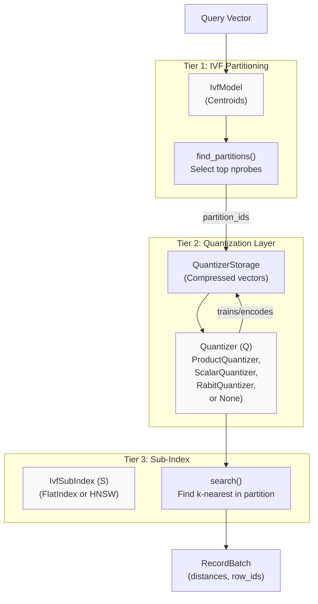
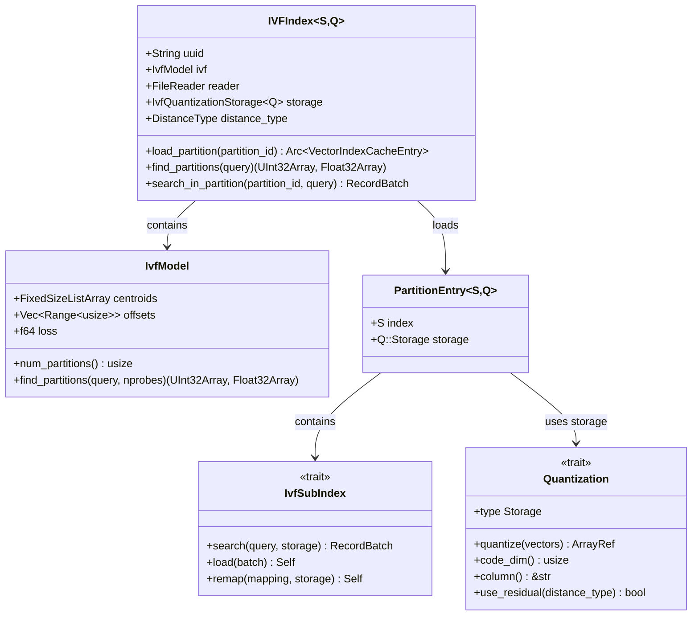
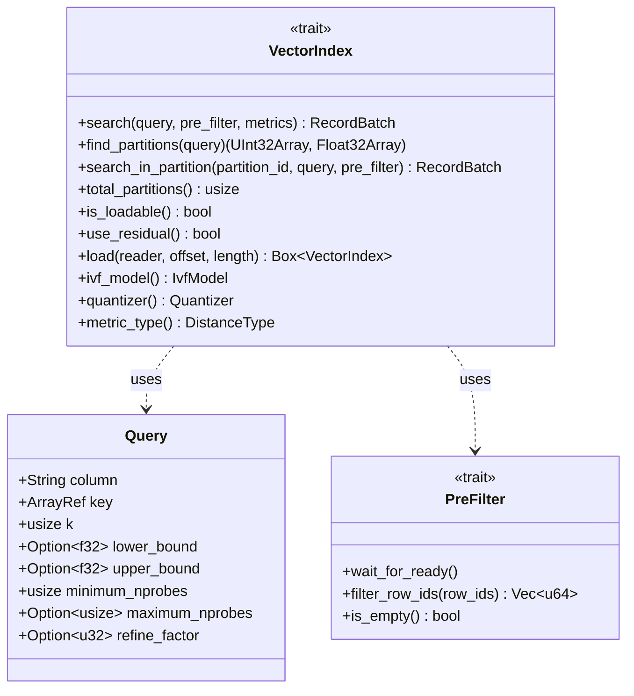
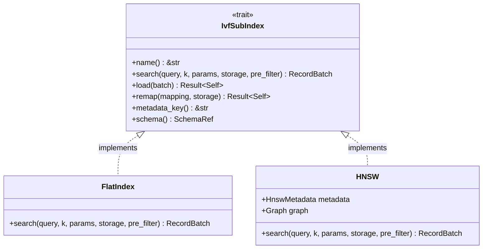
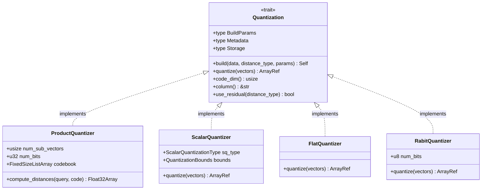
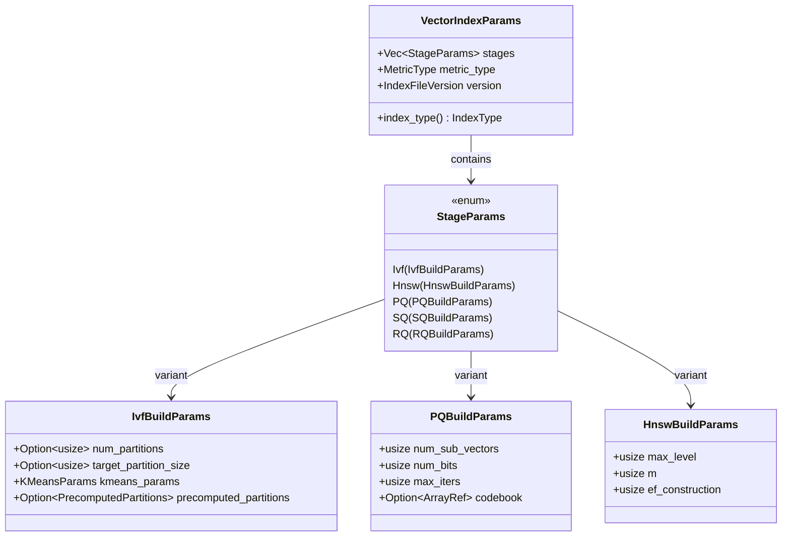
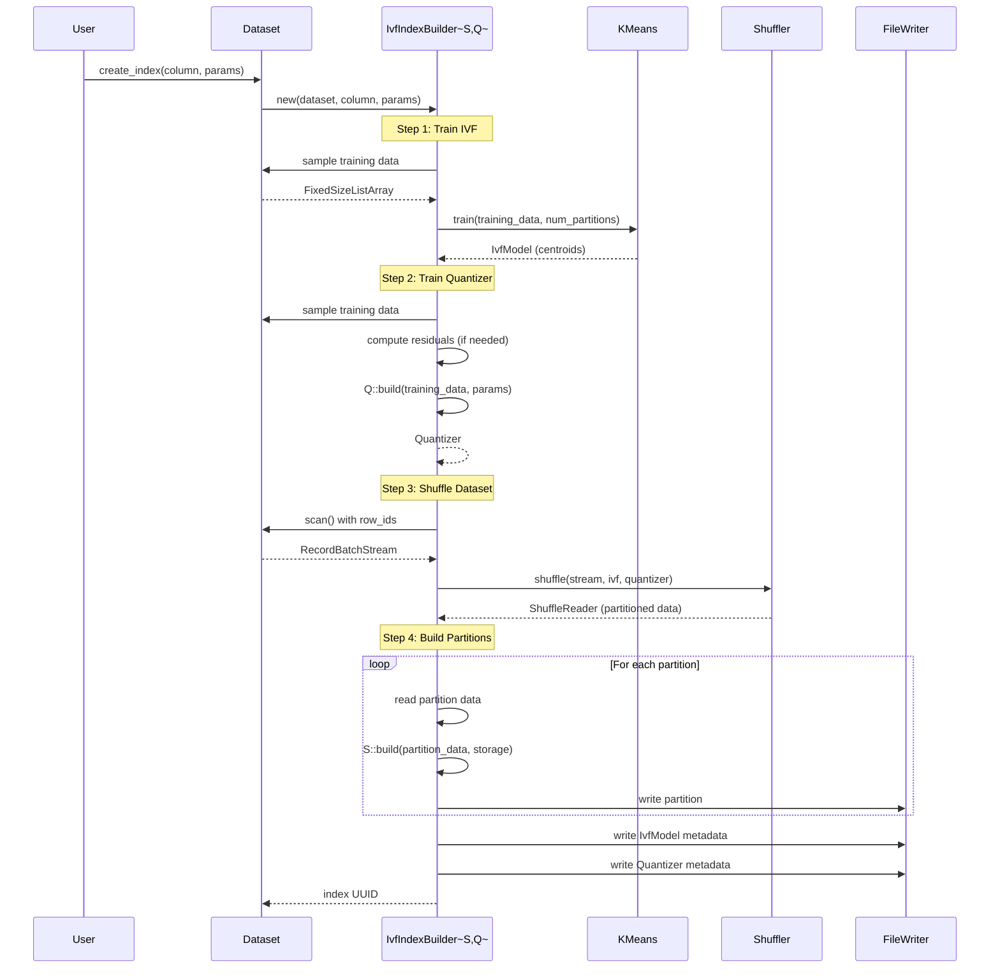
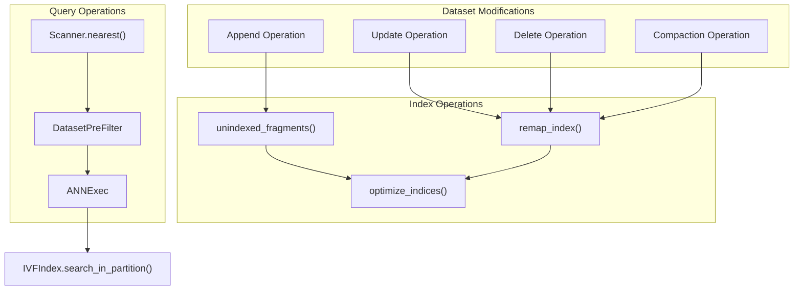

## Lance 源码学习: 7.1 向量索引 (Vector Indices)   
        
### 作者        
digoal        
        
### 日期        
2026-01-16        
        
### 标签        
Lance , AI 数据存储与搜索引擎 , 存储引擎 , 向量索引 , 标量索引 , 全文检索 , 多模态支持 , 零拷贝 , 版本控制 , 时间旅行 , 源码学习 , 随机访问加速 , Parquet        
        
----        
        
## 背景  
Gemini CLI  
````  
第一步: 使用 playwright 工具, 帮我把 https://deepwiki.com/lance-format/lance/7.1-vector-indices 的页面转换成 markdown .  
第二步: 重新检查 web 页面源码，寻找类名为 'mermaid' 的元素，提取其原始文本（Source Code），并按 Markdown 格式插入到上一步的 markdown 对应的位置中 .  
第三步: 将 markdown 翻译成中文(关键术语请同时保留中英文), 不需要翻译 code example 和 mermaid 里面的内容.        
链接请使用正常的链接进行转换:     
```        
Sources:        
[`rust/lance-table/src/format/fragment.rs` 271-303](填入正确链接)        
[`python/python/lance/fragment.py` 56-134](填入正确链接)        
```        
特定英文单词或指令等使用`符号包围.  
        
基于翻译的最终结果, 从用户角度使用中文提出 3 个高价值且有深度的问题.        
将中文的问题逐一发给 deepwiki mcp 工具(需带上该项目参数 `lance-format/lance`)进行咨询, 将问题以及从 deepwiki mcp 工具返回的结果保持原样追加到 markdown 的末尾.         
最终结果输出到当前目录的 2.md 文件(如果文件已经存在, 直接覆盖) .   
````  
  
Gemini CLI 的使用参考 [《Gemini CLI Coder Agent 解决外网访问 方法介绍》](../202601/20260117_02.md)        
  
-----  

  
向量索引 (Vector indices) 支持在高维向量嵌入上进行快速近似最近邻 (ANN) 搜索。本页介绍了 Lance 的向量索引系统、其支持的索引类型以及所有向量索引使用的核心架构模式。  
  
有关构建和优化向量索引的详细信息，请参阅[构建和优化向量索引](/lance-format/lance/7.1.3-building-and-optimizing-vector-indices)。有关查询执行的详细信息，请参阅[向量搜索查询](/lance-format/lance/7.1.4-vector-search-queries)。有关用于过滤的标量索引，请参阅[标量索引](/lance-format/lance/7.2-scalar-indices)。  
  
## 概述 (Overview)  
  
向量索引解决了在高维空间中有效查找查询向量的 k 个最近邻的问题。如果没有索引，查找最近邻需要计算到数据集中每个向量的距离（暴力搜索），这对于大型数据集来说是成本高昂的。  
  
Lance 实现了多种基于倒排文件 (IVF) 的索引类型，这些类型对向量空间进行分区，对向量进行量化以进行压缩，并使用专门的数据结构在分区内进行快速搜索。Lance 中的所有向量索引都遵循一个通用的三层架构。  
  
来源 (Sources): [rust/lance/src/index/vector.rs1-65](https://github.com/lance-format/lance/blob/0204e7e2/rust/lance/src/index/vector.rs#L1-L65), [rust/lance-index/src/vector.rs1-50](https://github.com/lance-format/lance/blob/0204e7e2/rust/lance-index/src/vector.rs#L1-L50)  
  
## 支持的索引类型 (Supported 索引类型s)  
  
Lance 提供了多种向量索引配置，针对速度、内存使用和召回率之间的不同权衡进行了优化：  
  
| 索引类型 | 分区 | 量化 | 子索引 | 最适用于 |  
| --- | --- | --- | --- | --- |  
| `IVF_FLAT` | IVF | None (full precision) | Flat | 高召回率，小型数据集 |  
| `IVF_PQ` | IVF | Product 量化 | Flat | 均衡的内存/速度 |  
| `IVF_SQ` | IVF | Scalar 量化 | Flat | 比 PQ 更好的召回率 |  
| `IVF_RQ` | IVF | Rabit 量化 | Flat | 二进制向量 |  
| `IVF_HNSW_FLAT` | IVF | None | HNSW graph | 高召回率，中型数据集 |  
| `IVF_HNSW_PQ` | IVF | Product 量化 | HNSW graph | 均衡，大型数据集 |  
| `IVF_HNSW_SQ` | IVF | Scalar 量化 | HNSW graph | 比 PQ 更好的召回率 |  
  
来源 (Sources): [rust/lance/src/index/vector.rs98-286](https://github.com/lance-format/lance/blob/0204e7e2/rust/lance/src/index/vector.rs#L98-L286), [rust/lance-index/src/lib.rs98-153](https://github.com/lance-format/lance/blob/0204e7e2/rust/lance-index/src/lib.rs#L98-L153)  
  
## 三层架构 (Three-Tier Architecture)  
  
所有 Lance 向量索引都遵循一个结合了分区、量化和子索引的三层架构：  
  

  
**架构层级 (Architecture Tiers):**  
  
1.  **IVF 分区 (IVF Partitioning)** : 使用 k-means 聚类将向量空间划分为多个区域。查询时，它会识别最相关的分区（`nprobes`）进行搜索。  
2.  **量化 (Quantization)** : 使用乘积量化 (PQ)、标量量化 (SQ)、Rabit 量化 (RQ) 或无量化 (FLAT) 来压缩分区内的向量。  
3.  **子索引 (Sub-Index)** : 在每个分区内，使用平面暴力索引或 HNSW 图索引进行快速的最近邻搜索。  
  
来源 (Sources): [rust/lance/src/index/vector/ivf/v2.rs102-229](https://github.com/lance-format/lance/blob/0204e7e2/rust/lance/src/index/vector/ivf/v2.rs#L102-L229), [rust/lance-index/src/vector/ivf.rs92-328](https://github.com/lance-format/lance/blob/0204e7e2/rust/lance-index/src/vector/ivf.rs#L92-L328)  
  
## 核心数据结构 (Core Data Structures)  
  
### IVFIndex 结构  
  

  
`IVFIndex<S, Q>` 是泛型的，其参数为：  
  
*   `S`: 实现 `IvfSubIndex` 的子索引类型 (例如 `FlatIndex` 或 `HNSW`)  
*   `Q`: 实现 `Quantization` 的量化类型 (例如 `ProductQuantizer`, `ScalarQuantizer`, `FlatQuantizer`)  
  
来源 (Sources): [rust/lance/src/index/vector/ivf/v2.rs102-229](https://github.com/lance-format/lance/blob/0204e7e2/rust/lance/src/index/vector/ivf/v2.rs#L102-L229), [rust/lance-index/src/vector/v3/subindex.rs1-50](https://github.com/lance-format/lance/blob/0204e7e2/rust/lance-index/src/vector/v3/subindex.rs#L1-L50), [rust/lance-index/src/vector/quantizer.rs1-100](https://github.com/lance-format/lance/blob/0204e7e2/rust/lance-index/src/vector/quantizer.rs#L1-L100)  
  
## 关键特征和抽象 (Key Traits and Abstractions)  
  
### VectorIndex 特征  
  
`VectorIndex` 特征定义了所有向量索引的接口：  
  

  
该特征将分区感知操作 (`find_partitions`, `search_in_partition`) 与旧版的 `search` 方法分离开来。  
  
来源 (Sources): [rust/lance-index/src/vector.rs118-192](https://github.com/lance-format/lance/blob/0204e7e2/rust/lance-index/src/vector.rs#L118-L192), [rust/lance-index/src/vector.rs70-115](https://github.com/lance-format/lance/blob/0204e7e2/rust/lance-index/src/vector.rs#L70-L115)  
  
### IvfSubIndex 特征  
  
`IvfSubIndex` 特征定义了分区内搜索的接口：  
  

  
来源 (Sources): [rust/lance-index/src/vector/v3/subindex.rs30-170](https://github.com/lance-format/lance/blob/0204e7e2/rust/lance-index/src/vector/v3/subindex.rs#L30-L170), [rust/lance-index/src/vector/flat/index.rs1-50](https://github.com/lance-format/lance/blob/0204e7e2/rust/lance-index/src/vector/flat/index.rs#L1-L50), [rust/lance-index/src/vector/hnsw/index.rs1-50](https://github.com/lance-format/lance/blob/0204e7e2/rust/lance-index/src/vector/hnsw/index.rs#L1-L50)  
  
### 量化 (Quantization) Trait  
  
`Quantization` 特征定义了压缩方法：  
  

  
来源 (Sources): [rust/lance-index/src/vector/quantizer.rs30-180](https://github.com/lance-format/lance/blob/0204e7e2/rust/lance-index/src/vector/quantizer.rs#L30-L180), [rust/lance-index/src/vector/pq.rs40-80](https://github.com/lance-format/lance/blob/0204e7e2/rust/lance-index/src/vector/pq.rs#L40-L80), [rust/lance-index/src/vector/sq/builder.rs1-50](https://github.com/lance-format/lance/blob/0204e7e2/rust/lance-index/src/vector/sq/builder.rs#L1-L50)  
  
## 索引参数 (Index Parameters)  
  
向量索引使用 `VectorIndexParams` 进行配置：  
  

  
`stages` 向量定义了处理流水线。例如：  
  
*   `[Ivf, PQ]` 创建一个 `IVF_PQ` 索引  
*   `[Ivf, Hnsw, SQ]` 创建一个 `IVF_HNSW_SQ` 索引  
  
来源 (Sources): [rust/lance/src/index/vector.rs66-286](https://github.com/lance-format/lance/blob/0204e7e2/rust/lance/src/index/vector.rs#L66-L286), [rust/lance-index/src/vector/ivf/builder.rs1-50](https://github.com/lance-format/lance/blob/0204e7e2/rust/lance-index/src/vector/ivf/builder.rs#L1-L50), [rust/lance-index/src/vector/pq/builder.rs1-L50](https://github.com/lance-format/lance/blob/0204e7e2/rust/lance-index/src/vector/pq/builder.rs#L1-L50)  
  
## 索引构建流水线 (Index Building Pipeline)  
  
向量索引使用 `IvfIndexBuilder` 构建：  
  

  
来源 (Sources): [rust/lance/src/index/vector/builder.rs93-255](https://github.com/lance-format/lance/blob/0204e7e2/rust/lance/src/index/vector/builder.rs#L93-L255), [rust/lance/src/index/vector.rs299-470](https://github.com/lance-format/lance/blob/0204e7e2/rust/lance/src/index/vector.rs#L299-L470), [rust/lance-index/src/vector/v3/shuffler.rs1-100](https://github.com/lance-format/lance/blob/0204e7e2/rust/lance-index/src/vector/v3/shuffler.rs#L1-L100)  
  
## 索引存储布局 (Index Storage Layout)  
  
向量索引存储在数据集的 `_indices/{uuid}/` 目录中：  
  
```  
_indices/  
└── {index_uuid}/  
 ├── index.idx # Main index file (IVF + sub-indices)  
 └── auxiliary.idx # Auxiliary file (quantized vectors for HNSW)  
```  
  
`index.idx` 文件包含：  
  
*   IVF 元数据 (质心, 分区偏移)  
*   每个分区的子索引数据 (HNSW 图或 flat 索引)  
*   文件末尾的 Protobuf 消息元数据  
  
`auxiliary.idx` 文件 (用于 `IVF_HNSW_*` 索引) 包含:  
  
*   按分区组织的量化向量存储  
*   在 HNSW 图遍历期间用于距离计算  
  
来源 (Sources): [rust/lance/src/index/vector/ivf/v2.rs135-229](https://github.com/lance-format/lance/blob/0204e7e2/rust/lance/src/index/vector/ivf/v2.rs#L135-L229), [rust/lance-index/src/lib.rs36-42](https://github.com/lance-format/lance/blob/0204e7e2/rust/lance-index/src/lib.rs#L36-L42), [rust/lance-index/src/vector/storage.rs1-50](https://github.com/lance-format/lance/blob/0204e7e2/rust/lance-index/src/vector/storage.rs#L1-L50)  
  
## 与数据集操作的集成 (Integration with Dataset Operations)  
  
向量索引与多个数据集操作集成：  
  

  
**索引生命周期 (Index Lifecycle):**  
  
*   **创建 (Creation)** : 通过 `Dataset.create_index()` 使用 `VectorIndexParams` 构建  
*   **查询 (Query)** : 当 `Scanner.nearest()` 检测到索引列时自动使用  
*   **维护 (Maintenance)** : 通过 `Dataset.optimize_indices()` 优化以合并未索引的数据  
*   **压缩 (Compaction)** : 在数据集压缩期间行 ID 更改时重新映射  
  
来源 (Sources): [rust/lance/src/index.rs549-871](https://github.com/lance-format/lance/blob/0204e7e2/rust/lance/src/index.rs#L549-L871), [rust/lance/src/index/append.rs44-180](https://github.com/lance-format/lance/blob/0204e7e2/rust/lance/src/index/append.rs#L44-L180), [rust/lance/src/index/vector.rs207-338](https://github.com/lance-format/lance/blob/0204e7e2/rust/lance/src/index/vector.rs#L207-L338)  
  
## 距离度量 (Distance Metrics)  
  
Lance 支持多种向量相似性的距离度量：  
  
| 度量 | 公式 | 用例 |  
| --- | --- | --- |  
| `L2` | 欧几里得距离 | 通用, 几何相似性 |  
| `Cosine` | 1 - 余弦相似度 | 归一化嵌入, 文本相似性 |  
| `Dot` | 负点积 | 预归一化向量, 效率 |  
  
**重要提示**: 当使用 `Cosine` 距离时, Lance 在索引构建期间对向量进行归一化, 并在内部将度量转换为 `L2`。这是因为在归一化向量上, L2 距离等效于余弦距离, 但计算效率更高。  
  
来源 (Sources): [rust/lance-linalg/src/distance.rs1-50](https://github.com/lance-format/lance/blob/0204e7e2/rust/lance-linalg/src/distance.rs#L1-L50), [rust/lance/src/index/vector/builder.rs376-400](https://github.com/lance-format/lance/blob/0204e7e2/rust/lance/src/index/vector/builder.rs#L376-L400), [rust/lance-index/src/vector/ivf.rs158-167](https://github.com/lance-format/lance/blob/0204e7e2/rust/lance-index/src/vector/ivf.rs#L158-L167)  
  
## 索引版本控制 (Index Versioning)  
  
Lance 维护索引版本元数据以实现前向兼容性：  
  
*   **旧版 (Legacy)** : 原始的 IVF_PQ 格式, 仅用于向后兼容。  
*   **V3**: 当前格式, 支持所有带有 Protobuf 元数据的索引类型。  
  
版本信息存储在索引元数据中, 并在加载时进行检查以确保兼容性。  
  
来源 (Sources): [rust/lance/src/index/vector.rs76-96](https://github.com/lance-format/lance/blob/0204e7e2/rust/lance/src/index/vector.rs#L76-L96), [rust/lance-index/src/lib.rs45](https://github.com/lance-format/lance/blob/0204e7e2/rust/lance-index/src/lib.rs#L45-L45)  
  
---  
  
## 深度问题 (Deep Questions)  
  
### 1. 在 `Lance` 中，`IVF_PQ` 和 `IVF_HNSW_PQ` 索引类型在性能和适用场景上有何具体差异？  
  
`IVF_PQ` 和 `IVF_HNSW_PQ` 在 Lance 中的主要区别在于它们的子索引结构，这显著影响了它们的性能和适用场景。两种索引类型都使用 IVF（倒排文件）来划分向量空间，并使用 PQ（乘积量化）来压缩向量。但是，它们在每个分区内的内部搜索机制是不同的。  
  
**IVF_PQ**:  
*   **子索引**: 在每个 IVF 分区内使用**平面**（暴力）搜索。  
*   **性能**: 它在内存使用和搜索速度之间提供了良好的平衡。分区内的搜索是详尽的，这可以带来更高的召回率，但与近似方法相比，延迟也更高，特别是随着分区大小的增长。  
*   **适用场景**: 最适合需要**在中到大型数据集**上实现召回率、内存使用和查询速度良好平衡的场景。  
  
**IVF_HNSW_PQ**:  
*   **子索引**: 在每个 IVF 分区内使用 **HNSW（分层可导航小世界）图**进行搜索。  
*   **性能**: 这是大型数据集最快的索引类型。HNSW 图允许非常快速的近似最近邻搜索，从而实现最低的查询延迟。然而，与 `IVF_PQ` 相比，这是以略低的召回率为代价的，并且由于图结构，内存使用量也会增加。召回率可以通过调整 HNSW 参数来调整。  
*   **适用场景**: 最适合**非常大的数据集（数十亿个向量）** ，其中低延迟是主要关注点，并且可以接受召回率的轻微权衡。  
  
**差异总结:**  
  
| 特性 | `IVF_PQ` | `IVF_HNSW_PQ` |  
| :--- | :--- | :--- |  
| **子索引** | 平面（暴力） | HNSW 图 |  
| **查询延迟** | 中等 | 最低 |  
| **召回率** | 较高（在分区内） | 较低（可调） |  
| **内存使用** | 较低 | 较高（由于 HNSW 图） |  
| **最适合** | 中大型数据集 | 非常大的数据集 |  
  
本质上，在 `IVF_PQ` 和 `IVF_HNSW_PQ` 之间进行选择是在搜索速度和召回率/内存之间的权衡。对于海量数据集上的绝对最快查询，`IVF_HNSW_PQ` 是首选。对于更高召回率更为关键且数据集不是非常大的场景，`IVF_PQ` 提供了一个可靠、平衡的选择。  
  
### 2. 当使用余弦距离 (`Cosine`) 时，`Lance` 内部将其转换为 `L2` 距离进行计算。请解释为什么这种转换在数学上是等效的，并且在计算上更高效？  
  
尽管无法在此环境中访问 `lance` 代码库进行最终确认，但行业普遍的做法是将余弦距离搜索优化为单位长度向量的 L2（欧几里得）距离搜索。在数学上，最小化 L2 距离等同于最大化余弦相似度。这种转换在计算上是有利的，因为计算平方 L2 距离可以避免现代 CPU 上昂贵的除法和平方根运算，并可通过 SIMD 指令进行高度优化，从而显著加快搜索过程。  
   
  
#### [PolarDB 学习图谱](https://www.aliyun.com/database/openpolardb/activity "8642f60e04ed0c814bf9cb9677976bd4")
  
  
#### [PostgreSQL 解决方案集合](../201706/20170601_02.md "40cff096e9ed7122c512b35d8561d9c8")
  
  
#### [德哥 / digoal's Github - 公益是一辈子的事.](https://github.com/digoal/blog/blob/master/README.md "22709685feb7cab07d30f30387f0a9ae")
  
  
#### [About 德哥](https://github.com/digoal/blog/blob/master/me/readme.md "a37735981e7704886ffd590565582dd0")
  
  

  
