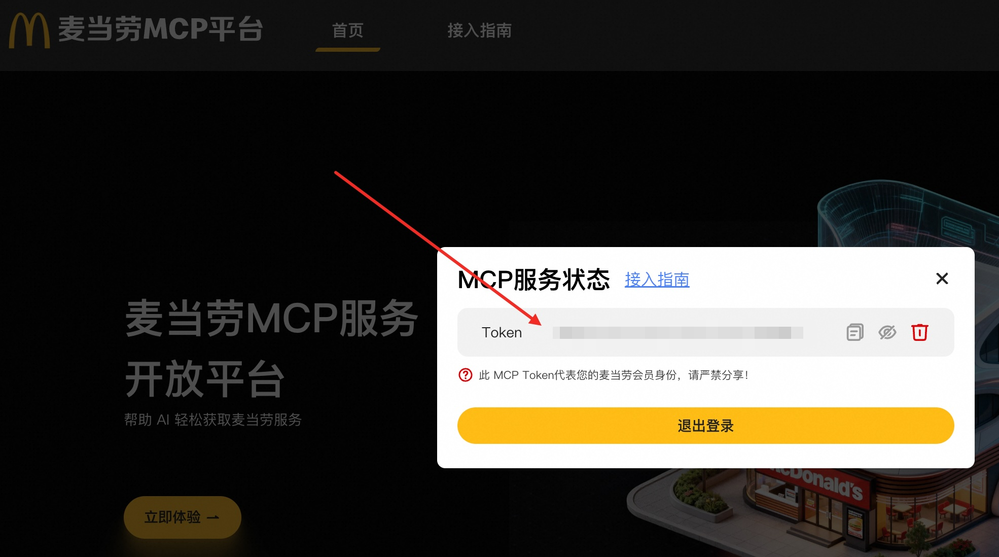

## Gemini 和 Qwen Coder 接入麦当劳  
                      
### 作者                      
digoal                      
                      
### 日期                      
2026-01-19                    
                      
### 标签                      
Gemini CLI , Qwen Coder , mcp server , mcp client , mcp tools , 麦当劳                    
                      
----                      
                      
## 背景    
怎么把 AI Coder Agent 变成日常小助手? 接入 MCP 即可!    
  
下面我们就来举个例子, 让 Gemini 和 Qwen Coder 接入肯德基和麦当劳 MCP , 现在可一键领取所有优惠券, 未来就是直接下单了.    
  
## Qwen Coder 接入麦当劳  
首先要注册麦当劳 mcp server https://open.mcd.cn/mcp 账号, 申请 token(千万别泄露这个 token, 它代表你的身份(账号密码)).   
  
  
  
然后配置 qwen coder  
```vi ~/.qwen/settings.json  
  
{  
  "security": {  
    "auth": {  
      "selectedType": "qwen-oauth"  
    }  
  },  
  "model": {  
    "name": "coder-model"  
  },  
  "$version": 2,  
  "mcpServers": {  
    "mcd-mcp": {  
      "httpUrl": "https://mcp.mcd.cn/mcp-servers/mcd-mcp",  
      "headers": {  
        "authToken": "你的token",  
        "Authorization": "Bearer 你的token",  
        "Content-Type": "application/json",  
        "Accept": "application/json"  
      },  
      "timeout": 15000  
    }  
  }  
}  
```  
  
启动 qwen coder , 看看这个 mcp 能干什么  
```  
> /mcp desc  
  
Configured MCP servers:  
  
🟢 mcd-mcp - Ready (5 tools)  
  Tools:  
  - auto-bind-coupons  
    自动领取麦麦省所有当前可用的麦当劳优惠券。无需指定具体的优惠券和couponId，系统会自动领取用户可领的所有券。当用户说"帮我领券"、"自动领取优惠券"、"一键领券"时使用此工具。  
  - available-coupons  
    查询用户当前可领取的麦麦省的优惠券列表。返回券名称、图片、状态和促销标签。当用户询问有什么优惠、可以领什么券时使用此工具。  
  - campaign-calender  
    查询麦当劳中国当月的营销活动日历，返回进行中、往期和未来日期的活动。适用于查看用户进行中和即将到来的可参与活动，还可查询用户对活动的订阅状态。  
  - my-coupons  
    查询我有哪些可用的优惠券。就像打开麦当劳APP的"我的优惠券"页面，能看到所有可以用来点餐的优惠券列表。 **包括但不限于使用场景**：  
        - 用户想知道自己有哪些优惠券可以用      
        - 检查优惠券的有效期和使用条件  
        - 查看优惠券数量和状态  
  - now-time-info  
    获取当前时间信息 - 返回当前服务器的完整时间信息，包括：  
    - 时间戳（毫秒级）  
    - 格式化的日期时间  
    - 年月日信息  
    - 时区和UTC时间  
    在你不知道当前时间，并且用户需要指定日期查询活动日历的时候有用  
```  
  
查询一下有哪些优惠券  
```  
> 帮我查询麦当劳可用优惠券  
  
 ╭───────────────────────────────────────────────────────────────────────────────────────────────────────────────────────────────────────────────────────────────────────────────╮  
 │ ✓  available-coupons (mcd-mcp MCP Server) {}                                                                                                                                  │  
 │                                                                                                                                                                               │  
 │    ### 麦麦省优惠券列表：                                                                                                                                                     │  
 │    - 优惠券标题：北非蛋风味麦满分 \                                                                                                                                           │  
 │      状态：可领取 \                                                                                                                                                           │  
 │      优惠券图片：\                                                                                                                                                            │  
 │                                                                │  
 │    - 优惠券标题：王牌炸鸡三拼盒 \                                                                                                                                             │  
 │      状态：可领取 \                                                                                                                                                           │  
   
 ......  
  
 \                                                                                                                                                           │  
 │      优惠券图片：\                                                                                                                                                            │  
 │                                                                  │  
 │    - 优惠券标题：29.9元明星堡堡搭 \                                                                                                                                           │  
 │      状态：可领取 \                                                                                                                                                           │  
 │      优惠券图片：\                                                                                                                                                            │  
 │                                                                │  
 │                                                                                                                                                                               │  
 ╰───────────────────────────────────────────────────────────────────────────────────────────────────────────────────────────────────────────────────────────────────────────────╯  
✦ 根据查询结果，以下是当前麦当劳APP麦麦省中可领取的优惠券：  
  
   1. 北非蛋风味麦满分 - 可领取  
     !北非蛋风味麦满分 (https://img.mcd.cn/cms/images/d0aad640e6439f8d.png)  
......  
   8. 19.9元辣翅成双 - 可领取  
     !19.9元辣翅成双 (https://img.mcd.cn/cms/images/c17ff0163bb5d941.png)  
  
   9. 29.9元明星堡堡搭 - 可领取  
     !29.9元明星堡堡搭 (https://img.mcd.cn/cms/images/d6e13c8b2adb307f.png)  
  
  这些优惠券都处于可领取状态，您可以根据自己的喜好选择领取。  
```  
  
然后全部领取  
```  
> 全部领取  
  
 ╭───────────────────────────────────────────────────────────────────────────────────────────────────────────────────────────────────────────────────────────────────────────────╮  
 │ ✓  auto-bind-coupons (mcd-mcp MCP Server) {}                                                                                                                                  │  
 │                                                                                                                                                                               │  
 │    ### 🎉 领券结果                                                                                                                                                            │  
 │                                                                                                                                                                               │  
 │    **总计**: 9 张优惠券                                                                                                                                                       │  
 │    **成功**: 9 张                                                                                                                                                             │  
 │    **失败**: 0 张                                                                                                                                                             │  
 │                                                                                                                                                                               │  
 │    ---                                                                                                                                                                        │  
 │                                                                                                                                                                               │  
 │    #### ✅ 成功领取的优惠券：                                                                                                                                                 │  
 │                                                                                                                                                                               │  
 │    - **9.9元脆汁鸡任选**                                                                                                                                                      │  
 │      - couponId：1F99B67639333AE4896152F52958E987                                                                                                                             │  
 │      - couponCode：MCD6TKM10X0HP01890600                                                                                                                                      │  
 │      - 图片：                                                   │  
 │                                                                                                                                                                                                                              │  
   
 ....  
  
 │    - **北非蛋风味麦满分**                                                                                                                                                     │  
 │      - couponId：D65F103DE281D32E3665BA698D223CB4                                                                                                                             │  
 │      - couponCode：MCD6M17X0H08102X12KT0                                                                                                                                      │  
 │      - 图片：                                                  │  
 │                                                                                                                                                                                                                                                                                                                                                      │  
 ╰───────────────────────────────────────────────────────────────────────────────────────────────────────────────────────────────────────────────────────────────────────────────╯  
✦ 已成功为您领取全部9张优惠券！以下是您刚刚领取的优惠券详情：  
  
   1. 9.9元脆汁鸡任选 - 已领取  
     !9.9元脆汁鸡任选 (https://img.mcd.cn/cms/images/4d25d1ab4b06b830.png)  
  
......  
  
   9. 北非蛋风味麦满分 - 已领取  
     !北非蛋风味麦满分 (https://img.mcd.cn/cms/images/d0aad640e6439f8d.png)  
  
  所有优惠券均已成功添加到您的账户中，可以在麦当劳APP的"我的优惠券"中查看和使用。  
```  
  
打开麦当劳APP, 可以看到, 你已经领取了所有优惠券.    
  
## Gemini CLI 接入麦当劳  
可使用同样的方法, 或命令行添加 mcd mcp , 例如  
```  
gemini mcp add --transport http mcd https://mcp.mcd.cn/mcp-servers/mcd-mcp --header "Authorization: Bearer 你的token"  
```  
  
启动 gemini cli, 因为前面已经领取了, 查看你有哪些优惠券. 完全没有问题  
  
```  
> 查看我有哪些麦当劳的优惠券  
  
╭──────────────────────────────────────────────────────────────────────────────────────────────────────────────────────────────────────────────────────────────────────────────────────────────────────────╮  
│ ✓  my-coupons (mcd MCP Server) {}                                                                                                                                                                        │  
│                                                                                                                                                                                                          │  
│ # 您的优惠券列表                                                                                                                                                                                         │  
│                                                                                                                                                                                                          │  
│ 共 11 张可用优惠券 | 第 1/1 页 | 每页 200 条   
  
......  
```  
  
## Qwen Coder / Gemini CLI 接入肯德基  
略  
  
## 小结  
MCP 就是 Agent 的触角, 要让 AI 变得更加强大, 首先要接入大量 MCP.   
  
但是 MCP 太多了, 又回带来另一个问题: 上下文爆炸.    
  
这个下回再聊.    
  
## 参考  
https://google-gemini.github.io/gemini-cli/docs/tools/mcp-server.html  
  
https://qwenlm.github.io/qwen-code-docs/en/users/features/mcp/  
  
https://open.mcd.cn/mcp  
  
怎么在 macOS 上安装?  
- [《Gemini CLI Coder Agent 解决外网访问 方法介绍》](../202601/20260117_02.md)    
  
怎么在 Linux 上安装?  
- [《大学生数据库实践课: 7.5 AI Coding Agent(qwen3 cli) 的使用》](../202601/20260105_01.md)      
- [《Gemini CLI 对比 Qwen3 Coder 谁更强?》](../202601/20260115_05.md)    
    
