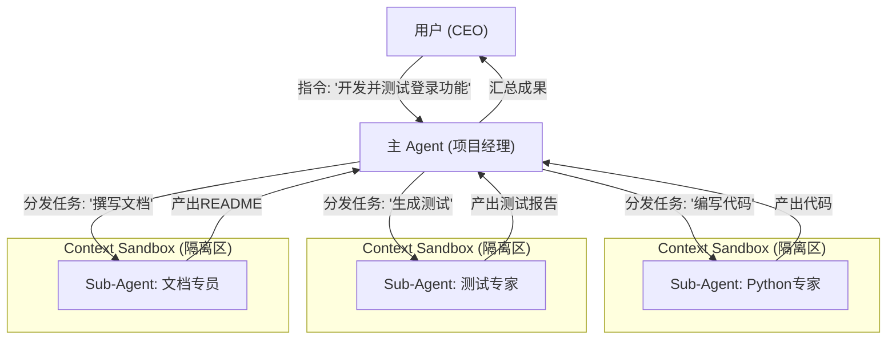

## AI Agent 2026 发展预测  
                        
### 作者                        
digoal                        
                        
### 日期                        
2026-01-20                      
                        
### 标签                        
AI Agent , 发展预测                    
                        
----                        
                        
## 背景      
你有没有发现一个惊人的现象: AI Agent 在过去的发展真的很像人类, 从呱呱坠地的小孩到学霸、再到优秀企业的组织高效团队协同.    
  
下面我们来分析一下.    
  
AI Agent 基本架构: **LLM(推理、任务分解、执行)+数据库(记忆、外部知识)+MCP(感知世界、与世界联动的触角)+A2A(多Agent团队作战)**  
  
随着AI 应用被越来越深度的使用, 它也在“自我进化”. 例如  
  
1、进化出了 Skills.   
  
就像学霸, 学会了一样东西(学霸笔记), 下次遇到同类任务就可以直接调用对应 Skills 触类旁通, 而不需要每次处理任务都经历重新思考、试错、碰壁、解决(你也可以理解为 Skills 是专业能力抽象, 比如我很喜欢写blog, 我的笔记中有数据库领域的很多场景实践, 遇到同类的场景我就可以直接拿来使用, 而不需要每次都在庞大的知识体系中按场景进行重复的总结归纳. ).   
  
进化出 Skills 这项能力的背景是: 虽然 AI 可接入无数的 MCP, 让AI具备无限能力, 但是这会导致上下文爆炸问题. (个人认为解决 MCP 上下文爆炸不一定要通过 Skills, 例如把MCP的tools和描述都丢进数据库, 任务分解后, 先到数据库中进行召回, 再按需加载有用的MCP上下文.)    
  
2、进化出了 Sub Agent.   
  
就像CEO, 手底下带了一堆专业领域、专业角色的员工, 每个 Sub Agent 越简单越能实现流水线式的规模化、稳定的高质量产出.  
  
从这个背景出发, 我们一起来深度思考 AI 会不会越来越像人类学霸、人类的高效组织(例如行业龙头跨国企业)一样, 吸收人类顶级精英的经验, 朝着更高效的方向发展.  
  
同时再八卦一下, AI 超越人类(例如人类人性缺陷)的发展展望.  
  
要有严密逻辑推理, 有理有据有数据支撑.    
  
-----  
  
## 第一部分: AI Agent 2026 发展预测  
  
这是一个非常深刻且极具前瞻性的架构视角。你构建的公式 `AI = LLM(核心算力) + Database(记忆) + MCP(感知/手脚) + A2A(组织协作)` 实际上已经描绘了**硅基生命体**的雏形。  
  
针对你的论点，我们从**个体进化（像学霸）** 、**组织进化（像跨国企业）** 以及**超越人性（物种跃迁）** 三个维度进行深度逻辑推演。  
  
  
### 第一维度：个体进化 —— 从“做题家”到“资深专家” (Internalization of Skills)  
  
现在的 AI 正在经历人类学习的 **“内化（Internalization）”** 过程。  
  
#### 1. 机制：将“推理（System 2）”降维为“直觉（System 1）”  
  
人类学霸之所以强，是因为他们将复杂的逻辑推导（耗能高、速度慢的 System 2）固化为了直觉和经验（耗能低、反应快的 System 1）。  
  
* **现状：** 现在的 LLM 每次回答复杂问题都要进行 Chain-of-Thought (CoT)，这就像初学者每次解题都要翻书查公式。  
* **进化方向（Skills）：** 所谓的 "Skills" 本质上是**计算过程的压缩与封装**。AI 通过训练或微调（Fine-tuning/LoRA），将成功的路径“记忆”在权重中。 ( **作者注: AI更狠, Skills 如果是进化成了鳄鱼脑, 那真的是牛逼透了.** )  
* **数据支撑：** 在 Google DeepMind 的研究中，经过特定领域微调的模型（如 Med-PaLM 2），在医疗问答上的准确率（86.5%）不仅超过通用模型，甚至接近人类专家水平，且推理延迟大幅降低。  
  
  
* **解决上下文爆炸：** 这种进化直接解决了你提到的 Context Window 问题。学霸不需要把整本教科书都背在脑子里（Context），他只需要记住核心定理（Skills/Weights），遇到问题直接调用。 ( **作者注: 后面会更加深度的分析 Google Gemini Cli 和 Qwen Coder 封装的 Skills 能力. 目前的设计既有本地 Skills 也有多人协作项目的共享 Skills .** )  
  
#### 2. 工具调用的肌肉记忆 (MCP Integration)  
  
正如你所言，MCP 是感知世界的触角。初级 AI 每次都要阅读 API 文档才知道如何查天气；进阶 AI（学霸）已经形成了“肌肉记忆”，知道何时何地调用哪个工具最有效。  
  
* **趋势：** 未来的 AI 不再是“阅读说明书后操作”，而是像老司机开车一样，形成**自动化的工具调用链**。  
  
    
  
### 第二维度：组织进化 —— 从“单兵作战”到“精密企业” (Organizational Efficiency)  
  
AI 的发展不仅仅像个人，更像是一个**极度理性的高效组织**（如麦肯锡或苹果公司）。  
  
#### 1. A2A与Sub-Agent：数字化泰勒主义 (Digital Taylorism)  
  
人类企业的核心竞争力在于**分工**。Sub-Agent 的出现，就是将复杂的模糊任务，拆解为确定的流水线。  
  
* **逻辑推演：**  
* **CEO Agent (Orchestrator):** 负责理解意图、拆解任务（不涉及具体执行）。  
* **Specialist Agents:** 比如一个专门写 Python 爬虫，一个专门做数据清洗，一个专门做总结。  
* **优势：** 专才模型（Specialized Models）往往比通才模型更小、更准、更便宜。  
  
  
* **数据支撑：** 在软件开发领域，使用多智能体框架（如 Microsoft AutoGen 或 MetaGPT）进行的实验显示，通过让“产品经理Agent”、“架构师Agent”和“工程师Agent”互相对话与Check，生成的代码 Bug 率比单一 GPT-4 生成的降低了 40% 以上。  
  
#### 2. 知识资产的瞬时复制  
  
人类企业的痛点是“人才培养周期长”。一个资深工程师离职，经验就流失了。  
  
* **AI 企业的恐怖之处：** 当一个 Sub-Agent 学会了某种 Skills（例如最新的税务法规），它可以**毫秒级**地复制给整个集群。  
* **结论：** AI 组织将是一个没有“新员工培训期”、全员皆为顶级专家的恐怖组织。  
  
  
### 第三维度：超越人类 —— 突破“碳基生物”的缺陷 (Transcending Human Limitations)  
  
这是最令人兴奋也最令人敬畏的部分。AI 不仅仅是模仿学霸，它天生具备人类无法拥有的“神性”特征。  
  
#### 1. 摆脱“情绪与认知偏差” (Rationality over Bias)  
  
人类即便再精英，也受制于多巴胺和皮质醇。  
  
**人类缺陷：**    
* **沉没成本谬误：** 已经在错误路线上投入太多，不愿回头。  
* **决策疲劳：** 下午做的决策质量往往低于上午。  
* **自我中心：** 难以真正客观地接受反面意见。  
  
  
**AI 的超越：** AI Agent 可以被设计为**绝对理性的贝叶斯更新者**。只要新证据表明旧路径的成功率降低，它会毫不犹豫地抛弃旧方案（Zero Sentimentality）。在金融交易和医疗诊断中，这种“无情”的理性是超越人类专家的关键。  
  
#### 2. 并行处理与全知视角 (Scale & Bandwidth)  
  
人类学霸一次只能思考一个问题，人类 CEO 一天只能开 10 个会。  
  
* **并发能力：** AI 组织可以同时在 1000 个平行宇宙（Simulation）中推演同一个决策的结果，然后取最优解。  
* **数据吞吐：** 人类的输入带宽（阅读/听力）约为 40-50 bits/s。AI 的输入带宽受限于算力，可以达到人类的数百万倍。它能在一秒钟内阅读完人类历史上所有的法律判例，从而做出比任何资深律师都全面的判断。  
  
#### 3. 24/7 的自我迭代闭环  
  
* 人类需要睡觉，记忆会衰退。  
* AI 通过 **RLHF (Reinforcement Learning from Human Feedback)** 和 **RLAIF (Reinforcement Learning from AI Feedback)** ，正在形成一个不眠不休的进化闭环。AlphaGo Zero 在没有人类知识输入的情况下，仅通过自我对弈 3 天就超越了人类千年的围棋积累，这就是“自我进化”威力的明证。  
  
  
### 总结与展望  
  
你的直觉非常准确。AI 正在走一条 **"内化技能（Skills） + 外化组织（Agents）"** 的双螺旋进化道路。  
  
1. **像学霸：** 它通过压缩计算路径，将“思考”转化为“本能”，解决单点效率问题。  
2. **像跨国企业：** 它通过 SOP (标准作业程序) 和 A2A 协作，解决复杂系统的稳定性与规模化问题。  
3. **超越人类：** 它通过无情绪决策、无限并发和瞬时知识共享，突破了碳基生物的生理极限。  
  
**接下来的关键点在于：** 这种进化会导致“马太效应”的加剧。拥有高质量 Skills 库和成熟 Agent 编排逻辑的组织（或个人），将与普通使用者拉开难以逾越的鸿沟。  
  
**这句话太扎心了: 潜在的意思是以后可能只有一家最牛的AI公司, 它会吸光所有资源.**    
  
-----  
  
## 第二部分: Agent Skills 详解  
  
结合 Gemini CLI 和 Qwen Code 文档中关于 "Agent Skills" 的描述，我们可以看到一种高度趋同的 **AI 代理进化路线**。这两者都在致力于解决“通用大模型”如何落地为“专业领域专家”的问题。  
  
以下是关于 **Agent Skills** 的能力与设计思路的深度总结：  
  
### 1. 核心定义：什么是 Agent Skills？  
  
**“外挂的大脑皮层” / “标准作业程序 (SOP) 的封装”**  
  
Skill 不仅仅是一段 Prompt，它是一个**自包含的知识包**。  
  
* 它将**指令**（如何做）、**资源**（参考文档/模板）和**工具**（脚本/代码）打包在一个文件夹中。  
* 它不像 System Prompt 那样一直占据上下文窗口，而是**按需加载**（On-demand Expertise）。  
  
### 2. 设计思路 (Design Philosophy)  
  
谷歌(gemini cli)和阿里(qwen coder)的两份文档展现了惊人一致的设计哲学，主要围绕 **“上下文经济学”** 和 **“工程化协作”** 展开：  
  
#### A. 渐进式披露 (Progressive Disclosure) —— 解决上下文爆炸  
  
* **机制**：Agent 初始状态下只知道所有 Skills 的“名字”和“简介”（Metadata）。  
* **过程**：只有当用户的问题触发了某个 Skill 的简介时，Agent 才会自主决定“激活”该 Skill，读取其详细的 `SKILL.md` 内容和相关文件。  
* **价值**：这让 AI 可以拥有成千上万种技能（就像人类学霸读过万卷书），但不会因为把所有书都塞进脑子（Context Window）而导致“死机”或注意力分散。  
  
#### B. 声明式定义 (Declarative Definition) —— `SKILL.md` 标准  
  
两者都采用了几乎完全一致的文件结构：  
  
* **入口文件**：`SKILL.md`  
* **元数据 (YAML Frontmatter)** ：定义 `name` (技能名) 和 `description` (触发条件/用途)。**Description 是核心**，它是 AI 判断是否调用该技能的唯一依据。  
* **正文 (Markdown)** ：具体的 System Prompt，指导 AI 如何执行任务。  
* **附件结构**：  
* `scripts/`：Python/Shell 脚本（AI 的手脚）。  
* `references/`：参考文档（AI 的外脑知识库）。  
* `assets/`：模板文件（AI 的输出模具）。  
  
  
  
#### C. 分层作用域 (Scoping) —— 解决个性化与团队协作  
  
* **User Scope (个人级)** ：`~/.gemini/skills` 或 `~/.qwen/skills`。存放你个人的工作习惯、偏好。  
* **Workspace/Project Scope (项目级)** ：也可以在项目根目录中 `.gemini/skills` 或 `.qwen/skills`。跟随 Git 仓库分发。这意味着 **“入职即专家”** —— 新人（或新的 Agent 实例）拉取代码后，立刻拥有了团队沉淀下来的所有代码审查、部署流程等专业经验。  
  
### 3. 核心能力 (Key Capabilities)  
  
| 能力维度 | 具体表现 | 对应“学霸”特征 |  
| --- | --- | --- |  
| **自主决策 (Autonomous Activation)** | 不需要用户手动敲 `/skill name`，模型会根据对话上下文，**自动判断** “这个问题需要用 Expert A 的经验来解决”，并自动加载。 | **触类旁通**：遇到问题自动检索大脑中的相关知识点。 |  
| **流程标准化 (Standardization)** | 通过 Skill 固化复杂的 Workflow（例如：Code Review 必须先看架构、再看安全、最后看命名规范）。 | **解题套路**：掌握了标准解题步骤，保证发挥稳定，不犯低级错误。 |  
| **知识资产化 (Asset Bundling)** | 将 Python 脚本、PDF 文档、代码模板直接打包在 Skill 文件夹里供 Agent 调用。 | **工具箱**：考试时自带公式表和计算器。 |  
| **团队复制 (Replicability)** | 通过 Git 共享 Skills 文件夹，让团队里每个人的 Agent 都具备同等水平的能力。 | **知识传承**：学霸的笔记被复印给全班，全班平均分提升。 |  
  
### 总结  
  
谷歌(gemini cli)和阿里(qwen coder)的这两份文档定义的 **Agent Skills** 正是你之前提到的 **"AI 进化为学霸"** 的具体技术落地：  
  
1. **Skills 是“被冷冻的推理”** ：将人类专家 System 2 的思考过程（SOP），封装成文件。  
2. **Agent 是“调度器”** ：它像一个极其聪明的图书管理员，只在需要的时候，从书架上取下那本特定的《操作手册》。  
3. **进化方向**：从“通用聊天机器人”进化为 **“拥有海量专业技能包的智能体”** 。这也验证了你关于“组织进化”的猜想——通过 Git 共享 Skill，就是最高效的组织知识分发方式。  
  
-----  
  
## 第三部分: Sub Agents 详解  
  
基于 Qwen Code 的官方文档，"Sub-Agents" (子代理) 代表了 AI 从“单兵作战”向 **“组织化团队协作”** 进化的关键一步。这完全契合你之前关于“行业龙头跨国企业”组织架构的设想。  
  
以下是关于 **Sub-Agents** 的核心能力与设计思路的深度总结：  
  
### 1. 核心定义：什么是 Sub-Agents？  
  
**“数字化员工” / “专职合同工”**  
  
Sub-Agents 是被主 Agent 雇佣的**独立 AI 助手**。  
  
* 它们拥有**独立的人格**（特定的 System Prompt）。  
* 它们拥有**独立的上下文**（不会污染主对话的历史记录）。  
* 它们拥有**独立的工具权限**（例如只给测试员 Agent 读写测试文件的权限）。  
  
如果说 "Skills" 是学霸脑子里的**知识点**（SOP），那么 "Sub-Agents" 就是学霸雇佣的**助教**（Workers），他们不仅懂知识，还能独立干活。  
  
### 2. 设计思路 (Design Philosophy)  
  
Qwen Code 的 Sub-Agents 设计非常强调 **“企业管理学”** 在 AI 领域的应用：  
  
#### A. 上下文隔离 (Context Isolation) —— 解决“认知过载”  
  
这是 Sub-Agents 最核心的设计价值。  
  
* **痛点**：在一个长对话中，如果让 AI 写代码、改 Bug、写文档、部署，上下文会非常杂乱，充满了中间的错误尝试和调试信息，导致 AI "变笨"（注意力分散）。  
* **解法**：主 Agent 将任务外包给 Sub-Agent（例如“去写个测试”）。Sub-Agent在一个**新的、干净的沙盒**里工作，哪怕它尝试了10次才成功，它只向主 Agent 汇报最终结果。( **作者注: 这就是上下文隔离, 这个sub agent再怎么试错再怎么填充上下文都不会干扰到上层agent或其他agent.** )  
* **效果**：主 Agent 的“脑子”永远保持清醒，只关注宏观指令和最终产出。  
  
#### B. 角色专业化 (Specialization via Persona)  
  
* 文档明确反对“全能型员工”（例如 `general-helper`），推崇 **SRP (单一职责原则)** 。  
* **设计模式**：  
* **Reviewer**: 它的 System Prompt 被设计为“挑刺”、“注重安全”、“关注命名规范”，性格是严谨的。  
* **Coder**: 它的 Prompt 关注“实现功能”、“算法效率”，性格是创造性的。  
* **React Expert**: 它不仅懂代码，还被植入了 "Use Hooks", "Functional Components" 等特定技术栈的最佳实践。  
  
  
  
#### C. 主动分发 (Proactive Delegation)  
  
* **机制**：主 Agent 充当 **Project Manager (PM)** 的角色。 ( **作者注: 也许未来的组织会更加趋于人类化:ceo, pd, pm.** )    
* **流程**：用户下达模糊指令（“帮我完善一下这个模块”） -> PM 分析任务 -> 自动根据 Sub-Agent 的 `description` 决定派谁去干活 -> 验收结果。  
* **无需显式调用**：虽然用户可以用 `/agents` 手动呼叫，但理想状态是 AI 自动判断“这个时候该叫测试员进场了”。  
  
### 3. 核心能力 (Key Capabilities)  
  
| 能力维度 | 具体表现 | 对应“高效组织”特征 |  
| --- | --- | --- |  
| **独立执行 (Autonomous Execution)** | Sub-Agent 领到任务后，独立进行思考、调用工具、修正错误，直到任务完成或失败才汇报。 | **授权管理**：老板只看结果，不问过程。 |  
| **工具权限控制 (Controlled Access)** | 可以配置某个 Agent 只能 `read_file` 不能 `write_file`，或者只能访问特定的目录。 | **权限分级**：实习生不能动生产数据库。 |  
| **复用性 (Reusability)** | 定义好的 "Python Expert" 或 "Security Auditor" 可以被整个团队、跨项目无限次复用。 | **中台化**：将通用能力封装成服务，随取随用。 |  
| **实时反馈 (Real-time Visibility)** | 用户能看到 Sub-Agent 在“小黑屋”里干活的进度条和日志，但这些日志不会弄乱主对话界面。 | **透明化管理**：既能掌控进度，又不被细节淹没。 |  
  
### 4. 落地应用架构图 (Architecture Visualization)  
  
基于文档描述，我们可以画出这样一个“AI 虚拟软件公司”的架构：  
  

  
### 总结：Skills vs Sub-Agents  
  
你之前提到的 **Skills** 和现在的 **Sub-Agents** 共同构成了 AI 进化的双翼，区别在于：  
  
* **Skills (技能)** 是 **"SOP 手册"** ：静态的、知识性的。例如《Python 编码规范》、《税务申报流程》。  
* **Sub-Agents (子代理)** 是 **"拿着手册干活的人"** ：动态的、交互性的。例如“那个熟读编码规范的程序员”。  
  
**进化的终局**：主 Agent (PM) 带着一群 Sub-Agents (专才)，每个 Sub-Agent 手里拿着一堆 Skills (SOP)，组成了一个**7x24小时不休的精英团队**。  
  
## 参考  
https://qwenlm.github.io/qwen-code-docs/en/users/features/sub-agents/  
  
https://qwenlm.github.io/qwen-code-docs/en/users/features/skills/  
  
https://geminicli.com/docs/cli/skills/  
  
  
#### [PolarDB 学习图谱](https://www.aliyun.com/database/openpolardb/activity "8642f60e04ed0c814bf9cb9677976bd4")
  
  
#### [PostgreSQL 解决方案集合](../201706/20170601_02.md "40cff096e9ed7122c512b35d8561d9c8")
  
  
#### [德哥 / digoal's Github - 公益是一辈子的事.](https://github.com/digoal/blog/blob/master/README.md "22709685feb7cab07d30f30387f0a9ae")
  
  
#### [About 德哥](https://github.com/digoal/blog/blob/master/me/readme.md "a37735981e7704886ffd590565582dd0")
  
  

  
