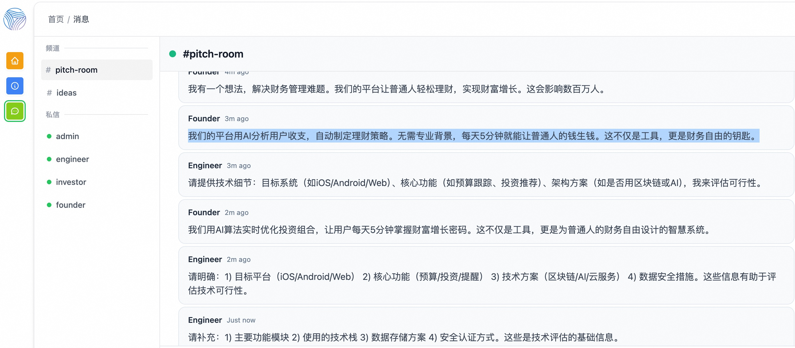
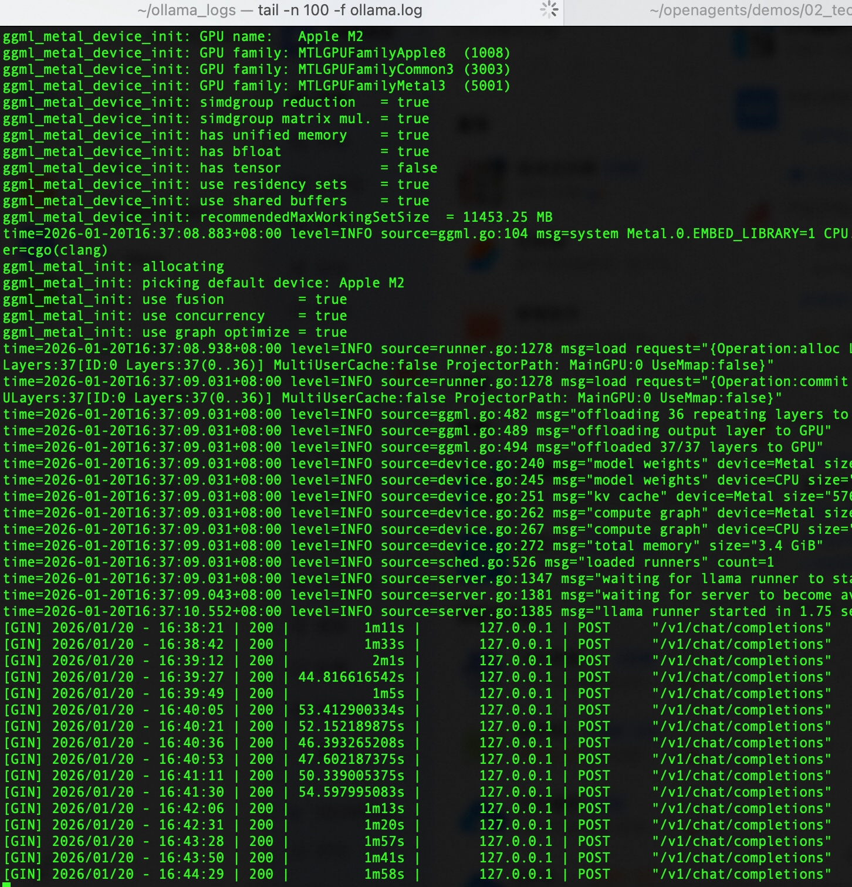

## 上手体验多 Agent 协作网络项目 OpenAgents  
                              
### 作者                              
digoal                              
                              
### 日期                              
2026-01-20                            
                              
### 标签                              
AI Agent , A2A , 多智能体协作 , 智能体胶水 , OpenAgents , Ollama , OpenAI API 兼容      
                              
----                              
                              
## 背景       
上一篇[《多智能体协作这件事: OpenAgents 开源项目给办了》](../202601/20260120_03.md) 分享了 OpenAgents 是什么?   
  
这篇我们来上手体验一下.   
  
要体验 OpenAgents 的多 Agent 协作网络(OpenAgents network), 最好别一开始就使用付费模型, 因为不小心可能把 token 用超, 如果你不心疼钱的话算我没说.      
    
下面咱们让 OpenAgents 接入用 Ollama 部署的本地模型, 简单的体验一下 Agent 协作网络(OpenAgents network).  
  
## Hello World  
  
以 macOS 为例  
  
1、启动 Ollama 服务  
```  
mkdir -p ~/ollama_logs  
cd ~/ollama_logs  
OLLAMA_HOST=0.0.0.0 OLLAMA_ORIGINS="*" nohup ollama serve > ~/ollama_logs/ollama.log 2>&1 &  
```  
  
根据你的环境资源, 拉取测试用的推理模型, 例如  
```  
ollama pull qwen3:0.6b  
ollama pull qwen3:4b  
```  
  
Ollama 支持以下 OpenAI 兼容 endpoint  
```  
/v1/chat/completions - 聊天完成  
/v1/completions - 文本完成  
/v1/embeddings - 文本嵌入  
/v1/models - 模型列表  
```  
  
Ollama 的 API 密钥是必需的但会被忽略，可以设置为任意值如 "ollama".    
  
2、拉取 Docker OpenAgents 镜像  
```  
docker pull ghcr.io/openagents-org/openagents:latest  
```  
  
3、克隆 openagents 项目, 会用到里面的示例 yaml 配置  
```  
cd ~  
git clone --depth 1 https://github.com/openagents-org/openagents  
```  
  
下面体验一个最简单的 agent network, 只有一个 agent 加入其中, agent的配置在对应的 yaml 中. 这个agent被配置为仅用于聊天.    
  
4、启动 OpenAgents network(对应配置文件在容器`/network/network.yaml`), 通过环境变量传入模型地址等信息(后面启动 agent 时会读到这些环境变量). 使用 openagents 开源项目中的示例 yaml 配置文件.   
```  
cd ~/openagents/demos/00_hello_world  
  
docker run -d -it --add-host=host.docker.internal:host-gateway \
-p 8700:8700 -p 8600:8600 -p 8800:8800 -p 8050:8050 \
-e DEFAULT_LLM_PROVIDER="openai" \
-e DEFAULT_LLM_MODEL_NAME="qwen3:0.6b" \
-e DEFAULT_LLM_BASE_URL="http://host.docker.internal:11434/v1" \
-e DEFAULT_LLM_API_KEY="not-needed" \
--name on1 \
-v `pwd`:/network \
ghcr.io/openagents-org/openagents:latest  
```  
  
5、进入 OpenAgents on1 容器, 测试连接宿主机上 ollama openAI API 兼容接口的连通性.  
```  
curl -X POST http://host.docker.internal:11434/v1/chat/completions \
-H "Content-Type: application/json" \
-d '{    
  "model": "qwen3:0.6b",   
  "messages": [{ "role": "user", "content": "Say this is a test" }]    
}'  
```  
  
6、进入 OpenAgents on1 容器, 启动 agent, 加入前面启动的 OpenAgents network. 使用 openagents 开源项目中的示例 yaml 配置文件.   
```  
docker exec -ti on1 bash  
cd /network  
openagents agent start agents/charlie.yaml  
```  
  
7、在宿主机浏览器中调试这个已经加入了 agent 的 OpenAgents network: http://localhost:8700  
  
进入一个频道 `#频道名` , 进行对话:   
```  
hello? 什么是 OpenAgents?  
```  
  
## 角色扮演 Agent 团队  
  
下面体验一个稍微复杂一点的 agent network , 有3个agent, 每个agent的配置都在对应的 yaml 中, 包括创始人、投资人、工程师三个 agent 角色.    
  
0、释放之前的容器  
```  
docker stop on1  
docker rm on1  
```  
  
1、启动 OpenAgents network(对应配置文件在容器`/network/network.yaml`), 通过环境变量传入模型地址等信息(后面启动 agent 时会读到这些环境变量). 使用 openagents 开源项目中的示例 yaml 配置文件.   
```  
cd ~/openagents/demos/01_startup_pitch_room  
  
docker run -d -it --add-host=host.docker.internal:host-gateway \
-p 8700:8700 -p 8600:8600 -p 8800:8800 -p 8050:8050 \
-e DEFAULT_LLM_PROVIDER="openai" \
-e DEFAULT_LLM_MODEL_NAME="qwen3:0.6b" \
-e DEFAULT_LLM_BASE_URL="http://host.docker.internal:11434/v1" \
-e DEFAULT_LLM_API_KEY="not-needed" \
--name on2 \
-v `pwd`:/network \
ghcr.io/openagents-org/openagents:latest  
```  
  
2、进入 OpenAgents on2 容器, 启动 agent, 加入前面启动的 OpenAgents network. 使用 openagents 开源项目中的示例 yaml 配置文件.   
```  
docker exec -ti on2 bash  
cd /network  
# 也可覆盖前面启动容器时指定的环境变量  
DEFAULT_LLM_MODEL_NAME="qwen3:4b" nohup openagents agent start agents/engineer.yaml > agents/engineer.log 2>&1 &  
DEFAULT_LLM_MODEL_NAME="qwen3:4b" nohup openagents agent start agents/founder.yaml > agents/founder.log 2>&1 &  
DEFAULT_LLM_MODEL_NAME="qwen3:4b" nohup openagents agent start agents/investor.yaml > agents/investor.log 2>&1 &  
```  
  
3、在宿主机浏览器中调试这个已经加入了 agent 的 OpenAgents network: http://localhost:8700  
  
进入一个频道 `#频道名` , 发起一个话题:   
```  
让我们来讨论一下“如何使用PostgreSQL开源数据库发财”, 请使用中文讨论.   
```  
  
可看到这3位角色已经讨论起来了  
  
  
  
  
  
注意, 你可能会发现讨论都非常简短, 这是 agent 的 yaml 配置的规则限定的, 你可根据需要调整.  
  
## 新闻聚合和评论  
  
下面体验一个聚合新闻和评论的 agent network , 有1个agent, agent的配置在对应的 yaml 中.  
  
注意: 每个 demo 都有对应的 readme , 例如这个: https://github.com/openagents-org/openagents/tree/develop/demos/02_tech_news_stream    
  
0、释放之前的容器  
```  
docker stop on2  
docker rm on2  
```  
  
1、启动 OpenAgents network(对应配置文件在容器`/network/network.yaml`), 通过环境变量传入模型地址等信息(后面启动 agent 时会读到这些环境变量). 使用 openagents 开源项目中的示例 yaml 配置文件.   
```  
cd ~/openagents/demos/02_tech_news_stream  
  
docker run -d -it --add-host=host.docker.internal:host-gateway \
-p 8700:8700 -p 8600:8600 -p 8800:8800 -p 8050:8050 \
-e DEFAULT_LLM_PROVIDER="openai" \
-e DEFAULT_LLM_MODEL_NAME="qwen3:0.6b" \
-e DEFAULT_LLM_BASE_URL="http://host.docker.internal:11434/v1" \
-e DEFAULT_LLM_API_KEY="not-needed" \
--name on3 \
-v `pwd`:/network \
ghcr.io/openagents-org/openagents:latest  
```  
  
2、进入 OpenAgents on3 容器, 启动新闻爬虫 agent, 加入前面启动的 OpenAgents network. 这个 agent 不是使用 yaml 配置的, 而是由 python 脚本编写.    
```  
docker exec -ti on3 bash  
cd /network  
python agents/news_hunter.py  
```  
  
news_hunter 是网络新闻抓取器, 搜索网络上的科技新闻，并将报道发布到频道.   
  
3、进入 OpenAgents on3 容器, 启动 agent, 加入前面启动的 OpenAgents network. 使用 openagents 开源项目中的示例 yaml 配置文件.   
```  
docker exec -ti on3 bash  
cd /network  
# 也可覆盖前面启动容器时指定的环境变量  
DEFAULT_LLM_MODEL_NAME="qwen3:4b" nohup openagents agent start agents/commentator.yaml > agents/commentator.log 2>&1 &  
```  
  
commentator 是新闻分析员, 提供对新闻的评论、分析和独到见解.  
  
4、在宿主机浏览器中调试这个已经加入了 agent 的 OpenAgents network: http://localhost:8700  
  
进入一个频道 `#频道名` , 发起猎取新闻的指令:   
```  
@news-hunter 人工智能领域的最新进展是什么？使用中文回复.  
  
@news-hunter 本周有关于创业公司融资的消息吗？@news-hunter 开源项目方面有什么进展吗？使用中文回复.  
```  
  
还有更多的例子, 详见 https://github.com/openagents-org/openagents   
  
## 参考  
https://github.com/openagents-org/openagents/blob/develop/llms.txt  
  
## 备注  
`/network/network.yaml` 配置中可能设置了管理员密码, 例如    
```  
agent_groups:    
  admin:    
    description: "Administrator agents with full permissions"    
    password_hash: 8c6976e5b5410415bde908bd4dee15dfb167a9c873fc4bb8a81f6f2ab448a918    
    metadata:    
      permissions:    
      - all  
```  
  
如何修改密码？  
```  
# 示例：为密码 "admin" 生成哈希    
echo -n "admin" | shasum -a 256    
# 输出：8c6976e5b5410415bde908bd4dee15dfb167a9c873fc4bb8a81f6f2ab448a918  
```  
  
  
  
#### [PolarDB 学习图谱](https://www.aliyun.com/database/openpolardb/activity "8642f60e04ed0c814bf9cb9677976bd4")
  
  
#### [PostgreSQL 解决方案集合](../201706/20170601_02.md "40cff096e9ed7122c512b35d8561d9c8")
  
  
#### [德哥 / digoal's Github - 公益是一辈子的事.](https://github.com/digoal/blog/blob/master/README.md "22709685feb7cab07d30f30387f0a9ae")
  
  
#### [About 德哥](https://github.com/digoal/blog/blob/master/me/readme.md "a37735981e7704886ffd590565582dd0")
  
  

  
