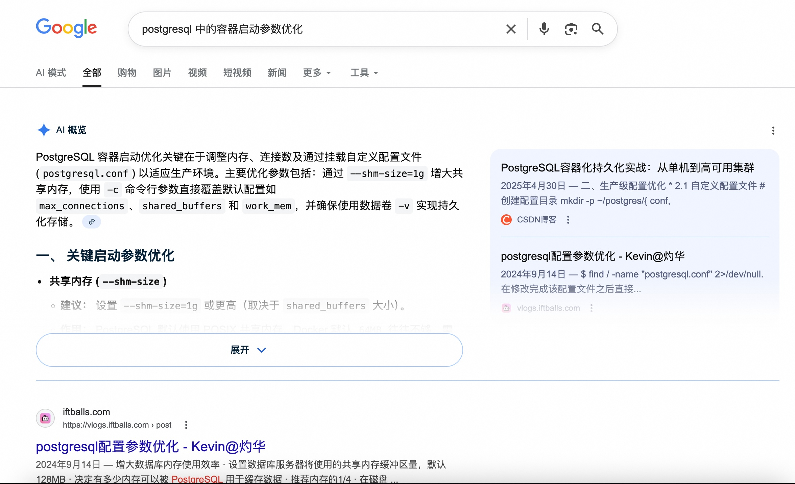

## 用 AI 分析谷歌财报 11 “搜索护城河”的韧性与替代风险  
                      
### 作者                      
digoal                      
                      
### 日期                      
2026-01-23                      
                      
### 标签                      
财报分析 , AI                      
                      
----                      
                      
## 背景                      
接上一篇, 本篇的问题:   
  
**关于“搜索护城河”的韧性与替代风险**    
    
谷歌 2025 年 Q3 的营收增长依然高度依赖搜索业务（Google Search & other 收入达 565.7 亿美元，占总营收的一半以上）。    
* **关键问题：** 在法院禁止支付“排他性默认搜索费用”后，谷歌如何维持在 iOS 和 Android 上的流量入口？    
* **解读逻辑：** 观察谷歌的流量获取成本（TAC）变化。如果 TAC 下降但搜索份额也随之下降，说明护城河在变薄；如果谷歌能通过 AI Overviews（AI 搜索摘要）提高用户留存，即使没有默认地位也能稳住份额，那才是真正的核心竞争力。                 
                      
-----                      
                      
针对你提出的第一个核心问题，我结合 2025 年 Q3 的财报数据和最新的反垄断裁决进展，为你提供一份深度分析报告。  
  
**核心观点：搜索护城河正在经历“从行政壁垒向技术粘性”的惊险跳跃。**  
  
    
  
### **1. 流量获取成本（TAC）的信号：效率提升，但压力初现**  
  
* **数据分析：** 2025 年 Q3，谷歌的 **TAC 总额为 148.8 亿美元**，同比增长 **8.4%** 。  
* **解读逻辑：** * **TAC 增长放缓于营收：** 相比“Google Search & other” 15% 的营收增长，TAC 的增长率仅为 8.4%。这意味着**谷歌每赚一美元搜索广告费，支付给渠道（如苹果、安卓厂商）的比例在下降**。  
    * **原因：** 并非谷歌主动压价，而是其**自有平台（如移动端 Google App、YouTube 内部搜索）** 的流量占比在提升。在这些平台上，谷歌无需支付分成，这正是其“护城河”从外部合同转向内部生态的体现。  
  
### **2. 流量入口危机：失去了“排他性”后的应对逻辑**  
  
* **现状：** 法院已明确禁止谷歌支付“排他性”费用（Exclusivity Payments）。这意味着从 2025 年底到 2026 年，苹果 Safari 和 Mozilla 可能被迫引入“可选项”。  
* **谷歌的“B 计划”：品牌深度集成与 Gemini 渗透**  
    * **产品化生存：** 谷歌正加速将 Chrome 打造为“AI 驱动的浏览器”，并直接在移动端推广 **Gemini App**。  
    * **逻辑：** 既然不能买下默认席位，就让用户因为“AI 功能更好用”而主动下载 Google App。财报显示，Gemini App 的月活已突破 **6.5 亿**，这种 **“去浏览器化”** 的直接入口正在抵消失去默认席位的风险。  
  
### **3. AI Overviews（AI 搜索摘要）：是护城河还是“自杀式”创新？**  
  
财报中 CEO 提到的 **“扩张性时刻（Expansionary Moment）”** 是理解未来的钥匙：  
* **查询量增长：** Q3 期间，AI Overviews 驱动了增量的搜索需求，特别是**长尾、复杂问题**。用户发现谷歌能直接给答案后，搜索频率反而翻倍了。  
* **年轻用户黏性：** 财报特别强调，AI 搜索在年轻人中的使用率更高。这击碎了“年轻人只用 TikTok 不用搜索”的担忧。  
* **风险点：** 虽然 AI 增加了查询量，但 **CTR（点击率）** 的分化值得警惕。  
    * **广告端的挑战：** AI 摘要占领了屏幕顶端，可能挤压下方传统搜索广告的点击。  
    * **谷歌的解法：** 在 AI 摘要内部嵌入广告（PMax 广告）。Q3 数据显示，这些嵌入式广告的转化率表现良好，稳住了广告单价（CPC）。  
    
作者注: 大家用现在的搜索引擎会发现, 现在的搜索最前面的是AI根据问题和相关网页内容给出的搜索摘要, 然后才是传统的网页答案.    
  
  
  
### **财务分析师的预测与预警**  
  
| 观察指标 | 2025 Q3 表现 | 2026 预测走向 |  
| --- | --- | --- |  
| **搜索份额** | 保持 90% 以上稳定 | **下行压力**。随着“选择屏幕”推行，可能出现 3%-5% 的结构性流失。 |  
| **TAC 占比** | 约 20.4%（持续优化） | **不确定**。若失去默认席位，TAC 支出虽减少，但营销费用（用于获客）将激增。 |  
| **AI 变现** | 仍处于实验性嵌入 | **全面铺开**。AI 摘要内的广告将成为新的增长点。 |  
  
**总结：** 谷歌正在用 **“AI 的先进性”** 来对抗 **“法律的惩罚”** 。如果用户已经养成了“在 Gemini 问问题”的习惯，那么苹果 Safari 的默认搜索是谁，对谷歌的打击将不再致命。目前看，护城河并未变薄，而是在**重新筑造**。  
  
      
