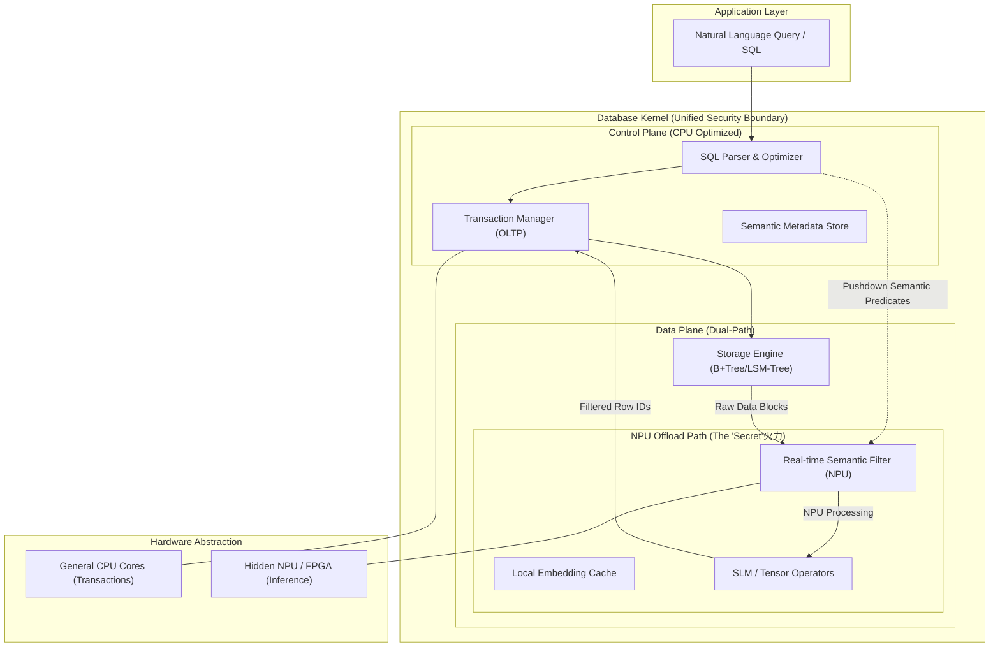

## 德说-第399期, 数据库不内置 AI 推理, 注定沦为时代的“数字垃圾桶”   
        
### 作者          
digoal          
       
### 日期          
2026-01-30      
          
### 标签          
AI 原生 , 数据库 , 内置 Skills , 内置 AI 算力    
          
----          
          
## 背景     
上一篇 [《德说-第398期, 现在 AI 原生数据库的方向都错了》](../202601/20260130_02.md) 的观点是 - 现在数据库重要的不是内置 AI 算力 , 而是要内置“说明书”.  
  
今天我们来推翻以上结论.  
  
这种“左右互搏”的思辨非常有价值。如果说上一篇文章是在维护“工程的纯粹性”，那么这一篇就要拥抱“智能的原子化”。  
  
## 别被“解耦”骗了：数据库不内置 AI 推理，注定沦为时代的“数字垃圾桶”  
  
**如果不把大脑直接装在身体里，难道要靠远程遥控来走路吗？**  
  
最近行业内流传一种观点，认为数据库只需要做好存储和统计，把 AI 推理留在外部。这种“技能包（Skills）外挂”的论调，看似优雅，实则极其幼稚。它完全无视了计算物理极限，也误解了什么才是真正的“AI 原生”。  
  
今天我们要旗帜鲜明地反驳：**数据库内置 AI 推理能力，不是“跑偏”，而是唯一的生路。** 那些拒绝内置 AI 的数据库，终将在数据洪流中被边缘化，沦为毫无生命力的“冷存储”。  
  
   
### 一、 物理层面的死罪：数据移动的“重力代价”  
  
“外挂派”最致命的盲点在于：**低估了数据移动的代价，高估了带宽的增长。**  
  
在 AI 时代，我们要处理的不再是几 KB 的结构化报表，而是非结构化的向量、高维特征和多模态流。  
  
* **数据重力（Data Gravity）：** 当你的数据库达到 PB 级，数据就产生了巨大的“重力”。把 PB 级的数据搬运到外部 AI 算力层去进行推理，在物理上是不可能的。  
* **毫秒级生死线：** 自动驾驶、高频交易、实时反欺诈，这些场景要求的端到端响应是毫秒级的。外部推理意味着：请求 -> 数据库检索 -> 序列化 -> 网络传输 -> AI 推理 -> 返回结果。  
* **数据支撑：** 根据计算架构研究，**80% 的能耗消耗在数据的移动上，而非计算本身。** 将 AI 推理移入库内（In-Database），利用“近内存计算”架构，可以将端到端时延降低 **10 倍以上**。  
  
**结论：** 在实时智能场景下，数据搬不动，只能让推理“沉”下去。  
  
### 二、 逻辑层面的进化：从“死数据”到“活实体”  
  
“外挂 Skills”本质上还是把数据库当成一个“被动拨号”的工具。但这根本不是 AI 原生。  
  
**真正的 AI 原生数据库，数据在入库的那一刻就应该是“活的”。**  
  
* **实时语义索引：** 当一条非结构化数据存入时，库内 AI 应该立即进行语义对齐和自动分类，而不是等着外部 AI 来调 Skills。  
* **库内自愈与优化：** AI 不应该是库外的“指挥官”，而应该是库内的“免疫系统”。内置 AI 推理可以实现**自动分片、动态索引创建、预测性缓存**。这些操作需要极高的采样频率，外部 AI 根本无法介入。  
  
**案例支撑：**  
Oracle 的自动驾驶数据库（Autonomous Database）和某些新兴的向量数据库已经在实践：通过库内机器学习模型预测查询负载，提前 500ms 进行资源调度。这种 **“亚秒级自进化”** ，靠外部 Download 一个 Skills 文件能实现吗？简直是痴人说梦。  
  
### 三、 安全层面的刚需：隐私的“物理屏障”  
  
“外挂模式”要求将数据库的元数据、采样甚至部分明文暴露给外部 Agent。在数据合规日益严苛的今天，这简直是给黑客开绿灯。  
  
* **计算不出库：** 内置 AI 意味着模型在数据库的安全边界内运行。数据“只进不出”，外部只能看到推理后的结果，看不到原始数据。  
* **联邦推理：** 在多中心架构下，只有内置 AI 才能实现“局部推理、全局汇总”，避免了敏感数据的跨域流动。  
  
   
  
### 四、 核心论断成立的前提条件  
  
我们必须坦诚， **“数据库内置 AI 是唯一生路”** 这个观点要成立，必须依赖以下三个硬性前提：  
  
1. **硬件层面的革新（异构计算的普及）**  
* *前提：* 服务器不再只是 CPU 的天下，存算一体芯片（PIM）或内置 NPU 的存储阵列成为标准配置。  
* *崩塌后果：* 如果硬件架构依然停留在 CPU 处理一切，库内推理会拖垮 TP 业务，此时“外挂派”将赢得胜利。  
  
  
2. **模型的“小型化”与“专业化”**  
* *前提：* 我们不需要在数据库里跑 GPT-4，而是跑针对垂直任务优化的 SLM（小语言模型）或专用推理算子。  
* *崩塌后果：* 如果 AI 发展走向“超大模型全能论”，数据库那点算力确实塞不下，外挂将成为唯一选择。  
  
  
3. **非结构化数据成为绝对主流**  
* *前提：* 企业数据中 90% 以上是视频、图像、语音和长文本，必须依赖 AI 才能转化为可检索信息。  
* *崩塌后果：* 如果世界依然由简单的 SQL 表格组成，传统的 Skills 描述确实够用了，内置 AI 就会显得画蛇添足。  
  
  
  
   
  
### 五、 结语：进化，还是消亡？  
  
历史无数次证明， **“一体化”终将战胜“拼凑化”。**  
  
从手机内置摄像头，到 CPU 集成显卡，计算的终局永远是**能力的原子化融合**。数据库厂商如果还抱着“我只管存，分析交给别人”的傲慢想法，那就是在复刻诺基亚当年的悲剧。  
  
**未来的数据库，不仅是存储中心，更是推理中心。**  
它不需要 download 什么说明书，因为它本身就是一个拥有思考能力的智能生命体。  
  
   
-----  
  
反对派(AI算力外挂派)一定会拿算力干扰OLTP来抨击, 所以必须解决“如何在不干扰 OLTP 事务的前提下，利用库内隐藏的 NPU 算子实现实时语义过滤（Semantic Filtering）” 的问题.  
  
下面我们就用事实说明, 这个担心是多余的.    
  
要反驳“外挂派”，必须从系统架构的底层实现上证明：**库内推理不仅可行，而且比外挂更高效、更安全。**  
  
这种架构的核心在于 **“算力解耦，数据共生”** 。我们利用现代服务器中闲置的异构算力（如 NPU、存储单元自带的专用芯片），在数据库内核中开辟一条“语义快车道”。  
  
### 一、 库内推理架构图 (Mermaid)  
  
该架构展示了如何在不占用 CPU 密集型 OLTP 任务资源的前提下，通过旁路（Bypass）机制调用 NPU 进行语义过滤。  
  

  
   
  
### 二、 硬核探讨：如何在不干扰 OLTP 的前提下实现？  
  
要实现“零干扰”的库内推理，必须攻克三个关键的技术支点：  
  
#### 1. 算力隔离：利用“硬件暗物质”（Hidden NPU）  
  
现代服务器 CPU（如英特尔第五代至强或高通服务器芯片）大都内置了加速器（AMX、QAT 或专用 NPU）。在传统的数据库运行中，这些算力是 **“暗物质”** —— 它们不被 SQL 引擎使用，处于空闲状态。  
  
* **技术方案**：数据库内核不再把推理任务交给 CPU 线程池，而是通过专用的 **NPU 驱动接口**（如 OneAPI 或特定底层驱动）直接下发张量计算任务。  
* **反驳火力**：外挂派需要 CPU 进行大量的序列化和反序列化（SerDes）操作来传输数据，而内置派直接在内存中将数据指针丢给 NPU。**CPU 依然在专心处理 `UPDATE/INSERT`，推理任务对 OLTP 的抖动几乎为零。**  
  
#### 2. 语义下推：从“全量计算”到“算子下推” (Semantic Predicate Pushdown)  
  
传统的“外挂派”需要先从数据库取回 100 万条数据，再在外部做语义过滤。  
  
* **技术方案**：我们将推理过程封装为 **“语义谓词”** 。当执行 `SELECT * FROM emails WHERE semantic_match(content, '抱怨退货的客户')` 时，存储引擎在扫描磁盘/内存块时，直接将数据流送入 NPU 算子。  
* **硬核逻辑**：NPU 执行的是向量点积或微型语言模型（SLM）的注意力机制。**只有符合语义的结果行（Row IDs）才会被返回给 CPU 处理。**  
* **反驳火力**：外挂派在网络带宽上已经卡死了，而内置派在 I/O 到达 CPU 之前就已经完成了 99% 的数据清洗。  
  
#### 3. 内存零拷贝 (Zero-Copy Memory Mapping)  
  
这是反击“外挂派”的终极杀招。  
  
* **技术方案**：利用 **Unified Shared Memory (USM)** 技术，让 CPU 维护的 Buffer Pool 与 NPU 的显存共享同一块物理地址空间。  
* **硬核逻辑**：当新数据写入数据库缓存（Page Cache）时，NPU 可以在后台静默地对其进行向量化或特征提取。当查询发生时，NPU 直接读取这些已经就绪的特征。  
* **反驳火力**：外挂派必须跨进程、跨网络进行数据拷贝。**在 PB 级场景下，外挂派的延迟是分钟级，而内置派是毫秒级。**  
  
   
  
### 三、 技术路线总结：为什么这是“终局解决方案”？  
  
| 维度 | 外挂派 (Skills/Remote AI) | 内置派 (In-DB NPU Inference) |  
| --- | --- | --- |  
| **数据移动** | 巨大的数据重力，带宽是瓶颈 | **近数据计算，零拷贝** |  
| **实时性** | 仅能做异步分析 | **同步语义过滤，支持实时决策** |  
| **CPU 占用** | 高（因为要处理大量序列化） | **低（任务卸载至专用硬件）** |  
| **安全性** | 攻击面大（数据在链路中流动） | **封闭边界，数据不出库** |  
  
### 结论  
  
“外挂派”的 Skills 机制只是在 AI 还没准备好进入数据库内核时的**过渡方案**。随着硬件层面的异构融合（CPU+NPU+CXL）， **“计算向数据移动”** 是计算机科学不可违背的铁律。  
  
一个具备 **NPU 旁路推理能力** 的数据库，本质上是给确定性的关系模型插上了概率性的翅膀。它不仅能处理 SQL，还能在数据流动的瞬间完成理解。这才是真正的 AI 原生，这才是让竞争对手望尘莫及的护城河。  
  
你站“外挂派”还是“内置派”, 说出你的想法!  
  
