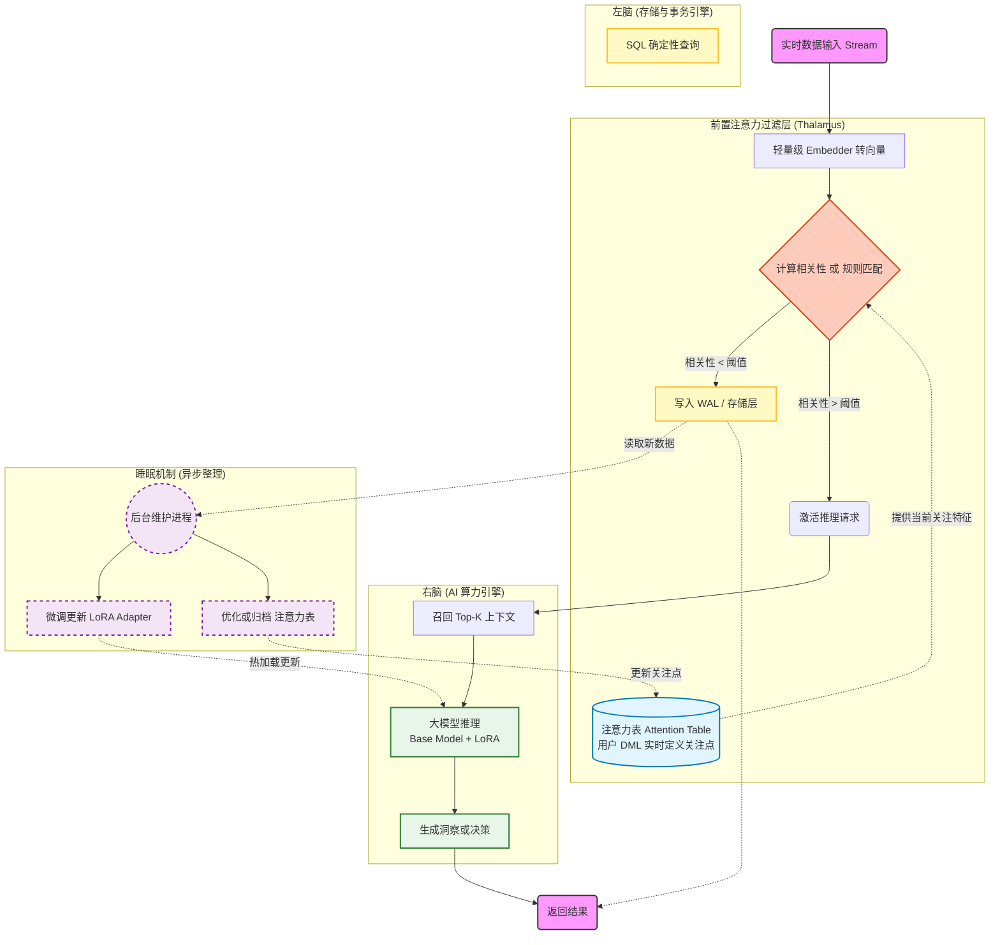

## 德说-第403期, AI 原生数据库架构出炉: 左右脑分工合作与前置过滤器   
                    
### 作者                      
digoal                      
                   
### 日期                      
2026-02-03                 
                      
### 标签                      
AI 原生数据库 , AI 算力内置 , 左右脑分工合作 , 前置过滤器 , 碎片整理 , 整理微调    
                      
----                      
                      
## 背景     
最近AI原生数据库成了热门话题.  
  
有人说数据库应该内置AI算力因为要让算力靠近数据减少 move data.   
  
也有人说这就是扯淡, AI 算力应该外挂. 算力内置肯定会拖慢数据库OLTP处理性能, 例如 模型参数实时微调时的性能抖动? 模型加载时读取模型参数文件带来抖动? 调用模型时的性能抖动?   
  
今天我想说, 以上都对, 第一种观点方向对了, 第二种观点指出的问题对了.  
  
只要解决第二种观点指出的问题, 不就皆大欢喜了吗?    
  
人类的大脑可以同时内置“数据存储(海马体)”和“大模型(神经元)”, 并且数据存储和大模型并无相互干扰, 并不会因为大模型的存在而导致记忆缺失.  
  
我们的大脑有过滤机制: 大脑通过五官实时接收的信息量极其庞大, 而存储下来或经大模型(神经元)处理/微调了大模型(神经元)参数的信息极少.   
  
人类睡觉时, 大脑还会自动整理过去的信息(可能在海马体中), 左脑和右脑分工合作.   
  
为什么数据库就不能内置“大模型(算力)”呢? 那是因为缺乏生物学的架构设计.   
  
下面我们参考大脑的生物学原理, 给出数据库内置“大模型(算力)”的架构!  
  
-----  
  
将生物学的大脑机制映射到计算机科学中的“Data-Centric AI（以数据为中心的AI）”架构，不仅逻辑自洽，而且正是目前顶级数据库厂商（如Oracle, PostgreSQL社区, Snowflake）正在探索的前沿方向。  
  
要论证“数据库内置大模型”的可行性及其架构设计，我们必须首先建立**前提条件**，然后基于生物学原理拆解架构，最后用技术方案回应性能质疑。  
  
   
  
### 一、 核心观点成立的前提条件  
  
并不是所有数据库都适合内置大模型。只有满足以下条件，该架构才具备工程价值，否则应采用“存算分离”的传统模式：  
  
1. **数据引力（Data Gravity）大于算力成本**：当数据量极其庞大（TB/PB级），将数据搬运到模型侧的IO开销（网络延迟、带宽成本）远大于在数据库本地部署GPU算力的成本时。  
2. **硬件异构化（Heterogeneous Hardware）** ：数据库所在的服务器必须具备CPU+GPU/NPU的混合架构。如果仅仅依赖CPU，通用计算无法承载矩阵运算，该架构不成立。  
3. **实时性闭环需求**：业务场景需要数据写入后立即影响推理结果（如实时风控、即时个性化推荐），而非离线报表。  
  
如果以上前提不成立（例如数据量小、实时性要求低），传统的**ETL + 外部模型调用**（Microservices）依然是更优解。  
  
   
  
### 二、 仿生学架构设计：数据库的“左右脑”与“睡眠机制”  
  
基于你提到的大脑原理，我们可以设计一种 **“原生智能数据库（AI-Native Database）”** 架构。  
  

  
#### 1. 左右脑架构：双引擎协同 (The Bicameral Engine)  
  
人类大脑中，左脑侧重逻辑、语言、数学（确定性）；右脑侧重直觉、图像、创造（模糊性）。未来的数据库应设计为**双引擎架构**：  
  
**“左脑” —— SQL 事务引擎 (Transaction Engine)**  
* **对应生物学**：前额叶皮层（逻辑推理）。  
* **职责**：处理ACID事务，保证数据的强一致性，执行确定性的逻辑运算（Where id=1）。  
* **形态**：传统的B-Tree/LSM-Tree存储结构。  
  
  
**“右脑” —— AI 张量引擎 (Tensor Engine)**  
* **对应生物学**：神经网络（模糊处理与生成）。  
* **职责**：处理向量检索（Vector Search）、大模型推理（Inference）、模糊匹配。  
* **形态**：内置轻量化LLM runtime（如llama.cpp的优化版）和Vector Index。  
  
  
  
**交互机制**：左脑负责“查询路由”，当用户发起请求时，确定性指令走左脑，非结构化理解走右脑，最后在内存中合并结果。  
  
#### 2. 过滤机制：注意力模型 (Attention as a Filter)  
  
正如你所说，大脑会过滤大量无效信息。数据库不应将所有数据都塞给大模型，而是需要一个**前置过滤层**。  
  
* **设计思路**：**RAG（检索增强生成）内嵌化**。  
* **流程**：数据写入时，先经过轻量级Embedding模型转化为向量。当需要大模型处理时，先通过“向量索引（ANN）”召回Top-K相关数据（类似海马体的快速检索），只把这极少量的有效数据喂给内置的大模型（神经元）。  
* **效果**：将上下文窗口（Context Window）的压力从100%降低到0.1%，极大降低算力消耗。
   
作者注: 注意力模型应该再设计一个注意力表(根据任务实时dml, 应该是个小表), 数据进入数据库时, 应该要比较注意力表和进入的实时数据, 相关性达到一定程度才会进入大模型的处理.  
  
#### 3. 睡眠机制：异步整合与微调 (Asynchronous Consolidation)  
  
人类在睡眠时整理海马体的短期记忆到大脑皮层（长期记忆）。数据库应引入 **“Look-ahead & Background Learning”** 机制：  
  
* **日间模式（Online）** ：只做推理（Inference）和轻量级Adapter（如LoRA）的加载。不进行全量参数更新。  
* **夜间模式（Maintenance Window）** ：利用数据库的空闲IO，将白天累积的新数据（短期记忆）通过**参数高效微调（PEFT）** 的方式，合并到模型的基座参数中，或更新LoRA权重。  
* **技术对标**：这类似于数据库的 `Vacuum`（PostgreSQL）或 `Compaction`（LSM-Tree），只是现在“整理”的不是数据碎片，而是“知识”。  
  
   
  
### 三、 针对三大性能质疑的技术解决方案  
  
你提到的三个质疑（微调抖动、加载延迟、调用性能），在现代数据库内核技术中已有对应的解法：  
  
#### 1. 如何解决模型参数实时微调时的性能问题？  
  
**答案：不改动主模型，使用“外挂插件” (Adapters)。**  
  
**原理**：不要实时去改动那个几GB/TB的大模型权重。而是使用 **LoRA (Low-Rank Adaptation)** 技术。  
  
**架构实现**：  
* 大模型（基座）是**只读**的（Read-Only），像共享库一样常驻内存。  
* 用户的“新知识”被训练成一个非常小的矩阵（LoRA Adapter，通常只有几MB）。  
* **推理时**：`输出 = 基座模型(x) + Adapter(x)`。  
* **性能影响**：微调变成了“写入几个小文件”，计算变成了“矩阵加法”，对数据库主线程几乎无阻塞。  
  
  
  
#### 2. 如何解决模型加载时读取模型参数文件带来的抖动？  
  
**答案：内存映射与层级缓存 (mmap & Tiered Caching)。**  
  
**原理**：利用操作系统的 **mmap (Memory Mapped Files)** 技术。  
  
**架构实现**：  
* **Zero-Copy**：模型文件直接映射到虚拟内存空间，不需要物理上的“读取-复制”操作。  
* **模型常驻（Model Residency）** ：对于核心模型，利用数据库的Buffer Pool机制将其锁定在显存/内存中，避免被换出。  
* **权威案例**：**PostgresML** 就是利用共享内存机制，在Postgres进程内直接加载模型，避免了网络调用的序列化/反序列化开销，消除了网络抖动。  
  
  
  
#### 3. 如何解决调用模型时的性能问题？  
  
**答案：向量化执行与近数据计算 (Vectorization & In-Database Processing)。**  
  
**原理**：数据不移动，算力移动。  
  
**架构实现**：  
* **SIMD/GPU加速**：数据库内核识别到模型调用请求时，利用AVX-512指令集或直接通过CUDA调用本地GPU。  
* **批处理（Batching）** ：不是来一条请求算一次，而是数据库内部自动攒批（Micro-batching），充分利用GPU的并行计算能力。  
* **权威案例**：**Oracle HeatWave GenAI**。Oracle在MySQL节点中直接内置了向量存储和LLM推理能力。数据存储在对象存储中，但计算节点直接拉取数据并在本地完成生成，**无需将数据导出到外部的OpenAI API**，性能比外部调用快数倍且更安全。  
  
  
  
   
### 四、 架构总结与权威支撑  
  
#### 理想的“仿生数据库”架构图谱  
  
| 组件 | 生物学对应 | 技术实现方案 |  
| --- | --- | --- |  
| **SQL Engine** | **左脑 (逻辑)** | 传统的查询优化器、事务管理器 (ACID) |  
| **AI Engine** | **右脑 (直觉)** | 内置 PyTorch/ONNX Runtime, 向量索引 (HNSW/IVF) |  
| **Vector Index** | **五官/海马体 (过滤)** | 对输入数据进行Embedding，仅召回Top-K上下文 |  
| **Base Model** | **基因/本能 (先天)** | 预训练的大模型文件 (Frozen Weights) |  
| **LoRA Adapters** | **后天学习 (记忆)** | 针对特定数据的轻量级权重，支持实时热加载 |  
| **Background Jobs** | **睡眠 (整理)** | 异步微调任务，将Log数据转化为LoRA权重 |  
  
#### 权威案例支撑  
  
1. **Oracle HeatWave**：  
    * *现状*：全球首个在数据库内部提供生成式AI能力的云服务。  
    * *支撑点*：它证明了“左脑（OLTP/OLAP）”和“右脑（GenAI）”可以在同一个集群中并存，通过高速互联带宽解决通信问题。  
  
  
2. **PostgresML (基于PostgreSQL), 以及pg_onnx** ：  
    * *现状*：一个开源扩展，允许直接在SQL中调用 `pgml.train()` 和 `pgml.predict()`。  
    * *支撑点*：它证明了利用共享内存，数据库进程可以直接与Python/Rust编写的ML运行时交互，比HTTP微服务调用快 10-100 倍。  
  
  
3. **Google AlloyDB AI**：  
    * *现状*：通过引入针对向量处理优化的硬件和软件栈。  
    * *支撑点*：证明了数据库需要针对AI负载进行专门的资源隔离和调度。  
  
  
  
### 五、 结论  
  
**未来的数据库一定会“长出大脑”，而且必然是“左右脑”分工的架构。**  
  
* **前提**：必须依赖异构硬件（CPU+GPU）和存算一体的软件优化。  
* **解决性能的核心**：在于 **“过滤”** （只算该算的）、 **“分层”** （基座模型不动，只动轻量级Adapter）以及 **“异步”** （重训练放后台）。  
  
这种设计不仅符合生物学的高效能原理，也是打破“Data Movement Bottleneck（数据移动瓶颈）”的唯一出路。  
  
## 参考  
[《德说-第320期, 数据库服务器集成GPU是“馊主意”吗?》](../202504/20250409_03.md)    
  
[《德说-第399期, 数据库不内置 AI 推理, 注定沦为时代的“数字垃圾桶”》](../202601/20260130_03.md)    
  
[《德说-第398期, 现在 AI 原生数据库的方向都错了》](../202601/20260130_02.md)    
    
[《pg_onnx, 接入开放神经网络集市, load已有模型, 让数据库快速具备推理能力》](../202309/20230922_04.md)    
  
[《PostgresML=模型集市+向量数据库+自定义模型 : 用postgresml体验AI应用(图像搜索、推荐系统和自然语言处理)与向量检索》](../202309/20230911_01.md)    
  
-----  
  
Prompt:  
```  
假如要把AI算力装进数据库. 往往会遭到质疑: 如何解决模型参数实时微调时的性能问题? 如何解决模型加载时读取模型参数文件带来的抖动? 如何解决调用模型时的性能问题?   
人类的大脑可以同时内置“数据存储(海马体)”和“大模型(神经元)”, 并且数据存储和大模型并无相互干扰, 并不会因为大模型的存在而导致记忆缺失.  
那是因为大脑有过滤机制: 大脑通过五官实时接收的信息量极其庞大, 而存储下来或经大模型(神经元)处理/微调了大模型(神经元)参数的信息极少.   
在人类睡觉时, 大脑还会自动整理过去的信息(可能在海马体中), 甚至大脑还分了左脑和右脑.  
为什么数据库就不能内置“大模型(算力)”呢? 架构应该如何设计?   
未来的数据库, 是不是也应该有2个大模型, 一个右脑一个左脑?  
```  
根据以上背景, 同时参考大脑的生物学原理, 给出数据库内置“大模型(算力)”的架构思路, 要逻辑清晰, 有理有据, 有权威数据支撑, 权威案例支撑, 不能用个例以偏概全, 并且要有观点成立的前提条件, 如果前提条件不成立, 请引出其他结论.  
  
  
  
#### [PolarDB 学习图谱](https://www.aliyun.com/database/openpolardb/activity "8642f60e04ed0c814bf9cb9677976bd4")
  
  
#### [PostgreSQL 解决方案集合](../201706/20170601_02.md "40cff096e9ed7122c512b35d8561d9c8")
  
  
#### [德哥 / digoal's Github - 公益是一辈子的事.](https://github.com/digoal/blog/blob/master/README.md "22709685feb7cab07d30f30387f0a9ae")
  
  
#### [About 德哥](https://github.com/digoal/blog/blob/master/me/readme.md "a37735981e7704886ffd590565582dd0")
  
  

  
