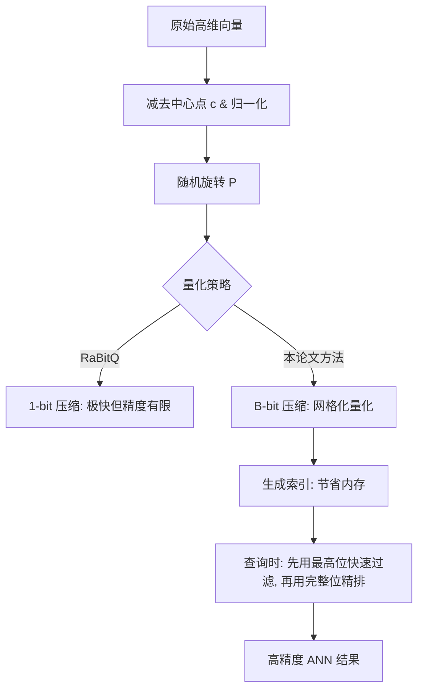
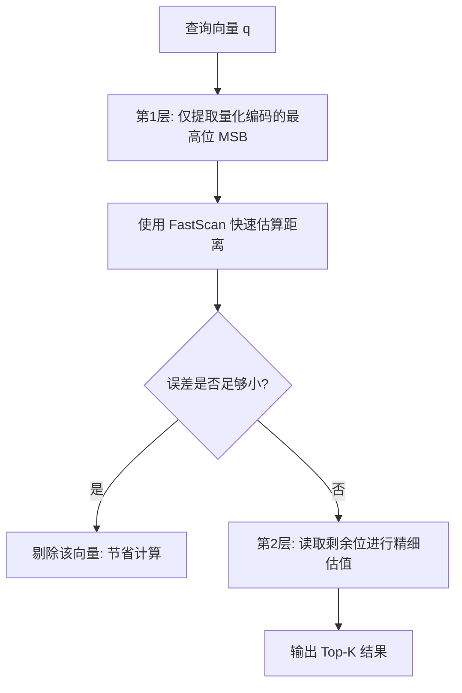
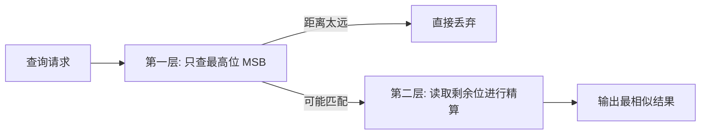

## AI论文解读 | Practical and Asymptotically Optimal Quantization of High-Dimensional Vectors in Euclidean Space for Approximate Nearest Neighbor Search  
          
### 作者          
digoal          
          
### 日期          
2026-02-24          
          
### 标签          
PostgreSQL , PolarDB , DuckDB , AI , 论文解读          
          
----          
          
## 背景    
[《商用向量数据库瑟瑟发抖! PG 地表最强向量插件 VectorChord 正式支持 8bit 和 4bit 量化》](../202602/20260224_11.md) , 今天来聊聊它背后的论文.  
        
https://arxiv.org/pdf/2409.09913          
    
提示:            
```            
读懂《Practical and Asymptotically Optimal Quantization of High-Dimensional Vectors in Euclidean Space for Approximate Nearest Neighbor Search》这篇论文需要提前掌握哪些基础知识, 请使用中文通熟易懂的讲解这些基础知识, 可以引用论文中的图、表或使用Markdown支持的图形(text,mermaid等)增加解释性.   
    
使用中文通熟易懂的解读《Practical and Asymptotically Optimal Quantization of High-Dimensional Vectors in Euclidean Space for Approximate Nearest Neighbor Search》这篇论文, 其中的关键内容请着重讲解, 可以引用论文中的图、表或使用Markdown支持的图形(text,mermaid等)增加解释性.   
    
提取《Practical and Asymptotically Optimal Quantization of High-Dimensional Vectors in Euclidean Space for Approximate Nearest Neighbor Search》这篇论文中的重要术语, 使用中文对这些术语进行通熟易懂的讲解, 可以引用论文中的图、表或使用Markdown支持的图形(text,mermaid等)增加解释性.   
```       
    
## 1 前置知识   
    
阅读这篇关于高维向量量化（Quantization）的论文，需要你对计算机科学中的 **向量搜索（Vector Search）** 、**线性代数**以及**概率统计**有一定的基础了解。  
  
以下是为你整理的、以通俗易懂的方式讲解的核心基础知识：  
  
### 1. 近似最近邻搜索 (ANN, Approximate Nearest Neighbor Search)  
  
* **核心任务** ：在一个包含海量高维向量（例如 AI 生成的 Embedding）的数据库中，找到与给定查询向量（Query）最相似的一个或多个向量 。  
  
  
* **挑战** ：由于“维度灾难”，精确搜索（逐一对比）在数据量巨大时非常缓慢 。  
  
  
* **解决方案** ：ANN 通过牺牲微小的精度来换取极高的搜索速度 。这篇论文的研究重点就是如何通过**向量量化**来节省内存并加速这一过程 。  
  
  
  
### 2. 向量量化 (Quantization)  
  
量化就像是图像压缩。为了节省空间，我们不存储每个坐标的精确浮点数（通常是 32 位），而是用更短的编码（Code）来表示。  
  
* **乘积量化 (PQ, Product Quantization)** ：一种经典方法，将向量切分成段，每段映射到一个预定义的“码本”（Codebook）中 。  
  
  
* **标量量化 (SQ, Scalar Quantization)** ：更简单的方法，直接将浮点数四舍五入为较短的整数（如 8 位或 4 位整数） 。  
  
  
  
### 3. RaBitQ：本论文的直接基础  
  
这篇论文是基于 **RaBitQ** 方法的改进方案 。理解 RaBitQ 的核心机制非常重要：  
  
* **二值化压缩** ：RaBitQ 默认将一个高维向量压缩为只有 0 和 1 的二进制位（32 倍压缩率） 。  
  
  
* **随机旋转 (Random Rotation)** ：在量化前，先对向量乘一个随机正交矩阵 $P$ 。这能保证量化误差在统计学上是“无偏”的，即估算的距离平均来看是非常准确的 。  
  
  
* **内积估计** ：RaBitQ 证明了即使向量被压缩成 0/1 序列，依然可以快速且准确地估算它们原本的内积（Inner Product） 。  
  
  
  
### 4. 核心数学概念简述  
  
如果你理解以下几个数学概念，读这篇论文会顺畅很多：  
  
* **欧几里得距离与内积** ：论文通过内积来估算平方欧氏距离。公式如下 ：  
  
  
  
$$\|o_r - q_r\|^2 = \|o_r - c\|^2 + \|q_r - c\|^2 - 2 \cdot \langle q, o \rangle$$  
  
  
这里向量被归一化处理（Normalized），因此计算内积 $\langle q, o \rangle$ 成为关键 。  
  
  
* **渐近最优 (Asymptotically Optimal)** ：这是一个理论术语，意味着论文提出的方法在“存储空间”与“估算误差”的权衡上，已经达到了理论上的极限效率 。  
  
  
* **SIMD (单指令多数据流)** ：论文提到使用 **FastScan** 技术 。这是一种硬件加速手段，利用 CPU 的特殊指令一次性处理多个量化后的向量数据，极大提升搜索效率 。  
  
  
  
### 5. 论文逻辑结构图解 (Mermaid)  
  
本论文的核心思想是将 RaBitQ 从“极高压缩（1比特）”扩展到“中等压缩（B比特）”，以获得更高的精度 。其流程如下：  
  

  
### 总结  
  
**阅读建议** ：你可以先重点看论文的第 2 节 (Preliminaries) 以了解 RaBitQ 的数学定义 ，然后再看第 3 节了解作者如何利用“B 位无符号整数向量”来构建新的码本（Codebook） 。如果你熟悉 Python 的 NumPy 操作或基本的位运算，理解其“分层过滤（先查最高位再查剩余位）”的策略会非常快 。  
    
## 2 解读论文   
    
这篇论文《Practical and Asymptotically Optimal Quantization of High-Dimensional Vectors in Euclidean Space for Approximate Nearest Neighbor Search》介绍了一种名为 **RaBitQ 扩展版**的新型向量量化方法 。它主要解决了高维向量搜索中“精度”与“内存”之间的矛盾 。  
  
以下是对该论文核心内容的通俗解读：  
  
### 1. 核心背景：为什么要改进 RaBitQ？  
  
在处理海量 AI 生成的向量（如大模型的 Embedding）时，内存非常宝贵 。  
  
* **传统 PQ（乘积量化）** ：虽然压缩率高，但在不读取原始向量（Re-ranking）的情况下，召回率往往较低（通常低于 80%） 。  
  
  
* **RaBitQ（前作）** ：这是一种极高压缩比的方法（32倍压缩），虽然有很好的数学保证，但它太“极端”了——它只能把向量压成 0 和 1（1-bit 量化） 。  
  
  
* **本论文的动机** ：如果我们愿意多花一点点内存（比如用 4 位或 8 位来表示一个维度，即 8 倍或 4 倍压缩），能否获得极高的搜索精度？   
  
  
  
### 2. 关键创新点：如何实现“渐近最优”？  
  
论文的核心贡献是设计了一个既能快速计算，又在数学上达到理论误差极限的“码本”（Codebook） 。  
  
#### A. 构建“网格型”码本 (Codebook Construction)  
  
作者不再像传统方法那样通过聚类（K-means）来学习码本，而是基于**均匀网格**手动构造 ：  
  
1. **网格化 (Grid)** ：在多维空间中划定一套均匀的整数网格点（B-bit 整数） 。  
  
  
2. **归一化 (Normalization)** ：将这些网格点映射到单位球面上 。  
  
  
3. **随机旋转 (Random Rotation)** ：乘上一个随机矩阵 $P$。这步至关重要，它能消除量化过程中的系统性偏见，确保距离估算是**无偏的** 。  
  
  
  
#### B. 快速量化算法 (Efficient Quantization)  
  
在构造好码本后，如何快速把一个原始向量映射到网格点上？如果暴力搜索 $2^{B \cdot D}$ 个点是不可能的 。  
作者提出了一个**基于排序和关键值枚举的优化算法**（Algorithm 1），将原本指数级的复杂度降低到了 $O(2^B \cdot D \log D)$，在实际应用中非常快 。  
  
### 3. 搜索加速：FastScan 与分层过滤  
  
为了让搜索飞快，论文利用了 CPU 的 **SIMD（单指令多数据流）** 指令集 。  
  
其搜索逻辑可以用下图表示：  
  

  
* **最高位过滤** ：因为 B-bit 编码的最高位其实就等同于原始的 1-bit RaBitQ 编码，作者先用最高位快速筛掉大部分不相关的向量 。  
  
  
* **增量精排** ：只有当最高位无法确定优劣时，才会读取剩下的位来提高精度 。  
  
  
  
### 4. 实验结论：它有多强？  
  
论文通过在多个真实数据集（如 OpenAI 词向量、MSong 等）上的测试表明：  
  
* **精度更高** ：在相同的内存占用下，该方法比传统的 SQ（标量量化）和 LVQ 的平均相对误差低 1.3 倍到 3.1 倍 。  
  
  
* **无需重排** ：在使用约 4.5 倍压缩率（B=7）时，它能稳定产生 **>99%** 的召回率，这意味着你**完全不需要在内存里保留原始向量**，极大地节省了硬件成本 。  
  
  
  
### 总结  
  
这篇论文的精髓在于：它通过**随机旋转+均匀网格归一化**的数学巧思，证明了在高维空间中，不需要复杂的机器学习聚类，仅靠简单的整数网格量化就能达到理论上的最优精度，并配合硬件加速技术实现了极高的工业落地价值 。  
    
## 3 术语   
    
这篇论文提出了一种新型的高维向量量化方法，它是对经典方法 **RaBitQ** 的一种改进和扩展。  
  
为了帮助你读懂这篇论文，我提取了其中的核心术语，并用通俗易懂的语言及图示进行了讲解：  
  
### 1. 核心术语表  
  
| 术语 (英文) | 术语 (中文) | 简单解释 |  
| --- | --- | --- |  
| **Quantization** | **量化** | 将复杂的浮点数向量转换为简单的数字（如整数或比特），以此节省存储空间并加速搜索 。 |  
| **ANN (Approximate Nearest Neighbor)** | **近似最近邻搜索** | 在海量数据中不求“绝对精确”但求“极快”地找到最相似的向量 。|  
| **Unbiased Estimator** | **无偏估计量** | 虽然压缩后的距离计算会有误差，但从统计学上看，大量计算的平均值等于真实值 。|  
| **Codebook** | **码本** | 一个预先定义好的“标准答案库”，量化过程就是把原始向量映射到库里最接近的那个点 。|  
| **Asymptotic Optimality** | **渐近最优** | 指该方法在数学理论上已经达到了“存储空间”与“误差精度”平衡的极限，无法做得更好 。|  
| **Random Rotation** | **随机旋转** | 在量化前对向量做一次随机的“转动”，确保数据分布均匀，这是保证“无偏性”的关键 。 |  
  
    
  
### 2. 核心术语深度解读  
  
#### A. 从 RaBitQ 到 B-bit 扩展 (Term: RaBitQ Extension)  
  
* **RaBitQ** 是前作，它很极端：把每个维度只压成 **1个比特**（非 0 即 1），虽然压缩率极高（32倍），但精度有时不够 。  
  
  
* **本论文的改进** ：支持 **B-bit**。你可以根据需要选择用 4位、8位或其他位数来表示一个维度，从而在“更省内存”和“更准”之间自由切换 。  
  
  
  
#### B. 网格化码本 (Term: Grid-based Codebook)  
  
这是论文最精妙的地方。传统的量化方法（如 PQ）需要通过复杂的机器学习（K-means）来训练码本，非常耗时 。  
而本论文直接定义了一个**均匀网格** ：  
  
```text  
原始空间 (浮点数)  ----->  均匀整数网格 (B-bit)  ----->  投影到球面上并随机旋转  
[0.12, -0.85, ...] ----->  [3, 1, 7, 0, ...]    ----->  得到最终的量化码  
```  
  
通过这种方式，它不需要训练，且由于网格的对称性，计算速度极快 。  
  
#### C. MSB 过滤与 FastScan (Term: MSB Filtering)  
  
为了让搜索更快，论文利用了二进制编码的特性：  
  
* **MSB (Most Significant Bit)** ：即二进制数的最高位 。  
  
  
* **策略** ：搜索时，先只看量化编码的**最高位**。这相当于先用 1-bit 的 RaBitQ 做一次粗筛（利用 CPU 的 **FastScan** 指令集瞬间扫过百万数据） 。如果最高位显示的距离已经远得离谱，就直接扔掉这个候选者，不再读取剩余的位 。  
  
  
  

  
#### D. 理论保证：渐近最优 (Term: Asymptotic Optimality)  
  
论文在数学上证明了，随着你给的比特数（空间）增加，它的误差（Error）是以**指数级**速度下降的 。  
  
* 这意味着你每多花 1 个比特，搜索精度就会大幅提升，且这种提升效率在数学上被证明是该类问题的理论极限 。  
  
  
  
### 总结  
  
读这篇论文，你只需要抓住一个核心直觉：**作者通过一套精巧设计的“随机旋转+整数网格”方案，让原本死板的数字压缩变得既有理论上的“完美精度（无偏且最优）”，又有工业上的“极致速度（支持硬件加速和分层过滤）”** 。  
  
## 参考          
           
https://arxiv.org/pdf/2409.09913      
          
<b> 以上内容基于DeepSeek、Qwen、Gemini及诸多AI生成, 轻微人工调整, 感谢杭州深度求索人工智能、阿里云、Google等公司. </b>          
          
<b> AI 生成的内容请自行辨别正确性, 当然也多了些许踩坑的乐趣, 毕竟冒险是每个男人的天性.  </b>          
    
