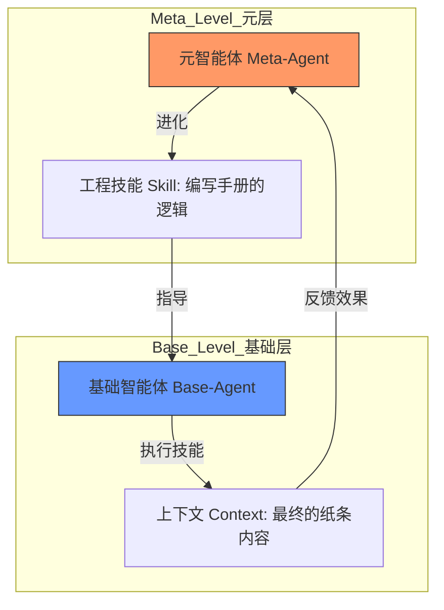
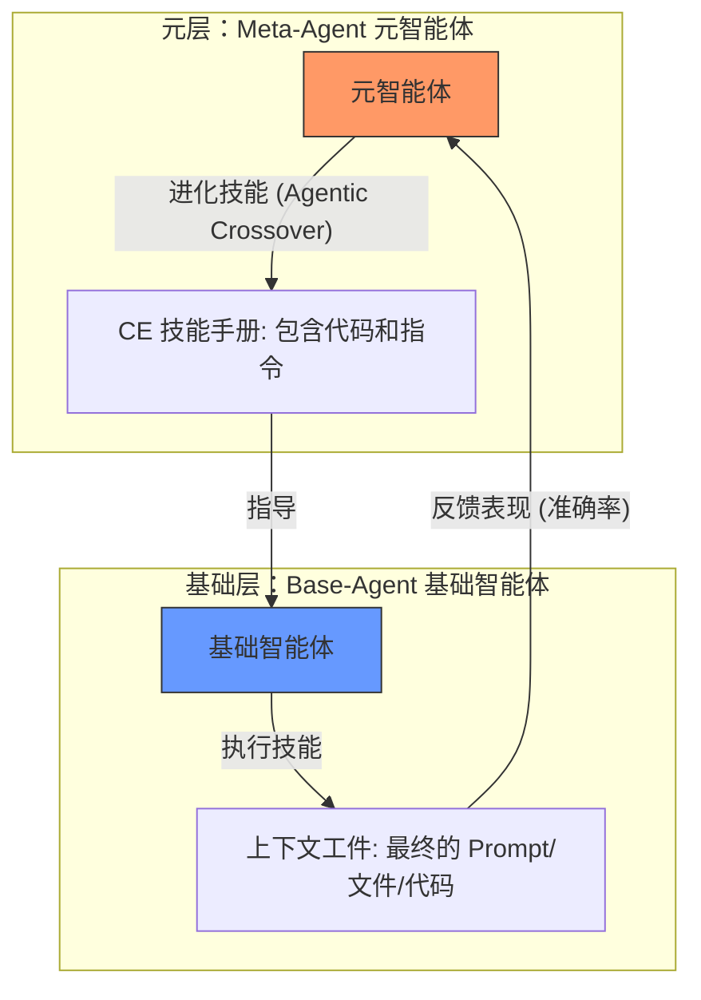
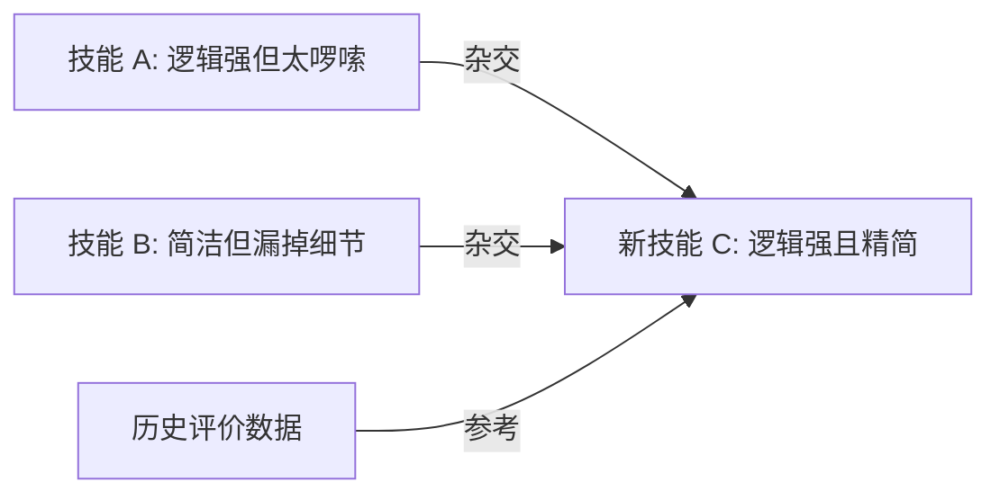

## AI论文解读 | Meta Context Engineering via Agentic Skill Evolution    
            
### 作者            
digoal            
            
### 日期            
2026-02-26            
            
### 标签            
PostgreSQL , PolarDB , DuckDB , AI , 论文解读            
            
----            
            
## 背景      
          
https://arxiv.org/pdf/2601.21557       
  
https://github.com/muratcankoylan/Agent-Skills-for-Context-Engineering       
      
提示:              
```              
读懂《Meta Context Engineering via Agentic Skill Evolution》这篇论文需要提前掌握哪些基础知识, 请使用中文通熟易懂的讲解这些基础知识, 可以引用论文中的图、表或使用Markdown支持的图形(text,mermaid等)增加解释性.     
      
使用中文通熟易懂的解读《Meta Context Engineering via Agentic Skill Evolution》这篇论文, 其中的关键内容请着重讲解, 可以引用论文中的图、表或使用Markdown支持的图形(text,mermaid等)增加解释性.     
      
提取《Meta Context Engineering via Agentic Skill Evolution》这篇论文中的重要术语, 使用中文对这些术语进行通熟易懂的讲解, 可以引用论文中的图、表或使用Markdown支持的图形(text,mermaid等)增加解释性.     
```         
      
## 1 前置知识     
      
阅读《Meta Context Engineering via Agentic Skill Evolution (MCE)》这篇论文，相当于是在探索如何让 AI 像人类“专家”一样，不仅能解决问题，还能 **自己总结出一套“解决问题的战术手册”** 。  
  
为了读懂它，你需要掌握以下四个维度的基础知识：  
  
### 1. 上下文工程 (Context Engineering, CE) —— “给 AI 递什么纸条？”  
  
这是论文的核心场景。AI（大模型）的表现高度依赖于你输入的内容（即 Context）。  
  
* **通俗理解**：如果你问 AI 一个专业的法律问题，它是直接盲猜（Zero-shot），还是你先给它一张印有“法律条文”和“判例”的“小纸条”再让它回答？  
* **CE 的目标**：研究如何通过优化这张“小纸条”（包含提示词、知识库、示例等），让 AI 表现得更好。  
* **论文背景**：传统的 CE 往往是人手工写死的模板。本文想让 AI **自动生成**这些“纸条”的内容和逻辑。  
  
  
  
### 2. 元学习 (Meta-Learning) —— “学会如何学习”  
  
这是论文标题中“Meta”的含义。  
  
* **通俗理解**：  
* **普通学习**：学习如何通过“错题本”提高考试分数（对应论文中的 **Base-level**，基础层）。  
* **元学习**：学习如何 **写出一本最高效的“错题本编写指南”** （对应论文中的 **Meta-level**，元层）。  
* **双层优化结构**：论文提出了一个“双层”框架，如下图所示：  
  

  
  
  
### 3. 智能体技能进化 (Agentic Skill Evolution) —— “AI 的战术升级”  
  
论文引入了“技能（Skill）”的概念，这不仅是文字说明，还包括 AI 可以运行的**代码和工具**。  
  
* **智能体杂交 (Agentic Crossover)**：这是论文借鉴进化论的一个概念。AI 会看过去几个版本的“战术手册”（Skills），保留有用的，修改失败的，像基因杂交一样产生一个更强的“新战术”。  
* **工具化**：这里的 AI 不只会写字，还会自己写 Python 代码、操作文件系统来整理数据。这需要你了解 **智能体（Agent）** 是如何调用工具（Tool Use）的。  
  
  
  
### 4. 进化策略 (Evolutionary Strategy, ES) —— “优胜劣汰”  
  
论文在算法编排上使用了一种简单的迭代机制。  
  
**迭代循环**：  
1. **进化**：元智能体生成新技能。  
2. **执行**：基础智能体根据技能去训练，生成一套 Context。  
3. **评估**：看看这套 Context 在验证集上准不准。  
4. **留强汰弱**：如果新版更好，就更新“历史最佳”，进入下一轮。  
  
  
  
  
  
### 总结：读这篇论文的“地图”  
  
| 知识点 | 对应论文内容 | 为什么重要 |  
| --- | --- | --- |  
| **LLM Inference** | Context, Prompting | 了解 AI 是如何根据输入产生输出的 |  
| **Programming Agent** | Python code, File system | 论文中的 AI 像程序员一样通过写代码来管理知识 |  
| **Evolutionary Algorithm** | Crossover, Selection | 理解 AI 是如何通过反复试验来“进化”战术的 |  
| **Generalization/Overfitting** | Validation vs Training | 了解为什么 AI 需要通过“元学习”来避免死记硬背 |  
  
**一句话总结这篇论文的工作：** 它不是直接教 AI 怎么做题，而是教 AI **如何通过分析错题，为自己编写一套最科学的复习笔记和查阅系统。**  
      
## 2 解读论文     
      
《Meta Context Engineering via Agentic Skill Evolution (MCE)》是北京大学科研团队发表的一篇关于如何提升大语言模型（LLM）能力的论文。  
  
简单来说，这篇论文研究的是： **如何让 AI 不仅仅是“做题”，而是学会“总结做题技巧”，并根据不同任务自动进化出最适合的“备考手册”和“检索工具”。**  
  
以下是对这篇论文核心内容的通俗解读：  
  
### 1. 核心背景：什么是“上下文工程” (CE)？  
  
当我们使用 AI 时，给它的提示词（Prompt）、示例（Few-shot）以及检索到的知识共同构成了 **上下文（Context）** 。  
  
* **传统做法：** 程序员手工编写一套固定的模板（如：“请参考以下案例...”、“如果遇到 A 就选 B”）。  
* **存在问题：** 人的经验有限，手工写的模板往往太死板，不能覆盖所有情况，且容易让 AI 产生“冗余疲劳”或“记忆偏差” 。  
  
  
  
### 2. MCE 的核心思想：双层进化框架  
  
MCE 提出了一个“双层”优化系统，让两个 AI 智能体配合工作 ：  
  

  
#### **第一层：元层 (Meta-level) —— “战术教练”**  
  
* **任务：** 负责总结“如何学习”。它不直接写提示词，而是写出一本 **《如何针对这个任务优化上下文的技能手册》** 。  
* **核心动作（Agentic Crossover）：** 它会回看过去几轮的失败教训和成功经验，像基因杂交一样，把好的“学习策略”保留，差的剔除，生成更强的“新技能” 。  
  
  
  
#### **第二层：基础层 (Base-level) —— “实战学生”**  
  
* **任务：** 拿着“教练”给的手册，去处理具体的训练数据 。  
* **不同之处：** 它不只是填空，它拥有**文件系统权限和代码执行能力**。它会自己写 Python 代码来提取错误模式、建立知识库，甚至编写一套自动化的检索算法 。  
  
  
  
   
  
### 3. 三大关键创新点  
  
#### **A. 从“固定模板”到“可进化技能 (Skills)”**  
  
以前的 AI 优化是改提示词，MCE 优化的是 **“技能”** 。  
  
* **技能是什么？** 它是一个文件夹，里面不仅有自然语言指令，还有 AI 写的 **Python 脚本**（比如：自动过滤重复信息的脚本） 。  
* 这让 AI 能够处理极其复杂的任务，比如法律判决（需要精密的逻辑树）或医学诊断 。  
  
  
  
#### **B. 智能体杂交 (Agentic Crossover)**  
  
这是元智能体进化的核心。AI 会像人类写论文综述一样，分析：  
  
1. “第一轮的策略 A 让准确率提升了，但导致了过拟合。”  
2. “第二轮的策略 B 比较简洁，但漏掉了关键细节。”  
3. **最终决策：** “我将结合 A 的逻辑框架和 B 的简洁表达，创造策略 C。”   
  
  
  
#### **C. 将上下文视为“代码和文件”**  
  
MCE 不把上下文看作一串死文字，而是一个**动态系统**。  
  
* 基础智能体可以创建一个包含 1000 行代码的检索函数，根据问题的不同，精准地从海量知识库中“路由”出最相关的那一小块内容 。  
  
  
  
    
  
### 4. 实验结果：AI 变强了多少？  
  
论文在金融、化学、医学、法律、AI 安全五个领域进行了测试 ：  
  
* **性能飞跃：** 相比于目前最先进的同类方法（如 ACE），MCE 的表现平均提升了 **16.9%** ，最高提升达 **53.8%** 。  
* **超越专家模型：** 在法律任务上，经过 MCE 增强的通用模型（DeepSeek）得分 0.70，超过了专门在法律数据上微调过的模型（0.56） 。  
* **极其高效：** 它的训练速度比之前的技术快 **13.6 倍**，且使用的 Token（字数）更少，效率更高 。  
  
  
  
### 5. 总结  
  
这篇论文的本质是**给 AI 一套进化工具箱**。它证明了：与其让人类费尽心思去教 AI 怎么做题，不如教 AI **如何根据不同学科的特点，自己写出一套最科学的复习笔记和查阅软件。**  
      
## 3 术语     
      
在论文《Meta Context Engineering via Agentic Skill Evolution (MCE)》中，作者提出了一套全新的 AI 优化框架。为了读懂它，你需要掌握以下几个关键术语。  
  
我会用通俗的语言为你解释这些术语，并结合论文中的逻辑进行拆解：  
  
   
  
### 1. 上下文工程 (Context Engineering, CE)  
  
* **术语定义**：指通过优化大模型在推理时接收到的“上下文”（包括提示词、示例、知识库等），来提升其表现的技术 。  
* **通俗讲解**：如果把 AI 比作一名“考生”，上下文就是他在进考场前手里拿的那张“小抄”或“参考资料”。上下文工程就是研究**如何给 AI 写出一张最精准、最有效的“小抄”** ，让他不用重新训练就能变聪明 。  
  
  
  
### 2. 元上下文工程 (Meta Context Engineering, MCE)  
  
* **术语定义**：这篇论文提出的核心框架。它不仅仅是优化“小抄”内容，而是通过一个“双层系统”同时进化 **“写小抄的技巧”** 和 **“小抄的内容”** 。  
  
  
**通俗讲解**：  
* **普通 CE**：你手动帮 AI 整理笔记。  
* **MCE（元 CE）** ：你雇了一个 **“高级教练”（元智能体）** 去教 **“学生”（基础智能体）** 如何总结笔记。教练会不断改进教学方法，学生会根据方法去翻书、写代码、总结规律。  
  
  
  
### 3. 元智能体 vs. 基础智能体 (Meta-level vs. Base-level Agent)  
  
论文中将任务分成了两个层级 ：  
  
| 术语 | 身份 | 职责 (做什么) |  
| --- | --- | --- |  
| **元智能体 (Meta-Agent)** | “战术教练” | 负责**进化技能**。它通过查看历史表现，思考什么样的“学习策略”更有效 。|  
| **基础智能体 (Base-Agent)** | “实战学生” | 负责**执行技能**。它按照教练给的策略，去处理具体的数据，最终生成 AI 使用的上下文 。|  
  
### 4. 工程技能 (Engineering Skills)  
  
* **术语定义**：一组可执行的指令、脚本（如 Python 代码）和资源，定义了如何表示和从数据中学习上下文 。  
* **通俗讲解**：这不仅仅是一句“请好好总结”，而是一套 **“操作手册”** 。手册里可能写着：“先运行这个脚本找出 AI 常犯的错，再用这段代码把错误分类，最后生成一张对比表” 。  
  
  
  
### 5. 智能体杂交 (Agentic Crossover)  
  
* **术语定义**：一种由 LLM 驱动的进化操作。元智能体通过分析多个旧技能的成败，挑选好的部分，融合生成一个更好的新技能 。  
  
  
**逻辑流程图**：  
  

  
### 6. 上下文工件 (Context Artifacts)  
  
* **术语定义**：指上下文最终的呈现形式。在 MCE 中，它们被存储为**文件和代码**，而不是一段死文字 。  
* **通俗讲解**：以前的 AI 上下文就是一段长长的文字；MCE 的上下文像是一个 **“动态数据库”** 。当 AI 遇到问题时，它会运行上下文里的代码，从文件库里精准地检索出最相关的知识 。  
  
  
  
### 总结：这些术语是如何串联的？  
  
通过下面的流程图，你可以一眼看出这些术语的关系 ：  
  
1. **元智能体**利用**智能体杂交**技术，从历史库中进化出新的**工程技能** 。  
2. **基础智能体**拿到这个技能，去处理训练数据（Training Rollouts） 。  
3. 处理的结果形成了一套**上下文工件**（包含文件和代码） 。  
4. 最后，这套工件在验证集上跑分。高分代表这个“技能”有用，会被存入数据库，等待下一轮进化 。  
  
这种“套娃式”的学习方法，让 MCE 能够自动发现人类专家都想不到的复杂优化策略 。  
    
## 参考            
             
https://arxiv.org/pdf/2601.21557        
            
<b> 以上内容基于DeepSeek、Qwen、Gemini及诸多AI生成, 轻微人工调整, 感谢杭州深度求索人工智能、阿里云、Google等公司. </b>            
            
<b> AI 生成的内容请自行辨别正确性, 当然也多了些许踩坑的乐趣, 毕竟冒险是每个男人的天性.  </b>            
     
  
#### [PolarDB 学习图谱](https://www.aliyun.com/database/openpolardb/activity "8642f60e04ed0c814bf9cb9677976bd4")
  
  
#### [PostgreSQL 解决方案集合](../201706/20170601_02.md "40cff096e9ed7122c512b35d8561d9c8")
  
  
#### [德哥 / digoal's Github - 公益是一辈子的事.](https://github.com/digoal/blog/blob/master/README.md "22709685feb7cab07d30f30387f0a9ae")
  
  
#### [About 德哥](https://github.com/digoal/blog/blob/master/me/readme.md "a37735981e7704886ffd590565582dd0")
  
  

  
