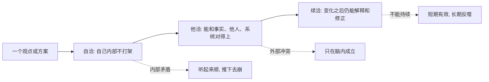

## 元认知思维筑基课: 逻辑三洽
  
### 作者  
digoal  
  
### 日期  
2026-04-23 
  
### 标签  
逻辑三洽 , 自洽 , 他洽 , 续洽
  
----  
  
## 背景 

> 面向对象: 初高中学生  
> 核心问题: 为什么一个说法不能只看“听起来有道理”，还要看它能不能和自己、别人、未来一起站得住。  
> 先说结论: 逻辑三洽是一种检查观点质量的方法: 先看内部是否自洽，再看它能否和外部事实、他人经验他洽，最后看它能否经得起时间、变化和后果的续洽。  

## 一张图先看懂



## 求真讲法

### 它到底说了什么

“逻辑三洽”不是一个数学定理，而是一套判断观点、计划、解释是否可靠的思维原则。它可以拆成三问:

1. 自洽: 这个说法内部有没有矛盾？
2. 他洽: 这个说法能不能和外部事实、他人的观察、已有规则对上？
3. 续洽: 这个说法放到未来、变化、后果里，还能不能继续成立或自我修正？

一个观点如果只做到自洽，可能只是“编得圆”。如果还能他洽，就开始接近现实。如果还能续洽，才更像一个可用、可长期迭代的判断框架。

### 它是怎么来的

这个原则来自普通推理中的三个压力:

- 语言压力: 你说的话前后要一致。
- 现实压力: 你的话要能解释真实世界，而不只是解释自己脑中的模型。
- 时间压力: 世界会变化，行动会带来后果，今天成立的判断要能接受明天的检验。

可以把它理解成“观点体检”:

```text
观点体检表

第一层: 自洽
  我的定义是否一致？
  我的前提和结论是否冲突？

第二层: 他洽
  事实是否支持？
  别人的经验是否能解释？
  有没有反例？

第三层: 续洽
  条件变化后怎么办？
  长期后果是否反过来破坏前提？
  新证据出现时能否修正？
```

### 它依赖哪些假设

逻辑三洽要成立，至少依赖这些假设:

| 假设 | 含义 | 如果不成立会怎样 |
| --- | --- | --- |
| 语言可以被澄清 | 关键概念能被定义清楚 | 讨论会变成各说各话 |
| 现实可以被部分观察 | 我们能通过事实、数据、经验校验说法 | 观点会停留在主观感受 |
| 人会行动并承担后果 | 判断不是只用来辩论，还会影响选择 | 续洽就无从检验 |
| 世界有一定连续性 | 今天的规律对明天仍有参考价值 | 任何长期推理都很脆弱 |

这里有一个重要边界: “三洽”不是保证结论一定正确，而是降低胡说、误判和短视的概率。

### 常见误解

第一种误解: “自洽就是真理。”

不对。小说世界也可以自洽，游戏规则也可以自洽，但它们不一定描述现实。一个观点自洽，只说明它内部不互相打架，不说明它已经符合事实。

第二种误解: “他洽就是讨好别人。”

不对。他洽不是让所有人满意，而是能和外部证据、他人可检验的经验、系统规则对齐。别人不同意你，不一定代表你错；但如果你完全解释不了别人的真实观察，就要警惕。

第三种误解: “续洽就是永远不变。”

不对。续洽不是死守原观点，而是在新条件下仍能解释、调整和承担后果。能修正，比假装永远正确更续洽。

## 求存讲法

### 它有什么用

逻辑三洽最直接的用处，是帮你区分三类说法:

| 类型 | 表面样子 | 三洽检查后的问题 |
| --- | --- | --- |
| 口号型 | 很有气势 | 常常缺少自洽定义 |
| 脑补型 | 听起来顺 | 常常缺少他洽证据 |
| 短视型 | 眼前有效 | 常常缺少续洽后果 |

比如“只要努力就一定成功”这句话，表面积极，但三洽检查会问:

- 自洽: “努力”和“成功”怎么定义？
- 他洽: 有没有努力但失败的人？有没有不够努力却因为资源、运气成功的人？
- 续洽: 如果一个人长期努力但反馈错误，会不会越努力越偏？

经过检查后，更可靠的说法可能是: “在目标、方法、反馈和资源大致匹配时，持续努力会显著提高成功概率。”这个说法没那么响亮，但更准确。

### 它怎么迁移到熟悉领域

学习中:

- 自洽: 我说“数学差”，到底是计算差、概念差，还是题型迁移差？
- 他洽: 错题、考试、老师反馈是否支持这个判断？
- 续洽: 我用的新方法坚持两周后，错误类型是否减少？

合作中:

- 自洽: 分工规则是否前后一致？
- 他洽: 每个人的时间、能力、信息是否匹配？
- 续洽: 项目变化时，规则能否调整？

技术和商业中:

- 自洽: 产品定位、用户、价格是否互相冲突？
- 他洽: 真实用户是否愿意使用或付费？
- 续洽: 规模变大后，成本、服务、信任是否还能维持？

### 它的适用范围和边界

逻辑三洽适合检查观点、解释、计划、规则、策略。它不适合替代全部专业知识。

例如，判断一个医学治疗方案，三洽可以帮你问“有没有证据、有没有长期副作用、前提是什么”，但不能代替医生和临床研究。判断一个工程方案，三洽可以帮你发现矛盾和风险，但不能代替实验、测试和专业计算。

它还有一个边界: 信息不足时，只能得到“暂时更可靠”的判断，不能得到绝对正确。

### 正例: 怎么用它提升能力

假设你想提高英语成绩，原来的想法是:“我背更多单词就能提分。”

用三洽检查:

| 检查 | 问题 | 调整 |
| --- | --- | --- |
| 自洽 | 提分只靠单词吗？阅读、语法、听力是否也影响？ | 把目标拆成词汇、阅读速度、长难句、听力识别 |
| 他洽 | 试卷错题是否主要错在单词？ | 用错题统计找真正短板 |
| 续洽 | 背完会不会忘？是否能在阅读中使用？ | 加入复习间隔和真题应用 |

调整后的方案是: 先统计最近三套卷子的错误原因，再把每天学习分成“单词复习、错句分析、真题阅读、听力跟读”。两周后复查错误类型是否改变。

这个方案更强，不是因为它更复杂，而是因为它自洽、他洽、续洽。

### 反例: 前提不成立会怎样

一个班级小组决定:“谁声音大，谁就当组长，因为声音大说明有领导力。”

三洽检查:

- 自洽问题: “声音大”和“领导力”不是同一个概念。
- 他洽问题: 真实合作中，组长还需要分工、倾听、跟进、解决冲突。
- 续洽问题: 如果声音大的人不听反馈，短期能推进，长期会让其他人沉默，信息变少，项目质量下降。

这里失败的关键，不是“这个人不够好”，而是前提错了: 把外在表现误当成核心能力。前提一错，后面的选择就会持续制造问题。

## 思考

逻辑三洽最值得练习的地方，不是拿它去挑别人的毛病，而是先检查自己的判断。

你可以经常问自己三个问题:

1. 我现在这个判断，有没有哪个词没有定义清楚？
2. 有没有一个真实反例，是我现在解释不了的？
3. 如果这个判断被我执行三个月，会产生什么副作用？

再进一步想: 很多争论为什么吵不完？往往不是因为双方都不会逻辑，而是因为他们停在不同层次。一个人在谈自洽，另一个人在谈他洽；一个人在谈眼前效果，另一个人在谈长期续洽。层次不对齐，争论就会互相错过。

## 最后记住

- 自洽解决“内部打不打架”的问题。
- 他洽解决“能不能对上现实和他人经验”的问题。
- 续洽解决“时间、变化、后果来了还能不能站住”的问题。
- 三洽不是保证绝对正确，而是让观点更经得起检验。
- 真正成熟的判断，不怕被检查，怕的是只在一个层次里显得有道理。

## 参考资料

- 本文把“逻辑三洽”作为一种通用思维原则来解释，未把它当作标准数学定理或形式逻辑术语。
- 参考的通用知识框架包括: 批判性思维中的一致性检查、证据检验、反例检验、可修正性思想，以及科学方法中“假设、观察、检验、修正”的基本结构。
- 未联网检索专门出处；若“逻辑三洽”来自某位作者或某套课程的专门定义，应以原始定义为准，并可在本文基础上替换术语边界。

  
#### [PostgreSQL 解决方案集合](../201706/20170601_02.md "40cff096e9ed7122c512b35d8561d9c8")
  
  
#### [德哥 / digoal's Github - 公益是一辈子的事.](https://github.com/digoal/blog/blob/master/README.md "22709685feb7cab07d30f30387f0a9ae")
  
  
#### [About 德哥](https://github.com/digoal/blog/blob/master/me/readme.md "a37735981e7704886ffd590565582dd0")
  
  

  
