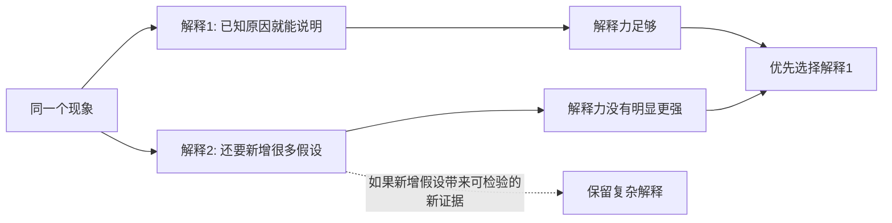
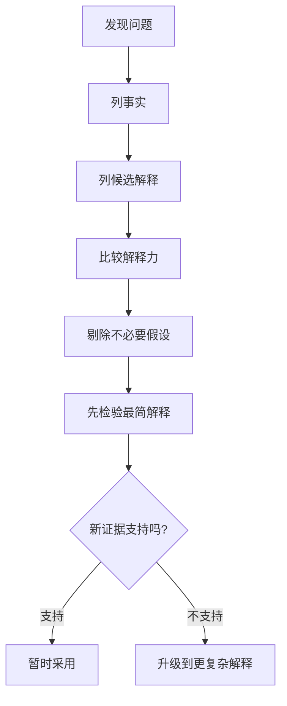

## 元认知思维筑基课: 奥卡姆剃刀
  
### 作者  
digoal  
  
### 日期  
2026-04-23 
  
### 标签  
奥卡姆剃刀 , 如无必要勿增实体
  
----  
  
## 背景 

> 面向对象: 初中生到高中生  
> 核心问题: 为什么遇到多个解释时，我们常常先选那个“不多加东西”的解释？  
> 先说结论: 奥卡姆剃刀不是说“越简单越真”，而是说: 在解释力差不多时，优先选择引入更少额外假设的解释。它是一把帮你减少胡思乱想、提高判断效率的“思维剪刀”，不是证明真理的机器。

## 一张图先看懂



## 求真讲法

### 它到底说了什么

奥卡姆剃刀通常被概括为: “如无必要，勿增实体。”更适合学生理解的说法是:

> 当两个解释都能解释同一件事，而且没有一个解释明显更有证据时，先选那个少加假设、少引入新东西的解释。

这里的“实体”不只是桌子、椅子这种东西，也可以是隐藏力量、神秘动机、额外规则、复杂阴谋、看不见的中间环节。所谓“剃刀”，就是把解释里没有必要的部分削掉。

### 它是怎么来的

奥卡姆剃刀常与中世纪哲学家威廉·奥卡姆相关。权威资料通常把它表述为一种“节约原则”或“简约原则”: 在构造或评价理论时，如果其他条件相同，少引入实体或实体种类的解释更值得优先考虑。

但要注意两点:

1. 这个思想并不是奥卡姆第一个想到的，早期哲学和神学传统中也有类似说法。
2. 奥卡姆剃刀不是数学定理，不能在所有情况下证明“简单解释一定正确”。它更像一种理性选择策略: 证据不足时，不要随便给世界加戏。

它背后的动机很朴素: 如果一个现象用已有原因就能说明，那再加入一堆无法检验的新原因，只会让判断更乱。

### 它依赖哪些假设

奥卡姆剃刀要成立，至少依赖这些前提:

| 前提 | 含义 | 如果不成立会怎样 |
|---|---|---|
| 解释力相近 | 两个解释都能说明已知现象 | 如果复杂解释能解释更多事实，就不能简单剃掉 |
| 证据相近 | 没有强证据支持更复杂解释 | 如果复杂解释有证据，复杂可能就是必要的 |
| 假设可比较 | 能大致判断谁引入了更多新东西 | 如果“简单”无法定义，就容易变成口号 |
| 目标是判断而非安慰 | 追求更可靠的解释 | 如果只是想听喜欢的答案，剃刀会被滥用 |

可以用一个简化公式理解:

```text
好解释 ≈ 足够解释事实 + 尽量少加假设 + 能接受新证据检验
```

### 常见误解

**误解一: 最简单的解释一定是真的。**  
不对。最简单只是在证据差不多时更值得先考虑。自然界有时真的很复杂，比如天气、疾病、生态系统、金融市场。

**误解二: 复杂解释一定是假的。**  
不对。如果复杂解释能预测新现象、解释更多证据、经得起检验，它就可能是更好的解释。

**误解三: 奥卡姆剃刀就是偷懒。**  
不对。偷懒是不查证据就下结论；奥卡姆剃刀是先比较解释力和假设数量，再决定哪个解释更值得优先检验。

**误解四: 它能代替实验。**  
不对。它只能帮助排序，不能代替观察、实验、统计和复盘。

## 求存讲法

### 它有什么用

奥卡姆剃刀的原生用途，是帮助人们在哲学、科学和理论解释中减少不必要的假设。它让我们避免这样的思路:

```text
现象: 手机没电了
简单解释: 昨晚忘了充电
复杂解释: 充电器被调包 + 电池被远程攻击 + 家里电路异常 + 软件故意耗电
```

如果没有额外证据，先检查“昨晚是否忘了充电”更合理。

### 它怎么迁移到熟悉领域

在学习、生活和工作里，它可以变成一套判断步骤:

1. 先列出事实: 我看到了什么？
2. 再列出解释: 有哪些可能原因？
3. 比较解释力: 哪个解释能说明最多事实？
4. 比较假设数: 哪个解释需要额外相信的东西更少？
5. 保留检验入口: 什么证据能推翻我现在的判断？



### 它的适用范围和边界

适用时:

- 你面对多个解释，但证据还不充分。
- 复杂解释没有带来更强预测力。
- 你需要先决定从哪里开始检查。
- 你愿意被新证据纠正。

不适用或要谨慎时:

- 问题本身包含多个互相作用的原因。
- 复杂解释有强证据支持。
- “简单”只是听起来舒服，不是真的少假设。
- 你把它当成压制不同观点的口号。

### 正例: 怎么用它提升能力

**例子: 考试突然退步。**

候选解释:

1. 这次题目偏难。
2. 最近睡眠少，复习效率下降。
3. 老师故意针对我。
4. 我天生不适合学这门课。

用奥卡姆剃刀，不是立刻说第 1 或第 2 一定正确，而是先问:

- 哪些解释需要额外假设？
- 哪些解释更容易被验证？
- 哪些解释能指导下一步行动？

“睡眠少、复习效率下降”比“老师故意针对我”少引入隐藏动机，也更容易检验: 看作息、错题、复习记录、班级整体成绩。它不一定是真相，但值得优先检查。

### 反例: 前提不成立会怎样

**反例: 病人发烧、咳嗽、胸痛。**

简单解释可能是普通感冒。但如果检查发现血氧下降、影像异常、炎症指标明显升高，那么“普通感冒”解释力不足。此时更复杂的解释，比如肺炎或其他严重感染，虽然引入更多医学判断，但它有证据支撑。

这里失败的前提是: “解释力相近”。当复杂解释能解释更多关键事实时，继续坚持最简单解释，反而是不理性。

## 思考

奥卡姆剃刀真正训练的不是“喜欢简单”，而是“知道什么时候不要多想，什么时候必须多查”。

可以思考三个问题:

1. 如果一个解释很简单，但不能预测下一步会发生什么，它还是好解释吗？
2. 如果一个复杂解释很吓人，但没有证据，你为什么会愿意相信它？
3. 学习中哪些“我不行”“老师针对我”“这科没用”的解释，其实加入了太多未经验证的假设？

更深一层看，奥卡姆剃刀和科学方法很像: 先用最少假设建立模型，再用证据逼迫模型变复杂。真正好的复杂，不是想象出来的复杂，而是被事实要求出来的复杂。

## 最后记住

1. 奥卡姆剃刀不是“简单必真”，而是“证据相当时，少加假设”。
2. 它适合给解释排序，不能代替实验和证据。
3. 使用前要先比较解释力，不能只比较简洁程度。
4. 复杂解释如果有更强证据，就不能被剃掉。
5. 最实用的问法是: “这个解释多加了哪些我还没有证据相信的东西？”

## 参考资料

- Encyclopaedia Britannica, [Occam's razor](https://www.britannica.com/topic/Occams-razor): 对奥卡姆剃刀的常见表述、历史归属和争议进行了概括。
- Stanford Encyclopedia of Philosophy, [Simplicity](https://plato.stanford.edu/archives/fall2019/entries/simplicity/): 讨论理论简洁性、奥卡姆剃刀以及“句法简洁”和“本体简约”的区别。
- Encyclopaedia Britannica, [William of Ockham](https://www.britannica.com/biography/William-of-Ockham): 提供威廉·奥卡姆的基本生平与思想背景。

  
#### [PostgreSQL 解决方案集合](../201706/20170601_02.md "40cff096e9ed7122c512b35d8561d9c8")
  
  
#### [德哥 / digoal's Github - 公益是一辈子的事.](https://github.com/digoal/blog/blob/master/README.md "22709685feb7cab07d30f30387f0a9ae")
  
  
#### [About 德哥](https://github.com/digoal/blog/blob/master/me/readme.md "a37735981e7704886ffd590565582dd0")
  
  

  
