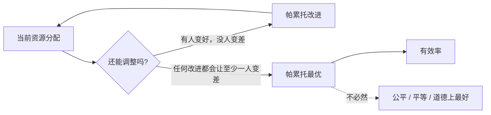
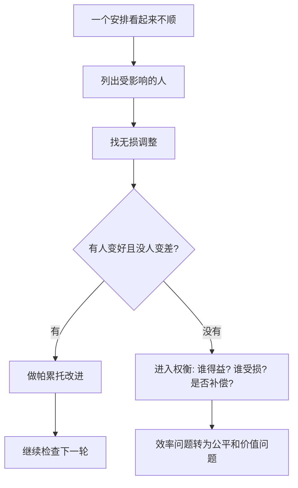

## 元认知思维筑基课: 帕累托最优
  
### 作者  
digoal  
  
### 日期  
2026-04-23 
  
### 标签  
帕累托最优 , 至少一个人变好并且不让任何人变差
  
----  
  
## 背景 
> 面向对象: 初中生到高中生  
> 核心问题: 为什么有些安排明明“不公平”，却还会被说成“有效率”？  
> 先说结论: 帕累托最优不是“最好”“最公平”，而是指一种状态: 已经找不到一种改变，能让至少一个人变好，同时不让任何人变差。

## 一张图先看懂



## 求真讲法

### 它到底说了什么

帕累托最优，也叫帕累托效率，是经济学和社会科学里评价“资源分配是否还有无损改进空间”的概念。

先理解两个词:

- **帕累托改进**: 一次改变让至少一个人变好，并且没有任何人变差。
- **帕累托最优**: 已经不存在帕累托改进了。换句话说，你想让一个人更好，就必然要让至少另一个人更差。

举个简单例子: 有一个苹果和一个橙子，小明喜欢苹果，小红喜欢橙子。最开始小明拿橙子，小红拿苹果。交换以后，小明更满意，小红也更满意，这就是帕累托改进。交换完成后，如果再想让小明多拿东西，就必须从小红那里拿走某些东西，那么这个状态可能就是帕累托最优。

### 它是怎么来的

这个概念以意大利经济学家、社会学家维尔弗雷多·帕累托命名。它解决的是一个很具体的问题: 在不直接比较“谁的快乐更重要”的情况下，如何判断一种分配是否还有明显改进空间？

它的思路很克制:

> 如果一种改变能让至少一个人更好，又不损害任何人，那这个改变几乎没有反对理由。  
> 如果这样的改变都找不到了，就说这个状态达到了帕累托最优。

这不是道德上的终极判断，而是一条效率标准。它故意避开了很多更难的问题，比如“穷人多一点重要，还是富人多一点重要”“公平到底该怎么定义”。

### 它依赖哪些假设

帕累托最优要有意义，至少依赖这些前提:

| 前提 | 含义 | 如果不成立会怎样 |
|---|---|---|
| 能判断每个人是否变好或变差 | 每个人有可识别的偏好或利益 | 如果偏好混乱，无法判断是否改进 |
| 只关心“有没有人受损” | 不直接比较不同人的幸福大小 | 可能忽略公平和弱势者处境 |
| 可行方案范围明确 | 知道哪些改变现实可做 | 如果可行方案没列全，会误判为最优 |
| 外部影响被纳入 | 受影响的人都算进来 | 如果漏掉旁观者，可能把伤害藏起来 |

可以把它写成一个判断式:

```text
如果存在方案 B:
  至少一个人比方案 A 更好
  且没有任何人比方案 A 更差
那么 A 不是帕累托最优。

如果找不到这样的 B:
  A 是帕累托最优。
```

### 常见误解

**误解一: 帕累托最优就是最公平。**  
不对。一个人拿走 99 个苹果，另一个人拿 1 个苹果，如果再调整就必须让某个人少拿，它也可能是帕累托最优。但这显然不代表公平。

**误解二: 帕累托最优只有一个。**  
不对。很多不同分配都可能是帕累托最优。它通常是一组状态，而不是唯一答案。

**误解三: 只要不是帕累托最优，就一定很差。**  
不一定。它只说明还有“有人变好、没人变差”的改进空间，不直接说明整体有多糟。

**误解四: 帕累托最优能替代价值判断。**  
不能。它只处理效率，不回答公平、权利、责任、尊严等问题。

## 求存讲法

### 它有什么用

帕累托最优最有用的地方，是帮你识别“白白浪费的改进机会”。

如果一个班级安排值日:

- 小李喜欢擦黑板，但被安排扫地。
- 小王喜欢扫地，但被安排擦黑板。

两人交换后都更愿意做，其他同学不受影响。这就是帕累托改进。原安排不是帕累托最优，因为它还有无损优化空间。

### 它怎么迁移到熟悉领域

在学习、合作、家庭分工、产品设计、团队管理里，可以这样用:

1. 找出参与者: 谁会被这个决定影响？
2. 写下资源或任务: 时间、钱、座位、职责、机会。
3. 问一个关键问题: 有没有一种调整，让至少一方更好，同时没人更差？
4. 如果有，先做这种调整。
5. 如果没有，再进入真正的取舍、补偿和公平讨论。



### 它的适用范围和边界

适用时:

- 资源分配、任务分工、交易、合作中存在明显低效。
- 你想先找“大家都不吃亏”的改进。
- 参与者的偏好比较清楚。
- 受影响的人都能被纳入判断。

要谨慎时:

- 有人没有表达偏好的能力，比如孩子、病人、未来世代。
- 损失被转嫁给看不见的人，比如污染让附近居民承担。
- 表面没人变差，其实有人被迫接受。
- 问题核心不是效率，而是公平、权利或底线。

### 正例: 怎么用它提升能力

**例子: 小组作业分工。**

四个人做展示:

- A 擅长画图，却被安排写长文。
- B 擅长写作，却被安排做配图。
- C 擅长演讲。
- D 擅长查资料。

如果 A 和 B 交换任务，A 更舒服，B 也更高效，C 和 D 不受损。这就是帕累托改进。它能提升小组效率，也减少抱怨。

这个例子成立，是因为几个假设都满足:

- 大家偏好和能力比较清楚。
- 任务可以交换。
- 交换没有让第三方承担额外成本。
- 改进以后仍能完成共同目标。

### 反例: 前提不成立会怎样

**反例: 公司把加班任务“优化”给最能干的人。**

表面上看，项目进度更快，客户更满意，其他同事也不用加班，好像很多人变好了。但如果最能干的员工因此长期疲惫、健康受损、晋升却没有补偿，那就不是“没人变差”。它不是帕累托改进，而是把损失压给了一个人。

这里失败的前提是: “受影响的人都被纳入判断”和“能真实判断谁变差”。如果只看团队短期产出，不看承担成本的人，就会把伤害伪装成效率。

## 思考

帕累托最优最值得警惕的地方，是“最优”这个词容易误导人。它听起来像最高级，但其实只是说: 没有无损改进空间。

你可以问自己:

1. 一个极不平等的分配，如果不能无损改变，它算不算“好”？
2. 如果某个方案让大多数人获益、少数人受损，我们能不能只用帕累托最优判断它？
3. 当一个人没有发言权时，我们怎么知道他没有变差？
4. 如果所有帕累托改进都做完了，接下来社会还需要讨论什么？

这会引出一个更深的问题: 效率只能告诉我们“有没有浪费的改进机会”，不能替我们决定“应该把好处给谁、损失由谁承担、是否需要补偿”。

## 最后记住

1. 帕累托改进是“至少一人变好，没人变差”。
2. 帕累托最优是“已经找不到帕累托改进”。
3. 帕累托最优等于效率状态，不等于公平状态。
4. 它可能有很多个，不是唯一最好答案。
5. 真正使用时，要检查有没有被遗漏的受损者。

## 参考资料

- Encyclopaedia Britannica, [Pareto-optimality](https://www.britannica.com/money/Pareto-optimality): 解释帕累托最优、帕累托低效以及福利经济学中的相关应用。
- CORE Econ, [The Economy](https://www.core-econ.org/the-economy/): 现代经济学入门教材，对资源分配、效率和福利经济学有系统讲解。
- Oxford Reference / A Dictionary of Economics: “Pareto efficiency” 条目常用于经济学术语定义，强调“不能在不损害他人的情况下改善某人处境”的标准。

  
#### [PostgreSQL 解决方案集合](../201706/20170601_02.md "40cff096e9ed7122c512b35d8561d9c8")
  
  
#### [德哥 / digoal's Github - 公益是一辈子的事.](https://github.com/digoal/blog/blob/master/README.md "22709685feb7cab07d30f30387f0a9ae")
  
  
#### [About 德哥](https://github.com/digoal/blog/blob/master/me/readme.md "a37735981e7704886ffd590565582dd0")
  
  

  
