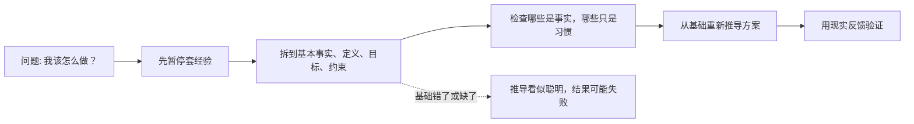
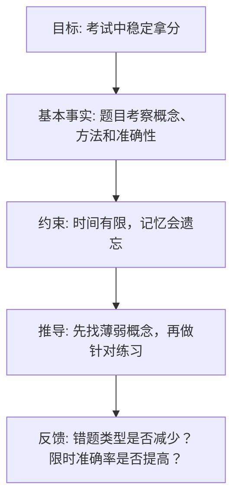

## 思维筑基课: 第一性原理: 从最底层重新想清楚
  
### 作者  
digoal  
  
### 日期  
2026-04-23 
  
### 标签  
第一性原理 , 基石假设 , 问题拆解 , 基本事实 , 从最底层重新想清楚  
  
----  
  
## 背景 

> 面向对象: 初中到高中学生  
> 核心问题: 为什么有些问题不能只靠模仿、经验和套公式解决？  
> 先说结论: 第一性原理不是一句口号，而是一种思考方法：把问题拆到不能再靠别人结论支撑的基本事实、定义、约束和目标，再从这些基础重新推导出做法。它能帮你跳出惯性，但前提是你拆出来的“基础”真的可靠。  

## 一张图先看懂



## 求真讲法

### 它到底说了什么

“第一性原理”这个词来自哲学和科学传统中的一个核心想法：一个系统里，总要有一些最基础的出发点。它们可能是定义、公理、观察事实、物理约束、数学规则，或者某个目标函数。后面的判断和方案，都应该能从这些基础推出，而不是只因为“大家一直这么做”。

用学生能懂的话说：

> 不要先问“别人怎么做”，先问“这件事最不能被忽略的事实是什么？我真正要达成什么？有哪些不能违反的约束？”

它不是让你怀疑一切，也不是让你无视经验。经验常常很有价值，但经验是上一轮问题的结果，不一定适合这一轮问题。

### 它是怎么来的

人类在学习世界时，会遇到两类问题：

1. 可以照着已有办法做的问题，比如背单词、做常规题、按说明书安装软件。
2. 旧办法不够用的问题，比如设计一种更便宜的方案、理解一个新现象、解决别人没遇到过的冲突。

第一类问题，经验很快。第二类问题，只照经验可能会卡住，因为经验里混着很多历史偶然和默认条件。

第一性原理的动机就是：当旧做法变得可疑时，回到更稳的基础。

一个简单例子：

```
普通模仿: 这个产品一直卖 100 元，所以新产品也卖 100 元。

第一性思考:
目标: 覆盖成本并让用户愿意买
事实: 材料 35 元，人工 15 元，物流 8 元，售后预留 7 元
约束: 用户对同类产品心理价位约 80-120 元
推导: 成本底线约 65 元，价格区间应结合定位和需求测试，而不是自动等于 100 元。
```

这里的关键不是价格最后是多少，而是推理从“基础事实”开始，而不是从“惯例”开始。

### 它依赖哪些假设

第一性原理要成立，至少依赖这些假设：

| 假设 | 含义 | 如果不成立会怎样 |
|---|---|---|
| 基础事实可靠 | 你拿来推导的事实、数据、定义是真实或足够接近真实的 | 从错误前提出发，逻辑越严密，错得越稳定 |
| 目标清楚 | 你知道自己到底优化什么，比如速度、成本、理解深度或长期能力 | 方案会在多个目标之间摇摆，难以判断好坏 |
| 约束完整 | 你知道不能违反什么，比如时间、预算、规则、物理限制、人的接受度 | 推导出的方案可能纸面可行，现实不可行 |
| 推理链可检查 | 每一步都能解释为什么从 A 到 B | 结果像灵感，不像可复用的方法 |
| 愿意接受反馈 | 现实结果可以反过来修正前提 | 容易把自己的推导当成绝对正确 |

### 常见误解

**误解一：第一性原理等于从零开始。**

不对。它不是要求你丢掉所有知识，而是要分清楚：哪些是基础事实，哪些是别人基于旧条件做出的结论。

**误解二：第一性原理一定比经验法更好。**

不对。做熟练的常规题时，套用经验可能更快。第一性原理更适合高不确定性、旧办法失效、需要创新或需要判断本质的问题。

**误解三：只要逻辑严密，结论就可靠。**

不对。逻辑只保证“如果前提对，结论才可能对”。前提错了，推理再漂亮也会失败。

**误解四：第一性原理就是反常识。**

不对。它有时会得出和常识相反的结论，但目标不是反常识，而是检查常识背后的条件还在不在。

## 求存讲法

### 它有什么用

第一性原理最原生的作用，是帮助人们建立可靠的知识和方案：

- 在数学里，很多结论要能追溯到定义、公理和已证明命题。
- 在科学里，解释要能回到观察、实验、模型和可检验预测。
- 在工程里，设计要能回到材料、能量、成本、时间、可靠性和用户需求。
- 在生活决策里，选择要能回到目标、资源、约束和代价。

它让你从“别人说怎样”转向“为什么必须这样，或者其实不必这样”。

### 它怎么迁移到熟悉领域

以学习为例。很多人会问：“学霸每天刷多少题？”这就是从结果模仿结果。第一性原理会换一种问法：



这个推导不排斥刷题，但刷题不再是目的，而是服务于“发现漏洞、修正概念、提高准确率”的工具。

### 它的适用范围和边界

适合使用第一性原理的场景：

- 问题很新，没有可靠模板。
- 旧办法成本太高、效率太低或解释不了现象。
- 你需要判断别人建议是否适合自己。
- 你要设计方案，而不是只执行流程。

不适合过度使用的场景：

- 时间极少，且已有方法足够可靠。
- 基础知识不足，无法判断哪些前提是真的。
- 问题主要依赖人情、制度、情绪和协调，不是单靠逻辑推导能解决。
- 你只是想证明自己和别人不一样。

### 正例: 怎么用它提升能力

假设你数学总是“会听课，但考试不会做”。

普通做法可能是：再买一本题集，多刷 100 题。

第一性原理的拆法：

| 层级 | 追问 | 可能发现 |
|---|---|---|
| 目标 | 考试到底要求什么？ | 限时读题、识别题型、调用概念、计算准确 |
| 事实 | 我错在哪里？ | 不是不会全部知识，而是函数图像和参数变化不熟 |
| 约束 | 我有什么限制？ | 每天只有 40 分钟，不能盲目刷整本书 |
| 推导 | 应该怎么练？ | 先整理 5 类参数变化，再做少量典型题，最后限时混合练 |
| 验证 | 怎么知道有效？ | 一周后同类题错误率下降，解题步骤更稳定 |

这就是用第一性原理提升能力：你不是“更努力”而已，而是让努力指向真正的瓶颈。

### 反例: 前提不成立会怎样

假设一个同学想用第一性原理安排睡眠。他推导说：

> 目标是学习时间最大化；一天 24 小时；少睡 2 小时就多 2 小时学习；所以应该长期少睡。

这个推理的问题不在“他不努力”，而在基础前提不完整。他漏掉了一个关键事实：睡眠会影响注意力、记忆巩固、情绪和长期健康。

前提补全后，推导会改变：

```
原错误前提: 学习成果 = 学习时长
补全前提: 学习成果 = 有效注意力 × 方法质量 × 复习反馈 × 身体状态
新结论: 长期压缩睡眠可能让有效注意力下降，表面时间增加，实际产出降低。
```

这个反例说明：第一性原理不是“自己想一套逻辑”。它要求你诚实地收集基础事实，尤其是那些会让你原计划变难看的事实。

## 思考

第一性原理最难的地方，不是“从基础推导”，而是承认自己一开始以为的基础，可能只是习惯、情绪或别人的结论。

你可以用三个问题训练它：

1. 如果我不能引用“大家都这样”，我还能怎样证明这个做法合理？
2. 这个结论依赖哪些条件？这些条件现在还成立吗？
3. 如果目标换了，或者约束换了，原来的方案还对吗？

它也可以和其他思维工具配合：

- 和奥卡姆剃刀配合：在多个解释里，优先选择假设更少且能解释事实的解释。
- 和反事实思考配合：如果某个前提被拿掉，结论是否还成立？
- 和系统思维配合：基础事实不只是一两个数字，还包括反馈、延迟和人的行为。

真正有用的第一性原理，不是让你显得深刻，而是让你在复杂问题里找到能被检查、能被修正、能带来行动的起点。

## 最后记住

1. 第一性原理是一种从基础事实、定义、目标和约束重新推导的思考方法。
2. 它不是从零开始，也不是否定经验，而是检查经验背后的条件是否仍然成立。
3. 它最适合旧办法失效、问题很新、需要创新或需要判断本质的场景。
4. 它依赖可靠前提；前提错了，逻辑越严密，结论越危险。
5. 用它解决问题时，要把“推导”交给现实反馈检验。

## 参考资料

- Aristotle, *Metaphysics*. “first principles” 在古典哲学中常指知识体系里的基础出发点。
- René Descartes, *Discourse on the Method*. 可作为“拆解问题、按顺序思考”的经典方法论参考。
- Richard P. Feynman, *The Feynman Lectures on Physics*. 物理学习中反复体现从基本现象、定义和模型出发理解问题的思路。
- 本文未联网检索；解释基于通用哲学、科学方法和学习方法教材体系，历史表述只作概念来源提示，不作为详细思想史考证。
  
  
#### [PostgreSQL 解决方案集合](../201706/20170601_02.md "40cff096e9ed7122c512b35d8561d9c8")
  
  
#### [德哥 / digoal's Github - 公益是一辈子的事.](https://github.com/digoal/blog/blob/master/README.md "22709685feb7cab07d30f30387f0a9ae")
  
  
#### [About 德哥](https://github.com/digoal/blog/blob/master/me/readme.md "a37735981e7704886ffd590565582dd0")
  
  

  
