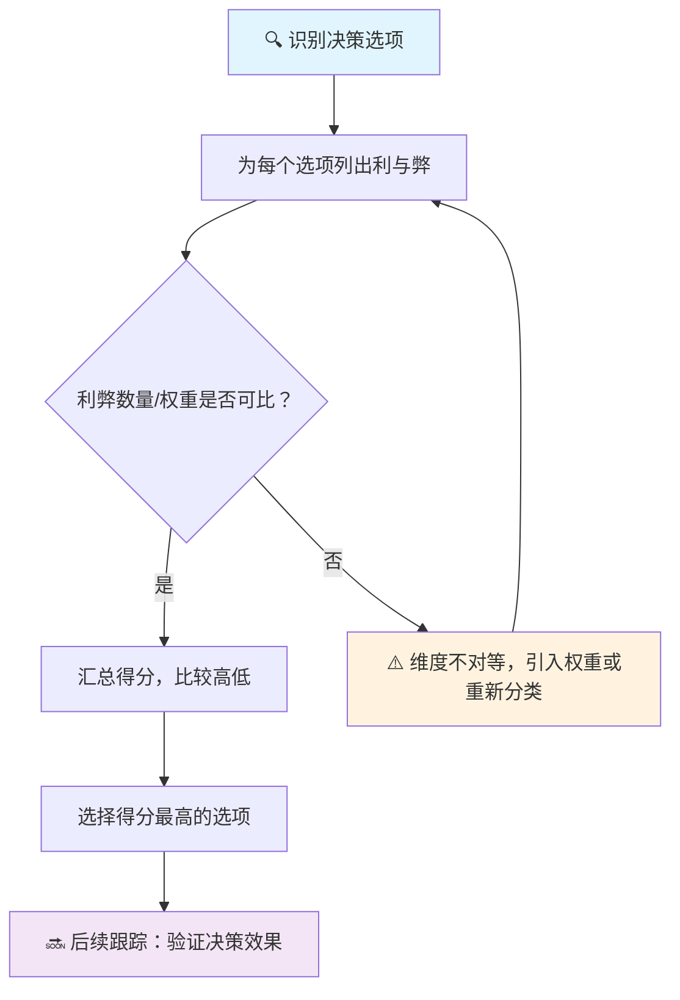

## 元认知思维筑基课: 利弊分析: 决策前先把好处和坏处摊开来看
  
### 作者  
digoal  
  
### 日期  
2026-04-23 
  
### 标签  
决策模型 , 利弊分析 , 决策前先把好处和坏处摊开来看 
  
----  
  
## 背景 
  
> 面向对象: 高中生及以上
> 核心问题: 面对多个选项时，怎么判断哪个选择更好？
> 先说结论: 利弊分析是一种把决策拆成「加分项」和「扣分项」逐一列举、然后汇总打分的思考方式。它的核心价值不是算出精确答案，而是逼你**把所有相关因素都想到**，避免只盯着显而易见的部分。

---

## 一张图先看懂



---

## 求真讲法

### 它到底说了什么

利弊分析（Pros and Cons Analysis）要求你在做决定前，把每个选项的好处（利）和坏处（弊）逐条写下来，给每条赋予主观权重，最后算出一个「净分」来比较不同选项。

**这不是在声称「人完全理性」，而是承认：**

> 人脑天然倾向于记住显眼的利，忽略隐藏的弊。列出来，是一种**对抗认知偏误**的手段。

### 它是怎么来的

这个方法没有严格的数学起源，更像是一种被实践反复验证的经验法则。它的思想根源可以追溯到：

- **本杰明·富兰克林**（18世纪）：据传他在给朋友的信中描述过类似方法——遇到两难时，把利弊分别写在纸上，权衡后决定。
- **决策科学中的「理性决策模型」**：明确列出所有 alternatives（选项）、outcomes（结果）、values（价值排序），是规范决策的第一步。

### 它依赖哪些假设

| 假设 | 含义 | 若不成立会怎样 |
|------|------|----------------|
| 决策者能识别所有相关因素 | 不是只想到明显的利弊 | 遗漏重大风险 |
| 权重可以主观量化 | 「重要」可以打分 | 打分主观性太强，结果失真 |
| 选项是已知的、固定的 | 不是边做边发现新选项 | 分析的是错误选项集合 |
| 结果可以事后评估 | 决策质量可以被验证 | 无法从结果中学习改进 |

### 常见误解

- **误解1：「量化打分 = 客观」**。打分本质上是主观的，权重反映的是个人价值观，不是客观事实。
- **误解2：「得分高就一定对」**。模型只处理**已知风险**，黑天鹅事件不在其中。
- **误解3：「可以一直用下去」**。适合中等复杂度、有时间思考的决策；不适合高度情绪化或需要快速反应的场合。

---

## 求存讲法

### 它有什么用

在**个人决策**（选专业、租房、换工作）、**团队决策**（产品方向、资源分配）、**商业评估**（是否上线某个功能、是否进入某个市场）等场景中，提供一个**结构化的思考框架**。

### 它怎么迁移到熟悉领域

**高中学习场景：**
> 暑假要不要参加补习班？
>
> - 利：巩固弱科、家长放心、开学有优势
> - 弊：时间被占用、费用高、可能效果一般
>
> 权衡后发现：若弱科是提分关键且自律差，补习的利 > 弊；若已掌握七成，自学即可，弊 > 利。

**职场场景：**
> 要不要接受一个新工作的 offer？
>
> - 利：薪资提升 30%、更快的晋升路径、新技能积累
> - 弊：通勤时间翻倍、团队文化未知、试用期高压
>
> 给每项权重（薪资权重 ×0.3，通勤权重 ×0.2 …），算净分，比感觉更靠谱。

### 它的适用范围和边界

| 适用 | 不适用 |
|------|--------|
| 选项 2-5 个、后果可以预见 | 选项未知或无限多 |
| 有时间慢慢分析 | 必须在几秒内决定 |
| 后果可逆或可承受 | 不可逆的重大决定（不可重来的选择） |
| 价值观相对稳定 | 情绪极端波动时（悲伤/兴奋/恐惧时少做重大决定） |

### 正例：怎么用它提升能力

**操作步骤（可直接抄用）：**

1. **把决策用一句话写下来**：「要不要报名 Python 课程？」
2. **开两张清单**，不评价，先全部列出来
   ```
   利：
   - 掌握编程技能
   - 简历加分
   - 可能接兼职
   弊：
   - 费用 3000 元
   - 每周占用 8 小时
   - 不确定能否坚持
   ```
3. **给每项打分**（1-5 分），乘以权重（自己定重要程度）
4. **汇总比较**，得分高的选项优先
5. **设触发条件**：「如果三个月后没有完成 50% 课程，就退课止损」

### 反例：前提不成立会怎样

> **场景**：小李决定毕业后去不去一家创业公司。
>
> 他仔细列了利弊：利——股权可能爆发成长、个人成长快；弊——薪资低于市场 40%、公司资金链不稳。
>
> 他给了「股权爆发」很高的权重，然后——公司 6 个月后倒闭，股权变成废纸。
>
> **失败原因**：他没有意识到「股权价值」的假设前提是「公司能活下来」，而这个前提他根本没有评估过。利弊分析做了，但没有做**前提成立性检验**。

---

## 思考

1. **反事实设问**：如果利弊清单上没有「公司资金链」这一项，你还会做出同样的选择吗？这说明列清单时的**你的认知范围**本身就是一个风险因素。

2. **边界挑战**：有没有一种决策，利和弊根本无法用分数衡量？比如「要不要送重病家人进 ICU」——这时候利弊分析还适用吗？

3. **跨学科联系**：进化心理学认为人脑偏好「近因」（近期发生的事印象更深），而利弊分析要求你列出所有相关因素。两者之间的张力在哪里？

4. **元认知**：你有没有过「列完利弊后发现真正问题不在选项本身」的经历？比如纠结要不要换工作时，最后发现真正的问题是「我不知道自己要什么」。

---

## 最后记住

1. **利弊分析的核心价值是「强迫思考」**，不是算出客观最优解
2. **打分是主观的**，权重反映你的价值观，不是真理
3. **它无法防范未知风险**，黑天鹅事件永远不在清单上
4. **前提成立性检验**：列出利弊后，追问「这些利/弊的前提假设是什么，这些前提可靠吗」
5. **结果要复盘**：用「三个月后再回头看当时的利弊分析，打分还准确吗」来校准自己的判断力

---

## 参考资料

- 《Thinking, Fast and Slow》— Daniel Kahneman（对人类判断中系统偏误的分析）
- 《The Decision Book》— Krogerus & Tschäppeler（结构化决策工具梳理）
- Franklin's Letter on Pro & Con method（富兰克林方法来源，有争议但广泛引用）
- 基于通用决策科学框架，无联网实时验证
  
  
#### [PostgreSQL 解决方案集合](../201706/20170601_02.md "40cff096e9ed7122c512b35d8561d9c8")
  
  
#### [德哥 / digoal's Github - 公益是一辈子的事.](https://github.com/digoal/blog/blob/master/README.md "22709685feb7cab07d30f30387f0a9ae")
  
  
#### [About 德哥](https://github.com/digoal/blog/blob/master/me/readme.md "a37735981e7704886ffd590565582dd0")
  
  

  
