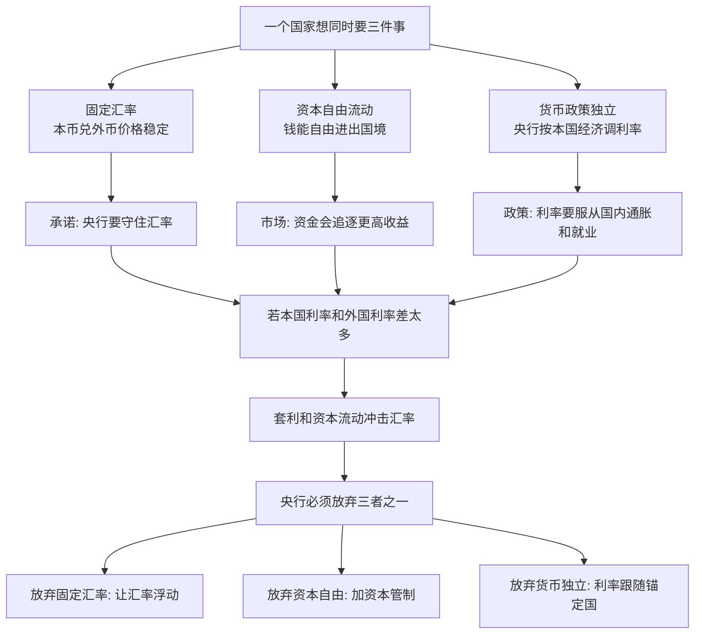

## 财经思维筑基课: 外汇领域不可能三角
  
### 作者  
digoal  
  
### 日期  
2026-04-29
  
### 标签  
不可能三角 , 外汇领域 , 稳汇率 , 资金自由跨境流动 , 利率自主可控
  
----  
  
## 背景 

> 面向对象: 高中生到大学低年级学生  
> 核心问题: 为什么一个国家不能同时做到“汇率稳定、资金自由进出、央行还能随心调利率”?  
> 先说结论: 外汇领域的“不可能三角”说的是: 在开放经济中，一个国家最多只能同时实现固定汇率、资本自由流动、货币政策独立性这三个目标中的两个。它不是道德判断，而是一个由套利、央行资产负债表和利率平价共同形成的约束。

## 一张图先看懂



## 求真讲法

### 它到底说了什么

“不可能三角”也常被叫作“三元悖论”或“蒙代尔-弗莱明三难选择”。它讨论的是开放经济里的三个政策目标:

| 目标 | 通俗说法 | 政策含义 |
|---|---|---|
| 固定汇率 | 本币和某个外币保持比较稳定的兑换价格 | 央行需要买卖外汇来维持承诺汇率 |
| 资本自由流动 | 钱可以比较自由地跨境投资、借贷、兑换 | 投资者可以快速把钱从低收益处搬到高收益处 |
| 货币政策独立性 | 央行可以按本国经济需要调利率和货币条件 | 比如经济差时降息，通胀高时加息 |

不可能三角的核心不是“这三件事都不好”，而是“在同一时间、同一制度下，三件好事不能全拿”。如果资本可以自由流动，又承诺固定汇率，那么本国利率通常就不能长期偏离锚定货币国家的利率。否则资本会用脚投票，央行为了守汇率就会被迫改变利率或消耗外汇储备。

### 它是怎么来的

先用一个校园类比。

你是班级小卖部负责人，承诺“1 张饭票永远换 1 瓶水”。同时学校允许同学自由把饭票拿到隔壁班换东西。你还想自己决定本班水价优惠，比如考试周半价。

问题来了: 如果隔壁班 1 张饭票只能换半瓶水，而你这里 1 张饭票换 1 瓶水，同学就会把隔壁班的饭票拿来你这里换水。你要么库存耗尽，要么取消固定兑换价，要么限制跨班兑换，要么跟隔壁班保持类似规则。

国家外汇市场也是类似逻辑，只是“饭票”变成货币，“水”变成金融资产收益，“小卖部库存”变成央行外汇储备。

更抽象一点，可以用“利率平价”的直觉理解:

```text
资本自由流动 + 汇率固定
        |
        v
投资者可以比较两国收益，且不用太担心汇率变化
        |
        v
如果本国利率明显低于外国: 钱流出本国
如果本国利率明显高于外国: 钱流入本国
        |
        v
资本流动会推升或压低本币汇率
        |
        v
央行为守住固定汇率，必须买卖外汇并调整货币条件
        |
        v
货币政策独立性被削弱
```

这背后的机制可以拆成四步:

1. 资本自由流动让投资者能跨国寻找更高回报。
2. 固定汇率降低了投资者对汇率损失的担心。
3. 如果本国利率由央行独立决定，并明显偏离外国利率，就会出现套利动机。
4. 大规模资本流动会冲击汇率，央行为了守住汇率承诺，只能干预外汇市场、改变国内货币供应，最终牺牲独立货币政策。

### 它依赖哪些假设

不可能三角不是在任何细节上都绝对成立。它依赖一些关键假设:

| 假设 | 为什么重要 | 如果不成立会怎样 |
|---|---|---|
| 资本流动足够自由 | 钱能快速跨境套利 | 若资本管制严格，套利压力会被挡住一部分 |
| 汇率承诺可信且较硬 | 市场相信央行要守某个汇率 | 若本来就是浮动汇率，压力会更多体现在汇率波动上 |
| 金融资产有可比收益 | 投资者能比较不同国家利率和风险 | 若市场分割严重，利差不一定马上引发资金流 |
| 央行储备和信用不是无限的 | 守汇率需要真实资源 | 若储备短期很厚，可以拖延矛盾，但不能永久消除 |
| 市场预期会反应政策矛盾 | 投资者会提前押注政策改变 | 预期越迟钝，危机可能越晚暴露 |

这里的“最多选两个”也是简化表达。现实中很多国家不是在三个角上做纯选择，而是在三条边之间选择不同程度的组合。例如“有管理的浮动汇率”“部分资本管制”“有限货币政策独立性”都属于中间状态。

### 常见误解

**误解一: 不可能三角说固定汇率一定错。**  
不对。固定汇率可以降低贸易和投资中的汇率不确定性，对小型开放经济有时很有价值。问题是，如果还要资本自由流动，就要接受货币政策跟随锚定货币国家。

**误解二: 外汇储备足够多就能三者全要。**  
储备能争取时间，但不是无限盾牌。如果政策目标长期冲突，储备会被持续消耗，市场还会形成“央行迟早守不住”的预期。

**误解三: 只要央行技术高，就能绕过约束。**  
技术可以改善节奏和沟通，但不能取消资金套利和资产负债表约束。把预算约束说成技术问题，是把数学题错看成操作题。

**误解四: 这只适用于小国。**  
大国有更深的金融市场、更强的政策信用，约束表现得没那么直接，但并不等于约束不存在。只是冲击可能更多体现在汇率、资产价格、通胀预期或资本流向上。

## 求存讲法

### 它有什么用

不可能三角的作用，是帮助我们理解一个国家的宏观政策为什么常常“看起来矛盾”。比如:

- 央行为什么不总能按国内经济情况随意降息?
- 为什么某些国家要限制资本流出?
- 为什么固定汇率制度遇到危机时会突然崩掉?
- 为什么一个经济体加入货币联盟后，会失去单独调节本国利率的能力?

它给我们的不是一句口号，而是一个检查表: 当你听到一个政策方案说“汇率要稳、资金要自由、利率也要自主”时，要立刻问: 牺牲项在哪里?

### 它怎么迁移到熟悉领域

不可能三角可以迁移成一种通用思维: **当三个目标背后共享同一个约束资源时，不要只问想要什么，要问哪个目标承担代价。**

| 场景 | 三个想要的目标 | 现实取舍 |
|---|---|---|
| 学习计划 | 成绩稳定、社交自由、每天都轻松 | 时间和精力有限，三者不能都拉满 |
| 产品开发 | 功能多、上线快、质量高 | 人力和时间有限，通常最多强保两个 |
| 公司管理 | 高自由度、强一致性、快速决策 | 自由越高，一致性和速度越难同时保证 |
| 家庭预算 | 高消费、高储蓄、低收入压力 | 收入一定时，三者必有取舍 |

这不是让人放弃理想，而是让人把隐藏的成本摆到桌面上。

### 它的适用范围和边界

适用时，它能帮你识别政策组合是否自洽。尤其当一个经济体面对外汇压力、资本外流、通胀和降息诉求时，这个框架很有解释力。

但它不能替代具体分析。因为现实还要看:

- 资本管制到底严到什么程度;
- 汇率是硬固定、爬行盯住，还是有管理浮动;
- 外汇储备、贸易顺差、财政状况和外债结构如何;
- 市场是否相信政策制定者;
- 冲击是短期情绪，还是长期基本面变化。

所以正确用法是: 先用不可能三角找出根本冲突，再用具体数据判断冲突的强弱和爆发路径。

### 案例推演: 如果人民币从“控制资本流动”缓慢切换到“不固定汇率”，可能因为什么

先说明边界: 这里不是断言人民币制度已经完成这种切换，而是用不可能三角做一个政策推演。也就是说，假设一个经济体原来更依赖“资本流动管理 + 汇率稳定 + 货币政策独立”，后来逐步减少对资本流动的硬约束，并让汇率承担更多波动，那么可能的原因是什么?

用三角形语言说，这是一种从左边组合向右边组合移动:

```text
原组合:
控制资本自由流动 + 相对稳定汇率 + 较强货币政策独立

逐步切换:
资本更便利地跨境流动 + 汇率更有弹性 + 保留货币政策独立

被放松的角:
不再把“固定或高度稳定汇率”作为唯一硬目标
```

可能原因可以分成六类。

| 可能原因 | 为什么会推动切换 | 对应的不可能三角逻辑 |
|---|---|---|
| 国内货币政策需要更大空间 | 如果国内经济周期和美国等主要经济体不同，利率政策就不适合完全跟随外部 | 要保货币政策独立，就不能同时硬保固定汇率和资本自由 |
| 资本账户逐步开放 | 企业出海、居民配置、外资进入、金融市场开放都会提高跨境资金流动需求 | 资本越自由，固定汇率越容易受到套利和预期冲击 |
| 外汇储备不宜长期消耗 | 长期守某个汇率水平需要持续买卖外汇，储备和央行资产负债表会承压 | 储备能缓冲矛盾，但不能永久消灭三角约束 |
| 人民币国际化需要价格弹性 | 一种货币要被更多人使用，就需要更真实的市场定价和风险对冲工具 | 国际化通常要求更开放的金融市场，汇率就要承担更多调节功能 |
| 经济结构更复杂 | 大型经济体内部有房地产、制造业、出口、消费、地方债等多重目标，单一汇率目标会绑住政策 | 国内目标越多，货币政策独立性的价值越高 |
| 让市场分担调节压力 | 汇率波动可以吸收一部分外部冲击，比如美元强弱、利差变化、贸易条件变化 | 放弃固定汇率，可以把压力从储备和利率转移到汇率价格上 |

这类切换的深层逻辑是: 当资本流动越来越难完全挡住，而国内又需要独立货币政策时，汇率就会被迫从“被保护的价格”变成“吸收冲击的价格”。

可以用一个更直观的链条表示:


不过，这种切换也不是没有代价。汇率更有弹性以后，企业进口成本、出口收入折算、外债偿付、居民换汇预期、金融市场波动都会变得更敏感。所以政策上通常不会一步到位，而是缓慢推进，并配套发展外汇衍生品、宏观审慎管理、跨境资金监测和预期沟通。

因此，用不可能三角看人民币问题，关键不是问“汇率稳定好不好”或“资本开放好不好”，而是问: 在国内政策自主性、资本跨境便利和汇率稳定之间，哪个目标正在从硬约束变成弹性变量?

### 正例: 怎么用它提升能力

假设你看到一个国家同时出现这些新闻:

1. 央行希望降息刺激经济。
2. 该国承诺汇率维持在某个区间。
3. 资本账户比较开放，居民和机构可以较自由买外汇资产。
4. 外国利率比本国高。

用不可能三角分析，你就不会只说“央行为什么不直接降息”。你会进一步判断:

- 如果降息，资金可能流出，本币贬值压力上升。
- 如果央行硬守汇率，可能要卖出外汇储备、回收本币流动性，刺激效果会被抵消。
- 如果要保留降息空间，就可能需要让汇率更灵活，或加强资本流动管理。

这就是把一个新闻判断从情绪层面提升到结构层面。

### 反例: 前提不成立会怎样

反例一: 把不可能三角机械套到完全封闭资本账户的经济体。  
如果资本不能自由进出，那么“资本自由流动”这个前提不成立。此时固定汇率和货币政策独立性可以在更长时间内并存，代价是居民和企业不能自由配置全球资产，金融市场效率和便利性会下降。

反例二: 把短期外汇干预误认为永久解决方案。  
有些经济体外汇储备较多，短期可以同时维持汇率稳定和一定政策自主。但如果资本自由流动且利率差长期诱发单边流出，储备会减少，市场预期会变差。这里失败不是因为“央行不会操作”，而是因为“储备无限”这个隐含前提是假的。

反例三: 在浮动汇率制度下说“央行必须跟随外国利率”。  
如果汇率可以浮动，央行就有更大空间按国内经济调利率。代价是汇率会波动，进口价格、外债负担和企业套保成本可能变化。这个例子说明: 放弃固定汇率，可以换回部分货币政策独立。

## 思考

不可能三角最有价值的地方，是训练我们识别“看似免费的一揽子承诺”。很多政策口号、商业计划、个人目标都喜欢同时许诺稳定、自由和自主，但这三件事常常会争夺同一个底层资源。

可以继续思考三个问题:

1. 如果一个国家选择资本自由流动和货币政策独立，它为什么通常要接受汇率浮动?
2. 如果一个国家选择固定汇率和资本自由流动，它的利率政策为什么会更像“跟随者”?
3. 如果一个国家选择固定汇率和货币政策独立，它为什么往往要限制资本自由流动?

再进一步，不可能三角也提示我们: 一个成熟的判断者，不只看政策目标是否好听，还要看目标之间是否共享约束、是否存在套利通道、是否有一方在承担沉默成本。

## 最后记住

1. 不可能三角说的是: 固定汇率、资本自由流动、货币政策独立性最多同时强保两个。
2. 它的核心机制是资本套利、汇率承诺和央行资产负债表之间的冲突。
3. 外汇储备和政策技巧能缓冲矛盾，但不能永久取消矛盾。
4. 现实国家常选择中间形态，不是纯粹站在三角形的某个顶点。
5. 用它分析问题时，最重要的问题是: 这个方案牺牲了哪一个目标，代价由谁承担?

## 参考资料

- Robert A. Mundell, "Capital Mobility and Stabilization Policy under Fixed and Flexible Exchange Rates", Canadian Journal of Economics and Political Science, 1963.
- J. Marcus Fleming, "Domestic Financial Policies under Fixed and under Floating Exchange Rates", IMF Staff Papers, 1962.
- Maurice Obstfeld, Jay C. Shambaugh, and Alan M. Taylor, "The Trilemma in History: Tradeoffs among Exchange Rates, Monetary Policies, and Capital Mobility", Review of Economics and Statistics, 2005.
- Paul R. Krugman, Maurice Obstfeld, and Marc Melitz, International Economics: Theory and Policy, relevant chapters on open-economy macroeconomics and exchange-rate regimes.
- International Monetary Fund, Annual Report on Exchange Arrangements and Exchange Restrictions, for practical classifications of exchange-rate arrangements and capital-account restrictions.


  
#### [PostgreSQL 解决方案集合](../201706/20170601_02.md "40cff096e9ed7122c512b35d8561d9c8")
  
  
#### [德哥 / digoal's Github - 公益是一辈子的事.](https://github.com/digoal/blog/blob/master/README.md "22709685feb7cab07d30f30387f0a9ae")
  
  
#### [About 德哥](https://github.com/digoal/blog/blob/master/me/readme.md "a37735981e7704886ffd590565582dd0")
  
  

  
