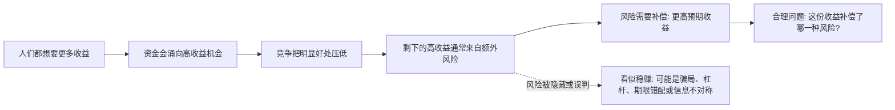

## 财经思维筑基课: 风险与收益匹配 
  
### 作者  
digoal  
  
### 日期  
2026-04-30 
  
### 标签  
风险 , 收益 , 隐藏风险 , 价值创造 , 谁承担风险 
  
----  
  
## 背景 
高收益通常伴随高风险。  
  
如果某个资产承诺“低风险、高收益、稳定回报”，通常要高度警惕。  

> 面向对象: 初中到高中学生  
> 核心问题: 为什么“高收益、低风险、稳赚不赔”通常不可信？  
> 先说结论: 风险与收益匹配不是数学公理，而是财经世界里非常基础的分析原则。它说的是：如果一个机会真的可能带来更高收益，通常也必须承担更大的不确定性、波动、亏损概率、时间成本或信息劣势。

## 一张图先看懂



## 求真讲法

### 它到底说了什么

“风险与收益匹配”可以改写成一句更准确的话：

> 在竞争充分、信息逐渐传播的市场里，想获得超过普通水平的预期收益，通常要承担某种额外代价。

这里有两个关键词。

**收益**不是“肯定赚到的钱”，而是“预期收益”。预期收益可以理解为把各种可能结果按概率加权后的平均结果。

**风险**也不只是“会不会亏钱”。它至少包括：

- 价格上下波动，短期可能亏损。
- 本金可能永久损失。
- 钱被锁住，急用时取不出来。
- 信息不完整，看不清真正问题。
- 借钱投资后，亏损被杠杆放大。
- 机会看似赚钱，但实际承担了别人不愿承担的风险。

一个简单例子：

| 选择 | 可能结果 | 看起来的收益 | 真实问题 |
|---|---:|---:|---|
| 把钱放进正规活期账户 | 收益低，但随时可用 | 低 | 风险和收益都低 |
| 买波动很大的资产 | 可能涨很多，也可能跌很多 | 高 | 承担价格波动和亏损风险 |
| 听别人说“稳赚高息” | 承诺很高 | 很高 | 可能隐藏信用风险、骗局或流动性风险 |

所以，这条原则不是说“风险越大，最后一定赚得越多”。真正的意思是：

**如果没有更高预期收益补偿，人们通常不会主动承担更高风险；如果有人承诺高收益却说没有风险，就要先怀疑风险被藏在哪里。**

### 它是怎么来的

这条原则来自几个朴素事实。

第一，人都偏好“同样收益下风险更低”。如果两个机会都能赚 10 元，但一个很稳，一个可能亏本金，大多数人会选更稳的。

第二，人也偏好“同样风险下收益更高”。如果两个机会风险差不多，但一个可能赚 10 元，一个可能赚 20 元，大多数人会选后者。

第三，金融市场里有竞争。明显的好机会不会长期没人发现。如果某个机会真的“低风险、高收益、可复制”，资金会不断进入，价格会被推高，收益率会被压低。

这就推出一个财经判断框架：

```text
如果收益明显高于普通水平
        |
        v
先不要问: 我能赚多少?
先要问: 我承担了什么风险?
        |
        v
如果风险说不清
要么是我没看懂
要么是对方没说全
要么是机会本身有问题
```

在现代金融学里，这一思想会出现在资产定价、投资组合、债券信用利差、股票风险溢价等问题中。比如，债券发行人越可能违约，通常就要给投资者更高利率；股票比短期国债波动更大，投资者通常会要求更高的长期预期回报。

### 它依赖哪些假设

这条原则成立，依赖一些重要前提。

| 假设 | 含义 | 如果不成立会怎样 |
|---|---|---|
| 人们讨厌无补偿风险 | 承担风险需要理由 | 有人可能为刺激、面子或误判承担不合理风险 |
| 市场有竞争 | 好机会会被别人发现 | 垄断、内幕信息、制度保护可能让超额收益暂时存在 |
| 信息会传播 | 价格会逐渐反映重要信息 | 信息不对称会让一方吃亏 |
| 风险能被识别 | 至少能大致说清风险来源 | 隐藏风险会让“低风险高收益”看起来成立 |
| 时间足够长 | 结果有机会接近概率规律 | 短期运气可能掩盖真实风险 |

注意：这些是假设，不是现实里永远成立的铁律。因此，“风险与收益匹配”不是用来替代调查的口号，而是用来启动调查的警报器。

### 常见误解

**误解一：风险越大，收益一定越高。**  
不对。风险大，只说明结果更不确定，不保证最后赚钱。买彩票风险很高，但长期期望收益并不高。

**误解二：低风险资产永远不好。**  
不对。低风险资产的作用可能是保命、备用、等待机会，而不是追求最高收益。

**误解三：高收益产品只要有人买，就说明可靠。**  
不对。很多人同时相信一件事，只能说明它流行，不能证明它安全。

**误解四：没有亏过钱，就说明没有风险。**  
不对。风险有时像没下雨前的洪水隐患，平时看不见，极端情况下才暴露。

## 求存讲法

### 它有什么用

这条原则最实用的地方，是帮助你识别问题。

看到一个投资、项目、兼职、创业机会时，不要只看“收益数字”，还要追问：

- 收益从哪里来？
- 谁付这笔钱？
- 为什么别人不抢？
- 我承担的是价格风险、信用风险、流动性风险，还是信息风险？
- 最坏情况下会损失什么？
- 如果大家都去做，这个收益还能存在吗？

这不是让人胆小，而是让人知道自己到底在冒什么险。

### 它怎么迁移到熟悉领域

风险与收益匹配不只适用于金融，也适用于学习和职业选择。

| 场景 | 高收益 | 对应风险或代价 |
|---|---|---|
| 学习竞赛 | 拿奖、升学优势 | 时间投入大，可能影响其他科目 |
| 选择冷门专业 | 竞争少，早期机会多 | 路径不清晰，信息少 |
| 创业 | 成长空间大 | 收入不稳定，失败概率高 |
| 跳槽去初创公司 | 股权和成长机会 | 公司不确定，岗位变化快 |
| 学新技术 | 未来机会 | 短期看不到回报，需要持续学习 |

迁移后的核心问题仍然一样：

> 我想得到的高收益，究竟需要我承担什么不确定性？这份不确定性，我能不能理解、承受和管理？

### 它的适用范围和边界

这条原则适合用在以下情况：

- 比较不同资产或机会。
- 判断高收益承诺是否可信。
- 识别风险是不是被隐藏。
- 设计自己的资金、时间和精力分配。

但它也有边界。

第一，短期里运气可能压过规律。有人一次冒险成功，不代表方法正确。

第二，风险不一定都能量化。人的健康、时间、声誉、家庭关系，也可能是代价。

第三，真正的能力可以改变风险收益关系。懂技术的人做技术创业，风险可能比外行低；懂行业的人投资相关企业，也可能更容易识别风险。但这不是“没有风险”，而是“风险被更好地理解和管理”。

第四，有些高收益来自不道德或违法行为。那不是合理风险补偿，而是把成本转嫁给别人或未来的自己。

### 正例: 怎么用它提升能力

假设一个高中生有 100 小时课外时间，可以选择刷短视频、学编程、做数学竞赛训练。

用“风险与收益匹配”思考，不是简单说“哪个最赚钱”，而是列出收益和风险：

| 选择 | 可能收益 | 风险或代价 | 可管理办法 |
|---|---|---|---|
| 刷短视频 | 放松快 | 时间被切碎，难形成能力 | 设定时长 |
| 学编程 | 长期能力、作品集 | 初期挫败，反馈慢 | 做小项目 |
| 数学竞赛 | 逻辑能力、升学优势 | 占用大量时间，结果不确定 | 设阶段目标 |

如果他选择学编程，并不是因为“高收益无风险”，而是因为他知道风险在哪里：短期很慢、容易放弃、需要持续练习。然后他用小项目降低挫败风险，用固定时间降低机会成本。

这就是成熟决策：不是逃避风险，而是识别风险、选择值得承担的风险。

### 反例: 前提不成立会怎样

假设有人说：“这个理财项目年化收益 20%，保本保息，随时可取。”

用这条原则检查：

- 年化 20% 明显高于普通低风险产品。
- 保本保息意味着投资者不承担本金损失。
- 随时可取意味着流动性也很好。
- 如果这些都是真的，其他资金为什么不立刻涌入，把收益压低？

这里违反了“市场有竞争”和“风险能被识别”两个假设。最可能的情况不是“发现了完美机会”，而是风险没有被说清楚：可能是借新还旧、底层资产不透明、信用风险很高，或者根本就是骗局。

这个反例的重点不是“收益高就一定假”，而是：

> 当收益很高、风险却被描述得很低时，解释责任在承诺收益的人身上。解释不清，就不该轻信。

## 思考

如果世界上真的存在“高收益、低风险、可复制、可大规模投入”的机会，会发生什么？

很可能会发生三件事：

第一，聪明资金大量进入。  
第二，价格被推高，收益率下降。  
第三，机会消失，或者暴露出原本被忽略的风险。

这也解释了为什么金融学习不能只背结论，而要练习追问机制。看到一个收益数字时，真正重要的不是兴奋，而是判断：

- 这笔收益来自真实创造价值，还是来自承担风险？
- 风险由谁承担，什么时候暴露？
- 我看到的是平均结果，还是幸存者故事？
- 我有没有能力承受最坏结果？
- 如果我的判断错了，损失会不会让我无法继续游戏？

风险与收益匹配背后，其实是一种更普遍的人生原则：凡是重要收获，通常都有代价。成熟不是不冒险，而是知道自己为什么冒险、冒哪种险、最多输多少。

## 最后记住

1. 高收益通常不是凭空出现的，它往往来自承担某种风险、期限、信息或流动性代价。
2. 风险大不等于收益高，只有被合理补偿、能被理解和管理的风险，才可能值得承担。
3. “低风险、高收益、稳赚不赔”不是机会说明书，而是风险排查清单。
4. 短期成功可能只是运气，长期判断要看机制、概率和最坏结果。
5. 最成熟的问题不是“能赚多少”，而是“这份收益补偿了哪一种风险，我能不能承受？”

## 参考资料

- Zvi Bodie, Alex Kane, Alan J. Marcus, *Investments*, 关于风险、收益、投资组合和资产定价的教材体系。
- Richard A. Brealey, Stewart C. Myers, Franklin Allen, *Principles of Corporate Finance*, 关于风险、资本成本和现值分析的教材体系。
- Burton G. Malkiel, *A Random Walk Down Wall Street*, 关于市场竞争、风险和长期投资收益的通俗讨论。
- 本文为面向学生的简化解释，基于通用金融学教材框架和常识性市场机制，不构成任何投资建议。
  

  
#### [PostgreSQL 解决方案集合](../201706/20170601_02.md "40cff096e9ed7122c512b35d8561d9c8")
  
  
#### [德哥 / digoal's Github - 公益是一辈子的事.](https://github.com/digoal/blog/blob/master/README.md "22709685feb7cab07d30f30387f0a9ae")
  
  
#### [About 德哥](https://github.com/digoal/blog/blob/master/me/readme.md "a37735981e7704886ffd590565582dd0")
  
  

  
