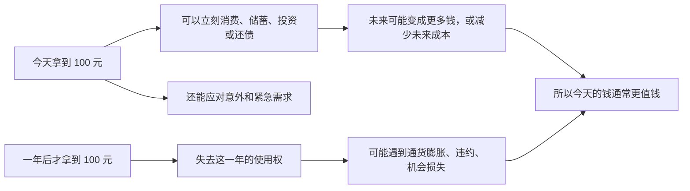

## 财经思维筑基课: 货币有时间价值
  
### 作者  
digoal  
  
### 日期  
2026-04-30 
  
### 标签  
货币 , 时间价值 , 机会价值 
  
----  
  
## 背景 
今天的 100 元比一年后的 100 元更值钱。  
  
因为今天的钱可以投资、消费、偿债，也能抵御不确定性。  
  
> 面向对象: 初中到高中学生  
> 核心问题: 为什么今天的 100 元，通常比一年后的 100 元更值钱？  
> 先说结论: 货币有时间价值，说的是同样面额的钱，越早拿到通常越有价值，因为它可以更早使用、投资、应急，也能少承受等待中的不确定性和通货膨胀。

## 一张图先看懂



## 求真讲法

### 它到底说了什么

“货币有时间价值”可以先用一句最朴素的话来理解：

> 钱不只是一个数字，还是一种立刻行动的能力。越早拥有这份能力，通常越有价值。

如果今天给你 100 元，和一年后再给你 100 元，大多数人会选今天拿到。原因不神秘，主要有四个：

- 今天拿到，可以立刻买东西、付学费、还债或存起来。
- 今天拿到，可以投资，未来可能变成更多钱。
- 今天拿到，可以应对意外，减少焦虑和被动。
- 一年后再拿到，中间可能遇到物价上涨、对方违约、自己失去机会。

所以，“时间价值”不是说钱自己会长大，而是说：

**钱一旦提前到手，就多了一段可以使用、安排和产生结果的时间。**

一个最简单的比较：

| 方案 | 现在能做什么 | 一年后结果 | 哪个更有价值 |
|---|---|---|---|
| 今天拿 100 元 | 立刻用、存、投、还债 | 可能仍是 100，也可能更多 | 通常更高 |
| 一年后拿 100 元 | 现在什么也做不了 | 到时才开始用 | 通常更低 |

### 它是怎么来的

这条原则不是数学公理，而是财经世界里被反复采用的基础假设和判断框架。它来自几个很现实的动机。

第一，**机会成本**。  
今天没拿到这笔钱，你就失去了这一年里用它做别的事的机会。哪怕只是存进低风险账户，也可能获得一点利息。

第二，**不确定性**。  
未来的钱不如眼前的钱确定。对方可能拖延、违约、失业、破产，也可能因为政策变化、经济波动而无法按时兑现。

第三，**通货膨胀**。  
如果物价上涨，同样 100 元以后能买到的东西可能更少。也就是说，钱的购买力会变化。

第四，**人的偏好**。  
大多数人天然更重视现在可支配的资源，而不是很久以后才拿到的同样资源。不是因为人“短视”，而是因为现实生活需要现在解决。

这套想法后来被系统化成很多财经工具，比如：

- 利息和复利计算。
- 现值与终值计算。
- 债券、股票、房产、项目投资的估值。
- 贷款、分期付款、养老金、保险产品的定价。

可以把它理解成财经里的“折算规则”：

```text
不同时间点的钱
不能直接硬比大小
需要先放到同一个时间点再比较
```

### 它依赖哪些假设

“货币有时间价值”并不是任何场景都一模一样地成立，它依赖一些前提。

| 假设 | 含义 | 如果不成立会怎样 |
|---|---|---|
| 钱可以被使用或投资 | 提前拿到的钱有用途 | 如果完全不能用，提前价值会下降 |
| 未来存在不确定性 | 晚拿到的钱有兑现风险 | 如果未来百分之百确定，时间差影响会变小 |
| 物价和机会会变化 | 等待会带来购买力或机会损失 | 如果世界静止不变，时间价值会减弱 |
| 人有现实需求 | 现在的消费、还债、应急有意义 | 如果人完全不在乎现在，偏好会不同 |

这也解释了为什么财经里常用“折现率”来表示时间价值。折现率可以粗略看成把未来的钱折算回今天时，要扣掉的那部分时间成本和风险补偿。

### 常见误解

**误解一：货币有时间价值，就是“钱会自动生钱”。**  
不对。钱不是自动增长，而是因为你可以拿它去做事，或者减少等待中的损失。

**误解二：只要未来金额更大，就一定更划算。**  
不对。要看等多久、风险多大、物价怎么变。今天 100 元和十年后 110 元，后者未必更值。

**误解三：时间价值只和投资有关。**  
不对。借钱、还债、分期、存钱、做预算、挑工作，都会用到它。

**误解四：通货膨胀是时间价值的唯一原因。**  
不对。就算没有明显通胀，机会成本和不确定性仍然存在。

## 求存讲法

### 它有什么用

这条原则最大的作用，是让你学会比较“不同时间上的钱”。

很多看起来简单的问题，如果不考虑时间价值，就会判断错：

- 现在拿 1 万元，和一年后拿 1.05 万元，哪个更好？
- 全款买，还是分期买？
- 早点还债，还是先留现金？
- 一个项目今年花钱、明年回款，值不值得做？

只要牵涉“今天的钱”和“未来的钱”，就不能只看数字大小。

### 它怎么迁移到熟悉领域

这个原则很容易迁移到学生熟悉的场景。

| 场景 | 现在的资源 | 未来的资源 | 时间价值体现 |
|---|---|---|---|
| 学习 | 今天开始积累 30 分钟 | 考前一周突击 3.5 小时 | 越早积累，复利越强 |
| 健康 | 现在运动和睡眠 | 生病后再补救 | 提前投入更有价值 |
| 技能 | 今天学一点编程 | 毕业前临时抱佛脚 | 提前学习有更长回报期 |
| 人际关系 | 平时维护信任 | 出事时才求帮助 | 提前建设成本更低 |

这说明“时间价值”不只是货币原则，也是一种资源观：

> 越早投入的优质资源，通常越能通过时间放大结果。

### 它的适用范围和边界

这条原则适合用于：

- 比较现在收钱和以后收钱。
- 理解利息、复利、折现、贷款和估值。
- 评估长期项目值不值得投入。
- 做预算和安排现金流。

但它也有边界。

第一，未来金额足够大时，未来的钱也可能更值得选。  
比如今天给你 100 元，和一年后给你 1000 元，大多数人会选后者。

第二，时间价值不是固定常数。  
不同人、不同利率、不同风险、不同通胀环境下，折现率不同，结论也会变化。

第三，它强调的是“通常更有价值”，不是“永远必须选现在”。  
有些人为了更大的长期收益，会主动放弃眼前的小收益。

第四，非金钱价值不一定能完全折算成货币。  
时间、健康、关系、兴趣，有时比短期现金更重要。

### 正例: 怎么用它提升能力

假设一个学生每月有 500 元零花钱。

方案 A：每个月花光。  
方案 B：每个月先存 100 元，用于买书、买课程或应急。

从表面看，方案 B 只是“少花了 100 元”。但从时间价值看，它多了三层好处：

- 越早存，越早形成缓冲垫。
- 真遇到急事，不用临时借钱。
- 如果后面有更好的学习机会，手里有钱就能立刻抓住。

这里的关键不只是“省钱”，而是把今天的一部分消费能力，转换成未来更多选择权。

### 反例: 前提不成立会怎样

假设有人说：“反正钱放着也是放着，早拿晚拿都一样。”

这句话在很多情况下不成立，因为它默认了一个错误前提：**钱在等待期间没有任何用途，也没有任何风险。**

举个例子：

- 甲今天能拿到 2000 元奖学金。
- 乙半年后才能拿到同样的 2000 元。

甲可以立刻买教材、报名课程，或者先存着备用。乙在这半年里如果正好缺这笔钱，可能要放弃课程，甚至借钱应急。

这里失败的根本原因，不是乙“不会理财”，而是“钱可以被使用”这个前提被忽略了。只要提前拥有的钱能解决现实问题，它就通常比晚到的钱更有价值。

## 思考

如果世界上没有时间价值，会发生什么？

那意味着今天的钱和十年后的一样值，等待没有代价，风险没有补偿，物价永远不变，机会不会流失。这样的世界几乎不是现实世界。

也正因为现实不是静止的，财经分析才必须把时间放进去。很多争论其实都不是在争“值不值”，而是在争：

- 我们用什么折现率？
- 未来这笔钱有多确定？
- 等待期间会失去什么机会？
- 物价、利率、风险会怎么变？

从更宽一点的角度看，货币有时间价值，也提醒人们：真正稀缺的，往往不是钱本身，而是钱背后的时间、选择权和行动窗口。

## 最后记住

1. 今天的钱通常比未来同面额的钱更有价值，因为它可以立刻使用、投资、应急或还债。
2. 货币的时间价值主要来自机会成本、不确定性、通货膨胀和现实需求。
3. 比较不同时间点的钱，不能只看数字大小，要先放到同一个时间点再比较。
4. 时间价值不只用于投资，也用于贷款、分期、预算、估值和日常决策。
5. 它说的是“通常如此”，不是“未来的钱永远不值得要”；关键在于金额、时间、风险和替代机会。

## 参考资料

- Richard A. Brealey, Stewart C. Myers, Franklin Allen, *Principles of Corporate Finance*, 关于现值、终值和折现的教材体系。
- Zvi Bodie, Alex Kane, Alan J. Marcus, *Investments*, 关于利率、折现和资产价值的基础框架。
- Aswath Damodaran, *Applied Corporate Finance*, 关于时间价值和估值思路的教学材料体系。
- 本文为面向学生的简化解释，基于通用公司金融与投资学教材框架，不构成投资建议。
  
  
#### [PostgreSQL 解决方案集合](../201706/20170601_02.md "40cff096e9ed7122c512b35d8561d9c8")
  
  
#### [德哥 / digoal's Github - 公益是一辈子的事.](https://github.com/digoal/blog/blob/master/README.md "22709685feb7cab07d30f30387f0a9ae")
  
  
#### [About 德哥](https://github.com/digoal/blog/blob/master/me/readme.md "a37735981e7704886ffd590565582dd0")
  
  

  
