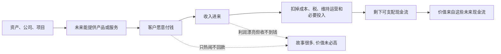

## 财经思维筑基课: 现金流决定价值
  
### 作者  
digoal  
  
### 日期  
2026-04-30 
  
### 标签  
现金流 , 利润 
  
----  
  
## 背景 
资产的价值，本质上来自未来能产生的现金流。  
  
股票、债券、房产、企业估值，最终都绕不开现金流。  
  

> 面向对象: 初中到高中学生  
> 核心问题: 为什么一个东西“很火”“看起来很赚钱”，不一定真的值钱？  
> 先说结论: 在财经分析里，价值最终要看它未来能不能持续带来现金流，也就是能不能真正把钱带回来。讲故事、做大收入、报表好看，都不能替代真实现金流。

## 一张图先看懂



## 求真讲法

### 它到底说了什么

“现金流决定价值”可以先翻译成学生能听懂的话：

> 一个东西值不值钱，关键不是别人怎么夸它，而是它以后能不能稳定地把钱真正带回来。

这里要先区分三个容易混在一起的词。

| 概念 | 通俗解释 | 关键问题 |
|---|---|---|
| 收入 | 卖东西或提供服务后记下来的进账 | 账上写了多少 |
| 利润 | 收入减去成本后的账面结果 | 看起来赚了多少 |
| 现金流 | 真正收到手、还能继续支配的钱 | 真拿到了多少 |

为什么要强调现金流？

因为“写在账上”和“拿到手里”不是一回事。一个公司可以：

- 卖出去很多货，但客户迟迟不付款。
- 做出很高利润，但为了维持增长要不断投更多钱。
- 讲出很好的未来故事，但一直没有稳定回款。

这些情况下，表面上可能很热闹，真正价值却不一定高。

所以，“现金流决定价值”真正要表达的是：

**价值来自未来能分配、能使用、能回到所有者手中的现金流，而不是只来自想象、名气、流量或短期账面数字。**

### 它是怎么来的

这条原则和“货币有时间价值”是连在一起的。

如果你问：一个资产今天值多少钱？  
财经里的标准追问会变成：

```text
它未来能带来多少现金流？
这些现金流会在什么时候来？
这些现金流有多确定？
把它们折算回今天，一共值多少？
```

也就是说，价值分析的底层逻辑不是“别人愿意炒到多高”，而是“未来回钱能力有多强”。

这个想法来自很朴素的现实：

第一，拥有一个资产，最终是希望它未来能给你带来好处。  
第二，这种好处如果不能落到真实现金上，就很难长期验证。  
第三，现金可以再投资、消费、还债、分红、扩大经营，所以它是最能落地的结果。

比如：

- 一张债券值钱，因为未来会按约定付利息和本金。
- 一套出租房值钱，因为未来可能持续带来租金。
- 一家公司值钱，因为未来可能持续产生自由现金流。

现代公司金融和投资学里，贴现现金流模型（DCF）就是把这件事写成更正式的分析方法：**资产的价值，等于未来现金流按风险和时间折算后的总和。**

### 它依赖哪些假设

“现金流决定价值”是强有力的分析原则，但它也依赖前提。

| 假设 | 含义 | 如果不成立会怎样 |
|---|---|---|
| 现金流最终能归属所有者 | 这些钱不是纸面幻觉 | 如果永远回不到所有者，价值会被高估 |
| 未来现金流大致可判断 | 可以估算规模、时间和稳定性 | 如果完全看不清，估值会很不稳 |
| 规则和产权相对稳定 | 回款不会被任意拿走或阻断 | 如果产权不稳，现金流价值会打折 |
| 维持现金流需要的投入可估算 | 不是无限烧钱换收入 | 如果后续投入被低估，真实价值会下降 |

这说明它不是一句口号，而是一套判断训练：

不是只看“能不能赚钱”，而是看“赚来的钱能不能真正留下来”。

### 常见误解

**误解一：只要利润高，价值就一定高。**  
不对。利润是会计结果，现金流才是落地结果。利润高但收不到款，价值可能并不高。

**误解二：只要收入增长快，价值就一定越来越大。**  
不对。收入增长如果靠补贴、赊销、烧钱换规模，未必能变成健康现金流。

**误解三：现金流决定价值，说明故事和预期没用。**  
不对。预期有用，因为未来现金流本来就是面向未来的。但预期必须能慢慢被现金流验证。

**误解四：短期没有现金流的项目就一定没价值。**  
不对。早期项目可能先投入、后回款。关键不是“现在有没有现金流”，而是“未来有没有合理路径形成现金流”。

## 求存讲法

### 它有什么用

这条原则的最大作用，是帮你识别“热闹”和“值钱”是不是一回事。

看到一个公司、项目、店铺、投资机会时，可以先问五个问题：

- 它的钱从谁那里来？
- 钱什么时候能收到？
- 收到的钱是一次性的，还是能持续重复？
- 为了拿到这些钱，要先投入多少？
- 最后真正剩下、能自由支配的现金还有多少？

如果这些问题回答不清，那么再漂亮的故事、再快的增长，都要打折看。

### 它怎么迁移到熟悉领域

这个原则不只适用于公司估值，也能迁移到学生熟悉的世界。

| 场景 | 表面指标 | 真正有价值的“现金流类指标” |
|---|---|---|
| 学习 | 刷了多少题、记了多少页 | 真正能稳定做对题、迁移知识 |
| 社交媒体 | 点赞多、播放高 | 能不能沉淀信任、形成长期影响 |
| 技能成长 | 看了很多教程 | 能不能做出作品、解决真实问题 |
| 校园活动 | 活动很热闹 | 能不能留下关系、经验和组织能力 |

也就是说，迁移后的核心问题变成：

> 这个事情带来的好处，是热闹一阵，还是能持续转化成真实结果？

这和财经里问“有没有持续现金流”是同一种思维。

### 它的适用范围和边界

这条原则适合用于：

- 分析企业、债券、房产、项目的长期价值。
- 区分账面繁荣和真实回款。
- 理解为什么估值最终离不开回钱能力。
- 训练自己抓本质，不被表面数据带偏。

但它也有边界。

第一，有些资产的价值不只来自直接现金流。  
比如黄金、艺术品、收藏品，部分价值来自稀缺性、避险属性或共识。

第二，早期创新项目可能暂时没有正现金流。  
这时不能机械地说“没有现金流就没有价值”，而要看未来形成现金流的路径是否可信。

第三，现金流本身也要看质量。  
靠一次性卖资产、延迟付款、缩减必要投入换来的现金流，不一定健康。

第四，估值永远包含判断。  
同样的现金流，时间不同、风险不同、稳定性不同，价值也不同。

### 正例: 怎么用它提升能力

假设有两个校园小生意。

甲：卖手工笔记本，每周能稳定卖出一些，收款及时，材料成本明确。  
乙：做一个“很火”的校园代购群，群里很热闹，咨询很多，但经常拖款、退单、还要自己先垫钱。

如果只看“热度”，乙可能更像“好项目”。  
但如果用现金流思维看：

- 甲的回款稳定。
- 甲的成本更清楚。
- 甲赚到的钱更容易真正留下。

因此，甲的价值可能反而更高。因为它不是只看起来忙，而是真的能持续把钱带回来。

### 反例: 前提不成立会怎样

假设有人说：“这家公司用户增长很快，所以一定很值钱。”

这句话的问题在于，把“增长”直接当成了“价值”，中间跳过了最关键的一步：**增长能不能转成现金流。**

可能出现的情况是：

- 用户很多，但不付费。
- 付费很多，但回款很慢。
- 回款不少，但为了维持增长要持续巨额补贴。
- 表面收入高，但最后自由现金流几乎没有。

这里失败的原因，不是“增长没意义”，而是“未来现金流大致可判断、维持投入可估算”这两个前提不成立。只看热度，不看回款和留存下来的钱，就容易高估价值。

## 思考

为什么财经世界里，人们总想把复杂问题最后落到现金流上？

因为现金流是最接近现实检验的一层。  
故事可以编，情绪可以炒，指标可以包装，但现金流更难长期伪装。

当然，现金流也不是万能答案。真正困难的地方在于：

- 未来现金流不是今天就摆在桌上，而是要预测。
- 预测里有很多假设：增长、成本、竞争、利率、风险。
- 同样 100 万现金流，明年拿到和十年后拿到，价值不一样。

所以，成熟的财经思维不是死背“现金流决定价值”这句话，而是继续追问：

- 现金流从哪里来？
- 能持续多久？
- 需要多少代价来维持？
- 风险来了会不会中断？
- 折算回今天后，还值多少？

这也是一种更普遍的能力：别被表面热闹带着走，要追到底层结果能不能真正落地。

## 最后记住

1. 价值最终要看未来能否持续带来真实现金流，而不是只看故事、热度或账面数字。
2. 收入、利润、现金流不是一回事；现金流最能检验结果是否真正落地。
3. 高增长只有在未来能转成可持续现金流时，才会支撑更高价值。
4. 早期没有现金流不等于没有价值，关键是未来形成现金流的路径是否可信。
5. 真正成熟的判断，不是问“它看起来多火”，而是问“它最后能把多少钱真正带回来”。

## 参考资料

- Richard A. Brealey, Stewart C. Myers, Franklin Allen, *Principles of Corporate Finance*, 关于企业价值、自由现金流和折现逻辑的教材体系。
- Aswath Damodaran, *Investment Valuation*, 关于现金流估值和价值分析的教学框架。
- Zvi Bodie, Alex Kane, Alan J. Marcus, *Investments*, 关于资产价值、现金流与折现的基础框架。
- 本文为面向学生的简化解释，基于通用公司金融与投资学教材框架，不构成投资建议。
  
  
  
#### [PostgreSQL 解决方案集合](../201706/20170601_02.md "40cff096e9ed7122c512b35d8561d9c8")
  
  
#### [德哥 / digoal's Github - 公益是一辈子的事.](https://github.com/digoal/blog/blob/master/README.md "22709685feb7cab07d30f30387f0a9ae")
  
  
#### [About 德哥](https://github.com/digoal/blog/blob/master/me/readme.md "a37735981e7704886ffd590565582dd0")
  
  

  
