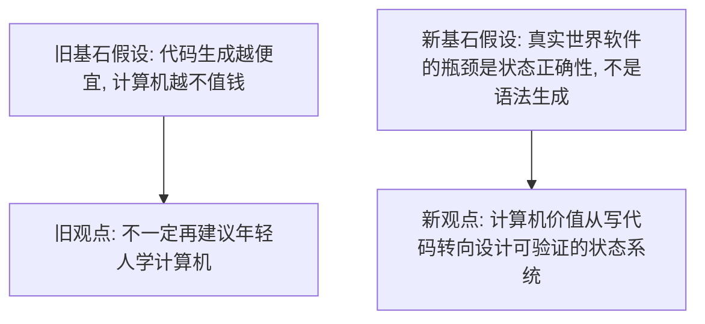

## 图灵奖得主 Stonebraker 炮轰半个行业, 但他只说对了一半
  
### 作者  
digoal  
  
### 日期  
2026-04-30 
  
### 标签  
AI , 替代 , 只读助手 , 可执行系统 , DBOS , 状态管理 , 一致性 , 安全 , 约束 , 责任边界 
  
----  
  
## 背景 
前言: 图灵奖得主炮轰半个行业，并断言：“我可能不再建议学计算机”！AI Agent最后全是数据库问题

原文见: 
https://www.toutiao.com/article/7634436516479894057/

> 但我不同意: Mike Stonebraker 说对了一半。AI Agent 一旦从“只读助手”走向“可执行系统”，核心确实会回到数据库与事务；但这并不推出“没必要学计算机”，真正被压缩的是低壁垒编码，真正升值的是对状态、一致性、约束与系统责任边界的理解。

下面咱们就来进行深入推演.

## 旧文真正说了什么

原文大致有六个主张。

1. `Postgres` 是最好的起点，但不是所有场景的终点。  
基石假设是：数据库的性能上限取决于是否按场景定制，而不是靠一个通用系统包打天下。

2. `Google` 当年的 `MapReduce + eventual consistency` 路线被高估了。  
基石假设是：一旦业务进入真实读写世界，事务和一致性不会消失，只会以更昂贵的方式回来。

3. `AWS` 支持太多数据库，很多只是重复建设。  
基石假设是：数据库品类分化是必要的，但分化不是无限的，市场最终会回到少数真正有性能或模型差异的系统。

4. 今天的 `agentic AI` 大多仍是“只读系统外包一层 LLM”。  
基石假设是：一旦 Agent 真正拥有写权限，它就不再只是推理问题，而是状态变更问题。

5. `text-to-SQL` 在公开榜单上看起来接近可用，但在企业环境里仍远未达标。  
基石假设是：真实世界数据库的复杂性，不是多加一点 prompt engineering 就能抹平。

6. 因为 AI 会改写软件生产方式，计算机科学可能不再是增长型行业。  
基石假设是：写代码约等于计算机行业本身，编码效率提升会直接压缩整个学科的长期需求。

把这六点压缩成一句话，旧文真正的结论其实是：

`AI 不是在消灭数据库，而是在把所有“看上去像智能”的系统重新拖回状态管理、事务一致性和系统约束这些老问题上。`

这个判断很强，也很有洞察力。但原文后半句又进一步滑到了另一个命题：

`既然代码越来越容易生成，学计算机可能就不再划算。`

问题恰恰出在这一步外推。

## 旧逻辑的关键漏洞

### 漏洞一：把“程序员岗位的重组”误写成“计算机学科的衰退”

美国劳工统计局最新 `2024-2034` 预测并不支持“整个计算机方向不再增长”这个强结论。  
`Software developers, QA analysts, and testers` 总体就业预计增长 `15%`，软件开发者单项增长 `16%`；但 `computer programmers` 这一更偏“纯编码执行”的职业预计下降 `6%`。这说明被压缩的是更可替代的编码分工，而不是整个计算机相关需求一起塌缩。

也就是说，Stonebraker 看到的是对的现象，但他的职业建议过于粗粒度。

### 漏洞二：把“Agent 最终是数据库问题”说得太窄

这句话抓住了最硬的一层，但还不够完整。  
当 Agent 开始读写现实系统时，确实需要事务、幂等、回滚、一致性、故障恢复；但除此之外，还会立刻碰到权限、审计、可观测性、人机审批、责任归属、跨系统补偿这些问题。数据库是底座，不是全部。

更准确地说，Agent 最终会变成：

`状态机问题 + 事务问题 + 权限问题 + 观测问题 + 责任问题`

只是其中事务层最接近数据库学派的话语体系，所以最容易被率先看见。

### 漏洞三：把公开 benchmark 与企业 benchmark 的落差，直接推成“LLM 永远不行”

`BEAVER` 这篇论文确实很扎实。它直接指出，企业 `text-to-SQL` 之所以难，不只是模型笨，而是因为企业数据仓库有三个结构性难点：私有数据不在训练语料里、schema 更复杂、查询本身更复杂。论文在真实企业仓库上测得的结果是，现成模型的端到端执行准确率“接近 0”。

但这更像是在说明：

`靠一个通用 LLM 端到端裸写企业 SQL 不行`

而不是：

`所有以 LLM 为核心的结构化查询交互都不行`

前者大概率成立，后者则还没有被证明。

### 漏洞四：把“Google 当年错了”说成“数据库老路最终全胜”

Stonebraker 对 `eventual consistency` 的批评，后来确实被 `Spanner` 的路线部分验证。Google 官方资料明确写到，`Spanner` 提供的是比 eventual consistency 更强的 `external consistency`，并支持外部一致的分布式事务。

但这并不代表“数据库世界没变”。真正变化的是：

`大家不是回到旧数据库，而是把分布式系统、时钟、不确定性、复制协议这些代价一起吃下去，重新造了一层更贵但更强的一致性系统。`

也就是说，老问题回来了，但它们是在新规模、新成本、新架构约束下回来的。

## 如果基石假设崩塌：新假设是什么

旧文后半段默认的基石假设是：

`如果代码生成更便宜，那么学计算机的价值就会下降。`

这个假设站不住，因为它把“写代码”错当成了“计算机”的本体。

更稳的新假设应该是：

`AI 会持续压低“把意图翻译成语法”的成本，但不会压低“为真实世界设计正确状态转移”的成本。`

一旦换成这个新假设，结论就完全变了：

`未来更值钱的，不是能更快写出函数的人，而是能为 Agent、工作流和数据系统定义状态边界、失败语义、补偿规则、权限模型和验证机制的人。`

## 新观点：AI 时代真正稀缺的不是代码，而是“可验证的状态设计”

### 1. AI 先替代语法，后暴露状态

今天很多人把 AI 的强弱，理解成“它能不能把自然语言变成代码”。这是第一层。

但一旦系统真正接入支付、库存、订单、权限、工单、审批、交通、医疗这些真实流程，难点立刻上移。  
你不再问“模型能不能生成一段函数”，而是问：

- 这次写操作到底有没有提交成功？
- 失败后是重试、补偿，还是回滚？
- 两个 Agent 的并发写入如何避免双花、超卖和脏状态？
- 外部 API 成功、内部数据库失败时，谁负责收拾残局？
- 多步骤工作流跨天中断后，如何从正确位置恢复？

这时，LLM 只是前端智能层，真正决定系统能否上线的是后端状态语义。

### 2. 所以 Stonebraker 看见的不是“AI 抢走了数据库”，而是“AI 把数据库推回舞台中央”

`DBOS` 的官方定位就很说明问题。它不是在卖一个更会写 prompt 的工具，而是在卖 durable workflow orchestration，把工作流、队列、Agent 执行、失败恢复、可观测性与数据库状态绑定起来。  
这背后的需求信号很明确：行业开始意识到，Agent 不是“答得像人”就够了，而是必须“像系统一样可靠”。

这也是为什么 Stonebraker 会说，Agent 最终都会变成数据库问题。  
这话翻译成工程语言，其实就是：

`当 AI 从“建议”变成“执行”，系统设计会从 prompt engineering 回落到 transaction engineering。`

### 3. 但这并不意味着“只要学数据库就够了”

如果把新世界理解成“以后都是 SQL 和事务”，那还是理解窄了。

未来高价值工程能力，至少包含五层：

1. `意图层`：把模糊目标拆成可执行步骤。
2. `状态层`：定义哪些状态可持久化、哪些状态可回滚。
3. `事务层`：保证原子性、一致性、幂等、补偿。
4. `治理层`：权限、审计、审批、人机协作。
5. `验证层`：监控、追踪、重放、故障归因、形式化或半形式化校验。

数据库只覆盖了第 `2-3` 层的核心部分。  
所以更准确的说法不是“AI Agent 最后全是数据库问题”，而是：

`AI Agent 最后会收敛成一门以数据库约束为核心的系统工程。`

### 4. 为什么 `text-to-SQL` 的失败恰好支持这个判断

`BEAVER` 的结果很关键，因为它说明一件常被忽略的事：

`企业软件难，不是因为缺 SQL 语法；而是因为企业世界本身就是高耦合、高上下文、高约束的状态空间。`

论文里 `BEAVER` 只有 `93` 个查询，但平均每个数据库 `105` 张表、每个查询平均 `4.25` 次 join、`4.67` 次聚合、嵌套深度 `1.95`，复杂度远高于 `Spider` 和 `Bird`。  
这意味着企业查询不是“把一句中文翻译成 SQL”这么简单，而是“把一句意图映射到一个私有知识图谱和约束系统里”。

所以 LLM 在企业 SQL 上翻车，并不是偶然 bug，而是暴露了一个更底层的事实：

`语义映射如果脱离了真实 schema、真实关系、真实业务上下文，靠语言模型本身是兜不住的。`

### 5. “还该不该学计算机” 的正确改写

如果你把“学计算机”理解成“背 API、刷语法、写 CRUD”，那风险确实在上升。  
如果你把“学计算机”理解成下面这些能力，风险反而在下降：

- 抽象现实流程为状态机
- 为多步骤系统设计失败语义
- 让跨系统写操作具备可恢复性
- 识别数据模型、索引、延迟、一致性之间的权衡
- 为自动化系统建立审计和责任边界

这类能力恰好因为 AI 普及而更稀缺，不会更廉价。

<svg role="img" aria-label="AI时代软件价值重心从代码语法转向状态正确性" viewBox="0 0 900 380" xmlns="http://www.w3.org/2000/svg">
  <rect width="900" height="380" fill="#f7f4ea"/>
  <text x="40" y="48" font-family="Arial, sans-serif" font-size="28" fill="#1f2937">AI 时代的软件价值重心迁移</text>
  <line x1="120" y1="290" x2="820" y2="290" stroke="#6b7280" stroke-width="2"/>
  <line x1="120" y1="290" x2="120" y2="90" stroke="#6b7280" stroke-width="2"/>
  <text x="740" y="330" font-family="Arial, sans-serif" font-size="22" fill="#374151">时间 / AI 渗透率</text>
  <text x="38" y="108" font-family="Arial, sans-serif" font-size="20" fill="#374151">价值密度</text>

  <path d="M130 120 C 260 135, 380 180, 520 230 S 720 285, 810 292" fill="none" stroke="#c2410c" stroke-width="6"/>
  <text x="620" y="205" font-family="Arial, sans-serif" font-size="22" fill="#9a3412">纯语法与模板编码</text>
  <text x="640" y="232" font-family="Arial, sans-serif" font-size="18" fill="#9a3412">边际价值下降</text>

  <path d="M130 275 C 270 270, 380 245, 520 195 S 710 120, 810 105" fill="none" stroke="#0f766e" stroke-width="6"/>
  <text x="520" y="122" font-family="Arial, sans-serif" font-size="22" fill="#115e59">状态建模 / 事务 / 治理</text>
  <text x="595" y="149" font-family="Arial, sans-serif" font-size="18" fill="#115e59">边际价值上升</text>

  <rect x="180" y="310" width="170" height="34" rx="8" fill="#fed7aa"/>
  <text x="195" y="333" font-family="Arial, sans-serif" font-size="18" fill="#7c2d12">过去: 写得更快的人</text>
  <rect x="560" y="310" width="220" height="34" rx="8" fill="#99f6e4"/>
  <text x="575" y="333" font-family="Arial, sans-serif" font-size="18" fill="#134e4a">未来: 设计正确系统的人</text>
</svg>
  
  

## 逻辑三洽检验

- 自洽: 新观点没有否认 Stonebraker 关于事务、一致性、企业 SQL 困境的判断，只是否认了“因此不再建议学计算机”这一步过度外推。
- 他洽: 它能同时解释四类事实。`Spanner` 说明大规模系统最终重新拥抱强一致；`BEAVER` 说明企业语义映射极难；`DBOS` 说明市场开始为“可恢复工作流”付费；`BLS` 则说明职业结构在重排，但软件开发整体需求仍增长。
- 续洽: 如果这个新观点成立，那么未来几年最值钱的工具不会只是“更会生成代码”，而会是“更会保证状态正确”的基础设施，例如 durable execution、workflow runtime、事务化 Agent 框架、审计与回放系统。

## 未来主要观测信号

1. 更多 Agent 框架会把 `workflow durability`、`human-in-the-loop`、`replay`、`idempotency` 做成默认能力，而不是外挂能力。
2. 企业采购会从“买一个更聪明的模型”转向“买一个可审计、可恢复、可回滚的自动化执行平台”。
3. `text-to-SQL` 的主流方案会减少“端到端直接生成”，转向“schema 检索 + 结构化规划 + SQL 约束生成 + 执行验证”的多阶段系统。
4. 工程岗位会继续分化。低壁垒编码岗位承压，但系统、数据、平台、安全、可靠性相关岗位继续扩张。
5. 如果未来公开数据显示软件开发整体就业也开始持续转负，而且 durable systems 工具需求没有上升，那本文的新假设就要被修正。

## 结论

这篇访谈最值得保留的洞察，不是“别学计算机了”，而是下面这句更硬的话：

`AI 让“生成代码”变便宜，但让“生成正确状态变更”变得更贵、更难，也更关键。`

所以真正应该更新的，不是对计算机的信心，而是对“什么才算计算机核心能力”的定义。

未来的护城河，不会只是会写程序。  
未来的护城河，是你能不能把一个会犯错、会中断、会并发、会越权的智能体系统，约束成一个可验证、可恢复、可追责的真实系统。

这件事，恰恰比过去更像计算机科学，而不是更不像。

## 参考来源

- [DBOS About](https://www.dbos.dev/about)
- [DBOS Home](https://www.dbos.dev/)
- [BEAVER: An Enterprise Benchmark for Text-to-SQL](https://arxiv.org/abs/2409.02038)
- [Spanner: Google's Globally-Distributed Database](https://research.google/pubs/spanner-googles-globally-distributed-database-2/)
- [Spanner: TrueTime and external consistency](https://docs.cloud.google.com/spanner/docs/true-time-external-consistency)
- [Software Developers, Quality Assurance Analysts, and Testers - U.S. BLS](https://www.bls.gov/ooh/computer-and-information-technology/software-developers.htm)
- [Computer Programmers - U.S. BLS](https://www.bls.gov/ooh/computer-and-information-technology/computer-programmers.htm)
- [Readings in Database Systems](https://www.redbook.io/)
  
# 附录
  
-----  
  
## 真正的AI原生数据库是什么? 如何定义它?  
  
AI 与 数据库的融合经历的3个阶段.  
  
1、AI4DB,  
  
运维侧: 自动驾驶、自动运维诊断、自动审核  
  
开发侧: text2sql、自动加工数据生成报告  
  
2、DB4AI,  
  
记忆存储、RAG场景 的 数据存储与搜索:  
- 多模态存储( 文本、标量、向量、图、GIS ... )  
- 文本切片, 文本向量, 语义搜索;  
- 全文检索、关键词搜索  
- 数据的重组, 图式搜索  
- 多路召回 + ranking 排序  
  
开发场景:  
- 元数据治理能力, 数据库可被 AI 理解  
- 数据库快照能力, 将数据库快速接入“应用开发、测试、发布”流程  
  
3、DBOS  
  
AI 正把数据库推回舞台中央, why?  
  
从 prompt engineering , 到 context engineering, 从 mcp 到 skill. 关键是解决上下文爆炸问题.  
  
现在从 agent 到 workflow / 数字员工. 关键问题变成了 **状态机问题 + 事务问题 + 权限问题 + 观测问题 + 责任问题**  
  
AI 时代真正稀缺的不是代码，而是“可验证的状态设计”  
  
所以 Stonebraker DBOS 的官方定位就很说明问题。DBOS 卖的是 durable workflow orchestration ，把工作流、队列、Agent 执行、失败恢复、可观测性与数据库状态绑定起来。  
  
这背后的需求信号很明确：行业开始意识到，Agent 不是“答得像人”就够了，而是必须“像系统一样可靠”。  
  
Agent 问题最终都会变成数据库问题。  
  
这话翻译成工程语言，其实就是：  
  
当 AI 从“建议”变成“执行”，系统设计会从 prompt engineering 回落到 transaction engineering。  
  
未来的护城河，不会只是用 Agent 会写程序。  
  
未来的护城河，是你能不能把一个会犯错、会中断、会并发、会越权的智能体系统，约束成一个可验证、可恢复、可追责的真实系统。  
  
未来主要观测信号:  
- 更多 Agent 框架会把 workflow durability、human-in-the-loop、replay、idempotency 做成默认能力，而不是外挂能力。  
- 企业采购会从“买一个更聪明的模型”转向“买一个可审计、可恢复、可回滚的自动化执行平台”。  
- text-to-SQL 的主流方案会减少“端到端直接生成”，转向“schema 检索 + 结构化规划 + SQL 约束生成 + 执行验证”的多阶段系统。  
- 工程岗位会继续分化。低壁垒编码岗位承压，但系统、数据、平台、安全、可靠性相关岗位继续扩张。  
- 如果未来公开数据显示软件开发整体就业也开始持续转负，而且 durable systems 工具需求没有上升，那本文的新假设就要被修正。  
  
最后如何定义AI原生数据库? 关键看数据库是否已进入第三阶段, 成为面向智能体执行的可信状态基础设施.  
  
## AI原生重构企业基础设施，最大的变革是什么? 留给行业最重要的建议是什么?  
  
AI 原生重构企业基础设施，最大的变革是：企业的中心正在从“应用系统”转向“状态系统”。  
  
过去企业数字化，默认人是执行者，系统只是记录者。人会判断、会补救、会负责。但 AI 进来以后，它不只是给建议，它会读数据、调工具、写代码、发邮件、改配置、跑流程。也就是说，AI 变成了新的执行主体。  
  
这时最关键的问题就不是“模型聪不聪明”，而是：当一个会犯错、会中断、会重复执行、会越权组合动作的智能体开始干活，企业能不能保证状态正确、权限可控、过程可审计、失败可恢复、责任可追溯？  
  
所以 AI 原生基础设施的核心，不是模型优先，而是状态优先、权限优先、事务优先、审计优先。  
  
数据库行业也不能把 AI 原生数据库简单理解成向量数据库。向量、RAG、语义搜索、text-to-SQL 都重要，但它们只是入口。真正的 AI 原生数据库，应该是面向智能体执行的可信状态基础设施。  
  
它既要帮 AI 找上下文，也要约束 AI 改状态；既要支持语义检索，也要支持事务恢复；既要提高自动化效率，也要限制自动化破坏力。  
  
给企业最重要的建议是：不要急用AI全面替代人工，先盘点自己的状态系统。  
  
哪些动作能自动执行？哪些必须人工确认？哪些数据能进上下文？哪些工具调用要审批？哪些结果必须能回滚？哪些行为必须被审计？  
  
这些问题答不清楚，AI 越能干，风险越大。  
  
一句话：AI 时代真正先进的企业，不是把 AI 接到每个系统上，而是把每个系统重构到 AI 可以安全执行。  
  
-----  
  
# AI原生重构企业基础设施，最大的变革是什么? 留给行业最重要的建议是什么?  
## AI原生重构企业基础设施，最大的变革是什么?  
最大的变革，不是企业多了一个聊天入口。  
  
也不是每个系统旁边都挂一个 Copilot。  
  
真正的变革是：  
  
**企业基础设施的中心，正在从“应用系统”转向“状态系统”。**  
  
过去二十年，企业数字化的主线是应用。  
  
ERP 管流程，CRM 管客户，OA 管审批，BI 管报表，DevOps 管交付。每个系统都有自己的界面、流程、权限、数据表和操作日志。  
  
人在系统之间切换，靠经验理解上下文，靠流程保证正确性，靠审批承担责任。  
  
但 AI 进来以后，问题变了。  
  
AI 不是一个新界面。  
AI 是一个新的执行主体。  
  
它会读数据、写数据、调用工具、生成代码、触发任务、修改配置、发邮件、下订单、开工单、跑脚本、分析报表、生成决策建议，甚至替人完成一整段跨系统流程。  
  
这时企业真正要问的，不是：  
  
“我的系统有没有接入大模型？”  
  
而是：  
  
**当一个非确定性的智能体开始执行企业动作，我的基础设施还能不能保证状态正确、权限可控、过程可审计、失败可恢复、责任可追溯？**  
  
这才是 AI 原生重构企业基础设施的要害。  
  
## 从应用中心，转向状态中心  
  
传统企业软件的基本假设是：  
**人是主执行者，系统是记录者。**  
  
所以很多系统设计其实默认了：  
  
人会判断。  
人会补救。  
人会记得上下文。  
人会发现异常。  
人会承担责任。  
  
AI 原生基础设施的假设必须反过来：  
  
**系统必须先约束执行者，再允许它行动。**  
  
因为 Agent 不是传统程序。  
  
传统程序的问题是 bug。  
Agent 的问题是“不稳定的意图执行”。  
  
它可能理解错。  
可能漏看上下文。  
可能调用错工具。  
可能重复执行。  
可能在网络中断后重试。  
可能拿到过期数据。  
可能越权组合多个低风险操作，形成高风险结果。  
可能生成看起来合理但事实错误的中间结论。  
  
所以 AI 原生企业基础设施的第一原则，不是“让 AI 更自由”，而是：  
  
**让 AI 的每一步执行，都落在可验证的状态轨道上。**  
  
这意味着，未来企业基础设施会出现几个关键变化。  
  
第一，数据库不再只是业务系统的持久化层，而会变成 Agent 执行的状态锚点。  
  
Prompt、上下文、工具调用、审批记录、执行计划、中间状态、重试记录、回滚点、权限判定、模型输出、人工干预，都需要被结构化记录。  
  
第二，工作流不再只是 BPM 审批流，而会变成 AI 执行的事务边界。  
  
什么步骤可以自动做？  
什么步骤必须人工确认？  
什么步骤失败后可以重试？  
什么步骤必须补偿？  
什么步骤一旦执行就不可撤销？  
这些都必须显式建模。  
  
第三，权限不再只是“用户能不能访问某个系统”，而会变成“智能体在某个上下文下能不能执行某个动作”。  
  
同一个员工授权的 Agent，在“生成销售分析”时可以读客户数据，但在“自动发报价单”时就必须受更强约束。  
  
第四，可观测性不再只是 CPU、延迟、错误率，而要观察 AI 的决策链路。  
  
模型为什么这么做？  
用了哪些上下文？  
调用了哪些工具？  
有没有越过审批？  
有没有重复执行？  
有没有产生不可逆副作用？  
这些会变成企业级 AI 系统的基本监控指标。  
  
## 最大的误区：把 AI 原生理解成“模型原生”  
  
很多企业会犯一个错误：  
  
以为 AI 原生基础设施，就是把所有系统都接上大模型。  
  
这只是表层。  
  
模型只是推理引擎。  
企业真正缺的是执行底座。  
  
如果没有状态管理，Agent 越聪明，事故越难查。  
如果没有权限边界，Agent 越能干，风险越集中。  
如果没有事务设计，Agent 越自动化，失败后的烂摊子越大。  
如果没有审计链路，Agent 越像员工，责任越说不清。  
  
所以 AI 原生不是“模型优先”，而是：  
  
**状态优先、权限优先、事务优先、审计优先，然后才是模型。**  
  
模型能力决定上限。  
基础设施能力决定能不能上生产。  
  
这句话要讲透：  
  
**企业不是缺一个更会聊天的 AI，企业缺的是一个敢把 AI 放进真实业务流程里的可靠系统。**  
  
## 对数据库行业最重要的建议  
  
数据库行业不要把 AI 原生数据库窄化成“向量数据库”。  
  
向量只是入口，不是终局。  
  
如果数据库厂商只把 AI 原生理解为：  
  
支持向量类型。  
支持 HNSW 索引。  
支持相似度搜索。  
支持 RAG。  
支持 text-to-SQL。  
  
那还是在做 DB4AI 的局部能力。  
  
真正的机会在更深一层：  
  
**数据库要从数据管理系统，升级为智能体时代的状态管理系统。**  
  
未来 AI 原生数据库至少要回答五个问题：  
  
1. **上下文怎么管？**  
   不只是存文档和向量，而是管理多版本、多来源、多权限、多粒度、多模态上下文。  
  
2. **执行状态怎么管？**  
   Agent 的计划、步骤、工具调用、中间结果、失败恢复、重试、补偿、回放，都应成为数据库原生能力或强绑定能力。  
  
3. **权限怎么管？**  
   权限不能只停留在表、行、列，还要进入语义、任务、工具、动作、上下文组合层面。  
  
4. **验证怎么管？**  
   AI 输出不能直接等于事实。数据库需要参与约束生成、执行校验、结果比对、异常检测和证据链维护。  
  
5. **责任怎么管？**  
   谁授权，谁审批，模型依据什么上下文，执行了什么动作，造成了什么状态变化，都必须可追溯。  
  
所以，真正的 AI 原生数据库，不是“带 AI 功能的数据库”。  
  
更准确地说，它应该是：  
  
**面向智能体执行的可信状态基础设施。**  
  
它既要服务 AI 读数据，也要约束 AI 改状态。  
既要支持语义检索，也要支持事务恢复。  
既要让模型找到上下文，也要让企业查清责任链。  
既要提高自动化效率，也要限制自动化破坏力。  
  
## 对企业最重要的建议  
  
企业不要从“买模型”开始。  
  
要从盘点自己的状态系统开始。  
  
先问几个硬问题：  
  
哪些业务动作可以让 AI 自动执行？  
哪些动作必须 human-in-the-loop？  
哪些数据可以进入上下文？  
哪些数据只能检索不能外传？  
哪些工具调用需要审批？  
哪些执行结果必须可回滚？  
哪些 Agent 行为必须审计？  
哪些流程失败后必须补偿？  
哪些责任不能交给模型承担？  
  
这些问题答不清楚，AI 项目越成功，企业风险越大。  
  
所以留给行业最重要的建议是：  
  
**不要急着建设“会说话的企业”，先建设“状态清楚的企业”。**  
  
AI 会让界面越来越轻。  
但会让底层状态越来越重。  
  
未来企业竞争力，不只是有没有 AI，而是：  
  
你的数据是否可组织。  
你的流程是否可编排。  
你的权限是否可计算。  
你的状态是否可恢复。  
你的执行是否可审计。  
你的责任是否可追溯。  
  
AI 原生基础设施的本质，不是让企业更像一个聊天机器人。  
  
而是让企业变成一个可以被智能体安全调用、可靠执行、持续学习、可验证演进的系统。  
  
一句话收束：  
  
**AI 时代，真正先进的企业，不是把 AI 接到每个系统上，而是把每个系统重构到 AI 可以安全执行。**  
  
  
#### [PostgreSQL 解决方案集合](../201706/20170601_02.md "40cff096e9ed7122c512b35d8561d9c8")
  
  
#### [德哥 / digoal's Github - 公益是一辈子的事.](https://github.com/digoal/blog/blob/master/README.md "22709685feb7cab07d30f30387f0a9ae")
  
  
#### [About 德哥](https://github.com/digoal/blog/blob/master/me/readme.md "a37735981e7704886ffd590565582dd0")
  
  

  
