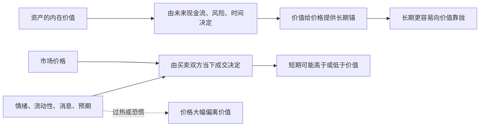

## 财经思维筑基课: 价格围绕价值波动
  
### 作者  
digoal  
  
### 日期  
2026-04-30 
  
### 标签  
价格 , 短期 , 价值 , 长期 , 回归 , 波动 
  
----  
  
## 背景 
  
短期价格受情绪、流动性、政策、资金面影响；长期价格更接近基本价值。  
  
这也是价值投资的核心前提之一。  
    
> 面向对象: 初中到高中学生  
> 核心问题: 为什么一个东西的市场价格经常上上下下，但人们还是会说它“真正值多少钱”？  
> 先说结论: 价格是市场当下成交出来的数字，价值是一个资产未来能带来多少真实好处的判断。价格会受情绪、资金、消息和预期影响而偏离价值，但如果价值基础还在，价格往往会在长期里围绕价值波动，而不是永远脱离。

## 一张图先看懂



## 求真讲法

### 它到底说了什么

“价格围绕价值波动”先要把两个词拆开。

| 概念 | 通俗解释 | 容易受什么影响 |
|---|---|---|
| 价格 | 现在市场上真实成交的数字 | 情绪、消息、资金、抢购、恐慌 |
| 价值 | 这个东西未来大概能带来多少真实好处 | 现金流、用途、风险、时间 |

比如，一只股票今天 20 元，这个 `20` 是价格。  
但它“到底值不值 20 元”，是在问价值。

这条原则说的不是“价格等于价值”，而是：

**价格经常会偏离价值，但价值像一根看不见的绳子，把价格长期拉在附近。**

为什么会偏离？

- 有人乐观，愿意追高。
- 有人恐慌，急着卖出。
- 短期资金突然很多或很少。
- 一条消息改变了市场预期。
- 大家都在猜别人会怎么想，而不是只看基本面。

所以，市场里每天看到的是价格，真正需要判断的是价值。

### 它是怎么来的

这条原则来自两组事实同时成立。

第一组事实：**短期市场是交易出来的。**  
谁更急着买，谁更急着卖，都会影响价格。只要成交发生，那个时点的价格就被定下来了。

第二组事实：**长期资产不能完全脱离其回报能力。**  
如果一个资产未来几乎带不来现金流、使用价值或稀缺性支撑，它的高价很难长期维持；反过来，如果一个资产能稳定创造真实回报，价格长期过低也很难永远持续。

这就形成了一个常见图景：

```text
短期:
价格更像情绪表

长期:
价格更像成绩单
```

在价值投资和公司金融里，人们常把“价值”建立在未来现金流、风险和时间上；而“价格”则是市场在某一刻给出的报价。于是就会出现：

- 好公司也可能因为恐慌而跌得很低。
- 差资产也可能因为热潮而涨得很高。
- 但如果基本面长期没有跟上，偏离通常很难永久维持。

### 它依赖哪些假设

“价格围绕价值波动”要成立，依赖几个重要前提。

| 假设 | 含义 | 如果不成立会怎样 |
|---|---|---|
| 价值有相对稳定的基础 | 可以从现金流、用途、稀缺性等估计 | 如果价值本身无法判断，回归就难谈起 |
| 市场不会永远只看情绪 | 最终会有人关心回报和基本面 | 如果市场长期只靠博傻，价格会长期失真 |
| 信息会逐步传播 | 错误定价有机会被修正 | 如果信息被封锁，偏离可能持续更久 |
| 交易和竞争持续存在 | 高估和低估会吸引不同参与者 | 如果没人能交易，价格修正就很慢 |

注意，这条原则说的是“围绕”和“波动”，不是说价格会机械地、立刻地回到某个精确数字。现实里，价格偏离价值可能持续很久。

### 常见误解

**误解一：价格就是价值。**  
不对。价格只是当下成交数字，不自动等于长期合理价值。

**误解二：只要价格跌了，就是便宜。**  
不对。价格跌可能是低估，也可能是价值本身变差了。

**误解三：价格最终会回归价值，所以只要死等就行。**  
不对。前提是你对价值判断没错，而且你有足够时间和承受力等它回归。

**误解四：价值是固定不变的。**  
不对。公司经营变了、竞争格局变了、利率变了，价值本身也会变。

## 求存讲法

### 它有什么用

这条原则最大的用处，是教你不要把“市场报价”直接当成“真实价值”。

看到一个东西涨得很快，不要只问：

- 它又涨了多少？

还要问：

- 它的价值有没有同步提高？
- 这个涨幅来自业绩、现金流和竞争力，还是来自情绪和资金推动？
- 如果现在价格很高，我买的是价值，还是别人的兴奋？

同样，看到价格大跌，也不要立刻以为“完了”，还要判断价值有没有一起塌掉。

### 它怎么迁移到熟悉领域

这个原则可以迁移到很多学生熟悉的场景。

| 场景 | 价格类指标 | 价值类指标 |
|---|---|---|
| 二手物品 | 当下挂价 | 实际使用寿命、功能、需求 |
| 考试成绩 | 一次分数波动 | 长期真实能力 |
| 社交评价 | 一时热度、点赞 | 真实信誉和长期信任 |
| 校园活动 | 当场人气 | 是否真正有内容和持续影响 |

比如一次考试失手，分数像“价格”，真实学习能力更像“价值”。  
分数会波动，但长期能力不会因为一次波动就彻底消失；反过来，偶然考高也不代表能力已经稳定提高。

### 它的适用范围和边界

这条原则适合用于：

- 理解股票、房产、债券、商品等资产的价格变化。
- 区分短期噪音和长期基本面。
- 防止把市场热度误当成内在价值。
- 训练“先问价值，再看价格”的思维顺序。

但它也有边界。

第一，不是所有东西的价值都容易算。  
有些资产，比如艺术品、收藏品、加密资产，价值判断本身就更依赖共识和预期。

第二，价格偏离价值可以持续很久。  
你可能方向判断对了，但时间判断错了。

第三，价值也会变化。  
如果行业恶化、技术落后、政策变化，原来的价值判断可能失效。

第四，短期资金压力会压过长期判断。  
即使你知道价格低于价值，如果你中途扛不住，也未必等得到回归。

### 正例: 怎么用它提升能力

假设学校里有两本二手参考书。

甲书因为最近很多人抢着买，价格从 20 元涨到 50 元。  
乙书因为封面旧一些，只卖 15 元，但内容完整、可正常使用。

如果只看价格，甲好像更“值钱”。  
但如果你是买来学习，就该看价值：

- 内容是否完整。
- 是否真的适合你的课程。
- 能不能帮你提升成绩。

这时，乙的价值可能更高，而价格反而更低。  
这就是“价格低于价值”的日常版理解。

### 反例: 前提不成立会怎样

假设有人说：“这个股票最近涨得很快，所以它一定越来越有价值。”

这句话的问题是，把“价格上涨”直接当成了“价值提高”。

可能真实情况是：

- 公司业绩并没有变好。
- 现金流没有明显改善。
- 只是市场情绪高涨，资金追逐热门题材。

这里失败的原因，是忽略了“价值有相对稳定基础”这个前提。  
如果价值本身没有同步增强，价格上涨就可能只是短期偏离，而不是长期价值抬升。

## 思考

为什么市场里那么多人明知道“价格不等于价值”，还是会被价格牵着走？

因为价格是每天都能看到的，价值却需要推理、比较和等待。  
价格给的是即时刺激，价值给的是延迟验证。人更容易被眼前数字影响，而不是被看不见的长期逻辑约束。

这也说明了一个更深的问题：

- 你看到的是价格，还是价格背后的原因？
- 你是在判断价值，还是在猜别人接下来会不会更激动？
- 如果市场暂时不认同你的判断，你能不能承受这段偏离？

成熟的财经思维，不是背一句“价格终将回归价值”，而是训练自己不断区分：

- 什么是价格噪音？
- 什么是价值变化？
- 什么是情绪推动？
- 什么是基本面改善？

只有先分清这些，价格与价值这组概念才真正有用。

## 最后记住

1. 价格是当下成交数字，价值是未来真实好处的判断，两者不是一回事。
2. 短期价格常受情绪、资金和消息影响，可能高于或低于价值。
3. 如果价值基础还在，价格长期更容易围绕价值波动，而不是永远脱离。
4. 价格下跌不一定低估，价格上涨也不一定价值提高，关键要看基本面是否变化。
5. 真正重要的能力不是盯价格本身，而是分清价格波动和价值变化。

## 参考资料

- Benjamin Graham, *The Intelligent Investor*, 关于价格与价值区分的经典投资框架。
- Seth A. Klarman, *Margin of Safety*, 关于市场价格偏离价值和安全边际的讨论框架。
- Aswath Damodaran, *Investment Valuation*, 关于价值估计、价格与价值关系的教学框架。
- 本文为面向学生的简化解释，基于通用投资学与公司金融教材框架，不构成投资建议。
  
  
#### [PostgreSQL 解决方案集合](../201706/20170601_02.md "40cff096e9ed7122c512b35d8561d9c8")
  
  
#### [德哥 / digoal's Github - 公益是一辈子的事.](https://github.com/digoal/blog/blob/master/README.md "22709685feb7cab07d30f30387f0a9ae")
  
  
#### [About 德哥](https://github.com/digoal/blog/blob/master/me/readme.md "a37735981e7704886ffd590565582dd0")
  
  

  
