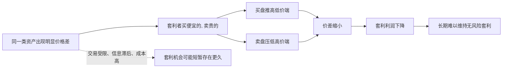

## 财经思维筑基课: 市场不会长期容忍无风险套利
  
### 作者  
digoal  
  
### 日期  
2026-04-30 
  
### 标签  
无风险套利 , 隐藏成本 , 价差 , 信息差 
  
----  
  
## 背景 
如果某个机会真的“无风险稳赚”，大量资金会迅速涌入，把利润压低甚至抹平。  
  

> 面向对象: 初中到高中学生  
> 核心问题: 为什么如果市场里真有“稳赚不赔”的机会，它通常不会一直摆在那里等人捡？  
> 先说结论: 无风险套利指的是几乎不承担风险，就能靠价格差稳定赚钱。财经世界里，这种机会一旦明显存在，资金通常会迅速涌入，把便宜的买贵、把贵的卖便宜，直到价差被压缩，所以它很难长期存在。

## 一张图先看懂



## 求真讲法

### 它到底说了什么

“市场不会长期容忍无风险套利”可以先拆成两部分。

第一，什么叫**套利**？  
套利通常是指：利用同一件东西或高度相似的东西，在不同市场、不同时间、不同形式下出现的价格不一致，进行低买高卖。

第二，什么叫**无风险套利**？  
这里说的不是“感觉很稳”，而是指在设计上，收益几乎已经锁定，承担的市场风险非常小，甚至理论上接近零。

比如一个极简例子：

| 市场 | 同一种商品价格 |
|---|---:|
| 甲市场 | 10 元 |
| 乙市场 | 15 元 |

如果你能立刻在甲市场买入，再立刻在乙市场卖出，而且没有运费、时间差、税费、信用风险，那么中间的 5 元差价就是套利空间。

这条原则说的是：

**真正明显、可重复、低风险的赚钱价差，不会长期安静地存在，因为别人也会发现，也会来做。**

### 它是怎么来的

这条原则的动机非常朴素：人会追逐便宜和利润。

如果同样的东西在两个地方价格不一样，套利者就会做两件事：

- 买入被低估、较便宜的一边。
- 卖出被高估、较昂贵的一边。

这两个动作会反过来改变价格：

- 买的人多了，便宜那边价格会上升。
- 卖的人多了，贵的那边价格会下降。

于是原来的价差就会变小。

可以用一个简单的 ASCII 图看：

```text
原来:
低价市场  ----10元---->  高价市场 15元
             差价 5 元

套利发生后:
低价市场价格被买高
高价市场价格被卖低

最后:
12.4 元  <----> 12.7 元
差价接近被成本吃掉
```

现代金融学里，很多定价关系背后都隐含这个逻辑。  
如果完全相同的现金流组合，市场却给出不同价格，就会吸引套利交易。正因为套利者不断修正这些不一致，很多价格关系才不会长期严重跑偏。

### 它依赖哪些假设

这条原则成立，需要几个关键前提。

| 假设 | 含义 | 如果不成立会怎样 |
|---|---|---|
| 套利者能发现机会 | 信息能传播，错误定价可见 | 如果没人发现，价差可能持续 |
| 可以实际交易 | 能买便宜的，也能卖贵的 | 如果一边不能交易，套利做不成 |
| 交易成本不太高 | 手续费、运费、税费不会吃掉利润 | 成本太高会让“套利”消失 |
| 时间差可控 | 价格不会在执行中剧烈反转 | 如果来不及锁定，风险会出现 |
| 资金和规则允许 | 有资金、有额度、能融券、能转移资产 | 限制太多时，价差难以被抹平 |

这也说明一句很重要的话：

> 无风险套利很少是“市场太傻”，更常见的是你还没把成本、约束、时间差和规则限制算进去。

### 常见误解

**误解一：只要看到两个价格不一样，就是套利。**  
不对。还要扣掉手续费、运输、税、时间差和执行风险。

**误解二：套利就是轻松捡钱。**  
不对。很多看似套利的机会，其实暗藏信用风险、流动性风险或规则风险。

**误解三：既然市场不会长期容忍套利，那市场一定永远有效。**  
不对。市场会出错，也会短暂失衡；这条原则说的是“难以长期持续”，不是“从不出现”。

**误解四：没有套利机会，就说明所有价格都完全正确。**  
不对。价格可以偏离价值，只是这种偏离不一定能被你无风险利用。

## 求存讲法

### 它有什么用

这条原则最大的作用，是帮你识别“稳赚不赔”宣传里藏着什么没说清楚。

只要有人说：

- 零风险。
- 高收益。
- 可复制。
- 长期稳定。

你就应该立刻追问：

- 如果真这么好，为什么别人还没把它做没？
- 这里被忽略的成本是什么？
- 有什么交易限制？
- 风险是不是从“价格风险”变成了“信用风险、流动性风险、规则风险”？

这条原则不是让你不相信机会，而是让你先找隐藏条件。

### 它怎么迁移到熟悉领域

这个原则也能迁移到学生熟悉的日常场景。

| 场景 | “套利”式机会 | 为什么不会长期存在 |
|---|---|---|
| 校园二手交易 | 某类教材一边很便宜，另一边很贵 | 很快就会有人转卖，价差缩小 |
| 演唱会门票 | 原价票和高价转卖票差很多 | 更多人开始抢票转卖，规则也会收紧 |
| 游戏道具 | 不同区服价格差明显 | 玩家倒货或官方修规则，差价会缩小 |
| 补习资料 | 某渠道长期低价 | 很快被更多人发现，供需会调整 |

迁移后的核心思想是：

> 只要一份“低风险好处”大家都能看到、都能复制，它通常就会因为竞争而缩水。

### 它的适用范围和边界

这条原则适合用于：

- 理解为什么金融市场中明显错误定价难以长期持续。
- 辨别“稳赚不赔”是不是忽略了成本和约束。
- 理解竞争为什么会压缩超额利润。
- 帮助建立更严谨的风险意识。

但它也有边界。

第一，短期套利机会确实会出现。  
信息传播不是瞬间完成的，市场也会因为恐慌、技术故障、规则变化出现短暂错位。

第二，有些“套利”不是无风险，只是风险不明显。  
比如你以为锁定价差了，结果交易对手违约、资产提不出来、规则突然变化。

第三，有些价差本来就是成本补偿。  
不同市场价格不同，可能不是错，而是反映运输、税费、监管和流动性差异。

第四，普通人未必能参与真正的套利。  
因为专业套利 often 需要速度、系统、资金和交易权限。这里不展开术语，只强调一点：机会存在，不等于谁都能做。

### 正例: 怎么用它提升能力

假设学校附近两家文具店卖同一款计算器。

- A 店卖 80 元。
- B 店卖 100 元。

如果这两家店距离很近、货是一样的、没有其他差别，那么一些学生会去 A 店买，再有人把信息告诉同学。结果会发生什么？

- 更多人去 A 店买，A 店可能提价。
- B 店发现卖不动，可能降价。

最后，两家店的价格会更接近。  
这就是“市场不会长期容忍明显无风险套利”的日常版本：大家一旦发现同样东西有明显价差，就会用行动把价差压小。

### 反例: 前提不成立会怎样

假设有人说：“我发现两个平台有价差，所以这一定是无风险套利。”

这句话常常错在忽略了前提。比如：

- 平台 A 买到后不能立刻转到平台 B。
- 转移过程要很久，价格已经变了。
- 手续费和提现费很高。
- 平台 B 的高价是挂单价，不是真成交价。
- 平台本身存在信用风险。

这里失败的根本原因，不是“套利理论错了”，而是“可以实际交易、交易成本不太高、时间差可控”这些前提不成立。结果看起来是无风险套利，做进去才发现并不无风险。

## 思考

为什么“不会长期容忍无风险套利”这句话这么重要？

因为它逼着你从“看到价差就兴奋”，转向“检查条件是否成立”。

真正成熟的财经思维，不是看到两个价格不一样就喊机会，而是逐项核对：

- 这是不是同一种东西？
- 能不能同时买和卖？
- 成本有没有算全？
- 价格能不能锁定？
- 风险是不是只是被换了个地方藏起来？

这条原则背后更深的一层，是竞争会消灭明显免费午餐。  
世界上不是没有机会，而是大多数公开、简单、低风险、可复制的机会，一旦被看见，就会因为竞争而迅速变普通。

## 最后记住

1. 无风险套利指的是几乎不承担风险，就能靠价格不一致稳定赚钱的机会。
2. 这类机会一旦明显存在，套利者会买便宜的、卖贵的，迅速把价差压缩。
3. 所以市场不会长期容忍明显、可复制、低成本的无风险套利。
4. 看到“稳赚不赔”时，重点不是先兴奋，而是先找隐藏的成本、限制和风险。
5. 短期错价会出现，但“短期存在”不等于“长期摆在那里等你捡”。

## 参考资料

- John C. Hull, *Options, Futures, and Other Derivatives*, 关于无套利定价和金融合约关系的教材体系。
- Stephen A. Ross, Randolph W. Westerfield, Jeffrey Jaffe, *Corporate Finance*, 关于无套利思想与金融定价的基础框架。
- Zvi Bodie, Alex Kane, Alan J. Marcus, *Investments*, 关于市场效率、套利和错误定价修正的教材体系。
- 本文为面向学生的简化解释，基于通用金融学教材框架，不构成投资建议。

  
  
#### [PostgreSQL 解决方案集合](../201706/20170601_02.md "40cff096e9ed7122c512b35d8561d9c8")
  
  
#### [德哥 / digoal's Github - 公益是一辈子的事.](https://github.com/digoal/blog/blob/master/README.md "22709685feb7cab07d30f30387f0a9ae")
  
  
#### [About 德哥](https://github.com/digoal/blog/blob/master/me/readme.md "a37735981e7704886ffd590565582dd0")
  
  

  
