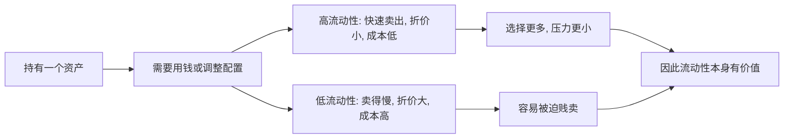

## 财经思维筑基课: 流动性本身有价值
  
### 作者  
digoal  
  
### 日期  
2026-04-30 
  
### 标签  
流动性 , 资产 , 出售 , 时间 , 折价 
  
----  
  
## 背景 
越容易快速变现、且不大幅折价的资产，通常越有价值。  
  
危机时，流动性甚至比账面收益更重要。  
  

> 面向对象: 初中到高中学生  
> 核心问题: 为什么两个看起来差不多值钱的东西，一个更容易变现，往往就更“值钱”一些？  
> 先说结论: 流动性指的是一个资产能不能在较短时间内、以较低成本、在不大幅降价的情况下卖出去。流动性本身有价值，因为它给持有者更多选择权、应急能力和更低的被动损失。

## 一张图先看懂



## 求真讲法

### 它到底说了什么

“流动性本身有价值”先要回答两个问题。

第一，什么是**流动性**？  
不是简单地“能不能卖”，而是：

- 能不能比较快卖掉。
- 卖的时候需不需要大幅降价。
- 交易成本高不高。
- 市场上有没有足够多买家。

第二，为什么它本身算价值的一部分？  
因为同样一笔财富，能不能及时用出来，会直接影响它对你的实际意义。

一个简单对比：

| 资产 | 名义价值 | 变现速度 | 变现时折价 | 流动性 |
|---|---:|---|---|---|
| 活期存款 | 1 万元 | 很快 | 几乎没有 | 高 |
| 很偏远的收藏品 | 1 万元 | 很慢 | 可能很大 | 低 |

虽然两者都“值 1 万元”，但在你急需交学费、付医疗费或抓住机会时，前者的实际可用价值更高。

所以，这条原则真正表达的是：

**资产不仅看“账面值多少”，还要看“关键时刻能不能顺利变成可用的钱”。**

### 它是怎么来的

这条原则来自现实中的几个朴素事实。

第一，人的需求常常有时间限制。  
需要交房租、交学费、救急时，晚几个月卖掉和今天卖掉，差别很大。

第二，低流动性资产容易被迫折价。  
如果你急着卖，但市场上买家很少，你就不得不降价。

第三，流动性差会放大风险。  
资产本身可能没有坏掉，但在需要现金的时候，如果卖不出去，就会变成麻烦。

第四，流动性提供选择权。  
你手里有高流动性资产，就更容易等待、更容易切换、更容易抓住新机会。

可以把它理解成：

```text
同样 100 元财富
如果一种今天能稳稳拿出来用
另一种要等很久还要打七折
它们对你的真实意义并不相同
```

所以在金融市场里，人们通常愿意为更高流动性付出一点代价，比如接受更低收益；而低流动性资产往往需要给出更高回报，来补偿持有者承担的不便和风险。

### 它依赖哪些假设

“流动性本身有价值”成立，依赖几个前提。

| 假设 | 含义 | 如果不成立会怎样 |
|---|---|---|
| 人有现金需求或调整需求 | 变现能力真的有用 | 如果永远不需要用钱，流动性价值会下降 |
| 市场中买家数量有限 | 卖得快慢和价格会不同 | 如果任何东西都能瞬间公平成交，流动性差异会缩小 |
| 时间本身有成本 | 等待不是免费的 | 如果等待没有代价，流动性溢价会减弱 |
| 被迫卖出的情况会发生 | 紧急状态下流动性尤其重要 | 如果永远不会急用钱，流动性的重要性会下降 |

这说明流动性不是抽象名词，而是和“时间压力”“交易成本”“选择权”绑在一起的。

### 常见误解

**误解一：只要能卖出去，就说明流动性没问题。**  
不对。关键是卖得快不快、价格损失大不大、成本高不高。

**误解二：高收益资产更好，流动性差没关系。**  
不对。收益高可能只是对低流动性的补偿，真到急用钱时，麻烦会暴露。

**误解三：流动性只在金融市场里重要。**  
不对。二手房、收藏品、库存、时间安排、技能切换，都有流动性问题。

**误解四：价格高就等于流动性好。**  
不对。一个东西可以很贵，但买家少、转手慢，流动性仍然差。

## 求存讲法

### 它有什么用

这条原则最大的作用，是让你在看“值多少钱”之外，再多问一句：

- 如果我现在就需要钱，能不能顺利拿出来？

这会改变很多判断：

- 选高收益但锁很久的产品，还是选更灵活的产品？
- 把钱都压在房子、收藏品、长期项目里，还是留一部分现金？
- 做预算时，为什么不能把“总资产不少”误当成“不会缺现金”？

财经里很多危机，不是因为“总资产突然归零”，而是因为短时间拿不出现金。

### 它怎么迁移到熟悉领域

这个原则很容易迁移到学生熟悉的资源管理。

| 场景 | 高流动性资源 | 低流动性资源 |
|---|---|---|
| 时间安排 | 可自由支配的空档 | 被排满、无法调整的日程 |
| 技能 | 可立即拿来解决问题的基础能力 | 学了但很久不用、转化慢的知识 |
| 人际支持 | 随时能帮忙的人 | 关系看似多，但真需要时帮不上 |
| 学习资料 | 随手可用、整理好的笔记 | 堆很多资料但临时找不到重点 |

迁移后的核心意思是：

> 资源不只是“有没有”，还要看“能不能在需要的时候用出来”。

### 它的适用范围和边界

这条原则适合用于：

- 理解现金、存款、股票、房产、私募资产等不同资产的差异。
- 做个人预算和资产配置。
- 理解为什么紧急备用金重要。
- 识别“账面很富，但现金很紧”的风险。

但它也有边界。

第一，流动性高不一定代表长期回报高。  
现金最灵活，但长期收益通常不如一些低流动性资产。

第二，低流动性不一定是坏事。  
有些长期投资本来就不该频繁交易，低流动性可能换来更高长期回报。

第三，流动性价值会随环境变化。  
平时大家不太在意，危机时流动性的价值会陡然上升。

第四，流动性也有成本。  
越容易随时拿出来的钱，往往收益越低，因为你买到了灵活性。

### 正例: 怎么用它提升能力

假设一个学生有 3000 元积蓄。

方案 A：全部拿去买一个转手慢、价格不透明的收藏品。  
方案 B：留 1000 元应急，剩下 2000 元再做长期安排。

如果突然要交报名费、换电脑配件或看病，方案 B 明显更稳。  
它不一定让总收益最高，但它保留了选择权，减少了被迫低价处理资产的概率。

这说明成熟决策不只是追求名义收益，还要考虑：

- 遇到突发情况怎么办？
- 我有没有缓冲？
- 我是不是把自己逼到只能被动卖出的地步？

### 反例: 前提不成立会怎样

假设有人说：“我总资产很多，所以完全没必要留现金。”

这句话的问题，是把“账面财富”直接当成了“可用现金”。

可能真实情况是：

- 资产都在房产、长期锁定产品、难转手物品里。
- 突然需要一笔钱时，卖不出去，或者只能大幅折价。
- 最后不是因为没资产，而是因为没流动性而陷入困境。

这里失败的根本原因，不是“资产价值判断错了”，而是忽略了“人有现金需求或调整需求”“时间本身有成本”这两个前提。资产存在，不等于它能及时救场。

## 思考

为什么平时很多人不重视流动性，往往要到压力来时才突然发现它很重要？

因为在平稳时期，大家更容易盯着收益和账面升值；流动性像空气，不出问题时感觉不到，一旦缺了才知道它有多贵。

这也引出几个更深的问题：

- 你拥有的是“资产数字”，还是“可用选择权”？
- 你在追求更高收益时，牺牲了多少流动性？
- 如果环境突然变差，你会不会被迫在最差的时候卖东西？

成熟的财经思维，不只是会算收益率，还会问：

- 这笔钱多久能拿出来？
- 拿出来要付出多大代价？
- 如果很多人同时想卖，会发生什么？

流动性本身有价值，说到底是在提醒你：财富不只是拥有多少，还包括你在关键时刻有多自由。

## 最后记住

1. 流动性不是“能不能卖”，而是能不能快卖、少折价、低成本地变成可用现金。
2. 流动性本身有价值，因为它提供应急能力、选择权和更低的被动损失。
3. 同样账面价值的资产，流动性更高的那一个，在很多情况下实际更有用。
4. 高收益有时只是对低流动性的补偿，不能只盯收益不看变现难度。
5. 真正稳健的决策，不只是追求总资产，还要安排好在关键时刻可用的流动性。

## 参考资料

- Zvi Bodie, Alex Kane, Alan J. Marcus, *Investments*, 关于流动性、收益和资产特征的基础框架。
- Richard A. Brealey, Stewart C. Myers, Franklin Allen, *Principles of Corporate Finance*, 关于流动性管理和资金安排的教材体系。
- Hyman P. Minsky 相关金融不稳定框架常强调现金流与流动性压力的现实重要性；本文仅借用其中通用思想，不展开模型细节。
- 本文为面向学生的简化解释，基于通用投资学与公司金融教材框架，不构成投资建议。
  
  
#### [PostgreSQL 解决方案集合](../201706/20170601_02.md "40cff096e9ed7122c512b35d8561d9c8")
  
  
#### [德哥 / digoal's Github - 公益是一辈子的事.](https://github.com/digoal/blog/blob/master/README.md "22709685feb7cab07d30f30387f0a9ae")
  
  
#### [About 德哥](https://github.com/digoal/blog/blob/master/me/readme.md "a37735981e7704886ffd590565582dd0")
  
  

  
