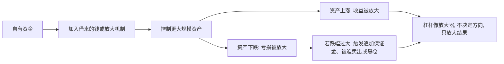

## 财经思维筑基课: 杠杆放大收益, 也放大风险
  
### 作者  
digoal  
  
### 日期  
2026-04-30 
  
### 标签  
杠杠 , 放大 , 收益 , 风险 , 资产波动 , 保证金 , 平仓 
  
----  
  
## 背景 
杠杆不是创造价值，而是放大结果。  
  
方向对时赚钱更快，方向错时亏损也更快，甚至爆仓。  
  

> 面向对象: 初中到高中学生  
> 核心问题: 为什么借钱、加杠杆看起来能让人赚得更快，也能让人亏得更快？  
> 先说结论: 杠杆本质上是用少量自己的钱，控制更大规模的资产或资源。这样做不会改变方向对错，只会把结果放大。方向对时，收益被放大；方向错时，亏损也会被放大，严重时甚至会把本金迅速打穿。

## 一张图先看懂



## 求真讲法

### 它到底说了什么

“杠杆放大收益，也放大风险”可以先翻成一句最直白的话：

> 你不是用更多本事赚钱，而是用更少的本金去撬动更大的结果。

所谓**杠杆**，常见含义是：

- 借钱投资。
- 用保证金控制更大头寸。
- 用负债去买资产。
- 用少量资源撬动更大规模行动。

它的核心不是神秘技巧，而是一个比例问题。

一个简单例子：

| 情况 | 自己的钱 | 控制的资产 | 资产涨 10% 后结果 |
|---|---:|---:|---|
| 不加杠杆 | 100 元 | 100 元 | 赚 10 元，收益率 10% |
| 加 2 倍杠杆 | 100 元 | 200 元 | 赚 20 元，收益率 20% |

看起来很诱人，但如果资产跌 10%：

| 情况 | 自己的钱 | 控制的资产 | 资产跌 10% 后结果 |
|---|---:|---:|---|
| 不加杠杆 | 100 元 | 100 元 | 亏 10 元，亏损率 10% |
| 加 2 倍杠杆 | 100 元 | 200 元 | 亏 20 元，亏损率 20% |

所以，这条原则真正要说的是：

**杠杆不会让一个坏决定变成好决定，只会让结果更剧烈、更快地显现。**

### 它是怎么来的

杠杆为什么会放大结果？因为你承担结果的基数变大了，而你的缓冲垫没有同比例变大。

如果你只有 100 元自己的钱，却控制了 300 元资产，那么资产价格每波动 1%，对你实际权益的影响，就不再只是 1%。

可以用一个极简公式理解：

```text
权益变化率 ≈ 资产变化率 × 杠杆倍数
```

这不是每个场景都严格一模一样，但对入门理解足够了。

比如：

- 房子首付一部分，其余按揭，本质上就是杠杆。
- 融资买股票、期货保证金交易，也是杠杆。
- 企业用负债扩张经营，也是杠杆。

所以杠杆之所以常见，是因为它能让人用更少资本做更大的事。  
问题在于，它把“更大机会”和“更大脆弱性”绑在了一起。

### 它依赖哪些假设

“杠杆放大收益，也放大风险”成立，依赖几个关键前提。

| 假设 | 含义 | 如果不成立会怎样 |
|---|---|---|
| 你控制的资产会波动 | 价格不是固定不变 | 如果资产完全不波动，放大效应就不明显 |
| 借来的资金不是免费的 | 要付利息、手续费或保证金成本 | 成本越高，赚钱门槛越高 |
| 对方会追踪你的风险 | 跌太多时会要求补钱或强平 | 这会让亏损更快兑现 |
| 你本金有限 | 缓冲垫不是无限大 | 跌幅一大，本金很快耗尽 |

这也解释了为什么很多人不是因为“方向永远错”，而是因为**即使方向最终可能对，中间波动太大，先被杠杆压死了。**

### 常见误解

**误解一：杠杆只是让赚钱更快。**  
不对。它同样让亏钱更快，而且亏损常常比收益更致命。

**误解二：只要我判断对大趋势，就可以放心加杠杆。**  
不对。中间的短期波动、融资成本和追加保证金要求，可能让你等不到“大趋势兑现”。

**误解三：小仓位加杠杆没事。**  
不对。只要杠杆存在，风险结构就变了，不能只看起点本金小不小。

**误解四：杠杆高说明能力强。**  
不对。高杠杆更常说明缓冲更薄，容错更低，不代表判断更高明。

## 求存讲法

### 它有什么用

这条原则最实用的地方，是提醒你不要只盯着“能放大多少收益”，还要先算：

- 如果方向错了，我最多会亏多少？
- 我能承受多大的中间波动？
- 有没有可能被迫卖出？
- 杠杆成本会不会吃掉收益？

很多人不是输在“长期逻辑”，而是输在杠杆让自己没资格活到长期。

### 它怎么迁移到熟悉领域

杠杆不只存在于金融，也能迁移到学生熟悉的生活和学习场景。

| 场景 | “杠杆”是什么 | 放大的是什么 |
|---|---|---|
| 时间安排 | 过度压缩休息来换效率 | 短期产出，也放大疲劳和失误 |
| 学习计划 | 一次报太多高强度课程 | 可能放大学习成果，也放大崩盘风险 |
| 人际承诺 | 同时接太多任务 | 可能放大影响力，也放大失信风险 |
| 创业或社团 | 用借来的资源快速扩张 | 可能放大成果，也放大现金流压力 |

迁移后的核心意思是：

> 任何“用较小基础撬动较大结果”的安排，通常都不是只放大利好，也会放大失控成本。

### 它的适用范围和边界

这条原则适合用于：

- 理解贷款买房、融资投资、保证金交易、企业负债经营。
- 判断为什么高杠杆系统更脆弱。
- 提醒自己做决策时先看下行风险。
- 理解“爆仓”“强平”“债务压力”这些现象。

但它也有边界。

第一，杠杆不是天然坏事。  
合理、可控、和现金流匹配的杠杆，可能提高资金效率。

第二，关键不只是杠杆倍数，还包括资产波动、融资成本和现金流稳定性。  
同样 2 倍杠杆，用在稳定资产和高波动资产上，风险完全不同。

第三，低杠杆不代表绝对安全。  
如果资产本身质量差，哪怕不加杠杆也可能亏损。

第四，某些长期项目本来就需要负债。  
问题不在于“是否有杠杆”，而在于“杠杆是否和你的承受能力匹配”。

### 正例: 怎么用它提升能力

假设一个学生准备参加重要考试。

方案 A：每天稳定学习 3 小时，留出睡眠和复盘时间。  
方案 B：为了“冲刺”，每天排 8 小时高强度学习，压缩睡眠和休息。

方案 B 很像一种“时间杠杆”：

- 好的时候，短期刷题量会迅速上升。
- 坏的时候，疲劳、走神、效率下滑也会被放大。

如果这个学生本来基础不错、节奏稳定，方案 A 的收益可能没那么刺激，但更可持续。  
方案 B 则可能在短期内看起来很猛，最后却因为透支而崩掉。

这说明杠杆思维的关键不是“能不能撬大”，而是“撬大之后，我扛不扛得住反作用力”。

### 反例: 前提不成立会怎样

假设有人说：“我只要看准一次行情，用高杠杆狠狠干一把，就能快速翻身。”

这句话的问题，不是看不懂“可能赚钱”，而是忽略了几个前提：

- 市场中途会波动，不会按直线走。
- 借钱有成本。
- 对方不会无限容忍你继续扛。
- 你的本金缓冲很有限。

结果可能是：

- 长期方向后来证明你没错。
- 但中间一次较大波动，就已经让你被强制平仓。
- 最后不是“判断错”，而是“杠杆让你没有继续留在牌桌上的资格”。

这里失败的根本原因，不是“杠杆公式失效”，而是忽略了“资产会波动”“本金有限”“风险会被对手方追踪”这些前提。

## 思考

为什么杠杆这么诱人？

因为它给人一种错觉：好像自己没有变强，只是把结果放大，就能更快抵达目标。  
但财经世界反复提醒人们，放大器从来不只放大顺风，也放大逆风。

这也引出几个更深的问题：

- 你想放大的到底是能力，还是只是仓位？
- 你有没有足够缓冲，扛过中间的坏波动？
- 你追求的是更高收益，还是在用更薄的安全垫换更快的刺激？

成熟的财经思维，不是先问“我能放大多少倍”，而是先问：

- 最坏会怎样？
- 我能不能承受最坏结果？
- 即使判断方向没错，我能不能活到结果兑现？

杠杆真正危险的地方，不是让人亏一点，而是让人失去继续参与未来机会的资格。

## 最后记住

1. 杠杆是用少量自己的钱控制更大规模的资产或资源，本质上是一种放大器。
2. 它不会改变方向对错，只会把好结果和坏结果都放大。
3. 收益被放大的同时，亏损、波动压力、利息成本和被迫卖出的风险也会被放大。
4. 很多人不是输在长期判断，而是输在杠杆让自己扛不过中间波动。
5. 判断杠杆值不值得，不是先看能赚多少，而是先看最坏情况下会不会出局。

## 参考资料

- John C. Hull, *Options, Futures, and Other Derivatives*, 关于保证金、杠杆与风险放大的基础框架。
- Richard A. Brealey, Stewart C. Myers, Franklin Allen, *Principles of Corporate Finance*, 关于财务杠杆与资本结构的教材体系。
- Hyman P. Minsky 相关金融不稳定框架常强调杠杆与脆弱性的关系；本文仅借用其中通用思想，不展开模型细节。
- 本文为面向学生的简化解释，基于通用金融学与公司金融教材框架，不构成投资建议。
  
  
#### [PostgreSQL 解决方案集合](../201706/20170601_02.md "40cff096e9ed7122c512b35d8561d9c8")
  
  
#### [德哥 / digoal's Github - 公益是一辈子的事.](https://github.com/digoal/blog/blob/master/README.md "22709685feb7cab07d30f30387f0a9ae")
  
  
#### [About 德哥](https://github.com/digoal/blog/blob/master/me/readme.md "a37735981e7704886ffd590565582dd0")
  
  

  
