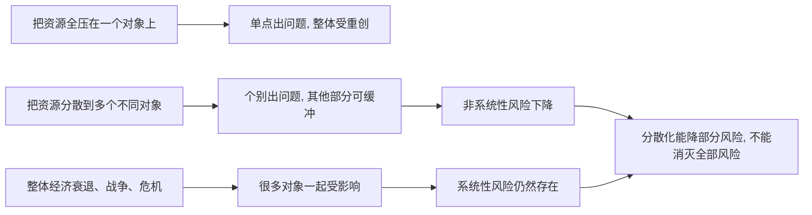

## 财经思维筑基课: 分散化可以降低非系统性风险
  
### 作者  
digoal  
  
### 日期  
2026-04-30 
  
### 标签  
单一风险 , 非系统性风险 , 分散投资 
  
----  
  
## 背景 
不把资金押在单一股票、行业、国家或资产类别上，可以降低个别事件造成的损失。  
  
但分散化不能消除整个市场下跌的系统性风险。  
  
> 面向对象: 初中到高中学生  
> 核心问题: 为什么把鸡蛋放在多个篮子里，通常比全放在一个篮子里更稳？  
> 先说结论: 分散化是把资金、资源或注意力分布到多个不同对象上。这样做不能消灭所有风险，但能减少某一个公司、某一个行业、某一个事件出问题时，对整体造成的致命打击。这种能被分散掉的风险，叫非系统性风险。

## 一张图先看懂



## 求真讲法

### 它到底说了什么

“分散化可以降低非系统性风险”里最关键的是先分清两类风险。

| 风险类型 | 通俗解释 | 能不能靠分散化明显降低 |
|---|---|---|
| 非系统性风险 | 某一个对象自己出事，比如一家公司爆雷 | 通常可以 |
| 系统性风险 | 整体环境出问题，比如经济衰退、市场恐慌 | 很难完全靠分散化消掉 |

所谓**分散化**，不是“随便多买几个”，而是不要把全部命运押在同一个点上。

举个简单例子：

| 方案 | 配置方式 | 一家公司出事的影响 |
|---|---|---|
| 全压一个公司 | 100% 放在 A 公司 | 可能重创全部 |
| 分散到 10 个不同公司 | 每个占 10% 左右 | 一家出事，只伤到一部分 |

所以，这条原则真正表达的是：

**如果风险来自个别对象自身，那么把资源分散到多个相互不完全同步的对象上，就能降低“单点失误毁掉整体”的概率。**

### 它是怎么来的

这条原则来自一个很朴素的事实：不同对象不会总在同一时间、以同样方式出问题。

比如：

- 某家奶茶店经营失败，不代表整条街所有店都会同一天倒闭。
- 某个学生某一门考试失利，不代表所有科目都会一起考砸。
- 某家公司管理层出问题，不代表所有公司都同样出问题。

正因为不同对象的波动不完全同步，把它们组合在一起时，个别坏结果会被其他部分部分对冲。

可以用一个简单的 ASCII 图理解：

```text
单押:
A 出问题  -> 整体几乎全受伤

分散:
A 出问题  -> B、C、D 可能没事
          -> 整体只受部分影响
```

现代投资学会用“相关性”来更精确地描述这种现象。  
如果几个资产不是完全同涨同跌，把它们放在一起，整体波动通常会比单押其中一个更平缓。

这就是分散化的底层动机：**不是预测谁永远不出错，而是承认自己可能看错，所以不让一个错误毁掉全部。**

### 它依赖哪些假设

“分散化可以降低非系统性风险”成立，依赖几个重要前提。

| 假设 | 含义 | 如果不成立会怎样 |
|---|---|---|
| 各对象风险来源不完全相同 | 不会总是一起出事 | 如果完全同涨同跌，分散效果很弱 |
| 你真的分散到了不同对象 | 不是表面分散、实则同一类风险 | 如果都押同一行业，仍可能一起跌 |
| 单个对象的坏消息不会传染全部 | 个别风险主要是局部的 | 如果风险迅速扩散，缓冲作用会减弱 |
| 交易和管理成本可接受 | 分散不会带来过高成本 | 成本太高会吃掉分散的好处 |

这也说明，真正的分散不是“买很多名字不同的东西”，而是“让底层风险来源更分开一些”。

### 常见误解

**误解一：分散化等于不会亏钱。**  
不对。它只能降低一部分风险，不能保证不亏。

**误解二：买得越多越分散。**  
不对。买 20 家同一行业公司，名字很多，底层风险却可能很像。

**误解三：分散化能消灭系统性风险。**  
不对。遇到整体性危机，很多资产可能一起跌。

**误解四：分散化说明不用研究。**  
不对。分散化是承认不确定性，不是放弃判断。

## 求存讲法

### 它有什么用

这条原则最大的作用，是避免“一个判断错，全部出局”。

它提醒你：

- 不要把所有钱压在一个公司、一个行业、一个市场。
- 不要把所有希望压在一个单一方案上。
- 真正的稳健不是每次都猜对，而是即使猜错一次，也还能继续留在场上。

这也是为什么很多长期投资者更重视组合，而不是只谈单个标的。

### 它怎么迁移到熟悉领域

这个原则很容易迁移到学生熟悉的场景。

| 场景 | 单押方式 | 分散方式 |
|---|---|---|
| 学习 | 只靠一门课拉总分 | 多门课均衡准备 |
| 升学 | 只押一个机会 | 同时准备多个路径 |
| 技能 | 只学一种非常窄的技能 | 建立几项可互补能力 |
| 社团/项目 | 所有精力都押一个项目 | 给核心项目外留缓冲 |

迁移后的核心意思是：

> 你不能让一个点的失误，直接决定全部命运。

### 它的适用范围和边界

这条原则适合用于：

- 投资组合配置。
- 风险管理。
- 个人规划和资源分配。
- 理解为什么“集中押注”收益可能更高，但脆弱性也更高。

但它也有边界。

第一，分散化不能对抗所有风险。  
市场整体崩跌时，很多看起来不同的资产也会一起受伤。

第二，过度分散也有代价。  
如果分得太散，可能难以管理，也可能把真正好的机会摊薄。

第三，表面分散不等于真实分散。  
持有很多名字不同、但都受同一宏观因素影响的资产，风险仍可能集中。

第四，分散化降低的是波动和单点打击，不一定提高收益。  
它更像安全设计，而不是收益魔法。

### 正例: 怎么用它提升能力

假设一个学生准备升学。

方案 A：只准备一个方向，所有时间都投入进去。  
方案 B：主攻一个方向，同时保留若干备选路径，并确保基础学科不过度失守。

方案 B 并不一定让最理想结果最大化，但它明显降低了“主路径失利后全盘受挫”的风险。

这就像投资里的分散化：

- 不是因为你不相信主线。
- 而是因为你知道现实里总会有意外。
- 你需要让系统对单点失败更有韧性。

### 反例: 前提不成立会怎样

假设有人说：“我买了 15 只股票，所以已经很分散，风险很低。”

这句话可能错在忽略了底层相关性。  
如果这 15 只股票全来自同一行业，或者都受同一类政策、利率、经济周期强烈影响，那么它们在关键时刻可能一起跌。

这里失败的根本原因，不是“分散化理论错了”，而是“各对象风险来源不完全相同”这个前提不成立。  
看起来分散，实际上还是集中。

## 思考

为什么很多人明知道分散化有用，还是喜欢重仓单押？

因为单押在看对时更刺激，结果更亮眼，也更容易讲出“我眼光准”的故事。  
分散化看起来没那么惊艳，它更像一种承认世界不确定、承认自己可能犯错的思维方式。

这也引出几个更深的问题：

- 你追求的是最高可能收益，还是更高的生存概率？
- 你能接受为了降低毁灭性风险，而放弃一点最极端的上行吗？
- 你所谓的“分散”，到底是名字多，还是风险源真的不同？

成熟的财经思维，不是把分散化当口号，而是反复检查：

- 风险来自哪里？
- 这些风险会不会一起爆发？
- 一处失误会不会拖垮全部？

分散化真正保护的，不只是资产，更是你继续参与未来机会的能力。

## 最后记住

1. 分散化的核心，不是买很多东西，而是不把命运押在单一点上。
2. 它主要降低的是非系统性风险，也就是某个个体、某个行业、某个局部事件带来的风险。
3. 它不能消灭系统性风险，整体市场坏的时候，很多资产仍可能一起受伤。
4. 表面分散不等于真实分散，关键要看底层风险来源是否不同。
5. 分散化更像生存和韧性设计，不是保证高收益的魔法。

## 参考资料

- Harry Markowitz, *Portfolio Selection*, 现代投资组合理论关于分散化与风险的经典起点。
- Zvi Bodie, Alex Kane, Alan J. Marcus, *Investments*, 关于系统性风险、非系统性风险与分散化的教材体系。
- Richard A. Brealey, Stewart C. Myers, Franklin Allen, *Principles of Corporate Finance*, 关于组合风险与资本市场基本框架的教材体系。
- 本文为面向学生的简化解释，基于通用投资学与公司金融教材框架，不构成投资建议。

    
  
#### [PostgreSQL 解决方案集合](../201706/20170601_02.md "40cff096e9ed7122c512b35d8561d9c8")
  
  
#### [德哥 / digoal's Github - 公益是一辈子的事.](https://github.com/digoal/blog/blob/master/README.md "22709685feb7cab07d30f30387f0a9ae")
  
  
#### [About 德哥](https://github.com/digoal/blog/blob/master/me/readme.md "a37735981e7704886ffd590565582dd0")
  
  

  
