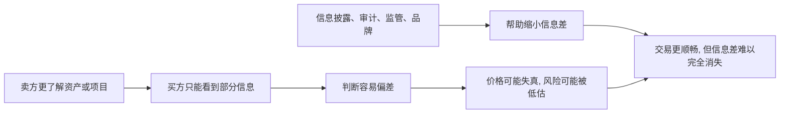

## 财经思维筑基课: 信息不对称普遍存在
  
### 作者  
digoal  
  
### 日期  
2026-04-30 
  
### 标签  
信息披露 , 信息差 , 理解差 , 时间差 , 第三方公平性 , 行动力 
  
----  
  
## 背景 
市场参与者掌握的信息不同，理解能力不同，行动速度也不同。  
  
所以金融市场不是完全公平的牌桌。  
  

> 面向对象: 初中到高中学生  
> 核心问题: 为什么在财经世界里，交易双方常常不是“知道同样多”再做决定？  
> 先说结论: 信息不对称，是指交易双方掌握的信息数量、质量、时点或理解能力不一样。它在财经世界里非常普遍，因为现实中几乎没人能同时、完整、准确地知道同一切。这会影响价格、公平、风险和决策结果。

## 一张图先看懂



## 求真讲法

### 它到底说了什么

“信息不对称普遍存在”可以先翻成一句很直接的话：

> 在很多交易和决策里，一方知道得更多，另一方知道得更少，或者双方虽然看到同样材料，但理解能力并不一样。

这里的“信息差”不只是有没有消息，还包括：

- 知道多少。
- 知道得多早。
- 知道得多准。
- 能不能看懂。
- 能不能及时行动。

一个简单对比：

| 角色 | 可能知道的内容 |
|---|---|
| 卖家 | 东西哪里有毛病、为什么急着卖 |
| 买家 | 只能看到外观、介绍和公开说明 |

在财经世界里，这种情况到处都是：

- 企业管理层比普通投资者更了解公司真实经营。
- 借款人比银行更清楚自己有没有还款能力。
- 卖保险的人和买保险的人，对风险情况掌握得不同。
- 二手交易里，卖家更清楚产品有没有暗伤。

所以，这条原则真正表达的是：

**市场不是所有人都拿着同一份完整答案在交易，而是在信息不完全、理解不一致的条件下做判断。**

### 它是怎么来的

信息不对称之所以普遍，不是因为谁一定在故意骗人，而是因为现实本来就有这些限制。

第一，信息生产成本不一样。  
有人更接近一线经营，有人只能看公开材料。

第二，信息披露有时差。  
很多真实情况先在内部发生，后在外部披露。

第三，理解能力不一样。  
同样一份财报，有人能看出风险，有人只能看见增长数字。

第四，行动能力不一样。  
即使两个人都知道一件事，一个人能立刻交易，另一个人可能来不及。

可以用一个简单的 ASCII 图理解：

```text
现实世界:
信息产生  ->  被部分人先看到  ->  被市场慢慢理解  ->  价格逐步反应

不是:
信息产生  ->  所有人同时完整知道  ->  立刻完全反映
```

这就是为什么财经学里会反复讨论“逆向选择”“道德风险”“信号传递”“信息披露”和“市场效率”。  
它们背后都在处理同一个现实：信息并不均匀地分布在所有人手里。

### 它依赖哪些假设

“信息不对称普遍存在”成立，依赖的是对现实的基本观察。

| 假设 | 含义 | 如果不成立会怎样 |
|---|---|---|
| 信息获取有成本 | 不可能人人零成本知道全部 | 如果人人全知全能，信息差会大幅缩小 |
| 人的理解力不同 | 同样材料会得出不同判断 | 如果人人理解完全一致，误差会减少 |
| 披露不是瞬时完全的 | 内部与外部存在时间差 | 如果所有信息同步公开，信息差会变小 |
| 激励并不完全一致 | 有人可能选择性表达信息 | 如果各方总是完全坦诚，风险会下降 |

这也说明，“信息不对称普遍存在”不是阴谋论，而是正常世界的默认背景。

### 常见误解

**误解一：信息不对称就是有人在撒谎。**  
不对。有人故意隐瞒是一种情况，但很多时候只是信息天然分布不均。

**误解二：公开信息时代，信息不对称已经消失。**  
不对。公开材料更多了，但筛选、理解、验证和行动能力仍然差很多。

**误解三：只要我知道得比别人多一点，就一定能赚钱。**  
不对。知道更多不等于理解更深，也不等于能正确行动。

**误解四：信息不对称只存在于金融市场。**  
不对。求职、二手交易、医疗、教育、租房里都很常见。

## 求存讲法

### 它有什么用

这条原则最大的作用，是提醒你在做财经判断时，不要默认“别人和我一样不知道”。

你需要多问几句：

- 对方为什么愿意把这个机会给我？
- 他是不是知道我不知道的东西？
- 我看到的是完整情况，还是包装后的片段？
- 如果我判断错，可能错在信息少、理解浅，还是行动慢？

这会直接改变你对风险的估计。

### 它怎么迁移到熟悉领域

这个原则很容易迁移到学生熟悉的日常场景。

| 场景 | 信息更多的一方 | 信息更少的一方 |
|---|---|---|
| 二手交易 | 卖家更了解物品真实状况 | 买家只能看外观和介绍 |
| 找家教或培训 | 提供服务者更了解真实质量 | 学生和家长多靠宣传判断 |
| 组队合作 | 某些成员更清楚自己投入多少 | 其他人未必看得到全部过程 |
| 求职/面试 | 应聘者更清楚自己真实能力 | 招聘方只能通过材料和面试推测 |

迁移后的核心意思是：

> 当你不是最了解情况的人时，不能假装自己已经看清全部。

### 它的适用范围和边界

这条原则适合用于：

- 理解为什么财经交易里需要审计、披露、评级、担保和监管。
- 理解为什么市场价格有时会失真。
- 帮助自己做更保守、更有验证意识的决策。
- 识别“包装得很好”的机会里可能隐藏的信息缺口。

但它也有边界。

第一，信息不对称不等于所有交易都不可信。  
很多制度设计，就是为了缩小信息差，让交易仍然可以发生。

第二，信息更多的一方不一定总能占便宜。  
有时他虽然知道更多，但市场规则、竞争和声誉约束会限制其行为。

第三，信息差不能被完全消灭。  
现实里只能尽量缩小，不能幻想人人完全对称。

第四，知道自己信息少，并不代表什么都不能做。  
关键是提高验证、比较、提问和留安全边际的能力。

### 正例: 怎么用它提升能力

假设一个学生想买二手平板。

如果他知道“卖家通常更清楚设备真实情况”，他就不会只看一句“九成新”，而会多做几步：

- 问电池健康和维修记录。
- 当面测试关键功能。
- 看有没有购买凭证。
- 比较多个卖家的报价和描述。

这些动作不能保证完全没有风险，但能显著缩小信息差。  
这就是把“信息不对称普遍存在”变成实际能力：不天真，不猜测，用验证补信息缺口。

### 反例: 前提不成立会怎样

假设有人说：“平台上大家都公开发信息，所以信息已经完全透明，我只要看宣传页就够了。”

这句话的问题，在于忽略了几个前提：

- 信息获取有成本，你未必看到了关键细节。
- 披露可能不完整，宣传页通常会突出优点。
- 就算材料公开，你也未必看得懂隐藏的条件和风险。

结果可能是：

- 你以为自己掌握了全部。
- 实际上只是看到了对方想让你先看到的部分。
- 最后不是机会本身神秘，而是你把“公开”误当成了“完整”和“对称”。

这里失败的根本原因，不是“信息不对称理论夸张”，而是错误地把“有信息”当成了“信息充分且均衡”。

## 思考

为什么财经世界越复杂，信息不对称反而越难消失？

因为复杂市场里，信息不仅更多，还更难解释。  
问题不只是“有没有拿到资料”，而是“资料是真是假、重要不重要、意味着什么、来不来得及行动”。

这也引出几个更深的问题：

- 你缺的是信息，还是缺理解框架？
- 你看到的是事实，还是对方挑选后的叙事？
- 当你发现自己处在信息弱势时，你会不会主动降低冲动决策？

成熟的财经思维，不是幻想自己总能知道得和别人一样多，而是承认信息差是常态，然后反过来问：

- 我缺了什么？
- 我能怎么验证？
- 我该保留多大安全边际？

信息不对称普遍存在，这句话真正保护的，不只是你的钱，更是你的判断谦逊。

## 最后记住

1. 信息不对称是指交易双方知道的内容、时点、质量或理解能力不一样。
2. 它在财经世界里非常普遍，不是例外，而是默认背景。
3. 信息差会影响价格、风险判断和交易公平性，也会带来逆向选择和道德风险。
4. 公开信息不等于完整信息，看到材料不等于真正看懂。
5. 面对信息不对称，最有效的做法不是假装全懂，而是多验证、多比较、留安全边际。

## 参考资料

- George A. Akerlof, “The Market for 'Lemons'”, 关于信息不对称与逆向选择的经典起点。
- Joseph E. Stiglitz 相关信息经济学框架，讨论信息分布不均如何影响市场结果。
- Zvi Bodie, Alex Kane, Alan J. Marcus, *Investments*, 关于信息、市场效率与投资决策的教材体系。
- 本文为面向学生的简化解释，基于通用信息经济学与投资学教材框架，不构成投资建议。

  
  
#### [PostgreSQL 解决方案集合](../201706/20170601_02.md "40cff096e9ed7122c512b35d8561d9c8")
  
  
#### [德哥 / digoal's Github - 公益是一辈子的事.](https://github.com/digoal/blog/blob/master/README.md "22709685feb7cab07d30f30387f0a9ae")
  
  
#### [About 德哥](https://github.com/digoal/blog/blob/master/me/readme.md "a37735981e7704886ffd590565582dd0")
  
  

  
