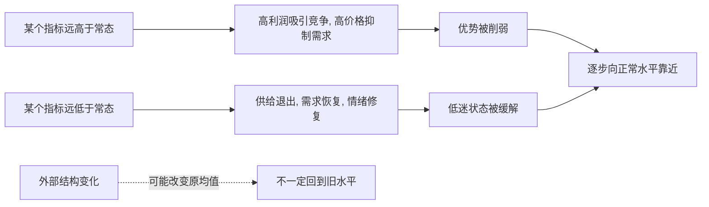

## 财经思维筑基课: 均值回归常常存在
  
### 作者  
digoal  
  
### 日期  
2026-04-30 
  
### 标签  
均值回归 , 普遍水平 , 极端水平 , 时间 , 技术革命 , 追涨杀跌 
  
----  
  
## 背景 
过高的利润率、估值、价格涨幅、信用扩张，往往难以长期维持。  
  
极端状态通常会向正常水平回归，但时间不确定。  
  

> 面向对象: 初中到高中学生  
> 核心问题: 为什么很多财经现象冲得太高或掉得太低后，常常又会慢慢往正常水平靠回去？  
> 先说结论: 均值回归指的是一个变量如果长期偏离自己的正常水平，往往会在竞争、供需、情绪修正、成本压力等力量作用下，逐步向更常见的平均状态靠近。它常常存在，但不是机械定律，也不保证立刻发生。

## 一张图先看懂



## 求真讲法

### 它到底说了什么

“均值回归常常存在”可以先用一句简单的话理解：

> 很多东西一旦偏离正常状态太远，往往会有力量把它往中间拉回去。

这里的“均值”不是一定要理解成复杂公式。  
它可以先理解成一个对象在较长时间里比较常见、比较稳定的水平。

比如：

- 一家行业的利润率长期特别高，可能会吸引竞争者进入。
- 某种商品价格长期特别低，可能会让供应减少。
- 某只股票估值长期特别夸张，后来可能因为预期修正而回落。

所以，这条原则真正表达的是：

**极端状态通常难以长期维持，因为现实世界里会出现修正力量。**

### 它是怎么来的

均值回归常常来自几个很朴素的机制。

第一，**竞争会压缩异常高收益。**  
如果某个行业利润特别高，别人会想进来分一杯羹，结果供给增加、价格下降、利润回落。

第二，**供需会修复异常价格。**  
价格太高时，需求可能减弱；价格太低时，供给可能退出。两边都会推动价格向更平衡的位置移动。

第三，**情绪极端往往不可持续。**  
过度乐观会推高价格，过度悲观会压低价格，但情绪本身很难永远停在极端。

第四，**运气成分会被时间稀释。**  
有些特别高或特别低的结果，部分只是偶然。时间拉长后，偶然成分常被平均掉。

可以用一个简单的 ASCII 图看：

```text
过高状态
   |
   v
竞争进入 / 需求减弱 / 预期修正
   |
   v
回到更常见水平

过低状态
   |
   v
供给退出 / 需求恢复 / 情绪修复
   |
   v
回到更常见水平
```

所以均值回归不是神秘力量，而是现实中的反馈机制在起作用。

### 它依赖哪些假设

“均值回归常常存在”要成立，需要几个前提。

| 假设 | 含义 | 如果不成立会怎样 |
|---|---|---|
| 存在相对稳定的常态水平 | 有一个较长期可参考的“正常区间” | 如果环境持续换轨，旧均值可能失效 |
| 偏离会触发反馈机制 | 高了有人进，低了有人退 | 如果没有反馈，极端状态可持续更久 |
| 外部冲击不是永久改写规则 | 变化主要是波动，不是换了世界 | 如果制度、技术、人口结构变了，均值会变 |
| 观察时间足够长 | 修正需要时间 | 如果只看很短期，常常看不到回归 |

这也说明一句关键的话：

> 均值回归说的是“常常如此”，不是“立刻如此”，更不是“永远回原点”。

### 常见误解

**误解一：只要涨多了就一定马上跌，跌多了就一定马上涨。**  
不对。均值回归可能很慢，也可能先走得更极端。

**误解二：均值永远不变。**  
不对。技术、制度、人口、利率、商业模式变化，都可能抬高或压低新的正常水平。

**误解三：均值回归等于预测神器。**  
不对。它能帮你识别极端状态，但不能精准告诉你拐点在哪一天。

**误解四：所有变量都会强烈均值回归。**  
不对。有些变量更像趋势延续，有些则回归更明显，要看具体机制。

## 求存讲法

### 它有什么用

这条原则最大的作用，是让你对“极端好”或“极端差”的状态保持警惕。

看到某个现象时，可以多问几句：

- 这是不是已经偏离正常水平很远？
- 为什么会偏离？是短期情绪，还是长期结构变化？
- 有没有力量会把它拉回来？
- 我看到的是暂时异常，还是新常态刚刚形成？

这会帮助你少一点线性外推的冲动。  
很多人容易犯的错误，就是把眼前的极端状态直接想象成会无限持续。

### 它怎么迁移到熟悉领域

这个原则很容易迁移到学生熟悉的生活和学习。

| 场景 | 极端状态 | 常见回归机制 |
|---|---|---|
| 考试成绩 | 一次考特别高或特别低 | 运气消退、水平回到日常区间 |
| 作息 | 连续几天超高强度学习 | 疲劳累积后效率回落 |
| 情绪 | 一时特别兴奋或沮丧 | 时间过去后情绪趋稳 |
| 消费 | 某样东西突然爆火涨价 | 热度消退、供给跟上 |

迁移后的核心意思是：

> 看到极端表现时，不要急着把它当成永久状态。

### 它的适用范围和边界

这条原则适合用于：

- 理解利润率、估值、价格、库存、情绪等为什么难长期停在极端。
- 提醒自己不要轻易线性外推。
- 分辨暂时过热、过冷与长期结构变化。
- 训练“找反馈机制”的思维。

但它也有边界。

第一，有些偏离是真变化，不是假波动。  
如果技术革命、制度变化、需求结构变了，原来的均值可能不再是参照。

第二，回归速度不确定。  
你可能判断对了方向，但等不到它回来。

第三，极端状态可能先变得更极端。  
市场在修正前，常常先在情绪推动下继续冲一段。

第四，均值回归不等于安全。  
就算一个东西最终会回归，中途波动也可能很大。

### 正例: 怎么用它提升能力

假设一个学生某次考试超常发挥，分数比平时高很多。

成熟的做法不是立刻认定“我已经永久进入新水平”，而是拆开看：

- 这次是不是有运气成分？
- 哪些题型是真进步了？
- 哪些优势可能难以长期复制？

这样做的好处是，既不否定成绩，也不被一次极端结果冲昏头。  
这和财经里看高利润、高估值、高增长是一样的：先问它能不能持续，而不是先假设它会无限延伸。

### 反例: 前提不成立会怎样

假设有人说：“这个行业过去两年利润率特别高，所以未来很多年一定都会这么高。”

这句话的问题，是把短期极端状态直接当成了长期常态。

可能真实情况是：

- 高利润吸引了新竞争者进入。
- 价格战开始。
- 成本优势被模仿。
- 供需关系恢复平衡。

这里失败的根本原因，不是“利润不会高”，而是忽略了“偏离会触发反馈机制”这个前提。  
一旦反馈开始作用，原来异常高的状态就很难不被压回去。

## 思考

为什么人们总爱把眼前趋势想象成会一直持续？

因为线性外推最省力。  
看到涨，就想一直涨；看到热，就想一直热；看到差，就想一直差。  
可现实世界往往不是直线，而是带反馈的系统。

这也引出几个更深的问题：

- 你看到的是趋势，还是趋势已经走到极端？
- 这个极端背后有没有自我修正力量？
- 你面对的是旧均值回归，还是新均值正在形成？

成熟的财经思维，不是见到高点就机械喊回归，也不是见到强势就盲目追延续，而是先问：

- 正常水平大概在哪里？
- 偏离由什么造成？
- 哪些力量会修正它？
- 这次有没有结构性变化，让“均值”本身变了？

均值回归真正教人的，不只是判断价格，更是提醒你：极端状态值得怀疑，持续性必须被证明。

## 最后记住

1. 均值回归指的是很多变量偏离常态太远后，常常会逐步向更常见水平靠近。
2. 它背后通常是竞争、供需、情绪修正和运气消退等反馈机制。
3. 它说的是“常常存在”，不是“立刻发生”，也不是“精确回到原点”。
4. 真正难的地方，不是知道有回归，而是分清这次是暂时偏离，还是新常态形成。
5. 面对极端高或极端低的状态，成熟做法不是线性外推，而是先找修正机制。

## 参考资料

- Burton G. Malkiel, *A Random Walk Down Wall Street*, 关于市场波动、估值与长期回归讨论的通俗框架。
- Jeremy Siegel, *Stocks for the Long Run*, 关于长期收益、估值和均值回归相关讨论的教材化视角。
- Zvi Bodie, Alex Kane, Alan J. Marcus, *Investments*, 关于收益、风险、估值和市场行为的基础框架。
- 本文为面向学生的简化解释，基于通用投资学与经济学常识框架，不构成投资建议。
  
  
#### [PostgreSQL 解决方案集合](../201706/20170601_02.md "40cff096e9ed7122c512b35d8561d9c8")
  
  
#### [德哥 / digoal's Github - 公益是一辈子的事.](https://github.com/digoal/blog/blob/master/README.md "22709685feb7cab07d30f30387f0a9ae")
  
  
#### [About 德哥](https://github.com/digoal/blog/blob/master/me/readme.md "a37735981e7704886ffd590565582dd0")
  
  

  
