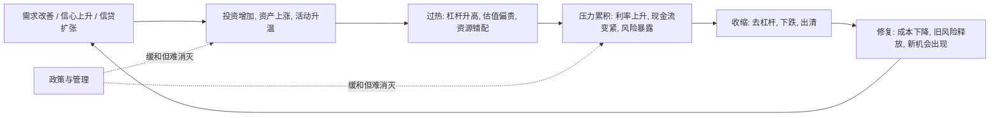

## 财经思维筑基课: 周期不可消灭
  
### 作者  
digoal  
  
### 日期  
2026-04-30 
  
### 标签  
周期 , 扩张 , 过热 , 积压 , 收缩 , 修复  
  
----  
  
## 背景 
经济、信用、利率、地产、商品、股市都有周期。  
  
金融系统经常在“繁荣、加杠杆、过热、收缩、出清、复苏”之间循环。  
  
> 面向对象: 初中到高中学生  
> 核心问题: 为什么经济、市场、行业总会经历繁荣和低迷，而不是一直平稳向上？  
> 先说结论: 周期指的是系统在扩张、过热、收缩、修复之间反复摆动。财经世界里的周期很难被彻底消灭，因为人会乐观和悲观，企业会扩张和收缩，信用会放松和收紧，供需也总在调整。管理和政策可以减弱波动，但通常不能把周期变成一条直线。

## 一张图先看懂



## 求真讲法

### 它到底说了什么

“周期不可消灭”可以先用一句很朴素的话理解：

> 只要系统里有人、有预期、有借贷、有供需变化，就很难永远保持在刚刚好的状态。

这里的“周期”不是神秘预言，而是很多财经现象反复出现的节奏：

- 先变好。
- 好到过头。
- 然后暴露问题。
- 再进入调整。
- 调整后重新恢复。

一个简单表格：

| 阶段 | 常见表现 |
|---|---|
| 扩张 | 需求增长、就业改善、资产上涨 |
| 过热 | 乐观过头、杠杆升高、估值偏贵 |
| 收缩 | 风险暴露、融资变难、价格下跌 |
| 修复 | 出清旧问题、恢复平衡、重新积累 |

所以，这条原则真正表达的是：

**财经系统不是静止机器，而是带反馈、带情绪、带杠杆的活系统，因此波动和循环几乎不可完全消除。**

### 它是怎么来的

周期之所以反复出现，通常来自几组机制互相作用。

第一，**人的预期会摇摆。**  
景气时，人容易更乐观；低迷时，人容易更保守。预期本身会推动行动，行动又反过来强化预期。

第二，**信用会扩张和收缩。**  
好时候更容易借到钱，钱多了会推动投资和资产价格；坏时候金融机构更谨慎，钱紧了又会反过来压低活动。

第三，**供需调整有时滞。**  
大家看到赚钱机会，会一起扩产；但产能建成要时间，等都建好了，可能已经供过于求。

第四，**风险在好时候更容易被低估。**  
顺风时，很多问题被上涨掩盖；逆风来时，风险才集中暴露。

可以用一个简单的 ASCII 图看：

```text
变好 -> 更敢借钱和投资 -> 更热 -> 过度扩张
   -> 风险积累 -> 压力爆发 -> 收缩
   -> 出清旧问题 -> 恢复
   -> 再次进入下一轮
```

这就是为什么周期常常不是“外部突然打断”，而是系统内部自己推动出来的。

### 它依赖哪些假设

“周期不可消灭”成立，依赖几个现实前提。

| 假设 | 含义 | 如果不成立会怎样 |
|---|---|---|
| 人的预期会变化 | 乐观和悲观会摇摆 | 如果人人永远理性且稳定，波动会减弱 |
| 信贷和资金条件会变化 | 资金松紧会影响行为 | 如果融资永远稳定、无约束，某些波动会变弱 |
| 供需调整有滞后 | 决策和结果不同步 | 如果所有生产都能瞬时调节，周期会缓和 |
| 风险识别并不完美 | 问题常在繁荣中积累 | 如果风险总能被提前准确处理，周期会减弱 |

这也说明，“不可消灭”不是说人类什么都做不了，而是说：

> 你可以缓冲、调节、缩短、减轻周期，但很难把它完全抹成一条直线。

### 常见误解

**误解一：周期不可消灭，说明政策和管理都没用。**  
不对。它们可以减轻冲击、延长缓冲、避免更糟结果，只是通常不能让波动彻底消失。

**误解二：周期就是固定几年一次。**  
不对。周期长短和形态并不固定，受行业、政策、利率、技术和外部冲击影响。

**误解三：只要预测到周期，就一定能轻松赚钱。**  
不对。知道有周期，和知道何时拐点、何时入场、能否扛住波动，是不同难度的问题。

**误解四：周期只存在于股市。**  
不对。经济、地产、商品、就业、库存、信用都可能有周期。

## 求存讲法

### 它有什么用

这条原则最大的作用，是防止你把短期状态误当成永久现实。

当看到繁荣时，你会多问：

- 现在是在健康扩张，还是已经过热？
- 这一轮好景气靠什么支撑？
- 风险是不是正在被上涨掩盖？

当看到低迷时，你也会多问：

- 这是短期出清，还是长期衰退？
- 哪些问题在被解决？
- 修复条件有没有开始出现？

这会帮助你少一点情绪化，多一点阶段意识。

### 它怎么迁移到熟悉领域

这个原则也很容易迁移到学生熟悉的生活。

| 场景 | 周期表现 |
|---|---|
| 学习状态 | 冲刺期很猛，之后疲劳，再恢复节奏 |
| 作息管理 | 一段时间高效率，随后透支，接着调整 |
| 团队合作 | 初期热情高，后来摩擦增多，再重新分工 |
| 消费热潮 | 一阵爆买，之后冷静，需求回归正常 |

迁移后的核心意思是：

> 人和系统都很难长期停在最兴奋或最低迷的状态，通常会在推动、透支、调整、恢复之间循环。

### 它的适用范围和边界

这条原则适合用于：

- 理解经济、行业、信用、库存、市场波动。
- 提醒自己不要把顺风或逆风永久化想象。
- 帮助判断“现在大概处在周期哪一段”。
- 训练“看阶段，不只看眼前”的思维。

但它也有边界。

第一，周期不可消灭，不代表每次都会按同样路线走。  
每轮周期的触发点、时长和烈度都可能不同。

第二，结构性变化会改写周期形态。  
技术革命、人口变化、制度变化，可能让旧经验部分失效。

第三，有些波动不是周期，而是单次冲击。  
不能看到起伏就机械地套周期叙事。

第四，知道有周期，不等于能精准择时。  
周期意识更像风险框架，不是神奇预测器。

### 正例: 怎么用它提升能力

假设一个学生在一段时间里状态特别好，连续很多天高强度学习，成绩也快速提升。

如果他理解“周期不可消灭”，就不会简单认为自己能永远保持同样强度，而会提前安排：

- 休息和复盘。
- 节奏切换。
- 难度分层。
- 状态下滑时的备用方案。

这样做的好处，不是追求永不波动，而是让波动更可控，别在过热后一下子崩掉。  
这和财经系统里通过现金储备、降杠杆、留缓冲应对周期，是同一种思路。

### 反例: 前提不成立会怎样

假设有人说：“这几年都很好，所以以后大概率会一直这么好，周期已经被消灭了。”

这句话的问题，是把阶段性顺风误当成永久新世界。

可能真实情况是：

- 好景气让大家更敢借钱和扩张。
- 扩张过度后，库存、负债、估值都抬高了。
- 表面稳定，其实风险在内部累积。

这里失败的根本原因，不是“乐观不对”，而是忽略了“人的预期会变化”“供需调整有滞后”“风险识别并不完美”这些前提。  
只要这些机制还在，周期就很难被真正消灭。

## 思考

为什么人总在繁荣时相信“这次不一样”，在低迷时又相信“再也起不来了”？

因为人天然容易把眼前状态投射成长期现实。  
顺风时，大家高估稳定性；逆风时，大家高估绝望的持续性。  
而周期思维恰恰是用来对抗这种情绪放大的。

这也引出几个更深的问题：

- 你看到的是趋势本身，还是趋势已进入过热或过冷阶段？
- 眼前的稳定，是健康平衡，还是风险被暂时掩盖？
- 你有没有给下一次收缩留下缓冲？

成熟的财经思维，不是幻想没有周期，而是承认周期是常态，然后提前问：

- 现在在哪一段？
- 哪些力量在推动下一段出现？
- 如果拐点来得比预期早，我有没有缓冲？

周期不可消灭，这句话真正教人的，不是悲观，而是敬畏反馈、敬畏滞后、敬畏系统复杂性。

## 最后记住

1. 周期是扩张、过热、收缩、修复反复出现的过程，不是偶然噪音。
2. 只要系统里有人性、信贷、供需滞后和风险误判，周期就很难被彻底消灭。
3. 政策和管理可以缓和周期，但通常不能把波动完全抹平。
4. 周期意识的价值，不是神奇预测拐点，而是避免把眼前阶段误当成永久现实。
5. 真正稳健的做法，不是幻想永远顺风，而是在顺风时为逆风留缓冲。

## 参考资料

- Hyman P. Minsky 相关金融不稳定框架，强调稳定会孕育不稳定、繁荣中积累脆弱性。
- Charles P. Kindleberger, *Manias, Panics, and Crashes*, 关于繁荣、投机、恐慌和危机循环的经典框架。
- Zvi Bodie, Alex Kane, Alan J. Marcus, *Investments*, 关于市场波动、风险和宏观条件影响的基础框架。
- 本文为面向学生的简化解释，基于通用经济学、金融学与商业周期常识框架，不构成投资建议。

    
  
#### [PostgreSQL 解决方案集合](../201706/20170601_02.md "40cff096e9ed7122c512b35d8561d9c8")
  
  
#### [德哥 / digoal's Github - 公益是一辈子的事.](https://github.com/digoal/blog/blob/master/README.md "22709685feb7cab07d30f30387f0a9ae")
  
  
#### [About 德哥](https://github.com/digoal/blog/blob/master/me/readme.md "a37735981e7704886ffd590565582dd0")
  
  

  
