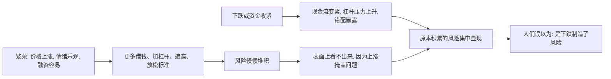

## 财经思维筑基课: 风险常在繁荣中积累，在下跌中暴露
  
### 作者  
digoal  
  
### 日期  
2026-05-01 
  
### 标签  
风险 , 隐患 , 上涨 , 积累 , 忽略 , 下跌 , 显现  
  
----  
  
## 背景 
好时候大家低估风险，坏时候大家高估风险。  
  
很多金融危机不是突然产生的，而是在繁荣期埋下的。  
  
  

> 面向对象: 初中到高中学生  
> 核心问题: 为什么很多金融危机看起来像是在下跌时突然爆发，但真正的问题往往早在好时候就埋下了？  
> 先说结论: 风险通常不是在下跌那一刻才产生的，而是在繁荣、乐观、赚钱容易的时候慢慢积累起来的。下跌更像一次压力测试，把原本被上涨掩盖的问题集中暴露出来。

## 一张图先看懂



## 求真讲法

### 它到底说了什么

“风险常在繁荣中积累，在下跌中暴露”可以先理解成一句很直白的话：

> 好时候最容易让人低估风险，坏时候最容易让人看见风险。

这里要先分清两个动作：

| 阶段 | 发生了什么 |
|---|---|
| 积累 | 风险被一点点堆起来 |
| 暴露 | 风险被市场、现金流或下跌逼出来 |

比如一家企业在景气时不断借钱扩张，表面上看利润更高、规模更大。  
这时候风险已经在积累：负债更多了、缓冲更薄了、对景气的依赖更强了。  
可因为收入还在增长、资产还在涨，问题暂时不显眼。

一旦环境转冷：

- 借新钱变难。
- 现金流变紧。
- 原来靠上涨掩盖的问题突然变得显眼。

所以，这条原则真正表达的是：

**下跌很多时候不是风险的起点，而是风险的显影液。**

### 它是怎么来的

这条原则来自几个反复出现的机制。

第一，**繁荣会让人放松警惕。**  
顺风时，赚钱容易，人会更相信“事情会一直好下去”。

第二，**上涨会掩盖错误。**  
价格在涨时，即使资产质量一般、策略有漏洞、杠杆偏高，也可能暂时显得一切正常。

第三，**好时候更容易加杠杆。**  
银行更愿意放贷，投资者更敢借钱，企业更愿意扩张，整个系统的脆弱性因此上升。

第四，**标准会在繁荣时悄悄放松。**  
借款审核变松、投资门槛降低、项目质量要求下降，因为大家更在意增长速度，而不是下行承受力。

可以用一个简单的 ASCII 图看：

```text
繁荣期:
赚钱顺利 -> 更乐观 -> 更敢借钱和扩张 -> 缓冲变薄
        -> 问题被上涨掩盖

下跌期:
价格下跌 / 融资收紧 / 现金流转弱
        -> 藏着的问题一起露出来
```

这就是为什么很多危机看起来像“突然爆发”，其实只是积累过程之前不容易被看见。

### 它依赖哪些假设

“风险常在繁荣中积累，在下跌中暴露”要成立，依赖几个重要前提。

| 假设 | 含义 | 如果不成立会怎样 |
|---|---|---|
| 繁荣会改变行为 | 人会更乐观、更敢冒险 | 如果景气时行为完全不变，积累会减弱 |
| 上涨能掩盖部分问题 | 表面结果让缺陷不显眼 | 如果所有问题都能立刻被识别，暴露会提前 |
| 融资和现金流条件会变 | 好坏时候的钱松紧不同 | 如果资金环境永远不变，暴露会减弱 |
| 系统里存在杠杆、错配或脆弱点 | 风险有地方可积累 | 如果系统没有脆弱结构，危机会轻很多 |

这也说明一句关键的话：

> 危险时刻最响的警报，往往不是风险开始的时刻，而是风险已经藏了很久的时刻。

### 常见误解

**误解一：下跌本身制造了所有风险。**  
不对。下跌常常只是把原来已经存在的问题逼出来。

**误解二：繁荣期既然赚钱，说明风险更小。**  
不对。恰恰因为赚钱顺利，风险更容易被低估和累积。

**误解三：只要表面没出事，就说明系统很安全。**  
不对。很多系统在出事前看起来都很稳定。

**误解四：风险暴露说明之前所有决策都错。**  
不对。问题不一定是方向全错，有时是杠杆太高、缓冲太少、节奏太激进。

## 求存讲法

### 它有什么用

这条原则最大的作用，是提醒你在好时候也要看坏处。

当一切都很顺的时候，成熟的判断不是只问：

- 还能涨多久？

还要问：

- 现在是不是因为太顺了，大家开始放松标准？
- 杠杆是不是升高了？
- 现金流缓冲是不是变薄了？
- 如果环境突然变差，系统扛不扛得住？

这会帮助你在顺风里保留敬畏，而不是只在逆风里慌张。

### 它怎么迁移到熟悉领域

这个原则也很容易迁移到学生熟悉的生活场景。

| 场景 | 风险积累发生在什么时候 | 风险暴露发生在什么时候 |
|---|---|---|
| 学习 | 状态好时熬夜透支、忽视基础漏洞 | 考试压力来时突然崩盘 |
| 身体 | 年轻时长期透支作息 | 生病或疲劳期问题暴露 |
| 团队合作 | 顺利时不建规则、不留备份 | 出现冲突或关键成员缺席时暴露 |
| 个人财务 | 收入高时乱花钱、不留储蓄 | 收入下降或突发支出时暴露 |

迁移后的核心意思是：

> 最危险的时刻，常常不是坏事刚来，而是好时候把问题养大了却没被发现。

### 它的适用范围和边界

这条原则适合用于：

- 理解金融危机、债务问题、资产泡沫为什么常在景气后爆发。
- 提醒自己不要在顺风时把缓冲用光。
- 判断“现在的稳定”是不是靠脆弱条件支撑。
- 训练逆向检查的能力。

但它也有边界。

第一，不是所有下跌都来自之前积累的风险。  
有些下跌是外部突发冲击带来的。

第二，不是所有繁荣都会演变成严重危机。  
如果杠杆不高、标准没明显放松、缓冲充足，系统可能只是温和调整。

第三，风险积累速度和暴露时点很难精确预测。  
你可能知道风险在堆，但不知道何时爆发。

第四，暴露出来的不一定是全部风险。  
有些问题第一次下跌时只露一部分，后续才继续显现。

### 正例: 怎么用它提升能力

假设一个学生最近成绩持续上升，状态很好。

一种做法是趁势不断加码：

- 睡得更少。
- 报更多课。
- 把所有时间压满。

另一种做法是趁状态好时反而做三件事：

- 补基础漏洞。
- 留休息缓冲。
- 整理错题和方法。

第二种做法更像理解了这条原则。  
因为他知道，顺风不是只拿来冲刺，也是拿来补脆弱点的最好时间。  
这样当考试压力真的上来时，之前积累的不是风险，而是缓冲。

### 反例: 前提不成立会怎样

假设有人说：“公司现在利润很好、股价也在涨，所以风险一定比以前更小。”

这句话的问题，在于把“表面顺利”直接等同于“系统更安全”。

可能真实情况是：

- 公司借了更多债扩张。
- 利润改善部分来自一次性因素。
- 现金流缓冲变薄。
- 管理层为了追求增长放松了标准。

这里失败的根本原因，不是“利润上涨没意义”，而是忽略了“繁荣会改变行为”“上涨能掩盖问题”“系统里存在脆弱点”这些前提。  
结果表面越顺，底下可能反而堆了更多风险。

## 思考

为什么人们总在危机之后才说“早就有问题了”，却很少在繁荣中真正行动？

因为上涨会让风险看起来像机会，顺风会让警惕显得扫兴。  
在一切都好的时候提醒风险，通常最不受欢迎；可真正有价值的判断，往往就发生在这种不受欢迎的时刻。

这也引出几个更深的问题：

- 你看到的是健康繁荣，还是被上涨掩盖的脆弱繁荣？
- 你在顺风时增加的是能力和缓冲，还是只是脆弱性？
- 如果今天的顺利突然停止，哪些问题会马上暴露？

成熟的财经思维，不是等到下跌才研究风险，而是在上涨时就开始问：

- 哪些假设被当成当然成立？
- 哪些标准被悄悄放松？
- 哪些问题只是暂时被价格和流动性盖住了？

风险常在繁荣中积累，在下跌中暴露，这句话真正教人的，是不要把安静误当安全，不要把上涨误当无风险。

## 最后记住

1. 风险很多时候不是在下跌那一刻才产生，而是在繁荣中慢慢积累起来的。
2. 繁荣期的上涨、乐观和融资宽松，常常会掩盖问题、鼓励加杠杆和放松标准。
3. 下跌更像压力测试，把原来已经存在的脆弱点集中暴露出来。
4. 表面顺利不等于系统更安全，恰恰可能意味着风险更不容易被看见。
5. 真正稳健的做法，是在顺风时补缓冲、查漏洞，而不是只在逆风时被动挨打。

## 参考资料

- Hyman P. Minsky 相关金融不稳定框架，强调稳定时期如何孕育更大的脆弱性。
- Charles P. Kindleberger, *Manias, Panics, and Crashes*, 关于繁荣中风险累积与危机中集中暴露的经典框架。
- Zvi Bodie, Alex Kane, Alan J. Marcus, *Investments*, 关于风险、杠杆、流动性和市场波动的基础框架。
- 本文为面向学生的简化解释，基于通用金融学与危机研究常识框架，不构成投资建议。

  
  
#### [PostgreSQL 解决方案集合](../201706/20170601_02.md "40cff096e9ed7122c512b35d8561d9c8")
  
  
#### [德哥 / digoal's Github - 公益是一辈子的事.](https://github.com/digoal/blog/blob/master/README.md "22709685feb7cab07d30f30387f0a9ae")
  
  
#### [About 德哥](https://github.com/digoal/blog/blob/master/me/readme.md "a37735981e7704886ffd590565582dd0")
  
  

  
