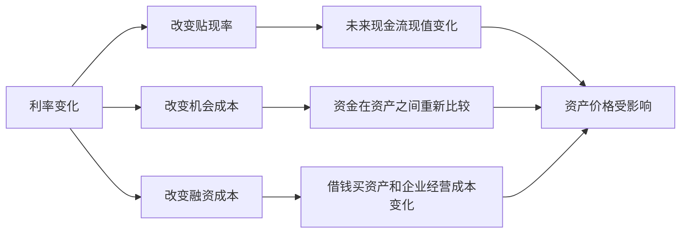

## 财经思维筑基课: 资产价格受利率深刻影响
  
### 作者  
digoal  
  
### 日期  
2026-05-01 
  
### 标签  
资产价格 , 资产类型 , 未来回报 , 折现率 , 利率 , 风险资产 , 安全资产 , 债券 , 股票 , 房产 , 融资成本 , 估值逻辑  
  
----  
  
## 背景 
利率越高，未来现金流折现后的现值越低，资产估值通常承压。  
  
利率越低，长期资产、成长股、房地产等更容易获得高估值。  
  

> 面向对象: 初中到高中学生  
> 核心问题: 为什么利率一变，债券、股票、房产这些资产的价格往往都会跟着动？  
> 先说结论: 利率会深刻影响资产价格，因为它同时改变三件事: 未来现金流折算到今天值多少、钱放在别处能拿到什么回报、以及借钱持有资产要付出多高成本。利率上升时，很多资产的估值会承压；利率下降时，很多资产更容易获得较高价格。

## 一张图先看懂



## 求真讲法

### 它到底说了什么

“资产价格受利率深刻影响”可以先翻成一句学生能听懂的话：

> 利率像资产定价里的重力。它一变，很多资产“看起来值多少钱”就会跟着变。

这里的“利率”可以先简单理解成：

- 把钱存起来大概能拿到多少回报。
- 借钱大概要付出多少成本。
- 市场上“时间的价格”大概是多少。

为什么它会影响资产价格？因为很多资产的价值，本来就来自未来的钱。

比如：

- 债券未来会付利息和本金。
- 股票背后是企业未来能赚到并留下的现金流。
- 房产可能带来租金，或替代未来住房成本。

如果未来的钱要折算回今天，那么“折算用的利率”一变，今天的估值就会变。

一个最简单的直觉：

| 情况 | 未来 100 元在今天看起来怎样 |
|---|---|
| 利率很低 | 今天看来比较值钱 |
| 利率很高 | 今天看来会打更大折扣 |

所以，这条原则真正表达的是：

**利率不是市场上的一个边角数字，它会通过估值、选择和融资，深刻改变很多资产愿意被支付的价格。**

### 它是怎么来的

利率影响资产价格，通常通过三条主线发生作用。

第一，**贴现率变化。**  
资产的价值，常常可以理解成“未来现金流折算回今天的总和”。  
利率越高，折现时打的折扣越大，未来的钱今天看起来就越不值钱。

第二，**机会成本变化。**  
如果安全资产收益变高，投资者就会问：  
“既然我把钱放得更稳也能拿到不错回报，为什么还要花很高价格去买更不确定的资产？”

第三，**融资成本变化。**  
很多资产不是全靠自有资金持有的。房贷、企业借款、融资买入，都受利率影响。  
利率升高时，借钱更贵，买资产和扩张经营都更难，资产价格容易受压。

可以用一个简单的 ASCII 图理解：

```text
利率上升
 -> 未来现金流折得更狠
 -> 安全回报更有吸引力
 -> 借钱更贵
 -> 很多资产估值承压

利率下降
 -> 未来现金流折得更少
 -> 安全回报吸引力下降
 -> 借钱更便宜
 -> 很多资产更容易涨价
```

这就是为什么市场常把利率看成影响面很广的“底层变量”。

### 它依赖哪些假设

“资产价格受利率深刻影响”成立，依赖几个重要前提。

| 假设 | 含义 | 如果不成立会怎样 |
|---|---|---|
| 资产价值和未来现金流有关 | 未来收益是估值基础 | 如果资产完全不靠未来回报，利率影响会弱些 |
| 投资者会比较不同回报机会 | 钱会在资产之间流动 | 如果资金不比较替代选择，机会成本作用会减弱 |
| 持有资产常涉及时间和融资 | 借钱成本、持有成本有意义 | 如果没有融资需求，这条影响会弱一些 |
| 利率变化能传导到市场 | 银行、债券、贷款、估值会响应 | 如果传导被阻断，价格反应可能变慢 |

这也说明一句关键的话：

> 利率影响资产价格，不是因为市场迷信利率，而是因为利率进入了资产估值和资金选择的底层算式。

### 常见误解

**误解一：利率一涨，所有资产一定立刻下跌。**  
不对。方向常有影响，但幅度和时点要看资产类型、预期和其他因素。

**误解二：利率只影响债券，不影响股票和房产。**  
不对。股票和房产也会通过折现、融资成本和资金比较受到影响。

**误解三：利率低，资产就一定只涨不跌。**  
不对。利率只是重要变量，不是唯一变量。盈利、风险、政策、情绪也会影响价格。

**误解四：所有资产受利率影响程度一样。**  
不对。现金流越远、越依赖融资、估值越高的资产，往往更敏感。

## 求存讲法

### 它有什么用

这条原则最大的作用，是让你在看资产价格时，不只盯资产本身，还要抬头看“钱的价格”。

当你看到市场变化时，可以多问几句：

- 现在利率环境在变松还是变紧？
- 这个资产的价值更靠近眼前现金流，还是很远的未来现金流？
- 它是不是很依赖借钱才能撑住高价格？
- 投资者是不是会因为更高的无风险回报而重新定价？

这会让你更容易理解，为什么有时候公司没出大事，股价却会因为利率变化而明显波动。

### 它怎么迁移到熟悉领域

这个原则也能迁移到学生熟悉的日常决策。

| 场景 | “利率”对应的意思 | 影响什么 |
|---|---|---|
| 时间安排 | 把时间用在别处的机会成本 | 某件事值不值得现在做 |
| 借用资源 | 借别人时间或工具的成本 | 扩张计划能否承受 |
| 学习投入 | 现在投入和未来回报的比较 | 远期收益值不值得等 |

迁移后的核心意思是：

> 当“等待的成本”或“借用资源的成本”变高时，很多依赖未来回报的选择，看起来就没那么值钱了。

### 它的适用范围和边界

这条原则适合用于：

- 理解债券、股票、房产等资产为什么会一起受利率影响。
- 理解为什么成长型、远期现金流型资产常对利率更敏感。
- 帮助自己建立“估值要看贴现率”的直觉。
- 理解货币环境为什么会影响市场整体估值。

但它也有边界。

第一，利率不是唯一变量。  
企业盈利、政策变化、风险偏好、供需结构，也都能显著影响价格。

第二，市场看的是预期利率，不只是当前利率。  
有时利率虽然还没变，市场已经先动了。

第三，利率影响不同资产的力度不同。  
短久期、现金流近、负债少的资产，通常没那么敏感。

第四，某些特殊资产价值还受制度、稀缺性或情绪强烈影响。  
不能把所有波动都简单归因于利率。

### 正例: 怎么用它提升能力

假设一个学生想理解，为什么同样是两家公司，利率上升时有的股价更容易跌。

他如果掌握这条原则，会先拆开看：

- 公司 A 现在就有稳定利润和现金流。
- 公司 B 主要靠未来很多年后的高增长来支撑估值。

当利率上升时，未来很远的钱会被打更大折扣。  
这时，公司 B 往往比公司 A 更容易被重新压低估值。

这种分析不是为了预测每一天涨跌，而是为了训练一种更像财经人的思考方式：  
不是只看“这家公司好不好”，还要看“这个价格是建立在什么利率前提上的”。

### 反例: 前提不成立会怎样

假设有人说：“利率只是银行存款的事，和股票、房子没关系。”

这句话的问题，是忽略了利率会同时进入估值、替代回报和融资成本。

可能真实情况是：

- 房贷利率更高，买房需求受压。
- 企业借钱更贵，利润预期下降。
- 安全资产回报上升，部分资金不愿再为高风险资产付那么高价格。

这里失败的根本原因，不是“资产自己变差了”，而是错误地把利率当成边缘变量，忽略了它在整个定价系统里的位置。

## 思考

为什么利率变化看起来只是几个百分点，却能让大类资产价格发生很大变化？

因为利率影响的不是一笔钱，而是整套定价逻辑。  
它改变了未来现金流值多少钱，改变了稳妥选择的吸引力，也改变了借钱扩张的代价。

这也引出几个更深的问题：

- 你看到的高估值，是建立在什么利率环境上的？
- 如果利率环境变化，这个价格还能站得住吗？
- 这个资产的故事，更靠近真实现金流，还是靠远期想象撑着？

成熟的财经思维，不是见到利率就机械喊涨跌，而是继续拆问：

- 它通过哪条路径影响价格？
- 哪类资产最敏感？
- 当前价格里已经预支了多少利率预期？

资产价格受利率深刻影响，这句话真正教人的，是把“价格表面波动”连回“资金时间价值”的底层结构。

## 最后记住

1. 利率会通过贴现率、机会成本和融资成本三条主线深刻影响资产价格。
2. 利率上升时，很多未来现金流型资产估值会承压；利率下降时，很多资产更容易获得较高价格。
3. 债券、股票、房产都会受利率影响，只是影响路径和敏感度不同。
4. 现金流越远、越依赖融资、估值越高的资产，通常对利率更敏感。
5. 看资产价格时，不能只看资产本身，还要看“钱的价格”正在发生什么变化。

## 参考资料

- Richard A. Brealey, Stewart C. Myers, Franklin Allen, *Principles of Corporate Finance*, 关于贴现、资本成本和估值的教材体系。
- Zvi Bodie, Alex Kane, Alan J. Marcus, *Investments*, 关于利率、债券定价和股票估值的基础框架。
- Aswath Damodaran, *Investment Valuation*, 关于利率、贴现率与资产估值关系的教学框架。
- 本文为面向学生的简化解释，基于通用公司金融与投资学教材框架，不构成投资建议。

  
  
#### [PostgreSQL 解决方案集合](../201706/20170601_02.md "40cff096e9ed7122c512b35d8561d9c8")
  
  
#### [德哥 / digoal's Github - 公益是一辈子的事.](https://github.com/digoal/blog/blob/master/README.md "22709685feb7cab07d30f30387f0a9ae")
  
  
#### [About 德哥](https://github.com/digoal/blog/blob/master/me/readme.md "a37735981e7704886ffd590565582dd0")
  
  

  
