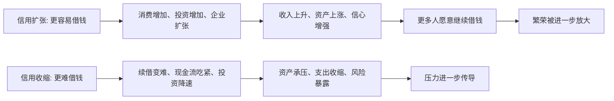

## 财经思维筑基课: 信用扩张推动繁荣，信用收缩制造压力
  
### 作者  
digoal  
  
### 日期  
2026-05-01 
  
### 标签  
信用 , 扩张 , 收缩 , 借钱 , 额度 , 条件 , 推动消费 , 投资 , 扩张 , 资产价格 
  
----  
  
## 背景 
钱和信贷变多，资产价格容易上涨；信贷收紧，资产价格容易承压。  
  
很多金融周期本质上是信用周期。  
  
> 面向对象: 初中到高中学生  
> 核心问题: 为什么借钱更容易的时候，经济和资产常常更热；而借钱突然变难时，压力又会迅速出现？  
> 先说结论: 信用扩张指的是借钱更容易、额度更多、条件更宽松。它会让消费、投资、扩张和资产价格更容易上升，从而推动繁荣。信用收缩则相反: 钱更难借、成本更高、续借更难，原本靠融资维持的活动会受到挤压，于是压力开始显现。

## 一张图先看懂



## 求真讲法

### 它到底说了什么

“信用扩张推动繁荣，信用收缩制造压力”可以先翻成一句更直白的话：

> 当系统里借钱越来越容易时，很多活动会被放大；当借钱越来越难时，很多原本看起来没问题的活动会突然吃紧。

这里先区分两个词：

| 概念 | 通俗解释 |
|---|---|
| 货币 | 已经存在、能直接花的钱 |
| 信用 | 现在先借到、以后再还的钱 |

信用之所以重要，是因为现实里的很多支出和扩张，不是完全靠现有现金完成的，而是靠“先用未来的钱”。

比如：

- 家庭买房常靠房贷。
- 企业扩大工厂常靠贷款。
- 投资者买资产有时会融资。
- 开发商、商家、项目方都可能依赖续借和授信。

所以，这条原则真正表达的是：

**信用像经济活动的加速器。宽松时，它把繁荣放大；收紧时，它把脆弱性逼出来。**

### 它是怎么来的

信用扩张为什么能推动繁荣？因为它会同时放大几个东西。

第一，**把未来购买力提前搬到现在。**  
本来今天没这么多钱，但因为能借钱，今天就能多买、多投、多扩张。

第二，**把更多参与者拉进来。**  
原本只能旁观的人，因为能获得贷款或授信，也能参与消费、买房、投资、创业。

第三，**让上涨和乐观互相强化。**  
信用宽松推动资产价格上涨，资产上涨又让抵押品看起来更值钱，于是更容易借到更多钱。

可一旦信用开始收缩，方向就会反过来：

- 续借更难。
- 借款成本更高。
- 原本依赖外部融资的人开始吃紧。
- 为了还钱，只能缩支出、卖资产、降杠杆。

可以用一个简单的 ASCII 图理解：

```text
信用扩张:
更容易借钱 -> 活动增加 -> 价格上涨 -> 信心增强 -> 更容易继续借

信用收缩:
更难借钱 -> 活动降速 -> 现金流变紧 -> 被迫收缩 -> 压力继续扩大
```

这就是为什么信用环境变化，常常能比很多表面指标更早影响系统温度。

### 它依赖哪些假设

“信用扩张推动繁荣，信用收缩制造压力”要成立，依赖几个关键前提。

| 假设 | 含义 | 如果不成立会怎样 |
|---|---|---|
| 经济活动部分依赖融资 | 消费、投资、持有资产不是全靠现钱 | 如果大家都不用借钱，信用影响会弱很多 |
| 信用条件会变化 | 额度、利率、审批、续借会松会紧 | 如果借贷条件永远不变，传导会减弱 |
| 资产和现金流会受融资环境影响 | 融资环境会改变行为 | 如果融资和经营完全脱钩，影响会小很多 |
| 借钱的人需要滚动维持 | 不是借一次就永远没事 | 如果没有续借压力，收缩伤害会弱一些 |

这也解释了为什么看信用时，不能只看“欠了多少钱”，还要看：

- 能不能续借。
- 借钱成本变没变。
- 现金流能不能覆盖还本付息。

### 常见误解

**误解一：信用扩张就是好事，说明经济强。**  
不对。短期可能更热，但如果过度扩张，后面也可能积累脆弱性。

**误解二：信用收缩只是银行的事，和普通人无关。**  
不对。房贷、企业经营、就业、资产价格都可能受影响。

**误解三：只要资产本身不错，信用收缩就没影响。**  
不对。哪怕资产质量不差，如果依赖融资，资金链紧了也会出问题。

**误解四：信用和利率是一回事。**  
不对。利率是借钱成本的一部分，信用还包括额度、审批、担保、续借难易等条件。

## 求存讲法

### 它有什么用

这条原则最大的作用，是帮你理解为什么有时“钱并没有突然消失”，但系统却突然变得很难受。

成熟的判断会多问：

- 现在借钱是更容易了，还是更难了？
- 这轮增长是靠真实收入增长，还是靠信用加速？
- 如果信用环境变紧，哪些主体最先扛不住？
- 谁的模式严重依赖不断借新钱？

这会让你更早看到压力来源，而不只盯表面热度。

### 它怎么迁移到熟悉领域

这个原则也能迁移到学生熟悉的资源管理场景。

| 场景 | “信用扩张”像什么 | “信用收缩”像什么 |
|---|---|---|
| 时间管理 | 先透支精力，把未来时间拿来用 | 后面疲劳积累，效率骤降 |
| 团队合作 | 先借别人帮忙快速推进 | 后面别人抽不开身，项目卡住 |
| 个人财务 | 先花未来收入，当前看起来更宽裕 | 后面还款压力让选择变少 |
| 学习计划 | 先靠突击和透支换短期成绩 | 后面基础不稳、状态回落 |

迁移后的核心意思是：

> 只要你在“先借未来资源来扩大现在”，扩张时会更顺，收缩时也会更痛。

### 它的适用范围和边界

这条原则适合用于：

- 理解房地产、企业扩张、债务周期、资产价格波动。
- 理解为什么景气和压力常与信贷环境一起变化。
- 提醒自己区分“真实增长”和“信用放大后的增长”。
- 帮助判断谁对融资环境最敏感。

但它也有边界。

第一，信用不是唯一驱动力。  
技术进步、人口变化、政策、国际需求，也会推动繁荣或压力。

第二，信用扩张不一定立即有害。  
如果投向高效率领域、现金流匹配得好，它可以支持健康增长。

第三，信用收缩不一定都是坏事。  
有时它是在给过热系统降温，避免更大失控。

第四，不同主体受影响程度不同。  
现金流稳、负债低、融资依赖小的主体，通常更能扛收缩。

### 正例: 怎么用它提升能力

假设一个学生做长期项目。

方案 A：每周按稳定节奏推进，任务量和精力匹配。  
方案 B：一开始大量透支时间、熬夜冲量，靠“借未来体力”换当前进度。

方案 B 在前期看起来更快、更热闹，很像“信用扩张推动繁荣”。  
但后面如果休息跟不上、精力开始透支，就会进入“信用收缩制造压力”的阶段：

- 效率下降。
- 错误变多。
- 进度反而卡住。

这说明很多表面上的快速繁荣，背后可能是在提前消耗未来资源。  
真正稳健的能力，不是只会扩张，而是知道扩张能不能持续。

### 反例: 前提不成立会怎样

假设有人说：“这家公司增长很快，所以一定是经营能力特别强，和信用环境没关系。”

这句话的问题，是忽略了融资可能在放大增长。

可能真实情况是：

- 它借了很多钱做扩张。
- 上游和银行愿意给更宽松账期和额度。
- 一旦融资环境变紧，续借变难，原本的高增长就会明显降速。

这里失败的根本原因，不是“增长没价值”，而是忽略了“经济活动部分依赖融资”“借钱的人需要滚动维持”这些前提。  
结果把信用放大的繁荣，误看成了完全由内生能力支撑的繁荣。

## 思考

为什么信用扩张时，人们常常误以为“这次增长特别扎实”？

因为信用会让很多东西同时变好看：

- 需求更旺。
- 价格更高。
- 收入更亮眼。
- 抵押品更值钱。

这些变化会制造一种错觉: 好像系统本身更强了。  
可一旦信用环境逆转，才会发现其中有多少是靠“先借未来”撑起来的。

这也引出几个更深的问题：

- 你看到的是能力增长，还是信用放大的增长？
- 当前的繁荣，离开持续融资还能站住吗？
- 如果明天借钱突然变难，谁会先出问题？

成熟的财经思维，不是只看增长快不快，而是继续追问：

- 增长靠什么融资？
- 现金流能不能自我支撑？
- 这套模式在信用收缩时还能不能活下去？

信用扩张推动繁荣，信用收缩制造压力，这句话真正教人的，是把“热度”重新拆回“资金链”和“可持续性”。

## 最后记住

1. 信用扩张是借钱更容易、额度更多、条件更宽松，它会放大消费、投资和资产活动。
2. 信用收缩是借钱更难、续借更难、成本更高，它会沿着现金流和资产价格制造压力。
3. 很多繁荣不是只靠现有收入推动，而是靠“先借未来资源”被放大。
4. 区分健康增长和信用放大增长，关键要看融资依赖度和现金流自我支撑能力。
5. 看一个系统稳不稳，不只看现在热不热，还要看信用一收紧时它还能不能站住。

## 参考资料

- Hyman P. Minsky 相关金融不稳定框架，强调融资结构、信用扩张与脆弱性积累。
- Charles P. Kindleberger, *Manias, Panics, and Crashes*, 关于信贷扩张、繁荣与危机传导的经典框架。
- Richard A. Brealey, Stewart C. Myers, Franklin Allen, *Principles of Corporate Finance*, 关于融资、现金流和财务压力的教材体系。
- 本文为面向学生的简化解释，基于通用金融学与经济周期常识框架，不构成投资建议。

  
  
#### [PostgreSQL 解决方案集合](../201706/20170601_02.md "40cff096e9ed7122c512b35d8561d9c8")
  
  
#### [德哥 / digoal's Github - 公益是一辈子的事.](https://github.com/digoal/blog/blob/master/README.md "22709685feb7cab07d30f30387f0a9ae")
  
  
#### [About 德哥](https://github.com/digoal/blog/blob/master/me/readme.md "a37735981e7704886ffd590565582dd0")
  
  

  
