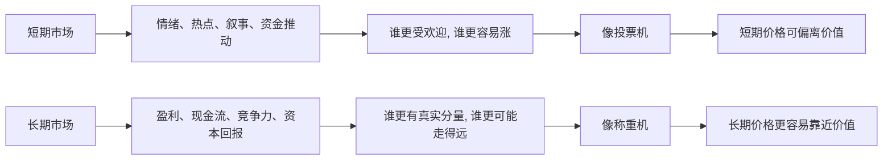

## 财经思维筑基课: 市场短期是投票机，长期是称重机
  
### 作者  
digoal  
  
### 日期  
2026-05-01 
  
### 标签  
市场 , 短期 , 情绪 , 政策 , 热点 , 叙事 , 投票机 , 长期价值 , 现金流 , 回报 , 竞争力 
  
----  
  
## 背景 
短期看情绪、叙事、资金流；长期看盈利、现金流、竞争力和资本回报率。  
  
> 面向对象: 初中到高中学生  
> 核心问题: 为什么市场短期里常常谁更受欢迎谁就涨，长期里却又往往是更有真实分量的东西走得更远？  
> 先说结论: “短期是投票机，长期是称重机”说的是两套不同力量。短期里，市场价格常受情绪、故事、热点和资金流向影响，像大家在投票选“谁现在更受欢迎”。长期里，市场更像在称重，看企业盈利、现金流、竞争力和持续创造价值的能力到底有多重。

## 一张图先看懂



## 求真讲法

### 它到底说了什么

“市场短期是投票机，长期是称重机”可以先拆成两个比喻。

**投票机**的意思是：  
短期里，市场像在统计大家当下更喜欢谁、害怕谁、追逐谁。

**称重机**的意思是：  
长期里，市场更像在衡量一个资产真实有多重，也就是它到底能不能持续创造结果。

一个简单对比：

| 时间尺度 | 更像在看什么 |
|---|---|
| 短期 | 热度、情绪、故事、资金追逐 |
| 长期 | 盈利、现金流、竞争力、兑现能力 |

所以，这句话真正表达的是：

**短期价格常常反映“大家现在怎么想”，长期价格更容易反映“这个东西到底值不值”。**

这也解释了一个常见现象：

- 好公司短期可能跌得很难看。
- 一般甚至很差的东西短期也可能被炒得很热。
- 但时间拉长后，真正能持续创造价值的对象，更容易把价格拉回到更合理的位置。

### 它是怎么来的

这条原则之所以常成立，是因为短期和长期主导市场的力量不一样。

第一，**短期里，人的情绪和资金流动更快。**  
一条消息、一个热门叙事、一次政策预期变化，都可能让大量资金在很短时间内涌向同一个方向。

第二，**短期里，别人怎么看往往比事情本身更重要。**  
很多交易不是在判断“它本身好不好”，而是在猜“别人接下来会不会更喜欢它”。

第三，**长期里，现金流和盈利更难伪装。**  
故事可以讲很久，但长期没有利润、没有现金流、没有竞争力，价格最终更难一直维持高位。

第四，**时间会过滤掉纯情绪成分。**  
时间越长，市场越难只靠情绪维持一个明显脱离基本面的价格。

可以用一个简单的 ASCII 图理解：

```text
短期:
消息 -> 情绪 -> 资金流动 -> 价格波动

长期:
经营结果 -> 现金流 -> 累积回报 -> 价格重估
```

所以，这不是在说短期毫无逻辑，而是在说：  
**短期逻辑更偏向人心和资金，长期逻辑更偏向结果和分量。**

### 它依赖哪些假设

“市场短期是投票机，长期是称重机”要成立，依赖几个关键前提。

| 假设 | 含义 | 如果不成立会怎样 |
|---|---|---|
| 市场参与者短期会受情绪和叙事影响 | 价格不只由基本面决定 | 如果人人完全理性，投票效应会减弱 |
| 长期经营结果最终能显现 | 盈利和现金流会被看到 | 如果结果长期无法检验，称重效应会弱 |
| 资产确实存在可衡量的基本面 | 有东西可“称重” | 如果对象几乎全靠共识，称重更难 |
| 时间足够长 | 短期噪音有机会被过滤 | 如果只看很短窗口，称重常看不出来 |

这也说明一句关键的话：

> 长期称重不是自动发生的魔法，而是基本面经过时间慢慢兑现、再被市场重新定价的过程。

### 常见误解

**误解一：短期既然是投票机，就完全不用看。**  
不对。短期情绪和资金也很真实，会影响波动和风险。

**误解二：长期一定百分之百回归价值。**  
不对。长期更容易靠近价值，但前提是你对价值判断本身没错。

**误解三：只要基本面好，短期就不可能大跌。**  
不对。短期市场完全可能因为情绪、流动性和预期变化而剧烈波动。

**误解四：市场长期一定完全公平。**  
不对。长期更重结果，不等于永远精准，也不等于没有偏差。

## 求存讲法

### 它有什么用

这条原则最大的作用，是帮你避免把短期热闹误当成长期分量。

看到一个东西突然大涨时，可以多问几句：

- 这是因为大家更喜欢它了，还是因为它真的更能赚钱了？
- 这是短期投票的结果，还是长期称重的开始？
- 价格变化背后，是情绪更强，还是基本面更强？

同样，看到一个好资产短期被冷落，也不要立刻把“没人喜欢”当成“没有价值”。

### 它怎么迁移到熟悉领域

这个原则也很容易迁移到学生熟悉的场景。

| 场景 | “投票机”表现 | “称重机”表现 |
|---|---|---|
| 学校评价 | 谁更受欢迎、谁更会表现 | 谁长期真正有能力 |
| 社交媒体 | 谁更有热度和流量 | 谁长期输出有质量内容 |
| 考试 | 一次偶然高分或低分的关注 | 长期稳定能力的积累 |
| 团队合作 | 谁一时最显眼 | 谁长期真正能扛事 |

迁移后的核心意思是：

> 短期受欢迎，不等于长期有分量；短期不被看见，也不等于长期没有价值。

### 它的适用范围和边界

这条原则适合用于：

- 理解市场短期波动和长期价值的区别。
- 防止被热点和情绪完全牵着走。
- 提醒自己区分“注意力”和“真实结果”。
- 建立更长周期的观察习惯。

但它也有边界。

第一，有些资产长期也高度受共识影响。  
如果一个东西几乎没有稳定现金流或硬结果，称重就更难。

第二，长期到底有多长，没有统一答案。  
几个月、几年、十年，对不同资产并不一样。

第三，短期投票可能持续很久。  
一个偏离价值的状态，未必很快结束。

第四，称重前提是你知道该称什么。  
如果基本面判断错了，长期也可能得出错误结论。

### 正例: 怎么用它提升能力

假设一个学生看到两类同学：

- 甲同学很会表达，短期里总能获得很多注意。
- 乙同学不太显眼，但长期稳定做事、成绩稳、项目能落地。

如果只看一时人气，甲更像“热门股”；  
如果拉长时间，乙更像“有长期称重优势”的对象。

这不是说甲一定不行，而是提醒你：

- 热度是一个信号，但不是全部。
- 长期分量要看持续输出和真实结果。

这和看市场是一样的：先分清你看到的是投票，还是称重。

### 反例: 前提不成立会怎样

假设有人说：“这个股票最近涨得最快，所以它一定是最好的公司。”

这句话的问题，是把短期投票结果直接当成了长期称重结果。

可能真实情况是：

- 它只是站在热门题材上。
- 短期资金集中追逐。
- 市场更在乎故事和想象，而不是当下盈利和现金流。

这里失败的根本原因，不是“涨得快没意义”，而是忽略了“短期价格常受情绪和叙事影响”这个前提。  
结果把“更受欢迎”误当成了“更有分量”。

## 思考

为什么人们明知道市场短期像投票机，还是会被短期价格牵着走？

因为投票结果每天都在变，而且变化很刺激。  
称重结果则更慢、更安静、更需要等待。  
人天生更容易对眼前变化做反应，而不是对长期结果保持耐心。

这也引出几个更深的问题：

- 你是在研究价值，还是在追逐别人眼下的偏好？
- 你看到的是热度，还是分量？
- 如果市场暂时不给你认同，你有没有能力等待称重发生？

成熟的财经思维，不是鄙视短期，也不是神化长期，而是学会区分：

- 现在是投票主导，还是称重主导？
- 哪些上涨只是受欢迎，哪些上涨有结果支撑？
- 哪些下跌只是情绪，哪些下跌说明分量真的变轻了？

市场短期是投票机，长期是称重机，这句话真正教人的，是把“被看见”与“真正有分量”分开看。

## 最后记住

1. 短期市场更容易反映情绪、热点、叙事和资金偏好，所以像投票机。
2. 长期市场更容易反映盈利、现金流、竞争力和结果兑现，所以像称重机。
3. 短期受欢迎不等于长期有价值，短期被冷落也不等于长期没分量。
4. 市场价格在不同时间尺度下受不同力量主导，不能用一套眼镜看全部。
5. 真正成熟的判断，不是只看谁现在最热，而是分清热度和分量。

## 参考资料

- Benjamin Graham, *The Intelligent Investor*, 关于“投票机/称重机”比喻的经典来源与价值投资框架。
- Seth A. Klarman, *Margin of Safety*, 关于价格、价值和市场情绪偏离的讨论框架。
- Zvi Bodie, Alex Kane, Alan J. Marcus, *Investments*, 关于市场行为、估值与长期回报的基础框架。
- 本文为面向学生的简化解释，基于通用投资学与价值分析常识框架，不构成投资建议。

  
  
#### [PostgreSQL 解决方案集合](../201706/20170601_02.md "40cff096e9ed7122c512b35d8561d9c8")
  
  
#### [德哥 / digoal's Github - 公益是一辈子的事.](https://github.com/digoal/blog/blob/master/README.md "22709685feb7cab07d30f30387f0a9ae")
  
  
#### [About 德哥](https://github.com/digoal/blog/blob/master/me/readme.md "a37735981e7704886ffd590565582dd0")
  
  

  
