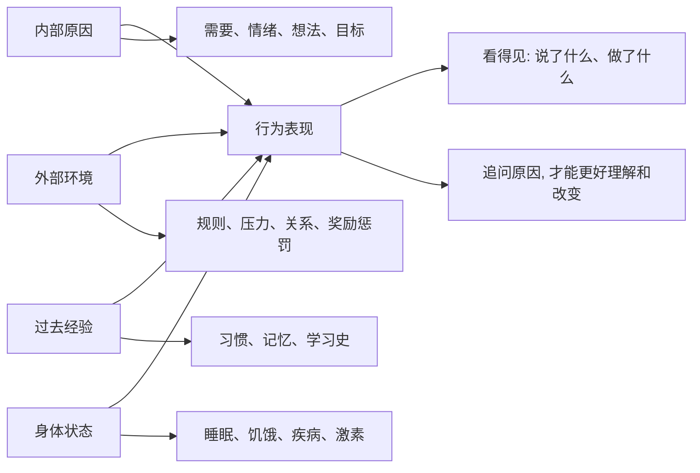

## 心理学思维筑基课: 行为有原因
  
### 作者  
digoal  
  
### 日期  
2026-05-01 
  
### 标签  
行为 , 复杂系统 , 原因 , 内部原因 , 外部原因 , 过去经历 , 需要 , 情绪 , 想法 , 经验 , 环境 , 奖励惩罚 , 身体状态
  
----  
  
## 背景 
人的行为通常不是凭空发生的，背后有动机、情绪、认知、经验、环境或生理状态。  
  
  

> 面向对象: 初中到高中学生  
> 核心问题: 为什么心理学不满足于说“他就是这样的人”，而要继续追问行为背后的原因？  
> 先说结论: “行为有原因”是心理学里非常基础的分析原则。它说的是人的行为通常不是凭空出现的，而是由需要、情绪、想法、经验、环境、奖励惩罚和身体状态共同影响。理解原因不是替行为找借口，而是为了更准确地解释、预测和改变行为。

## 一张图先看懂



## 求真讲法

### 它到底说了什么

“行为有原因”不是说每个行为背后都有一个简单答案，而是说：

> 当一个人做出某种行为时，通常可以从心理、环境、经验和生理多个层面找到影响因素。

比如一个同学上课突然发脾气，表面行为是“发脾气”。  
如果只说“他脾气差”，解释就停住了。  
心理学会继续问：

- 他是不是长期睡眠不足？
- 他是不是觉得自己被羞辱了？
- 他是不是以前学会了“发火能让别人让步”？
- 当时课堂环境是不是压力太大？
- 他是不是正处在焦虑、委屈或防御状态？

这不是要替他开脱，而是要把“行为”从一个标签，拆成可以理解和处理的原因链。

一个简单对比：

| 说法 | 问题 | 更好的追问 |
|---|---|---|
| 他就是懒 | 把人贴成固定标签 | 他为什么没有开始行动？ |
| 她就是爱哭 | 忽略情绪来源 | 她在害怕、委屈还是无助？ |
| 他就是坏 | 停止分析行为机制 | 这个行为被什么奖励或压力维持？ |

所以，这条原则真正表达的是：

**行为不是孤立事件，而是很多力量共同作用后的结果。**

### 它是怎么来的

这条原则来自心理学多个传统的共同观察。

第一，**行为主义发现奖励和惩罚会塑造行为。**  
如果一个行为之后得到奖励，它更可能重复；如果带来痛苦或惩罚，它可能减少。

第二，**认知心理学发现想法会影响反应。**  
同一件事，不同解释会带来不同情绪和行为。  
比如考试没考好，有人想“我完了”，有人想“我知道哪里要补”，后续行动会不同。

第三，**社会心理学发现环境和群体会改变行为。**  
同一个人在不同规则、压力、权威和群体氛围下，可能表现很不一样。

第四，**发展心理学发现早期经验会影响后来的模式。**  
一个人怎样理解安全、信任、评价和失败，常常和过去经验有关。

可以用一个简单的 ASCII 图理解：

```text
不是:
人品标签 -> 行为

而是:
需要 + 情绪 + 想法 + 经验 + 环境 + 身体状态
                         -> 行为
```

所以“行为有原因”不是某一个学派独有的口号，而是心理学分析人的基本入口。

### 它依赖哪些假设

“行为有原因”成立，依赖几个前提。

| 假设 | 含义 | 如果不成立会怎样 |
|---|---|---|
| 行为受到多因素影响 | 行为不是凭空跳出来 | 如果行为完全随机，心理学解释就失去意义 |
| 原因不一定能立刻看见 | 表面行为背后有隐含过程 | 如果只看表面，容易误判 |
| 人会受环境和学习影响 | 行为会被规则、奖励、经验塑造 | 如果人完全不受影响，改变就很难解释 |
| 原因可以被部分识别和改变 | 通过观察、访谈、实验、练习能找到线索 | 如果原因完全不可知，就只能贴标签 |

注意，这里说“有原因”，不是说人没有选择，也不是说所有原因都能被一次谈话完全找到。心理学更常用的是“多因素解释”：多个原因叠加，才形成一个行为。

### 常见误解

**误解一：有原因就是有借口。**  
不对。解释行为原因，不等于免除责任。理解原因是为了更好处理问题。

**误解二：找到一个原因就够了。**  
不对。人的行为通常由多个因素共同形成，很少只有一个根源。

**误解三：行为有原因，所以人没有自由选择。**  
不对。原因会影响选择，但不等于完全决定选择。觉察原因后，人反而更有机会改变。

**误解四：原因一定藏在童年。**  
不对。早期经验重要，但当前环境、睡眠、压力、关系和奖励结构同样重要。

## 求存讲法

### 它有什么用

这条原则最大的作用，是让你从“评价人”转向“理解机制”。

面对一个行为，不要只问：

- 这个人好不好？

还要问：

- 这个行为在什么情境下出现？
- 它满足了什么需要？
- 它被什么奖励维持？
- 它是不是在逃避某种痛苦？
- 如果想改变，应该改人、改环境，还是改行为后果？

这会让你在学习、沟通、管理情绪和处理冲突时更有效。

### 它怎么迁移到熟悉领域

这个原则很容易迁移到学生生活。

| 场景 | 表面行为 | 可能原因 |
|---|---|---|
| 拖延作业 | 不开始写 | 害怕做不好、任务太大、奖励太远 |
| 上课走神 | 注意力飘走 | 睡眠不足、内容太难、缺少目标 |
| 和同学吵架 | 说话很冲 | 感到被冒犯、想保护面子、压力太大 |
| 沉迷手机 | 放不下来 | 即时奖励强、现实压力大、缺少替代活动 |

迁移后的核心意思是：

> 想改变行为，先别急着骂自己或别人，先找行为被什么力量推动和维持。

### 它的适用范围和边界

这条原则适合用于：

- 理解自己和他人的行为。
- 改善学习习惯、情绪管理和人际关系。
- 分析冲突背后的需要和压力。
- 设计更有效的改变方法。

但它也有边界。

第一，有原因不等于原因已经被我们找到。  
有时原因很复杂，需要长期观察和专业帮助。

第二，有原因不等于行为一定正确。  
伤害别人、违反规则的行为，即使有原因，也仍然需要承担后果。

第三，不同心理学流派会强调不同原因。  
行为主义看强化，认知取向看解释方式，社会心理学看情境，发展心理学看成长经验。

第四，不能用原因把人固定住。  
知道一个人过去受过伤，不代表他永远只能这样行动。

### 正例: 怎么用它提升能力

假设你发现自己总是拖延写作业。

如果只说“我太懒了”，接下来很可能还是拖延。  
如果用“行为有原因”分析，可以拆成：

- 任务太大，不知道从哪里开始。
- 害怕写得不好，所以先逃避。
- 手机给的奖励更快。
- 写作业后的正反馈太少。

然后改变方法就更具体：

- 把任务拆成 10 分钟一小段。
- 先写草稿，不要求完美。
- 写作业时把手机放远。
- 完成一小段后给自己短暂休息。

这就是这条原则的价值：它把“我不行”变成“我可以调整原因链”。

### 反例: 前提不成立会怎样

假设老师看到一个学生上课总插话，就直接判断：“他就是不尊重人。”

这个判断可能忽略了很多原因：

- 他可能不知道什么时候适合发言。
- 他可能想获得关注。
- 他可能因为焦虑而控制不住打断。
- 他可能在过去经验中学到“抢先说话才不会被忽视”。

如果老师只用惩罚压下行为，短期可能安静，但真正原因没有处理，问题可能换一种方式出现。

这里失败的根本原因，是忽略了“原因不一定能立刻看见”和“行为受到多因素影响”这两个前提。只看表面行为，容易把可改变的问题误判成固定人格。

## 思考

为什么人们很容易说“他就是这样的人”，却不愿意继续追问原因？

因为贴标签很快，理解原因很慢。  
标签让我们省事，也让我们有一种“我已经看懂了”的错觉。  
但标签通常不能帮助改变行为，原因链才更有用。

这也引出几个更深的问题：

- 当你评价别人时，你看到的是行为，还是行为背后的处境？
- 当你责怪自己时，你是在贴标签，还是在找可改变的条件？
- 如果一个行为反复出现，它到底在满足什么需要，或逃避什么痛苦？

成熟的心理学思维，不是替所有行为辩护，而是拒绝停在表面。  
它会继续追问：

- 这个行为什么时候出现？
- 出现前发生了什么？
- 出现后带来了什么好处或代价？
- 哪些条件一变，行为也会变？

“行为有原因”真正教人的，是把人当作复杂系统来理解，而不是把人简化成一个标签。

## 最后记住

1. 行为通常不是凭空发生的，而是由需要、情绪、想法、经验、环境和身体状态共同影响。
2. 理解原因不是替行为找借口，而是为了更准确地解释、预测和改变行为。
3. 一个行为很少只有单一原因，心理学更常用多因素解释。
4. 贴标签很快，但找原因更有用，因为原因链里常藏着改变入口。
5. 真正成熟的判断，是在承担责任的同时，也认真追问行为为什么会发生。

## 参考资料

- B. F. Skinner, *Science and Human Behavior*, 关于强化、环境和行为形成的行为主义框架。
- Albert Bandura, *Social Learning Theory*, 关于观察学习、自我效能和社会环境影响行为的框架。
- Aaron T. Beck, *Cognitive Therapy and the Emotional Disorders*, 关于认知解释如何影响情绪和行为的认知治疗框架。
- David G. Myers, *Psychology*, 关于动机、学习、认知、社会心理和发展心理的通用教材体系。
- 本文为面向学生的简化解释，基于通用心理学教材框架，不用于诊断或替代专业心理帮助。

  
  
#### [PostgreSQL 解决方案集合](../201706/20170601_02.md "40cff096e9ed7122c512b35d8561d9c8")
  
  
#### [德哥 / digoal's Github - 公益是一辈子的事.](https://github.com/digoal/blog/blob/master/README.md "22709685feb7cab07d30f30387f0a9ae")
  
  
#### [About 德哥](https://github.com/digoal/blog/blob/master/me/readme.md "a37735981e7704886ffd590565582dd0")
  
  

  
