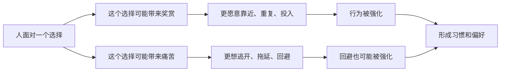

## 心理学思维筑基课: 人会追求奖赏、回避痛苦
  
### 作者  
digoal  
  
### 日期  
2026-05-01 
  
### 标签  
奖赏 , 痛苦 , 大脑 , 长期目标 , 短期目标拆解 , 奖励 , 多巴胺 , 回避痛苦 , 大脑机制 
  
----  
  
## 背景 
奖励、惩罚、损失、威胁和安全感，会显著影响人的选择。  
  

> 面向对象: 初中到高中学生  
> 核心问题: 为什么人常常会靠近让自己舒服、被认可、有收获的事，同时避开让自己难受、失败、丢脸或受伤的事？  
> 先说结论: “人会追求奖赏、回避痛苦”是心理学里一个非常基础的行为原则。它说的是，人常常会被奖励、满足、轻松、认可和安全感吸引，也会避开疼痛、羞耻、恐惧、损失和压力。很多行为习惯、拖延、上瘾、努力、依赖和逃避，都能从这个原则中找到线索。

## 一张图先看懂



## 求真讲法

### 它到底说了什么

“人会追求奖赏、回避痛苦”先要把两个词讲清楚。

**奖赏**不只是钱和礼物，还包括：

- 开心、放松、轻松。
- 被夸奖、被喜欢、被接纳。
- 成就感、控制感、胜利感。
- 解决麻烦之后的松一口气。

**痛苦**也不只是身体疼，还包括：

- 失败、羞耻、尴尬。
- 焦虑、无聊、挫败。
- 被拒绝、被批评、被忽视。
- 做困难任务时的不舒服感。

所以，这条原则真正表达的是：

> 人的很多行为，都会朝着“更舒服、更有好处、更安全”的方向移动，同时远离“更难受、更危险、更丢脸”的方向。

一个简单表格：

| 行为 | 当下奖赏 | 当下痛苦 |
|---|---|---|
| 写作业 | 长期成绩好 | 现在要费脑、可能做错 |
| 刷短视频 | 立刻轻松、有趣 | 几乎没有即时痛苦 |
| 运动 | 长期更健康 | 当下会累、会痛 |
| 逃避冲突 | 暂时轻松 | 关系问题可能拖更久 |

这也解释了一个常见现象：  
人不一定总做“长期最好”的事，往往更容易先被“当下更舒服”的事吸引。

### 它是怎么来的

这条原则来自心理学对学习和动机的长期观察。

第一，**行为主义发现，被奖励的行为更容易重复。**  
如果一个行为之后带来好处，人大概率会更愿意再做一次。

第二，**回避痛苦本身也会变成奖励。**  
比如一个人因为怕失败而拖延，拖延后他暂时没那么焦虑了。这个“焦虑下降”的感觉，本身就会强化拖延。

第三，**大脑对即时反馈特别敏感。**  
立即得到的小奖赏，往往比遥远的大收益更能驱动行为。

第四，**社会性奖赏和痛苦非常强。**  
被认可、被喜欢、被接纳，对人很有吸引力；被嘲笑、被孤立、被羞辱，也会强烈影响行为。

可以用一个简单的 ASCII 图理解：

```text
行为 -> 得到舒服/好处 -> 更容易重复

行为 -> 暂时躲开难受/压力 -> 也更容易重复
```

所以，追求奖赏和回避痛苦，不只是“喜欢好事、讨厌坏事”这么简单，而是行为形成和习惯维持的底层机制。

### 它依赖哪些假设

“人会追求奖赏、回避痛苦”成立，依赖几个前提。

| 假设 | 含义 | 如果不成立会怎样 |
|---|---|---|
| 人能感受到结果差异 | 会区分舒服和难受、收益和损失 | 如果完全感觉不到差异，强化机制会变弱 |
| 行为和结果之间存在联系 | 做了某事后会得到反馈 | 如果行为后果完全随机，学习会更困难 |
| 当下体验会影响未来选择 | 记得什么值得靠近、什么值得回避 | 如果经验不会留下痕迹，习惯难形成 |
| 人不总是只按理性长期利益行动 | 即时感受有分量 | 如果人完全按长期最优行动，这条原则会弱很多 |

这也说明一句关键的话：

> 奖赏和痛苦不一定是客观大小决定的，很多时候是由一个人主观怎么感受、怎么解释来决定的。

### 常见误解

**误解一：追求奖赏就是自私。**  
不对。帮助别人、承担责任、坚持训练，也可能带来意义感、归属感和自我尊重这些更深层奖赏。

**误解二：回避痛苦就是软弱。**  
不对。回避是很自然的倾向，只是有些回避在长期上会制造更大问题。

**误解三：只要知道什么对自己好，就一定会去做。**  
不对。长期对自己好，和当下有奖赏，不是同一回事。

**误解四：奖赏一定是外部给的。**  
不对。内在满足感、成就感、自我认可，也是非常强的奖赏。

## 求存讲法

### 它有什么用

这条原则最大的作用，是帮你理解很多“明知道不该这样却还是这样”的行为。

比如：

- 为什么会拖延。
- 为什么戒掉坏习惯很难。
- 为什么有人明知不健康还是熬夜。
- 为什么表扬、反馈和环境设计会影响行为。

你会开始多问几句：

- 这个行为到底给了什么奖赏？
- 它帮人躲开了什么痛苦？
- 想改变它，应该改变哪种反馈？

这会比单纯说“你要自律”更有用。

### 它怎么迁移到熟悉领域

这个原则非常容易迁移到学生生活。

| 场景 | 追求的奖赏 | 回避的痛苦 |
|---|---|---|
| 刷手机 | 有趣、轻松、即时刺激 | 回避无聊、压力、困难任务 |
| 不敢发言 | 可能失去表现机会 | 回避出错和尴尬 |
| 努力学习 | 想拿成绩、被认可、获得掌控感 | 回避失败和落后 |
| 讨好别人 | 想被喜欢、被接纳 | 回避冲突、被拒绝 |

迁移后的核心意思是：

> 你看到的表面行为，往往不是终点；真正驱动它的，是这个行为带来的奖赏，或它帮人避开的痛苦。

### 它的适用范围和边界

这条原则适合用于：

- 理解习惯、拖延、成瘾、坚持、回避和关系模式。
- 设计更有效的学习和行为改变方法。
- 帮助自己识别即时诱惑和长期收益的冲突。
- 理解为什么有些行为明知不好却很难停下。

但它也有边界。

第一，人不是只会追求快乐。  
很多人也会为了价值、责任、身份认同和意义，主动承受短期痛苦。

第二，奖赏和痛苦不完全客观。  
同一件事，不同人感受可能完全不同。

第三，文化和环境会改变什么算奖赏、什么算痛苦。  
被表扬、被独立、被服从，在不同环境里的意义并不相同。

第四，这条原则不能解释全部复杂行为。  
有些行为还要结合依恋、人格、创伤、认知偏差和社会情境来理解。

### 正例: 怎么用它提升能力

假设一个学生总拖延背单词。

如果只说“我意志力差”，通常没什么帮助。  
如果用这条原则分析，可能会发现：

- 背单词当下很枯燥，是痛苦。
- 刷手机当下很轻松，是奖赏。
- 拖延还能暂时避开“我记不住怎么办”的焦虑。

那改变方法就会更具体：

- 把任务拆小，降低开始时的痛苦。
- 做完一组就给自己一个小奖励。
- 把手机放远，减少即时奖赏的诱惑。
- 用打卡、同伴监督和反馈把长期目标变成短期奖赏。

这里真正改变的，不是“人性”，而是奖赏和痛苦的结构。

### 反例: 前提不成立会怎样

假设家长说：“孩子不学习，就是因为他不在乎未来。”

这个判断可能忽略了更直接的机制：

- 学习本身太难，带来高痛苦。
- 短视频和游戏给的即时奖赏太强。
- 他一碰学习就想到失败和被批评，于是下意识回避。

如果只讲大道理，而不改变奖励结构和痛苦体验，行为往往不会明显改变。

这里失败的根本原因，是忽略了“当下体验会影响未来选择”这个前提。  
人常常不是不懂未来重要，而是被当下更强的奖赏和更强的回避驱动拉走了。

## 思考

为什么很多真正有价值的事情，往往在开始时更痛苦，而很多没那么好的事却更容易上瘾？

因为短期奖赏和长期价值，经常不是一回事。  
大脑对“现在就舒服一点”很敏感，而成长、健康、学习、关系修复，很多都要先经过不舒服阶段才有回报。

这也引出几个更深的问题：

- 你现在做的事，是因为它真的重要，还是因为它即时奖赏最强？
- 你回避的，是不必要的伤害，还是成长必经的不舒服？
- 你能不能把长期有价值的事，设计出更及时的奖赏？

成熟的心理学思维，不是责怪自己“为什么总想舒服”，而是学会重新安排：

- 什么该更容易开始。
- 什么该减少诱惑。
- 什么该把长期目标变成短期反馈。

“人会追求奖赏、回避痛苦”真正教人的，是别只和意志力硬拼，而要学会设计行为背后的反馈系统。

## 最后记住

1. 人的很多行为都会被奖赏吸引，也会被痛苦回避驱动。
2. 奖赏不只是物质奖励，认可、轻松、成就感和安全感也都是奖赏。
3. 很多坏习惯之所以难改，不是因为人不懂道理，而是因为即时奖赏太强、即时痛苦太弱。
4. 回避痛苦有时能短期减压，但长期可能让问题更大。
5. 真正有效的改变，常常不是空喊自律，而是重组奖赏和痛苦的结构。

## 参考资料

- B. F. Skinner, *Science and Human Behavior*, 关于强化、奖赏和行为形成的经典框架。
- Richard H. Thaler, Cass R. Sunstein, *Nudge*, 关于行为如何受反馈和环境设计影响的通俗框架。
- David G. Myers, *Psychology*, 关于学习、动机、奖赏系统和行为习惯的通用教材体系。
- 本文为面向学生的简化解释，基于通用心理学教材框架，不用于诊断或替代专业心理帮助。

  
  
#### [PostgreSQL 解决方案集合](../201706/20170601_02.md "40cff096e9ed7122c512b35d8561d9c8")
  
  
#### [德哥 / digoal's Github - 公益是一辈子的事.](https://github.com/digoal/blog/blob/master/README.md "22709685feb7cab07d30f30387f0a9ae")
  
  
#### [About 德哥](https://github.com/digoal/blog/blob/master/me/readme.md "a37735981e7704886ffd590565582dd0")
  
  

  
