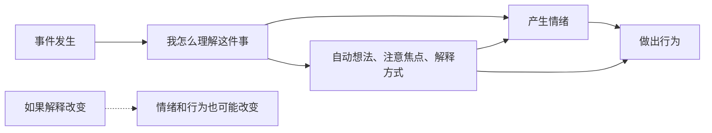

## 心理学思维筑基课: 认知会影响情绪和行为
  
### 作者  
digoal  
  
### 日期  
2026-05-04 
  
### 标签  
认知 , 解释 , 事件 , 解释器 , 情绪 , 行为 
  
----  
  
## 背景 
人不是直接对事件反应，而是对自己“如何解释事件”作出反应。  

> 面向对象: 初中到高中学生  
> 核心问题: 为什么同一件事，不同人会有完全不同的情绪和反应？  
> 先说结论: 认知会影响情绪和行为，说的是人不是直接对“事情本身”反应，而是对“自己怎么理解这件事”作出反应。事件像原材料，认知像解释器；解释不同，情绪和行为就可能完全不同。

## 一张图先看懂



## 求真讲法

### 它到底说了什么

“认知会影响情绪和行为”可以先用一句最重要的话来理解：

> 不是事情自动决定你的感受，而是你对事情的解释，常常决定你接下来怎么感受、怎么行动。

这里的“认知”不只是认真思考的大脑活动，它还包括：

- 你注意到了什么。
- 你忽略了什么。
- 你怎么解释一件事。
- 你脑子里自动跳出的念头是什么。
- 你给这件事赋予了什么意义。

举个最简单的例子：

| 事件 | 认知解释 | 情绪和行为 |
|---|---|---|
| 老师上课点你回答问题 | “老师想羞辱我” | 紧张、害怕、回避 |
| 老师上课点你回答问题 | “老师相信我能回答” | 紧张但愿意尝试 |
| 老师上课点你回答问题 | “这是练习机会” | 更平静、更愿意开口 |

事情是同一件事，反应却不同。  
这不是因为情绪毫无规律，而是因为中间多了一层解释。

所以，这条原则真正表达的是：

**事件、认知、情绪、行为之间，通常不是一条直线，而是一条“先解释，再反应”的链。**

### 它是怎么来的

这条原则和认知心理学、认知治疗的发展密切相关。

早期很多人容易把情绪理解成“事情直接引起的”。  
后来心理学家发现，现实更接近下面这个结构：

```text
事件
 -> 自动想法 / 解释
 -> 情绪
 -> 行为
```

认知治疗的重要贡献之一，就是把这层“解释”清楚地摆出来。  
比如 Aaron Beck 等人的工作强调：

- 人会形成自动想法。
- 自动想法常常非常快，快到我们以为自己只是“自然反应”。
- 这些想法会影响情绪强度和后续行为。

例如考试没考好：

- 有人会想：“我太差了，我没救了。”
- 有人会想：“这次没发挥好，但我知道哪里要补。”

这两种解释，带来的情绪和行动差别会非常大。

可以用一个简单的 ASCII 图看：

```text
事件相同
   |
   v
解释 A: “这是威胁”
   -> 焦虑、退缩

解释 B: “这是挑战”
   -> 紧张、但尝试
```

这就是为什么心理学在研究行为时，不只看外部刺激，也看内在解释系统。

### 它依赖哪些假设

“认知会影响情绪和行为”成立，依赖几个关键前提。

| 假设 | 含义 | 如果不成立会怎样 |
|---|---|---|
| 人会主动解释事件 | 不只是被动接受刺激 | 如果完全没有解释过程，认知作用会弱很多 |
| 不同解释会带来不同反应 | 意义赋予会改变体验 | 如果解释不会影响情绪，理论就站不住 |
| 自动想法可以被识别 | 虽然很快，但能被训练着看见 | 如果完全不可觉察，就很难改变 |
| 认知不是唯一因素 | 情绪和行为还受身体、环境、经验影响 | 如果把一切都归结给认知，会过度简化 |

这也说明一句关键的话：

> 认知会影响情绪和行为，不等于情绪都是“想太多”造成的，更不等于只要换个想法就万事大吉。

### 常见误解

**误解一：既然认知影响情绪，那情绪就是假的。**  
不对。情绪很真实，只是它常常经过了主观解释这一层。

**误解二：只要正能量一点，情绪就能立刻变好。**  
不对。有效的认知调整不是硬灌鸡汤，而是更准确、更平衡地理解事情。

**误解三：认知决定一切。**  
不对。睡眠、激素、创伤、环境压力、人际关系也都会影响情绪和行为。

**误解四：自动想法就是深思熟虑后的观点。**  
不对。自动想法往往来得很快、很熟、很像“理所当然”。

## 求存讲法

### 它有什么用

这条原则最大的作用，是给情绪和行为提供一个“可改变的中间环节”。

如果你以为：

```text
事件 -> 情绪 -> 行为
```

那很多时候会觉得自己只能被动接受。  
但如果你看到：

```text
事件 -> 认知解释 -> 情绪 -> 行为
```

就会发现，虽然不能立刻控制事件，但可以慢慢训练自己去识别和修正解释方式。

这会帮助你：

- 降低灾难化想法。
- 减少误会和冲突。
- 提高面对压力时的弹性。
- 把“我就是这样”改成“我可以调整解释方式”。

### 它怎么迁移到熟悉领域

这个原则在学生生活里非常常见。

| 场景 | 认知解释 1 | 认知解释 2 |
|---|---|---|
| 被同学没回消息 | “他讨厌我” | “他可能忙，还没看到” |
| 考试失误 | “我完蛋了” | “我这部分没掌握，要补” |
| 被老师批评 | “我就是不行” | “这次做法有问题，不等于我整个人不行” |
| 上台发言 | “大家会笑我” | “大家多半也在想自己的事” |

迁移后的核心意思是：

> 很多让你难受的，并不只是事情，而是你脑中对事情的第一版解释。

### 它的适用范围和边界

这条原则适合用于：

- 理解焦虑、挫败、误会和压力反应。
- 改善自我对话和学习状态。
- 调整冲突中的过度解读。
- 作为认知行为治疗等方法的基础入门框架。

但它也有边界。

第一，不是所有情绪问题都能只靠改认知解决。  
严重创伤、抑郁、惊恐、生理疾病等可能需要更完整的支持。

第二，有些解释本来就是准确的。  
不能把每个负面想法都当成“想多了”。

第三，认知调整需要练习。  
不是看懂道理一次，自动想法就会自动消失。

第四，环境真的很糟时，问题不只在解释。  
如果一个人持续被羞辱、压迫或忽视，改变环境比只改想法更重要。

### 正例: 怎么用它提升能力

假设一个学生一到考试前就很焦虑。

如果他只看到“我一考试就会紧张”，往往很难改变。  
如果进一步拆开认知链，可能会发现：

- 自动想法是“如果考不好，我就完了”。
- 解释方式是“这次表现 = 我整个人的价值”。

一旦看见这层，就有了改变入口：

- 把“完了”改成更准确的判断，比如“这次重要，但不是人生终局”。
- 把“我这个人不行”改成“我这部分还没练够”。
- 把注意力从“证明自己”转回“完成题目”。

这并不会让压力瞬间消失，但常能让焦虑从失控，变成可承受、可行动的紧张。

### 反例: 前提不成立会怎样

假设有人说：“你难过就是因为你想法不对，想开一点就好了。”

这句话的问题，是把认知影响扩大成了认知万能。

可能真实情况是：

- 这个人长期睡眠不足。
- 正处在真实的人际排斥里。
- 家庭环境持续高压。
- 过去创伤让他对威胁特别敏感。

这里失败的根本原因，不是“认知不重要”，而是忽略了“认知不是唯一因素”这个前提。  
只改想法，不碰环境、身体状态和关系处境，很多问题并不会真正缓解。

## 思考

为什么很多人会觉得“我明明就是被事情弄难受的”，很难意识到中间还有一层认知？

因为解释太快了。  
快到像是“事实本身”。  
例如“他没理我 = 他讨厌我”，这其实已经是一种解释，但在当下很容易被当成客观现实。

这也引出几个更深的问题：

- 你现在难受，是因为事实本身，还是因为你把它解释成了最糟版本？
- 你的第一反应，是不是唯一解释？
- 有哪些自动想法，正在悄悄替你决定情绪和行为？

成熟的心理学思维，不是让自己变得麻木，也不是强行积极，而是学会在反应前多看一眼：

- 我现在是怎么理解这件事的？
- 这个理解有证据吗？
- 有没有更准确、更有帮助的解释方式？

“认知会影响情绪和行为”真正教人的，是把自动反应变成可观察、可调整的过程。

## 最后记住

1. 人常常不是直接对事件反应，而是对自己如何解释事件作出反应。
2. 认知包括自动想法、注意焦点、解释方式和意义赋予。
3. 同一件事，不同认知可能带来完全不同的情绪和行为。
4. 认知很重要，但不是唯一因素，环境、经验和身体状态同样关键。
5. 真正有效的调整，不是硬想积极，而是学会更准确、更平衡地理解事情。

## 参考资料

- Aaron T. Beck, *Cognitive Therapy and the Emotional Disorders*, 关于自动想法、认知解释与情绪行为关系的经典框架。
- Judith S. Beck, *Cognitive Behavior Therapy: Basics and Beyond*, 关于认知行为模型的清晰教学框架。
- David G. Myers, *Psychology*, 关于认知、情绪和行为关系的通用教材体系。
- 本文为面向学生的简化解释，基于通用心理学与认知治疗教材框架，不用于诊断或替代专业心理帮助。
  
  
#### [PostgreSQL 解决方案集合](../201706/20170601_02.md "40cff096e9ed7122c512b35d8561d9c8")
  
  
#### [德哥 / digoal's Github - 公益是一辈子的事.](https://github.com/digoal/blog/blob/master/README.md "22709685feb7cab07d30f30387f0a9ae")
  
  
#### [About 德哥](https://github.com/digoal/blog/blob/master/me/readme.md "a37735981e7704886ffd590565582dd0")
  
  

  
