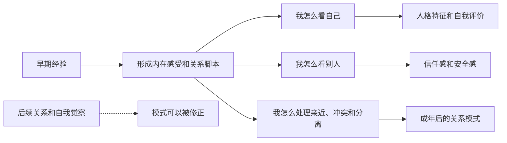

## 心理学思维筑基课: 早期经验会影响人格和关系模式
  
### 作者  
digoal  
  
### 日期  
2026-05-04 
  
### 标签  
早期反复经历 , 原生家庭 , 人格 , 塑造 
  
----  
  
## 背景 
童年、家庭互动、依恋关系和早期创伤，会影响成年后的安全感、信任、亲密关系和自我评价。  
  
> 面向对象: 初中到高中学生  
> 核心问题: 为什么一个人小时候经历过的养育方式、关系氛围和重要事件，会在长大后影响他怎么看自己、怎么看别人、怎么建立关系？  
> 先说结论: 早期经验会影响人格和关系模式，是心理学里很重要的一条原则。它说的是，人在成长早期与照顾者、家庭和环境反复互动，会慢慢形成“我值不值得被爱”“别人可不可靠”“遇到冲突该靠近还是退开”这类内在模式。它们常会延续到后来的性格和关系中，但并不等于命运已经被写死。

## 一张图先看懂



## 求真讲法

### 它到底说了什么

“早期经验会影响人格和关系模式”不是说小时候发生一件事，就自动决定一生，而是说：

> 人在成长早期反复经历的互动方式，会逐渐变成自己理解世界、理解关系、理解自己的默认模板。

这里的“早期经验”通常包括：

- 照顾者是否稳定回应自己。
- 家里冲突多不多、安不安全。
- 自己表达情绪时，会被安慰、忽视、嘲笑还是惩罚。
- 犯错时，是被引导，还是被羞辱。
- 亲近关系里，自己是被接住，还是常常被推开。

这些经验会慢慢回答一些很核心的问题：

| 内在问题 | 可能形成的答案 |
|---|---|
| 我值得被爱吗？ | 值得 / 不值得 / 要表现好才值得 |
| 别人可靠吗？ | 大体可靠 / 难以预测 / 不值得信任 |
| 我有需要时能求助吗？ | 可以 / 最好不要 / 求助很危险 |
| 冲突出现时怎么办？ | 能沟通 / 先讨好 / 先攻击 / 先逃开 |

所以，这条原则真正表达的是：

**人格和关系模式，不只是天生长出来的，也是在早期关系环境里一点点学出来的。**

### 它是怎么来的

这条原则背后，和发展心理学、依恋理论、社会学习理论都有关系。

第一，**依恋理论强调早期照顾关系的重要性。**  
如果照顾者大体稳定、可回应，孩子更容易形成“世界基本安全、我可以求助”的感觉。  
如果回应长期混乱、冷漠或令人害怕，孩子可能形成更紧张或回避的关系策略。

第二，**社会学习会让孩子模仿关系处理方式。**  
孩子不仅听大人怎么说，也在看大人怎么相处、怎么发火、怎么和解、怎么处理亲密和边界。

第三，**重复经验会形成默认反应。**  
如果一个人从小 repeatedly 感受到“表达需要会被嫌麻烦”，他长大后就可能更倾向于压抑需要，哪怕后来环境已经不一样了。

可以用一个简单的 ASCII 图理解：

```text
小时候反复经历:
“我哭了 -> 有人安慰我”
    -> 学到: 我可以求助, 关系可依靠

小时候反复经历:
“我表达需要 -> 被嫌弃/忽略”
    -> 学到: 最好别麻烦别人
```

这不是机械因果，而是长期学习和适应的结果。

### 它依赖哪些假设

“早期经验会影响人格和关系模式”要成立，依赖几个关键前提。

| 假设 | 含义 | 如果不成立会怎样 |
|---|---|---|
| 早期大脑和心理具有较强可塑性 | 早期互动特别容易留下痕迹 | 如果早期完全不敏感，影响会小很多 |
| 反复经验会形成稳定模式 | 一次次互动会沉淀成默认脚本 | 如果经验不会积累，长期模式难形成 |
| 人会把早期学到的策略带到后来关系里 | 旧模式会迁移到新场景 | 如果完全不会迁移，影响会弱很多 |
| 后续经验也能修正旧模式 | 不是一锤定音 | 如果后续完全不能改变，就会变成决定论 |

这也说明一句关键的话：

> 早期影响深，不等于早期决定一切。

### 常见误解

**误解一：原生家庭决定一生。**  
不对。早期影响很大，但后续关系、反思、治疗、环境变化都能带来修正。

**误解二：有问题一定都怪父母。**  
不对。影响来源可能很多，家庭重要，但不是唯一因素。

**误解三：只要童年不好，长大关系一定差。**  
不对。有些人会在后续关系中得到修复，也会发展出很强的觉察和韧性。

**误解四：人格就是早期经验的结果。**  
不对。人格还受气质、生理基础、同伴关系、文化和后续经历影响。

## 求存讲法

### 它有什么用

这条原则最大的作用，是帮助人理解：

- 为什么自己总在关系里重复某种模式。
- 为什么有些反应明明不合理，却像自动触发。
- 为什么某些人特别怕被抛弃，某些人特别怕太亲近。
- 为什么一个人嘴上说想亲密，行动上却总推开别人。

它提醒你：  
**很多成年后的关系困扰，不只是当下没处理好，也可能和旧经验留下的关系脚本有关。**

### 它怎么迁移到熟悉领域

这个原则在学生生活里也很容易看到。

| 早期经验类型 | 可能形成的后续模式 |
|---|---|
| 被稳定鼓励、出错后能被接住 | 更敢尝试、较少因失败而全盘否定自己 |
| 表达情绪常被嘲笑 | 更容易压抑情绪、不敢求助 |
| 家里冲突很多且不可预测 | 对气氛变化特别敏感，容易紧绷 |
| 成绩好时才被看见 | 容易把“有表现”当成“值得被爱”的条件 |

迁移后的核心意思是：

> 你现在的很多习惯反应，可能不是你“天生就这样”，而是你过去学会了这样比较能活下来。

### 它的适用范围和边界

这条原则适合用于：

- 理解依恋、安全感、自尊和关系模式。
- 帮助自己识别反复出现的人际困扰。
- 分析为什么有些行为像自动程序一样触发。
- 作为自我觉察和成长的入口。

但它也有边界。

第一，不能把它用成宿命论。  
心理模式会影响今天，但不代表今天没有新的选择。

第二，不能只往过去找解释。  
当前环境和关系正在发生什么，同样重要。

第三，不是每个问题都要追溯到童年。  
有些困扰更直接地来自眼前压力、创伤或现实处境。

第四，早期影响有时是概率，不是必然。  
同样经历，不同人会有不同反应，因为气质、资源和支持不同。

### 正例: 怎么用它提升能力

假设一个学生发现自己在人际关系里总是特别怕被讨厌，于是不断讨好别人。

如果只说“我性格软弱”，很难改变。  
如果用这条原则去看，可能会发现：

- 小时候自己一表达不同意见，就容易被否定。
- 于是慢慢学会：安全的方式是顺着别人，别惹麻烦。

一旦看见这个旧模式，就有新的练习方向：

- 先在小事上表达不同意见。
- 学习区分“别人不高兴”和“关系会破裂”不是同一回事。
- 在更安全的人际关系里练习边界和真实表达。

这时改变的重点，不是逼自己“立刻变强”，而是慢慢更新旧脚本。

### 反例: 前提不成立会怎样

假设有人说：“我现在关系里总逃避亲密，所以一定是我小时候出了什么问题，已经没法改了。”

这句话的问题有两层。

第一，它把“早期影响”误读成“早期决定”。  
第二，它忽略了后续关系、现实压力和自我练习的作用。

可能真实情况是：

- 早期经验确实让他更习惯自我保护。
- 但现在的环境里，也缺少让他感到安全的关系。
- 同时他还没学会新的表达和靠近方式。

这里失败的根本原因，不是早期经验不重要，而是忽略了“后续经验也能修正旧模式”这个前提。  
如果把影响读成命运，人反而更难改变。

## 思考

为什么有些人长大后明明知道某种关系模式让自己受苦，却还是会反复进入同样的循环？

因为熟悉感很强。  
人不一定总追求“最好”，很多时候更容易回到“熟悉”的模式，即使这个熟悉并不舒服。  
旧模式像自动导航，虽然不一定带你去好地方，但它让你不用重新学习。

这也引出几个更深的问题：

- 你在关系里最自动的反应，是保护现在的自己，还是重复过去学到的生存方式？
- 你以为的“我就是这样”，里面有多少其实是旧脚本？
- 哪些后续关系，正在帮助你修正早期留下的答案？

成熟的心理学思维，不是把一切都怪到童年，也不是否认童年的影响，而是同时看见两件事：

- 过去怎样塑造了今天。
- 今天又怎样重新塑造未来。

“早期经验会影响人格和关系模式”真正教人的，不是把自己困在过去，而是看见旧模式从哪里来，才知道新模式怎么长出来。

## 最后记住

1. 早期经验常会影响一个人怎么看自己、怎么看别人、怎么处理亲近和冲突。
2. 这些影响往往通过反复互动，慢慢沉淀成默认的关系脚本和自我感受。
3. 早期影响很深，但不是决定论，后续关系和自我觉察都可能带来修正。
4. 很多成年后的自动反应，可能不是天生性格，而是早年学会的适应策略。
5. 真正有力量的理解，不是停在“我小时候怎样”，而是继续问“我现在怎么更新这个旧模式”。

## 参考资料

- John Bowlby, *Attachment and Loss*, 关于依恋、早期照顾关系与后续心理模式的重要理论基础。
- Mary Ainsworth 相关依恋研究，帮助区分不同依恋模式与照顾互动的关系。
- Judith Lewis Herman, *Trauma and Recovery*, 关于早期创伤如何影响安全感、关系与自我组织的通俗框架之一。
- David G. Myers, *Psychology*, 关于发展心理、人格与关系模式的通用教材体系。
- 本文为面向学生的简化解释，基于通用发展心理学与依恋理论框架，不用于诊断或替代专业心理帮助。

  
  
#### [PostgreSQL 解决方案集合](../201706/20170601_02.md "40cff096e9ed7122c512b35d8561d9c8")
  
  
#### [德哥 / digoal's Github - 公益是一辈子的事.](https://github.com/digoal/blog/blob/master/README.md "22709685feb7cab07d30f30387f0a9ae")
  
  
#### [About 德哥](https://github.com/digoal/blog/blob/master/me/readme.md "a37735981e7704886ffd590565582dd0")
  
  

  
