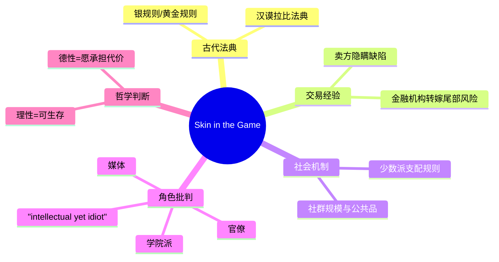
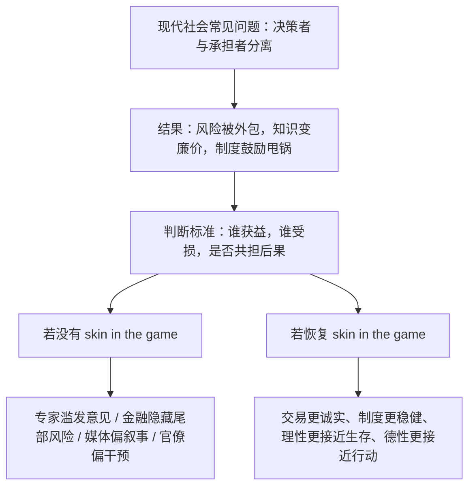

## 《Skin in the Game | 非对称风险》读书笔记：真正重要的不是观点对不对，而是谁替观点买单
  
### 作者  
digoal  
  
### 日期  
2026-05-05 
  
### 标签  
非对称风险 , 风险转嫁 , 伦理 , 知识 , 权力 , 制造后果 , 承担后果 
  
----  
  
## 背景 
  
  
> 一句话结论：塔勒布这本书表面在讲风险，底层其实在讲伦理、知识与权力的同一条约束线：谁制造后果，谁就应承担后果。  
> 适合谁读：做投资、做管理、做政策、做媒体、做研究，以及经常“给别人建议”的人。  
> 我的评价：这不是一本结构工整的教材，而是一部带攻击性的判断机器。它最有价值的地方，不是结论都对，而是它逼你用“谁在承担代价”重写很多熟悉问题。

## 1. 书籍档案与资料来源

### 书籍档案

- 书名：*Skin in the Game: Hidden Asymmetries in Daily Life*
- 作者：Nassim Nicholas Taleb
- 丛书：Incerto
- 豆瓣对应版本：2018-02-27，Random House，精装，304 页，ISBN `9780425284629`（ [豆瓣](https://book.douban.com/subject/27200412/) ）
- 版本说明：
  - 豆瓣条目对应的是 2018 年英文精装本，不是 2019 年中信中译本
  - Penguin Random House 页面同时列出 2020-01-07 的平装本，ISBN `9780425284643`（[Penguin Random House](https://www.penguinrandomhouse.com/books/537828/skin-in-the-game-by-nassim-nicholas-taleb/)）

### 作者背景

资料显示，Taleb 曾做二十多年衍生品交易，后转入风险、概率与尾部风险研究；NYU Tandon 的作者页把他定义为风险工程领域学者，并明确把 *Skin in the Game* 列为 Incerto 五卷之一（[NYU Tandon](https://engineering.nyu.edu/faculty/nassim-nicholas-taleb)）。

### 本文使用材料

- 官方书目信息：豆瓣、Penguin Random House
- 作者相关访谈页：关于 “Skin in the Game / Soul in the Game / rationality / honour” 的访谈引介（[nassimtaleb.org 页面汇总](https://nassimtaleb.org/2019/10/interview-katrine-marcal/)）
- 学术书评：Frontiers in Psychology（[Frontiers](https://www.frontiersin.org/journals/psychology/articles/10.3389/fpsyg.2018.01640/full)）
- 媒体/专业评论：Kirkus（[Kirkus Reviews](https://www.kirkusreviews.com/book-reviews/nassim-nicholas-taleb/skin-in-the-game-hidden/)）、Management 学术期刊书评元信息（[Management Journal](https://management.fon.bg.ac.rs/index.php/mng/article/view/317)）

  
## 2. 时代背景：这本书在回应什么问题

这本书出版于 2018 年，但它回应的问题明显属于 2008 年金融危机之后的长期症候：决策者赚了上行，社会承担下行；专家制造模型，别人承担模型失灵；媒体、官僚、职业经理人、政策设计者往往能输出意见，却不必为意见的后果付出对等代价。

Taleb 在本书前言里直接把主题压缩为四个互相缠绕的问题：知识是否可靠、人与人之间是否对称、交易中信息如何分享、复杂世界里理性到底该怎么定义。我的判断是，这四件事在他那里其实是一件事：没有代价约束的知识，会迅速变成廉价话语；没有代价约束的制度，会迅速变成风险外包。

为什么它在今天仍然重要？因为平台经济、金融工程、舆论产业、公共政策、AI 建议系统，本质上都在放大一个古老问题：建议者、设计者、传播者和承担者，往往不是同一批人。塔勒布要纠正的，正是这种“讲话的人不受伤，听话的人去承担”的结构。

## 3. 作者想表达什么

### 主命题

可以把本书的核心命题写成一句话：

世界真正危险的，不是风险本身，而是风险与后果被不对称地分配；因此，公平、理性、知识可信度，都要回到“谁在承担后果”来检验。

### 次级命题

1. 公平首先不是抽象平等，而是风险共担。
2. 很多制度失败，不是因为规则不够多，而是因为决策者不承担失败成本。
3. 少数坚定且不可妥协的人，常常比多数温和的人更能塑造现实。
4. 理性不是教科书式优化，而是能在真实世界里活下来。
5. 真正的德性不在表态，而在愿不愿意押上自己的利益、声誉、身体或命运。

### 隐含价值观

- 偏好局部知识，怀疑远距离抽象治理
- 偏好惩罚风险转嫁，怀疑“善意但无代价”的干预
- 偏好经过时间检验的实践，怀疑只在模型里成立的聪明

## 4. 作者如何证明：数据、案例、故事与概念

Taleb 不是按学术论文的方式证明，而是用“历史法典 + 日常交易 + 制度观察 + 讽刺人物画像”来反复敲同一个钉子。

### 证据地图

### 他最常用的几类支撑

| 支撑类型 | 典型内容 | 它在论证里起什么作用 |
|---|---|---|
| 法律/历史 | 汉谟拉比法典、古代交易伦理 | 说明“风险共担”不是新潮观念，而是文明底层规则 |
| 市场经验 | 交易员、销售、库存转嫁、奖金不追索 | 说明现代金融如何系统性制造“不对称收益” |
| 社会观察 | kosher/halal、过敏原、地方自治 | 说明少数派与局部规则如何重塑整体秩序 |
| 人物画像 | “知识分子蠢货” | 用夸张人物型，批评无代价发言者 |
| 概念工具 | Lindy、尾部风险、理性、生存 | 把伦理批评升级成认知与系统论批评 |

## 5. 书中的 3 个浓缩例子

### 例子一：汉谟拉比法典里的“倒塌房屋”

- 书中发生了什么：Taleb 引用了古巴比伦法典中的经典规则，大意是建房者造的房子若倒塌并导致屋主死亡，建造者要承担极重责任。
- 作者借它证明什么：高风险职业不能只享受收益却把极端后果埋给别人。尤其是那些只有设计者自己知道的“角落风险”，最需要强制责任绑定。
- 这个例子的关键机制：把结果责任前置到决策者本人，能直接抑制隐藏尾部风险的激励。
- 我的迁移理解：这几乎可以无缝迁移到金融产品设计、算法推荐、医疗方案、工程外包。真正的问题常常不是“有没有制度”，而是“制度有没有让关键设计者一起上船”。

### 例子二：抓到海龟的人，自己先吃海龟

- 书中发生了什么：Taleb 用“你抓到的海龟，最好自己吃掉”这个古老寓言来讲建议与推销。提出“为你好”的人，往往也刚好从你的行动里受益。
- 作者借它证明什么：凡是建议者不承担损失、却能获得收益的场景，都天然值得警惕。
- 这个例子的关键机制：建议不是中性的；建议的可信度，取决于建议者是否暴露在同一后果里。
- 我的迁移理解：投资荐股、商业咨询、媒体标题党、KOL 带货、平台激励设计，很多都可以先问一句：如果结果反了，他损失什么？

### 例子三：顽固少数派如何支配多数

- 书中发生了什么：Taleb 观察到，严格遵守 kosher/halal 或对花生极度过敏的人，虽然人数很少，却能迫使供应链、学校、航班、零售端整体按他们的约束重排。
- 作者借它证明什么：现实世界很多规则并不是多数投票形成的，而是由“不能妥协的一小群人”推动的。
- 这个例子的关键机制：只要少数派的选择是单向约束，而多数派能兼容，系统为降低复杂度和库存成本，就会向少数派收敛。
- 我的迁移理解：这能解释语言、宗教饮食、合规要求、产品默认设置、软件接口兼容性，甚至政治议题如何被少数强意志群体塑形。

## 6. 论证逻辑图

逻辑上，Taleb 的关键转向是：把伦理问题、认知问题、制度问题统一到“后果绑定”上。也就是说，知识是否可靠，不先看论文和头衔，先看它是否经过自己付费的现实检验。

## 7. 前提假设与反方观点

| 前提假设 | 支撑材料 | 可能反例 | 我的判断 |
|---|---|---|---|
| 人会在不承担代价时系统性转嫁风险 | 全书反复用金融、媒体、政策、交易举例；学术书评也把其要点概括为对代理问题的批判（[Frontiers](https://www.frontiersin.org/journals/psychology/articles/10.3389/fpsyg.2018.01640/full)） | 有些职业伦理强、声誉约束强的领域并不完全如此 | 成立，但强度因行业不同而异 |
| 风险共担比繁复监管更有效 | 豆瓣与 PRH 简介都强调此点；Kirkus 也指出他偏向用责任约束替代空转知识（[Kirkus](https://www.kirkusreviews.com/book-reviews/nassim-nicholas-taleb/skin-in-the-game-hidden/)） | 某些高复杂系统只靠个人追责并不够，例如公共卫生、核安全 | 成立，但不能推导出“监管越少越好” |
| 少数派常比多数更能定义规则 | 书中 kosher/halal、过敏原等案例非常有解释力 | 当兼容成本很高，或多数派具备强制力时，少数派未必胜出 | 这是条件性规律，不是普遍铁律 |
| 理性应以生存和长期稳健定义 | 与 Taleb 一贯的 Incerto 路线一致 | 某些探索型行为短期看不稳健，却有长期创新价值 | 这个命题更像实践启发，而不是可一刀切的理论 |

### 重要反方观点

1. Taleb 常把有效直觉说得过满，容易把“有解释力”说成“足够证明”。
2. 他批评“知识分子蠢货”时很锋利，但有时把学院派、媒体人、政策制定者画得过于单一。
3. 他强调地方性、局部性和社群边界，这能带来稳健，也可能削弱对普遍正义的讨论。

我的判断是：这本书最适合当“纠偏器”，不适合当“唯一世界观”。它擅长纠正现代社会对代价、责任和远程治理的盲区，但不适合直接拿来代替完整的制度设计理论。

## 8. 作者真正的思想

表面上他在说风险，深层上他在说两件事。

第一，知识不是靠表达完成的，而是靠暴露完成的。一个判断如果永远不需要作者一起承担后果，它在 Taleb 那里就不配叫知识，只能叫 talk。

第二，道德不是态度，而是代价。你愿不愿意亲自承受失败、羞耻、损失、名誉受创，决定了你的主张到底是道德、装饰，还是广告。

所以这本书真正试图改变读者的，并不是“你该更懂风险”，而是“你要先学会识别谁没有下注却在指挥赌局”。

## 9. 我读完学到了什么

### 9.1 先问激励，不先问立场

很多争论并不需要先判断谁政治上对、谁道德上好，先问“谁承担结果”已经能过滤掉大量噪音。

### 9.2 不承担后果的专业化，往往会变坏

职位、头衔、模型、流程，都可能把人保护得太好。一个系统越能让决策者脱离结果，就越可能鼓励漂亮但脆弱的方案。

### 9.3 现实世界常常不是多数逻辑，而是约束逻辑

很多规则形成，不是多数人真同意，而是多数人“无所谓”，少数人“绝不退让”。这点对做产品、做组织、做社会分析都很有用。

### 9.4 理性不是“会解释”，而是“不容易死”

这是 Taleb 最有力量也最容易被误解的一点。他不是反理性，而是反“脱离生存检验的纸面理性”。

## 10. 如何举一反三

| 书中思想 | 可迁移场景 | 使用方法 | 风险 |
|---|---|---|---|
| 谁建议，谁共担 | 投资、咨询、医疗、产品策略 | 设计追责和回溯机制，看建议者是否暴露于结果 | 过度追责会抑制试错 |
| 少数派支配规则 | 平台治理、产品默认值、合规、组织规范 | 找到“不可妥协的少数约束”，优先建模 | 容易高估少数派影响力 |
| 银规则优先于黄金规则 | 管理、公共政策、跨团队协作 | 少做“我以为对你好”的干预，多先避免伤害 | 可能过于保守 |
| 理性=长期存活 | 投资组合、职业决策、系统架构 | 先排除致命错误，再追求局部最优 | 可能错过高波动高回报机会 |

### 一个很实用的四问清单

1. 这件事如果失败，谁最先疼？
2. 提建议的人，自己的利益会不会同步受损？
3. 有没有人把短期好处拿走，把长期尾部风险留给别人？
4. 这个规则是多数人真支持，还是少数人不能妥协、多数人懒得反对？

## 11. 我的反思与讨论问题

### 我赞同的地方

- 他对“远程发言、近端受损”的攻击非常准确，尤其适用于金融、媒体、政策和平台治理。
- 他把伦理、知识与制度串成一个判断框架，这一点非常强。
- 他对少数派规则的观察，属于一眼看穿很多社会现象的那种模型。

### 我保留意见的地方

- 他经常把批评写成审判，导致一些本来可讨论的命题，被风格提前极化。
- “地方共同体”在很多场景确实比抽象制度更有效，但现代社会也需要跨地域、跨阶层、跨文化的普遍保护机制。
- 他的很多判断更像“高质量启发式”，不总是“可严格证成的理论”。

### 值得讨论的问题

1. 在 AI 时代，模型给建议、人类承担后果，skin in the game 应该怎么设计？
2. 平台、媒体、咨询行业，是否天然比制造业更容易产生“无代价建议”？
3. 少数派支配规则，是文明进步的机制，还是新的绑架机制？

## 12. 分享版：3-5 分钟讲稿

如果让我用几分钟讲这本书，我会这样说：

塔勒布这本《Skin in the Game》讲的不是普通意义上的“冒险精神”，而是一个更硬的判断标准：一个人如果能决定别人的命运，却不用承担决定失败的代价，那这个系统迟早会出问题。  
他认为，公平不是口头上的平等，而是风险要共担；知识也不是谁学历高谁就对，而是谁愿意把自己放进后果里，谁的话才更可信。  
书里有几个特别有力的例子。一个是汉谟拉比法典，建房子的人如果把房子建塌了，就不能拍拍屁股走人；一个是“抓海龟的人自己吃海龟”，意思是你推荐给别人的东西，最好你自己也吃得下；还有一个是顽固少数派如何塑造社会规则，比如严格饮食要求的人虽然人数很少，却能逼着整个供应链为他们调整。  
所以这本书真正教我们的，是看问题不要先问谁说得漂亮，而要先问：谁在下注，谁在承担，谁把尾部风险埋给了别人。  
一句话总结：没有代价约束的观点，很容易变成伤害他人的廉价正确。

### 讨论问题

- 你所在行业里，最典型的“别人替你买单”现象是什么？
- 你更信任“说得对的人”，还是“会一起承担后果的人”？
- 组织内部哪些决策最需要重新绑定责任？

### 一句话 takeaway

判断一个观点值不值得信，不只看它是否正确，更看说这句话的人有没有和你一起冒险。

## 13. 来源与延伸阅读

### 核心来源

- 豆瓣条目与版本信息：[https://book.douban.com/subject/27200412/](https://book.douban.com/subject/27200412/)
- 出版社页面与版本差异：[https://www.penguinrandomhouse.com/books/537828/skin-in-the-game-by-nassim-nicholas-taleb/](https://www.penguinrandomhouse.com/books/537828/skin-in-the-game-by-nassim-nicholas-taleb/)
- Taleb 官方学术/职业背景：[https://engineering.nyu.edu/faculty/nassim-nicholas-taleb](https://engineering.nyu.edu/faculty/nassim-nicholas-taleb)
- 访谈页引介：[https://nassimtaleb.org/2019/10/interview-katrine-marcal/](https://nassimtaleb.org/2019/10/interview-katrine-marcal/)
- 学术书评：[https://www.frontiersin.org/journals/psychology/articles/10.3389/fpsyg.2018.01640/full](https://www.frontiersin.org/journals/psychology/articles/10.3389/fpsyg.2018.01640/full)
- Kirkus 评论：[https://www.kirkusreviews.com/book-reviews/nassim-nicholas-taleb/skin-in-the-game-hidden/](https://www.kirkusreviews.com/book-reviews/nassim-nicholas-taleb/skin-in-the-game-hidden/)
- 期刊书评元信息：[https://management.fon.bg.ac.rs/index.php/mng/article/view/317](https://management.fon.bg.ac.rs/index.php/mng/article/view/317)

  
### 延伸阅读建议

- 如果你想把这本书读深，最好连着看 Taleb 的 *Antifragile* 和 *The Black Swan*，因为 *Skin in the Game* 在结构上更像 Incerto 体系里的“伦理与责任分册”，不是一个孤立项目。

  
  
#### [PostgreSQL 解决方案集合](../201706/20170601_02.md "40cff096e9ed7122c512b35d8561d9c8")
  
  
#### [德哥 / digoal's Github - 公益是一辈子的事.](https://github.com/digoal/blog/blob/master/README.md "22709685feb7cab07d30f30387f0a9ae")
  
  
#### [About 德哥](https://github.com/digoal/blog/blob/master/me/readme.md "a37735981e7704886ffd590565582dd0")
  
  

  
