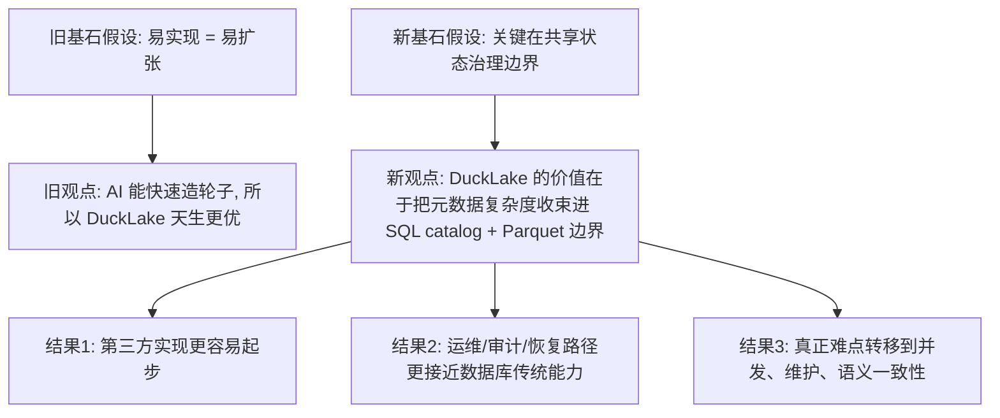
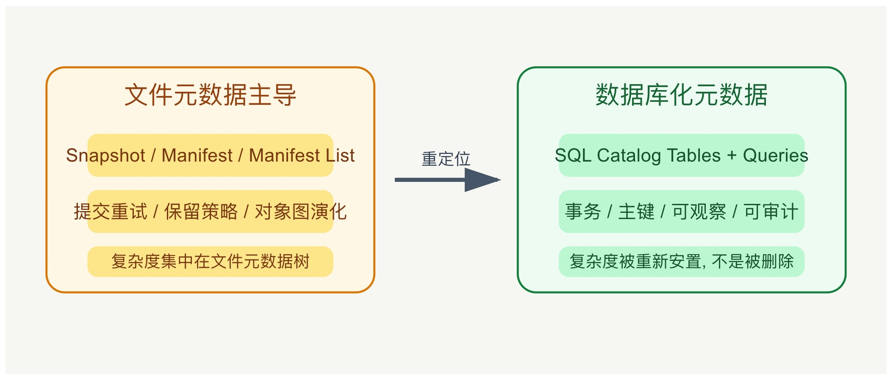

## DuckLake 的未来: 重新安置复杂度, catalog从文件回归到SQL
  
### 作者  
digoal  
  
### 日期  
2026-05-05 
  
### 标签  
DuckDB , DuckLake , 元数据 , parquet 数据 , 复杂度 , 回归SQL , schema 演化 , 时间旅行 , 分支 , 权限 , 恢复 , 审计  
  
----  
  
## 背景 
  
读 《The DuckLake Spec is so Simple, Even a Clanker Can Build One for Dataframes》 https://ducklake.select/2026/05/04/ducklake-dataframe/ 有感: DuckLake 真正简单的，不是湖仓系统，而是“元数据边界”

> 一句话新结论: DuckLake 的真正优势，不是“AI 几天就能写完一个实现”，而是它把湖仓里最难失控的那部分复杂度，尽量压缩进了 SQL catalog 与 Parquet 边界之内。

## 旧文真正说了什么

原文的核心结论并不复杂，可以压缩为 5 条：

1. DuckLake v1.0 的规范足够简单，一个 Python dataframe 适配器可以在几天内被 AI 写出来，并与 DuckDB 的 `ducklake` 扩展做到读写互通。
2. 这种简单性来自 DuckLake 的架构分工: catalog 负责元数据，Parquet 负责数据文件，实现者更像“编排器”。
3. 因为 DuckLake 是 spec，不是必须绑定 DuckDB runtime 的单体产品，所以 Pandas、Polars、PySpark 都可以做原生接入。
4. 与 Iceberg 相比，DuckLake 更容易被实现和理解。
5. 这证明 DuckLake 的设计方向是对的，甚至暗示 AI 辅助开发会加速整个生态扩张。

这些主张背后的基石假设是：

- 假设一: “能做出互通实现”已经足以说明协议设计优秀。
- 假设二: 湖仓格式的主要难点在“规范表述复杂”，而不在“长期状态治理复杂”。
- 假设三: 如果重活都交给 SQL 数据库和 Parquet，那么剩余实现难度就足够低，生态扩张会自然发生。
- 假设四: dataframe 场景可以代表更广义的数据湖生产场景。

原文拿来支撑这些主张的证据主要有三类：

- 官方文章里的实验事实: `ducklake-dataframe` 在 2026 年 5 月 4 日被展示为可与 DuckDB DuckLake v1.0 读写互通的 Python 实现。[原文](https://ducklake.select/2026/05/04/ducklake-dataframe/)
- DuckLake v1.0 官方发布中对“稳定规范、向后兼容、生产可用”的声明，以及对 inlining、sorted tables、bucket partitioning、deletion vectors 等能力的描述。[DuckLake v1.0](https://ducklake.select/2026/04/13/ducklake-10/)
- `ducklake-dataframe` 在 PyPI 上明确自述为 “proof of concept”，但同时给出了 Pandas、Polars、PySpark、SQLite、PostgreSQL、DuckDB 的组合支持与 1500+ 测试的叙述。[PyPI 页面](https://pypi.org/project/ducklake-dataframe/0.4.0/)

把旧文压成一句话就是：

> 旧文真正成立的判断，不是“DuckLake 已经简单到问题消失”，而是“DuckLake 把一个第三方读写器的首版实现门槛显著降下来了”。

## 旧逻辑的关键漏洞

旧文最大的问题，不是它错，而是它把两类复杂度混成了一类：

1. 协议表达复杂度。
2. 生产治理复杂度。

DuckLake 确实在第一类复杂度上做了强压缩。官方规范首页直接把它定义为两个构件: 支持事务和主键的 SQL catalog，加上 Parquet 数据存储；而且官方明确建议从 “Queries” 页面开始理解 DuckLake，意思很直白: 它本质上就是一套基于 SQL 表和查询定义的元数据协议。[DuckLake 规范导言](https://ducklake.select/docs/stable/specification/introduction)

但这并不自动推出第二类复杂度也低。因为一个湖仓系统真正难以长期稳定运行的地方，通常不是“怎么把一次读写做出来”，而是这些问题：

- 并发提交冲突如何判定与重试。
- 小文件、删除向量、内联数据何时清理与 checkpoint。
- schema 演化、时间旅行、分支、权限、恢复、审计如何长期治理。
- 多引擎同时接入时，谁对语义兼容负责。
- 当 catalog 选型不同，类型、事务语义、锁粒度与故障恢复会不会变成新的系统边界。

恰好，DuckLake v1.0 官方发布自己也在证明这一点。它一边强调 v1.0 已“production-ready”，一边列出大量围绕可靠性、correctness、未来 spec 变化的工作；而且 v1.1、v2.0 计划里还明确点名了 variant inlining、multi-deletion-vector Puffin files、branching、permission-based roles、incremental materialized views 等尚未完成的治理能力。[DuckLake v1.0](https://ducklake.select/2026/04/13/ducklake-10/)

也就是说，旧文里“AI 六天写出实现”证明的，是接口表面足够薄；它没有证明状态治理已经足够薄。

## 如果基石假设崩塌: 新假设是什么

旧假设是：

> 一个湖仓格式只要容易实现，它就更可能赢得生态。

我认为更稳的新假设是：

> 一个湖仓格式能否扩张，不主要取决于“首个第三方实现有多容易写”，而取决于“它是否把跨引擎共享状态的治理边界压缩到了足够可控、足够可验证、足够可恢复的范围内”。

这时，DuckLake 的价值就应该被重写为：

- 它不是消灭复杂度。
- 它是重新安置复杂度。
- 它把文件侧元数据树的一部分复杂度，搬回 SQL catalog 这个更成熟、更可观察、更容易被数据库工程师理解的地方。

## 新观点: DuckLake 不是“更简单的湖仓”，而是“更数据库化的湖仓”

DuckLake 的规范导言写得很诚实: 它只要求两个主部件，catalog database 和 Parquet data storage；metadata 由 SQL tables 和 queries 定义。[DuckLake 规范导言](https://ducklake.select/docs/stable/specification/introduction) 这意味着 DuckLake 的第一性原理其实不是 “lakehouse simplification”，而是 “metadata relationalization”。

换句话说，DuckLake 并不是在说:

> 湖仓从此没有复杂度了。

它真正说的是:

> 湖仓无法避免复杂度，那就把最核心的共享状态放到数据库最擅长的地方。

这个视角下，再看它与 Iceberg 的差异，就更清楚了。

Iceberg 规范的核心是围绕 snapshot、manifest、manifest list、sequence number、snapshot retention policy、optimistic concurrency 组织出来的一整套元数据树与提交规则。[Iceberg 规范](https://iceberg.apache.org/spec/) 这套体系非常强，也因此天然偏“文件元数据工程”。比如它明确要求用 manifest list 跟踪 snapshot 中的 manifests，并围绕重试、sequence number、retention policy 建立规范。[Iceberg Snapshot 与 Manifest List](https://iceberg.apache.org/spec/)  

DuckLake 的路线则是把“元数据对象图”的一部分，改写为“数据库中的关系表 + 查询”。这不会让系统自动更容易，但会让下面这些事情更容易被传统数据库工程经验覆盖：

- 用 SQL 直接看 catalog 状态。
- 用数据库事务与主键约束承接一部分一致性需求。
- 用熟悉的备份、恢复、审计、权限体系治理元数据。
- 让第三方实现者更容易从“读 SQL + 读 Parquet”开始起步。

这也是为什么 DuckLake v1.0 发布时，官方既能说它已经 production-ready，也仍然要继续推进 variant inlining、branching、roles 等后续能力。[DuckLake v1.0](https://ducklake.select/2026/04/13/ducklake-10/)  
因为数据库化让复杂度更可收束，但不会让复杂度凭空消失。

## 这篇旧文真正有价值的地方

如果把营销感滤掉，原文其实给了一个很有价值的信号：

> 在 2026 年 5 月 4 日这个时间点，DuckLake 已经把“第三方读写实现”的认知和工程门槛压到了 AI 也能快速完成 PoC 的程度。

这个信号有三层价值：

1. 对生态开发者，它意味着扩展面更宽。官方 2026 年 4 月 13 日的文章已经列出 DataFusion、Spark、Trino、Pandas 等客户端/实现，说明 DuckLake 正在形成多引擎接入面。[DuckLake v1.0](https://ducklake.select/2026/04/13/ducklake-10/)
2. 对组织治理者，它意味着 catalog-first 的设计，可能让权限、恢复、审计与多实例协作更接近企业现有数据库治理能力。
3. 对 AI coding 本身，它意味着某些协议如果边界压得足够清晰，AI 的确可以显著压缩首版集成成本。

但要注意边界：

- `ducklake-dataframe` 在 PyPI 上明确标注自己是 proof of concept，不建议直接推断为生产可用替代品。[PyPI 页面](https://pypi.org/project/ducklake-dataframe/0.4.0/)
- 原文自己也承认作者没有对代码与测试做细审，复杂路径尤其可能有 bug。[原文](https://ducklake.select/2026/05/04/ducklake-dataframe/)
- dataframe 适配器的成功，更像是“协议可接入性”的证据，不是“全生命周期可靠性”的证据。

<svg role="img" aria-label="DuckLake 将复杂度从文件元数据树转移到 SQL catalog 边界的示意图" viewBox="0 0 860 360" xmlns="http://www.w3.org/2000/svg">
  <rect width="860" height="360" fill="#f7f7f2"/>
  <rect x="40" y="60" width="320" height="220" rx="18" fill="#fff7e6" stroke="#d97706" stroke-width="2"/>
  <text x="200" y="95" text-anchor="middle" font-size="24" fill="#92400e" font-family="Arial, sans-serif">文件元数据主导</text>
  <rect x="80" y="125" width="240" height="42" rx="10" fill="#fde68a"/>
  <text x="200" y="152" text-anchor="middle" font-size="18" fill="#78350f" font-family="Arial, sans-serif">Snapshot / Manifest / Manifest List</text>
  <rect x="80" y="180" width="240" height="42" rx="10" fill="#fde68a"/>
  <text x="200" y="207" text-anchor="middle" font-size="18" fill="#78350f" font-family="Arial, sans-serif">提交重试 / 保留策略 / 对象图演化</text>
  <rect x="80" y="235" width="240" height="30" rx="10" fill="#fde68a"/>
  <text x="200" y="255" text-anchor="middle" font-size="16" fill="#78350f" font-family="Arial, sans-serif">复杂度集中在文件元数据树</text>

  <rect x="500" y="60" width="320" height="220" rx="18" fill="#eefbf3" stroke="#15803d" stroke-width="2"/>
  <text x="660" y="95" text-anchor="middle" font-size="24" fill="#166534" font-family="Arial, sans-serif">数据库化元数据</text>
  <rect x="540" y="125" width="240" height="42" rx="10" fill="#bbf7d0"/>
  <text x="660" y="152" text-anchor="middle" font-size="18" fill="#14532d" font-family="Arial, sans-serif">SQL Catalog Tables + Queries</text>
  <rect x="540" y="180" width="240" height="42" rx="10" fill="#bbf7d0"/>
  <text x="660" y="207" text-anchor="middle" font-size="18" fill="#14532d" font-family="Arial, sans-serif">事务 / 主键 / 可观察 / 可审计</text>
  <rect x="540" y="235" width="240" height="30" rx="10" fill="#bbf7d0"/>
  <text x="660" y="255" text-anchor="middle" font-size="16" fill="#14532d" font-family="Arial, sans-serif">复杂度被重新安置, 不是被删除</text>

  <path d="M380 170 C430 170, 450 170, 480 170" stroke="#475569" stroke-width="4" fill="none" marker-end="url(#arrow)"/>
  <text x="430" y="155" text-anchor="middle" font-size="16" fill="#334155" font-family="Arial, sans-serif">重定位</text>

  <defs>
    <marker id="arrow" markerWidth="10" markerHeight="10" refX="8" refY="3" orient="auto">
      <path d="M0,0 L0,6 L9,3 z" fill="#475569"/>
    </marker>
  </defs>
</svg>

## 逻辑三洽检验

- 自洽: 新论点没有否认原文“DuckLake 更容易做出第三方实现”，只是把这个现象放回“元数据边界设计”的机制里解释。
- 他洽: 它既能解释原文展示的 AI 快速造出 dataframe 实现，也能解释 DuckLake 官方为何仍持续推进 v1.1、v2.0 的治理特性。
- 续洽: 如果这个新观点对，未来最强的验证信号不该只是“又多了一个客户端”，而应是“多引擎并发、恢复、权限、维护、升级”的真实生产案例持续增加。

## 未来主要观测信号

1. DuckLake v1.1 是否按官方计划补上 variant inlining 与 multi-deletion-vector Puffin files。
2. 是否出现更多公开的生产事故复盘，证明 SQL catalog 路线在恢复、审计、权限上确实更好治理。
3. 第三方实现是否从“能读写”走向“能稳定维护 branch、role、time travel、CDC、compaction”。
4. 企业采用时，是否更倾向 PostgreSQL catalog，而不是 SQLite 或 DuckDB catalog，这会暴露它真实的生产治理重心。
5. 与 Iceberg 互操作相关能力，是否继续增强到足以降低迁移摩擦，而不是只停留在概念兼容。

## 结论

旧文最值得保留的洞察是：DuckLake 的确把“做一个实现”这件事压缩到了足够低的门槛。

但更高一层的判断应该是：DuckLake 的胜负手，不在“简单”，而在“把复杂度放回数据库能管理的地方”。  
如果这条路成立，DuckLake 的长期优势不是更像一个轻协议，而是更像一个把 lakehouse 元数据重新数据库化的系统工程选择。

## 参考来源

- [The DuckLake Spec is so Simple, Even a Clanker Can Build One for Dataframes](https://ducklake.select/2026/05/04/ducklake-dataframe/)
- [DuckLake v1.0: The Lakehouse Format Built on SQL Reaches Production-Readiness](https://ducklake.select/2026/04/13/ducklake-10/)
- [DuckLake Specification Introduction](https://ducklake.select/docs/stable/specification/introduction)
- [Apache Iceberg Specification](https://iceberg.apache.org/spec/)
- [ducklake-dataframe 0.4.0 on PyPI](https://pypi.org/project/ducklake-dataframe/0.4.0/)

  
  
#### [PostgreSQL 解决方案集合](../201706/20170601_02.md "40cff096e9ed7122c512b35d8561d9c8")
  
  
#### [德哥 / digoal's Github - 公益是一辈子的事.](https://github.com/digoal/blog/blob/master/README.md "22709685feb7cab07d30f30387f0a9ae")
  
  
#### [About 德哥](https://github.com/digoal/blog/blob/master/me/readme.md "a37735981e7704886ffd590565582dd0")
  
  

  
