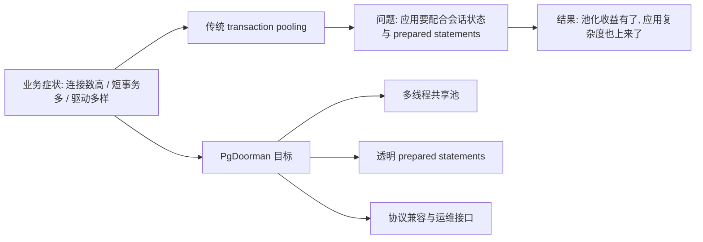
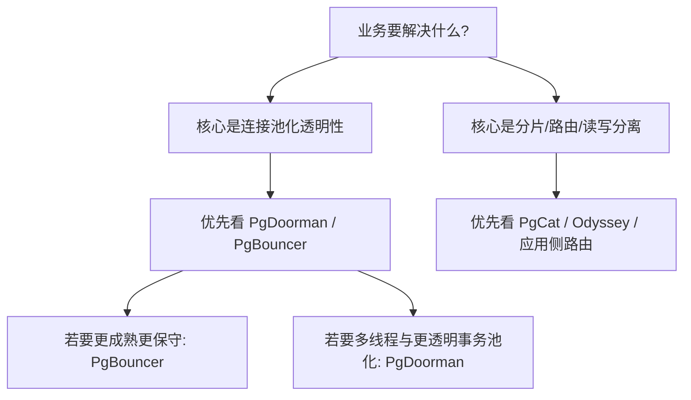
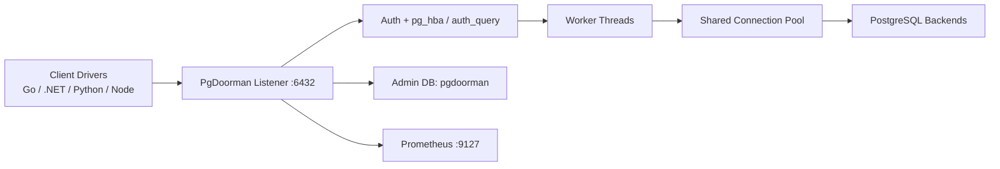
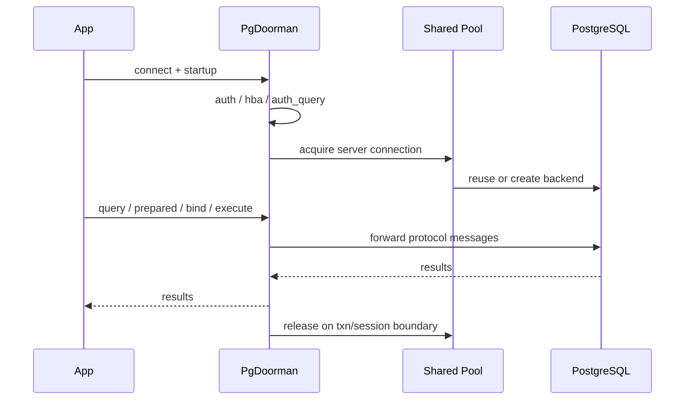
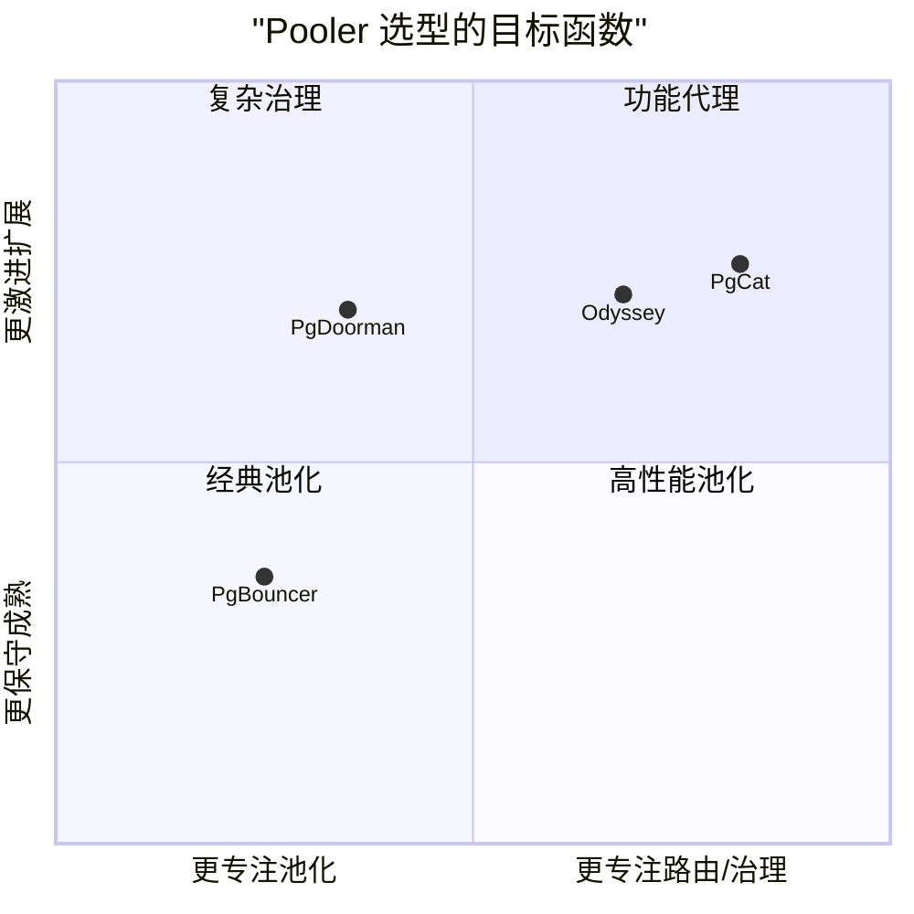
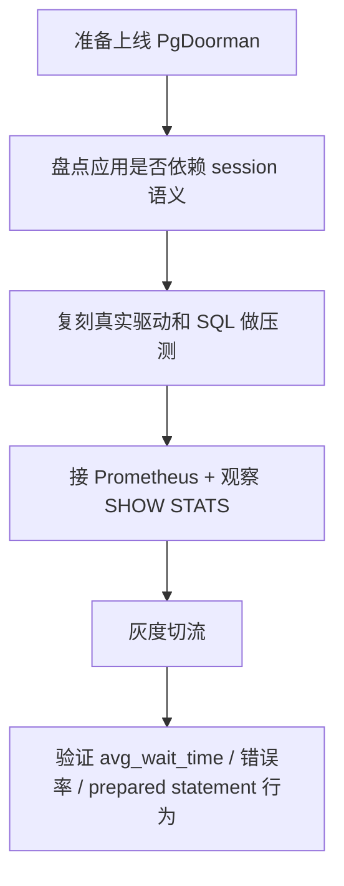

## PG 连接池怎么选? 来看看 PgDoorman 多线程事务池化
  
### 作者  
digoal  
  
### 日期  
2026-05-05 
  
### 标签  
PostgreSQL , 连接池 , 多线程 , 可观测 , 事务池化 , 短连接 , 小事务 
  
----  
  
## 背景 
PG 的连接池工具已经很多了, pgbouncer/pgpool-II/pgcat/pgdog/Odyssey 等等, 到底怎么选? 
  
   
## 开篇判断

很多团队并不缺 PostgreSQL 连接池本身，真正缺的是这样一种中间层：它既能像事务池化那样把后端连接数压下来，又尽量不把 prepared statements、扩展协议、多语言驱动兼容性问题甩回给应用改造。`pg_doorman` 试图填的就是这个空位。

我的观点：如果你的核心痛点是 PostgreSQL 连接爆炸、应用连接数高、事务型请求密集，并且你又不想为了 transaction pooling 去大改应用，那么 `pg_doorman` 值得优先评估。  
成立前提：你的场景以连接池化为主诉求，而不是读写路由、分片、跨集群流量编排。  
支撑证据：项目 README 明确把自己定位为高性能 PostgreSQL pooler，强调多线程、透明事务池化、prepared statement 处理、管理接口、Prometheus 指标与无缝二进制升级；DeepWiki 对其架构分析也显示它围绕连接池、协议处理、认证、管理与监控展开，而不是围绕分片/负载均衡展开。  
如果前提崩塌：如果你真正要的是读写分离、故障切换、分片和请求路由，那么更合理的方向往往是 `PgCat` 或 `Odyssey` 的相关能力，甚至在应用或平台代理层完成流量治理，而不是强行把 `pg_doorman` 当“全能代理”。



## 背景：为什么现在还需要重新看连接池

PostgreSQL 的连接池从来不是新问题，但问题的结构变了。

第一，现代应用不是一个单体进程，而是多服务、多语言、多驱动、多容器副本并发接入数据库。  
第二，大家已经越来越依赖事务池化来压缩数据库后端连接，但 transaction pooling 天生会打破部分 session 语义。  
第三，很多团队不只是追求“能跑”，而是要在高并发下维持可预测的延迟、兼容多种驱动、还能在线重载配置与升级。

PgBouncer 官方特性页直到今天仍明确提示：transaction pooling 会破坏一部分基于 session 的 PostgreSQL 特性；虽然 PgBouncer 现在已经支持 transaction pooling 下的 protocol-level prepared plans，但仍需要打开 `max_prepared_statements` 并接受能力边界。[PgBouncer Features](https://www.pgbouncer.org/features.html) [PgBouncer FAQ](https://www.pgbouncer.org/faq.html)

这就意味着，市场上对 pooler 的要求已经不是“有没有池化”，而是：

1. 能不能更透明地承接事务池化。
2. 能不能更好吃满多核。
3. 能不能给运维足够好的可观测性和在线控制能力。
4. 能不能少让应用团队为池化副作用买单。

## 场景：谁最该关注 PgDoorman

最适合关注它的人，不是所有 PostgreSQL 用户，而是以下几类角色：

- DBA：需要压后端连接数，但不想频繁处理“某语言驱动又和 transaction pooling 打架”的工单。
- 平台工程师：希望统一接入层，兼顾池化、运维命令、指标暴露和二进制升级。
- 架构师：面临多核机器上单线程 pooler 吃不满 CPU，或者多实例 pooler 带来状态失衡。
- 应用研发负责人：希望应用连上去“像连 PostgreSQL 一样”，而不是每个团队都去理解 session 语义断裂。

典型生产触发器包括：

- Java、Go、Python、Node.js、.NET 等多语言服务同时接同一 PostgreSQL。
- 业务以短事务、读多写少、请求密集为主。
- 连接高峰容易顶满数据库 `max_connections` 或带来明显连接建立开销。
- 事务池化已经是方向，但团队不希望为此全面禁用 prepared statements 或重写数据访问层。

## 痛点：传统池化方案为什么经常“技术上成立，组织上失败”

### 痛点一：事务池化节省了连接，却把兼容性成本转给应用

很多团队理论上知道 transaction pooling 更省后端连接，但真正上线时卡在 prepared statements、临时表、session 参数、连接状态残留等问题上。PgBouncer 官方文档对此也写得很直白：transaction pooling 并不兼容全部 session 语义。[PgBouncer Features](https://www.pgbouncer.org/features.html)

运营成本是什么？  
不是“不能用”，而是每个应用团队都得知道哪些特性别碰，哪些驱动要调参数，哪些框架默认行为需要关闭。

### 痛点二：单线程或多实例拼装，容易引入新的失衡

PgDoorman 文档在 “Why not multi-PgBouncer?” 中直接批评“多实例 PgBouncer”方案：prepared statements 复用困难，取消查询控制别扭，而且操作系统按轮询分发新连接，长时间运行后连接负载可能不均。[PgDoorman Home 1.8.3](https://ozontech.github.io/pg_doorman/1.8.3/)

这类方案的真实代价不是理论性能，而是：

- 池内状态碎片化。
- 不同实例负载不均。
- 运维排障复杂度上升。

### 痛点三：多语言驱动兼容性是一场长期战争

README 明确提到项目在两年多使用中持续改进对 Go `pgx`、.NET `npgsql`、Python/Node.js 异步驱动的支持。这句话的潜台词很重要：pooler 的竞争，不只是 TPS，更是驱动兼容性的工程战。[GitHub README](https://github.com/ozontech/pg_doorman)

### 痛点四：运维团队不只需要“池”，还需要“可控”

如果 pooler 没有好用的管理命令、指标、reload、升级机制，那么它只是把数据库问题前移成代理问题。README 和官方文档都强调了 admin console、`SHOW` 命令、Prometheus 指标和在线升级路径。[GitHub README](https://github.com/ozontech/pg_doorman) [PgDoorman Basic Usage 2.0.1](https://ozontech.github.io/pg_doorman/2.0.1/tutorials/basic-usage/)

## 传统方案及其问题：不是它们不好，而是目标函数不同

### PgBouncer：极简、成熟，但 transaction pooling 仍要求应用配合

PgBouncer 的优势是成熟、轻量、生态认知高。但它的官方特性表仍告诉你：transaction pooling 会破坏一部分 session 级能力；prepared plans 虽然已经支持，但需要显式配置，且不是“所有客户端无感”。[PgBouncer Features](https://www.pgbouncer.org/features.html) [PgBouncer FAQ](https://www.pgbouncer.org/faq.html)

适合什么时候继续用 PgBouncer？

- 你要的是最广泛采用、最保守的 pooler。
- 你能接受应用侧做一些配合。
- 你更看重极简稳定，而不是多线程扩展或事务池化透明性。

### Odyssey：多线程、更强路由能力，但系统复杂度也更高

Odyssey README 把自己定位为可扩展、多线程 PostgreSQL pooler，并带有 request router 色彩；其 release 页面也持续引入 HBA、prepared statements in tx pool、Prometheus 等能力。[Odyssey GitHub](https://github.com/yandex/odyssey) [Odyssey Releases](https://github.com/yandex/odyssey/releases)

它更适合：

- 你不仅需要池化，还需要更复杂的路由和治理。
- 你的团队可以接受更复杂的配置与运维面。

### PgCat：功能面更大，但这也意味着目标不再只是“高效池化”

PgCat 官方 README 的核心卖点是 sharding、load balancing、failover、mirroring、Prometheus、auth passthrough、多线程 Tokio runtime。[PgCat GitHub](https://github.com/postgresml/pgcat)

这类产品更像“pooler + routing proxy”。如果你的核心目标是分片和路由，PgCat 的方向更对；但如果你只想把 pooler 这件事做得更快、更透明、更容易运维，那么更窄、更专注的设计反而可能更合适。



## 产品方案：PgDoorman 到底提供了什么

按照 README，PgDoorman 是一个高性能 PostgreSQL connection pooler，位于应用和 PostgreSQL 之间。应用连接到它时，会表现得像在连接 PostgreSQL；它在后端负责创建或复用真实数据库连接，以减少连接建立开销、限制后端连接数、提升可扩展性，并提供监控与管理能力。[GitHub README](https://github.com/ozontech/pg_doorman)

它对应前面痛点的映射关系大致是：

| 痛点 | PgDoorman 的对应能力 | 证据类型 |
| --- | --- | --- |
| 连接建立与后端连接数压力 | session/transaction pooling | README / 官方文档 |
| transaction pooling 下的兼容性焦虑 | transparent prepared statement caching/remapping | README / DeepWiki |
| 多核机器扩展诉求 | multithreaded runtime + single shared pool | README / DeepWiki |
| 运维可控性不足 | Admin Console、`SHOW`、`RELOAD`、`SHUTDOWN`、`UPGRADE` | README / 文档 / DeepWiki |
| 监控接入困难 | Prometheus exporter，默认 9127 端口 | README / DeepWiki |
| 配置繁琐 | `generate` 自动生成配置 | README |

## 原理与架构：它为什么有机会比“多实例拼装”更顺

DeepWiki 的架构总结给出一个很清晰的轮廓：PgDoorman 是模块化设计，围绕客户端处理、配置、连接池、认证、管理接口和指标采集展开；其中一个关键点是“所有 worker 线程共享一个连接池”，这直接瞄准了多实例或线程内独立池导致的负载不均问题。

我的观点：PgDoorman 的真正架构价值，不是“Rust 重写”本身，而是“多线程 + 共享池 + 协议层 prepared statements 透明处理”的组合。  
成立前提：你的瓶颈来自连接池化层，而不是更上层的 SQL 路由或分片策略。  
支撑证据：README 对透明 transaction pool mode 和 prepared statement 兼容性有明确表述；DeepWiki 对共享池、协议处理、prepared statement cache/remapping 有具体描述。  
如果前提崩塌：如果你瓶颈在读写路由、故障转移、分片决策，那么这个架构优势就不再是第一位，应转向路由代理或应用层策略。



### 连接生命周期

基于 README 与 DeepWiki，可以把它的连接生命周期总结为：

1. 客户端连接 PgDoorman 的监听地址和端口。
2. PgDoorman 根据用户配置、`pg_hba` 规则、静态密码或 `auth_query` 完成认证。
3. 根据 `pool_mode` 决定分配 session 级还是 transaction 级后端连接。
4. 对查询进行 PostgreSQL 协议层转发，处理 simple/extended query protocol、batch 和 pipelining。
5. 在 transaction mode 下回收后端连接，并依据缓存策略管理 prepared statements。



### 管理与观测

PgDoorman 提供一个虚拟管理数据库 `pgdoorman`，可以通过 `psql -h <host> -p 6432 -U admin pgdoorman` 进入；官方文档明确列出了 `SHOW HELP`、`SHOW STATS`、`SHOW CLIENTS`、`SHOW SERVERS`、`SHOW POOLS`、`RELOAD`、`SHUTDOWN` 等操作。DeepWiki 还补充了 `PAUSE`、`RESUME`、`RECONNECT`、`UPGRADE` 等控制命令路径。[PgDoorman Basic Usage 2.0.1](https://ozontech.github.io/pg_doorman/2.0.1/tutorials/basic-usage/) [DeepWiki ozontech/pg_doorman](https://deepwiki.com/search/summarize-pgdoormans-architect_3f3fd355-6f02-4d30-b2cc-93efba4a1e7d)

监控方面，README 写明内置 Prometheus exporter 默认跑在 `9127`；DeepWiki 列出了它不仅采集连接数、吞吐、字节数，还包括延迟分位数和 prepared statement cache 相关指标。对 DBA 和平台团队来说，这意味着它不是黑盒 TCP 代理。

## 效果对比：它的优势到底落在哪

官方 benchmark 页面给出了几组 pgbench 自测数据，但页面一开头就写了免责声明：`Benchmarks always lie to you :)`，建议用户自行验证。这一点必须保留，不能把项目自测写成通用结论。[PgDoorman Benchmarks 1.8.3](https://ozontech.github.io/pg_doorman/1.8.3/benchmarks/)

在该页面给出的 smoke perf test 中：

- prepared without SSL 场景里，PgDoorman 为 `135,000 TPS`，高于 PgBouncer 的 `45,000`，略高于 Odyssey 的 `125,000`。
- simple without SSL 场景里，PgDoorman 为 `110,000 TPS`，高于 PgBouncer 的 `60,000`，略高于 Odyssey 的 `105,000`，高于 PgCat 的 `85,000`。
- reconnect with SSL 场景里，PgCat 为 `530 TPS`，PgDoorman 与 Odyssey 均为 `260 TPS`，PgBouncer 为 `240 TPS`。

但这些数字只能说明一件事：**在项目作者的测试设定下，PgDoorman 至少具备竞争力，而且它自己也承认不同协议路径、TLS 实现和驱动兼容性会改变结果。**

| 维度 | 传统 transaction pooling 常见感受 | PgDoorman 试图带来的改进 | 证据 |
| --- | --- | --- | --- |
| prepared statements | 常要调驱动或规避 | 更透明的缓存与重映射 | README / DeepWiki |
| 多核利用 | 单线程或多实例拼装 | 多线程共享池 | README / DeepWiki |
| 在线运维 | 基础命令有限或靠外部流程 | 管理库 + reload + upgrade + metrics | README / 文档 / DeepWiki |
| 路由能力 | 一般不强 | 有意识地不做太多 | README |
| 性能结论 | 依赖 workload | 在官方自测中具备竞争力 | 官方 benchmark，自带免责声明 |

我的推断是：对大量短事务、驱动多样、prepared statements 使用较多的场景，PgDoorman 的“透明性”可能比纸面 TPS 更有价值。  
成立前提是：你的应用真的在 transaction pooling 兼容性上有摩擦成本。  
如果前提不成立：如果你的应用早已完全适配 PgBouncer，或者你几乎不用 prepared statements，那么 PgDoorman 的优势会缩小。

## 竞品比较：选型不该比“谁更强”，而该比“谁更贴目标函数”

| 产品 | 核心定位 | 适合场景 | 不足或边界 |
| --- | --- | --- | --- |
| PgBouncer | 轻量、成熟、经典 pooler | 保守选型、简单池化、生态认知高 | transaction pooling 仍有 session 语义边界；prepared statements 需要配置与验证 |
| Odyssey | 多线程 pooler + request router | 更复杂的路由、云化治理 | 复杂度更高；目标不只是池化 |
| PgCat | pooler + sharding/load balancing/failover | 需要分片、读写路由、故障切换 | 功能面更大，系统面也更大 |
| PgDoorman | 专注高效、多线程、透明事务池化 | 连接数压力、短事务、高兼容性诉求 | 不是以分片/路由为卖点；性能证据主要来自自测 |



## 使用场景：什么时候它最可能产生真实价值

### 场景一：大量短事务 API 服务

症状：应用副本多、数据库连接总数高、后端 `max_connections` 压力大。  
为什么有帮助：transaction pooling 可以显著压缩后端连接，透明 prepared statement 处理降低应用改造量。  
命令/配置：

```toml
[general]
host = "0.0.0.0"
port = 6432
admin_username = "admin"
admin_password = "admin"

[pools.exampledb]
server_host = "127.0.0.1"
server_port = 5432
pool_mode = "transaction"

[pools.exampledb.users.0]
pool_size = 40
username = "doorman"
password = "md5xxxxxx"
```

预期信号：`SHOW POOLS` 中 `sv_idle`、`sv_active`、`cl_waiting` 可用于观察池内压力。  
注意事项：如果应用依赖 temp table、session-level advisory lock 等 session 语义，仍要审计兼容性。

### 场景二：平台团队统一数据库接入层

症状：不同语言驱动行为不一致，连接问题经常在应用团队和 DBA 之间来回扯皮。  
为什么有帮助：池化逻辑、认证、`pg_hba`、Prometheus 指标、管理命令可以前移到统一层。  
命令/配置：使用 README 中的 `generate` 命令快速生成配置。  
预期信号：`SHOW STATS` 中 `avg_wait_time` 持续偏高时，说明池大小或后端能力需要调整。  
注意事项：`generate` 连接 PostgreSQL 拉取信息时，某些模式需要更高权限；若后端 `pg_hba.conf` 要求认证，生成后仍可能要手工补 `server_password`。

### 场景三：在线变更敏感的生产环境

症状：代理层每次改配置或升级都担心中断连接。  
为什么有帮助：文档提供 `RELOAD` 与二进制升级路径，DeepWiki 还指出存在 `UPGRADE` 命令/信号路径。  
命令/配置：

```sql
SHOW STATS;
RELOAD;
```

预期信号：配置变更后，新连接使用新配置，旧连接按池化模式逐步释放。  
注意事项：不同信号和命令的行为要先在预发环境验证，避免把 graceful path 当成强一致无损切换。

## 最佳实践

### 1. 先证明“你需要 transaction pooling”，再证明“你需要 PgDoorman”

不要跳过工作负载审计。先确认你的应用是否真的被连接数量、连接建立开销、短事务高并发压住，再评估具体 pooler。

### 2. 不要把官方 benchmark 当采购单

项目 benchmark 已经明确声明自测只能提供大致感觉。正确做法是复刻你自己的驱动、SQL 模式、TLS 设定、事务长度和连接生命周期。

### 3. 用管理命令盯 `avg_wait_time`，不要只盯 TPS

官方文档对 `SHOW STATS` 的说明里特别提醒 `avg_wait_time`。对于真实生产环境，这往往比一时的吞吐更能揭示池是否过小、数据库是否过载。[PgDoorman Basic Usage 2.0.1](https://ozontech.github.io/pg_doorman/2.0.1/tutorials/basic-usage/)

### 4. 把 admin 账号与 Prometheus 接口纳入标准安全治理

README 示例使用 `admin/admin` 只是演示。生产环境至少要：

- 更换强密码。
- 限制监听地址或上层网络访问。
- 明确是否暴露 TLS。
- 管控指标端口访问范围。

### 5. 明确哪些业务不能上 transaction pooling

哪怕 PgDoorman 追求透明，也不要假设一切 session 语义都会无痛成立。临时表、会话级锁、连接状态依赖仍应做灰度验证。



## 动手实践

下面步骤以 README 和官方文档的最小示例为基础；其中部分路径名是按官方示例改写的本地文件路径，属于“适配后的示例”，不是仓库硬编码。

### 1. 拉取镜像

```bash
docker pull ghcr.io/ozontech/pg_doorman
```

### 2. 编写最小配置

创建 `pg_doorman.toml`：

```toml
[general]
host = "0.0.0.0"
port = 6432
admin_username = "admin"
admin_password = "replace-me"

[pools]

[pools.exampledb]
server_host = "127.0.0.1"
server_port = 5432
pool_mode = "transaction"

[pools.exampledb.users.0]
pool_size = 40
username = "doorman"
password = "md5xxxxxx"
```

如果你不想手工写，也可以先看：

```bash
pg_doorman generate --help
pg_doorman generate --output pg_doorman.toml
```

如果要直接连 PostgreSQL 自动探测：

```bash
pg_doorman generate --host db.example.com --port 5432 --output pg_doorman.toml
```

注意：README 明确提示，如果 PostgreSQL 后端要求额外认证，自动生成后可能仍需手工设置 `server_password`。

### 3. 启动

```bash
docker run -p 6432:6432 \
  -v /path/to/pg_doorman.toml:/etc/pg_doorman/pg_doorman.toml \
  --rm -t -i ghcr.io/ozontech/pg_doorman
```

或者直接二进制运行：

```bash
pg_doorman pg_doorman.toml
```

### 4. 业务连接验证

```bash
psql -h localhost -p 6432 -U doorman exampledb
```

### 5. 管理连接验证

```bash
psql -h localhost -p 6432 -U admin pgdoorman
```

进入后执行：

```sql
SHOW HELP;
SHOW STATS;
SHOW POOLS;
SHOW SERVERS;
SHOW CLIENTS;
```

### 6. 变更验证

修改配置后执行：

```sql
RELOAD;
```

验证点：

- 新连接是否采用新参数。
- `SHOW POOLS` 的等待与空闲连接是否符合预期。
- 应用 prepared statements 是否仍正常。

### 7. 排障与回滚

如果出现兼容性问题，最直接的回滚方式通常是把应用连接串切回原 PostgreSQL 或原 pooler。  
如果问题仅限某些依赖 session 语义的业务，可以先回退这些业务，保留对短事务服务的灰度使用。

## 风险、限制与失效条件

### 风险一：性能证据主要来自官方自测

项目 benchmark 明确带免责声明。  
如果你的 workload 与官方测试差异很大，比如长事务、复杂 SQL、不同驱动、不同 TLS 实现，那么结论可能完全改变。

如果这个前提崩塌：不要基于官方 benchmark 做最终选型，应以自家压测结果为准。

### 风险二：它不是以分片/负载均衡为主目标

README 直说移除了 load balancing 和 sharding，认为这些更适合在应用层处理。  
这是一种很清晰的取舍，不是缺陷伪装成能力。

如果这个前提崩塌：如果你的关键诉求是读写分离、故障切换、分片路由，那么应直接评估 PgCat、Odyssey 或应用层路由方案，而不是硬补 PgDoorman。

### 风险三：transaction pooling 透明，不等于 session 语义万能

我的推断是：PgDoorman 在 prepared statements 和协议支持上明显比“传统 transaction pooling + 应用妥协”更进一步，但这不应被解读为“所有 session 依赖都自然兼容”。  
成立前提是：你的主要冲突来自 prepared statements 与连接复用，而不是 temp tables、会话变量、LISTEN/NOTIFY 之类更强 session 绑定。  
如果前提不成立：请考虑 session pooling，或回到 PgBouncer/PgCat/Odyssey 的更适合模式，甚至直接使用数据库直连。

### 风险四：管理面和指标面也会成为新的攻击面

`admin_username`、Prometheus 端口、TLS 配置、`pg_hba` 规则都必须纳入安全审计。否则 pooler 会成为数据库前的新入口。

## 结论

PgDoorman 最值得认真看的地方，不是“又一个 PostgreSQL pooler”，而是它试图把 transaction pooling 从“节省连接但让应用难受”推进为“尽量透明地节省连接，同时更适合多核和运维”。

我的最终观点：  
如果你的场景是高并发短事务、多语言驱动、希望尽量保留应用无感、又不需要复杂路由治理，那么 `pg_doorman` 是一个很有现实价值的候选项。  
成立前提：你的选型目标是“池化透明性 + 多线程扩展性 + 运维可观测性”。  
支撑证据：README 的明确定位、DeepWiki 的共享池与协议处理分析、官方文档的管理和指标能力、官方 benchmark 中在若干场景下的竞争力。  
如果前提崩塌：  
- 更保守成熟，且应用已适配 transaction pooling：优先继续用 PgBouncer。  
- 更重路由、分片、故障切换：优先看 PgCat 或 Odyssey。  
- 更重 session 语义完整性：优先 session pooling，甚至不做中间层池化。

对 DBA、平台工程师和架构师最实际的下一步不是“立即替换”，而是：

1. 用真实驱动和真实 SQL 压一次对照测试。
2. 专门验证 prepared statements 和 transaction pooling 的行为。
3. 用 `SHOW STATS`、`SHOW POOLS`、Prometheus 指标观察池等待时间和错误率。
4. 只在目标清晰的短事务服务上先灰度，而不是全量一刀切。

## 参考资料

1. [ozontech/pg_doorman GitHub README](https://github.com/ozontech/pg_doorman)
2. [PgDoorman Documentation Home 1.8.3](https://ozontech.github.io/pg_doorman/1.8.3/)
3. [PgDoorman Overview 2.0.1](https://ozontech.github.io/pg_doorman/2.0.1/tutorials/overview/)
4. [PgDoorman Basic Usage 2.0.1](https://ozontech.github.io/pg_doorman/2.0.1/tutorials/basic-usage/)
5. [PgDoorman Benchmarks 1.8.3](https://ozontech.github.io/pg_doorman/1.8.3/benchmarks/)
6. [DeepWiki: ozontech/pg_doorman architecture summary](https://deepwiki.com/search/summarize-pgdoormans-architect_3f3fd355-6f02-4d30-b2cc-93efba4a1e7d)
7. [PgBouncer Features](https://www.pgbouncer.org/features.html)
8. [PgBouncer FAQ](https://www.pgbouncer.org/faq.html)
9. [yandex/odyssey GitHub README](https://github.com/yandex/odyssey)
10. [yandex/odyssey Releases](https://github.com/yandex/odyssey/releases)
11. [postgresml/pgcat GitHub README](https://github.com/postgresml/pgcat)

## 证据缺口说明

- 没有找到独立第三方 benchmark 或大规模公开案例来交叉验证官方性能结论。
- 关于最新 release 版本号，当前主要使用的是 README、文档页和公开仓库页面证据，未在本文中强行给出未经进一步确认的“最新版本”结论。

    
  
#### [PostgreSQL 解决方案集合](../201706/20170601_02.md "40cff096e9ed7122c512b35d8561d9c8")
  
  
#### [德哥 / digoal's Github - 公益是一辈子的事.](https://github.com/digoal/blog/blob/master/README.md "22709685feb7cab07d30f30387f0a9ae")
  
  
#### [About 德哥](https://github.com/digoal/blog/blob/master/me/readme.md "a37735981e7704886ffd590565582dd0")
  
  

  
