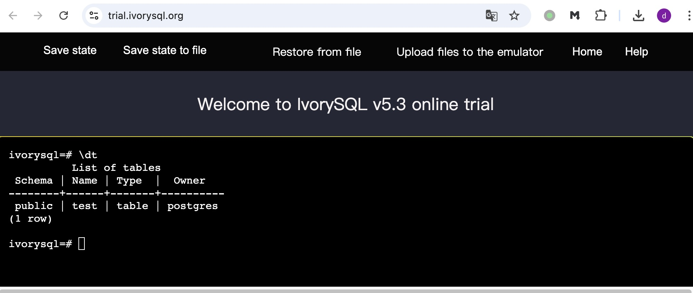

## IvorySQL 网页版初体验及场景展望  
  
### 作者  
digoal  
  
### 日期  
2026-05-05  
  
### 标签  
IvorySQL , PostgreSQL , Oracle , 网页版 , wasm  
  
----  
  
## 背景  
什么? 用网页体验数据库?  
  
没错 IvorySQL 这款兼容 Oracle 的开源国产数据库, 可以用浏览器直接打开体验:  
- https://trial.ivorysql.org/  
  
网页版大幅度降低了 IvorySQL 的学习和使用门槛, 太棒了  
  
类似的还有 DuckDB/glaredb/PGLite 这几个项目  
- https://shell.duckdb.org/  
- https://glaredb.com/  
- https://pglite.dev/repl/  
  
IvorySQL 网页版还支持导出和导入, 可保留网页版使用过程中的状态, 也可上传备份文件重构之前的状态.  
  
  
  
所以 IvorySQL 网页版使用场景更加广泛:  
- 教学用的场景, 导入教学 schema 和数据;  
- 开发调试, 导入 schema 和数据进行联调;  
- 用 AI 写文章、开发插件、开发应用时, 如果内容或应用中涉及 IvorySQL 数据库, IvorySQL 网页版可作为真实环境进行验证, 确保 AI 写的东西的正确性;  
  
**最后给 IvorySQL 提一些建议:**  
  
1、网页版的 addr 和 port 是否可透出给用户 (如果技术上可行), 如果可以的话, IvorySQL 网页版的使用场景才能覆盖到更多场景.  
  
2、如果不能透出 addr 和 port 给用户, 是否可以 mcp 提供出来? 封装一些简单的 tool, 例如检查 SQL 是否可运行等.  
  
3、打通 github, 将网页版集成到开发工作流中, 特别是结合 AI 使用时, 最主要的用途还是前面提到的第三点.  
  
4、目前 IvorySQL 提供的网页版是兼容 Oracle 模式的版本, 最好能有 2个URL分别对应 pg/ora 模式.  
  
5、内置一些日常教学 tutorial 等  
  
6、内置多一些常用插件 (特别是覆盖AI和多模场景)  
- 向量(vchord, pgvector)  
- 分词(pg_jieba, pgroonga)  
- 关键词检索(pg_tokenizer, pg_textsearch, bm25)  
- 图(age)  
- gis(postgis, pgrouting)  
- context/memory 分割和整理  
  
7、建议开源项目增加自动 deepwiki 刷新.  
- https://deepwiki.com/IvorySQL/IvorySQL  
  
最后, 可以多宣传一下 IvorySQL 网页版的使用场景和案例, 带动更多人用起来.  
  
  
-----  
  
# 其他发现  
目前网页版体验以 oracle 兼容为主, 贴合了 ivorysql 当前的产品定位  
```  
ivorysql=# select name,comment from pg_available_extensions order by 1;  
        name        |                                comment  
--------------------+------------------------------------------------------------------------  
 amcheck            | functions for verifying relation integrity  
 autoinc            | functions for autoincrementing fields  
 bloom              | bloom access method - signature file based index  
 btree_gin          | support for indexing common datatypes in GIN  
 btree_gist         | support for indexing common datatypes in GiST  
 citext             | data type for case-insensitive character strings  
 cube               | data type for multidimensional cubes  
 dblink             | connect to other PostgreSQL databases from within a database  
 dict_int           | text search dictionary template for integers  
 dict_xsyn          | text search dictionary template for extended synonym processing  
 earthdistance      | calculate great-circle distances on the surface of the Earth  
 file_fdw           | foreign-data wrapper for flat file access  
 fuzzystrmatch      | determine similarities and distance between strings  
 gb18030_2022       | support gb18030 2022 with extension  
 hstore             | data type for storing sets of (key, value) pairs  
 insert_username    | functions for tracking who changed a table  
 intagg             | integer aggregator and enumerator (obsolete)  
 intarray           | functions, operators, and index support for 1-D arrays of integers  
 isn                | data types for international product numbering standards  
 ivorysql_ora       | Oracle Compatible extenison on Postgres Database  
 lo                 | Large Object maintenance  
 ltree              | data type for hierarchical tree-like structures  
 moddatetime        | functions for tracking last modification time  
 ora_btree_gin      | support for indexing oracle datatypes in GIN  
 ora_btree_gist     | support for oracle indexing common datatypes in GiST  
 pageinspect        | inspect the contents of database pages at a low level  
 pg_buffercache     | examine the shared buffer cache  
 pg_freespacemap    | examine the free space map (FSM)  
 pg_logicalinspect  | functions to inspect logical decoding components  
 pg_prewarm         | prewarm relation data  
 pg_stat_statements | track planning and execution statistics of all SQL statements executed  
 pg_surgery         | extension to perform surgery on a damaged relation  
 pg_trgm            | text similarity measurement and index searching based on trigrams  
 pg_visibility      | examine the visibility map (VM) and page-level visibility info  
 pg_walinspect      | functions to inspect contents of PostgreSQL Write-Ahead Log  
 pgcrypto           | cryptographic functions  
 pgrowlocks         | show row-level locking information  
 pgstattuple        | show tuple-level statistics  
 plisql             | PL/iSQL procedural language  
 plpgsql            | PL/pgSQL procedural language  
 postgres_fdw       | foreign-data wrapper for remote PostgreSQL servers  
 refint             | functions for implementing referential integrity (obsolete)  
 seg                | data type for representing line segments or floating-point intervals  
 sslinfo            | information about SSL certificates  
 tablefunc          | functions that manipulate whole tables, including crosstab  
 tcn                | Triggered change notifications  
 tsm_system_rows    | TABLESAMPLE method which accepts number of rows as a limit  
 tsm_system_time    | TABLESAMPLE method which accepts time in milliseconds as a limit  
 unaccent           | text search dictionary that removes accents  
 uuid-ossp          | generate universally unique identifiers (UUIDs)  
(50 rows)  
  
  
  
 gb18030_2022       | support gb18030 2022 with extension  
 ivorysql_ora       | Oracle Compatible extenison on Postgres Database  
 ora_btree_gin      | support for indexing oracle datatypes in GIN  
 ora_btree_gist     | support for oracle indexing common datatypes in GiST  
 plisql             | PL/iSQL procedural language  
```  
  
  
  
  
```  
ivorysql=# select * from pg_settings where short_desc ~* 'ora' or extra_desc ~* 'ora' or setting ~* 'ora';  
-[ RECORD 1 ]---+----------------------------------------------------------------------------------------------------------------------  
name            | ivorysql.compatible_mode  
setting         | oracle  
unit            |  
category        | Client Connection Defaults / Statement Behavior  
short_desc      | Set default sql parser compatibility mode  
extra_desc      |  
context         | user  
vartype         | enum  
source          | override  
min_val         |  
max_val         |  
enumvals        | {pg,oracle}  
boot_val        | pg  
reset_val       | oracle  
sourcefile      |  
sourceline      |  
pending_restart | f  
-[ RECORD 2 ]---+----------------------------------------------------------------------------------------------------------------------  
name            | ivorysql.database_mode  
setting         | oracle  
unit            |  
category        | Preset Options  
short_desc      | Set database mode  
extra_desc      |  
context         | internal  
vartype         | enum  
source          | override  
min_val         |  
max_val         |  
enumvals        | {pg,oracle,0,1}  
boot_val        | pg  
reset_val       | oracle  
sourcefile      |  
sourceline      |  
pending_restart | f  
-[ RECORD 3 ]---+----------------------------------------------------------------------------------------------------------------------  
name            | ivorysql.listen_addresses  
setting         | localhost  
unit            |  
category        | Connections and Authentication / Connection Settings  
short_desc      | Sets oracle host name or IP address(es) to listen to.  
extra_desc      |  
context         | postmaster  
vartype         | string  
source          | default  
min_val         |  
max_val         |  
enumvals        |  
boot_val        | localhost  
reset_val       | localhost  
sourcefile      |  
sourceline      |  
pending_restart | f  
-[ RECORD 4 ]---+----------------------------------------------------------------------------------------------------------------------  
name            | ivorysql.port  
setting         | 1521  
unit            |  
category        | Connections and Authentication / Connection Settings  
short_desc      | Sets the Oracle TCP port the server listens on.  
extra_desc      |  
context         | postmaster  
vartype         | integer  
source          | default  
min_val         | 1  
max_val         | 65535  
enumvals        |  
boot_val        | 1521  
reset_val       | 1521  
sourcefile      |  
sourceline      |  
pending_restart | f  
-[ RECORD 6 ]---+----------------------------------------------------------------------------------------------------------------------  
name            | nls_currency  
setting         | $  
unit            |  
category        | Compat Oracle Options  
short_desc      | Compatible Oracle NLS parameter for NLS_CURRENCY.  
extra_desc      |  
context         | user  
vartype         | string  
source          | default  
min_val         |  
max_val         |  
enumvals        |  
boot_val        | $  
reset_val       | $  
sourcefile      |  
sourceline      |  
pending_restart | f  
-[ RECORD 7 ]---+----------------------------------------------------------------------------------------------------------------------  
name            | nls_date_format  
setting         | YYYY-MM-DD  
unit            |  
category        | Compat Oracle Options  
short_desc      | Compatible Oracle NLS parameter for date type.  
extra_desc      |  
context         | user  
vartype         | string  
source          | default  
min_val         |  
max_val         |  
enumvals        |  
boot_val        | YYYY-MM-DD  
reset_val       | YYYY-MM-DD  
sourcefile      |  
sourceline      |  
pending_restart | f  
-[ RECORD 8 ]---+----------------------------------------------------------------------------------------------------------------------  
name            | nls_iso_currency  
setting         | AMERICA  
unit            |  
category        | Compat Oracle Options  
short_desc      | Compatible Oracle NLS parameter for NLS_ISO_CURRENCY.  
extra_desc      |  
context         | user  
vartype         | string  
source          | default  
min_val         |  
max_val         |  
enumvals        |  
boot_val        | AMERICA  
reset_val       | AMERICA  
sourcefile      |  
sourceline      |  
pending_restart | f  
-[ RECORD 9 ]---+----------------------------------------------------------------------------------------------------------------------  
name            | nls_length_semantics  
setting         | byte  
unit            |  
category        | Compat Oracle Options  
short_desc      | Compatible Oracle NLS parameter for charater data type.  
extra_desc      | Valid values are CHAR, BYTE.  
context         | user  
vartype         | enum  
source          | default  
min_val         |  
max_val         |  
enumvals        | {byte,char}  
boot_val        | byte  
reset_val       | byte  
sourcefile      |  
sourceline      |  
pending_restart | f  
-[ RECORD 10 ]--+----------------------------------------------------------------------------------------------------------------------  
name            | nls_territory  
setting         | AMERICA  
unit            |  
category        | Compat Oracle Options  
short_desc      | Compatible Oracle NLS parameter for NLS_TERRITORY.  
extra_desc      |  
context         | user  
vartype         | string  
source          | default  
min_val         |  
max_val         |  
enumvals        |  
boot_val        | AMERICA  
reset_val       | AMERICA  
sourcefile      |  
sourceline      |  
pending_restart | f  
-[ RECORD 11 ]--+----------------------------------------------------------------------------------------------------------------------  
name            | nls_timestamp_format  
setting         | YYYY-MM-DD HH24:MI:SS.FF6  
unit            |  
category        | Compat Oracle Options  
short_desc      | Compatible Oracle NLS parameter for timestamp type.  
extra_desc      |  
context         | user  
vartype         | string  
source          | default  
min_val         |  
max_val         |  
enumvals        |  
boot_val        | YYYY-MM-DD HH24:MI:SS.FF6  
reset_val       | YYYY-MM-DD HH24:MI:SS.FF6  
sourcefile      |  
sourceline      |  
pending_restart | f  
-[ RECORD 12 ]--+----------------------------------------------------------------------------------------------------------------------  
name            | nls_timestamp_tz_format  
setting         | YYYY-MM-DD HH24:MI:SS.FF6 TZH:TZM  
unit            |  
category        | Compat Oracle Options  
short_desc      | Compatible Oracle NLS parameter for timestamp with time zone type.  
extra_desc      |  
context         | user  
vartype         | string  
source          | default  
min_val         |  
max_val         |  
enumvals        |  
boot_val        | YYYY-MM-DD HH24:MI:SS.FF6 TZH:TZM  
reset_val       | YYYY-MM-DD HH24:MI:SS.FF6 TZH:TZM  
sourcefile      |  
sourceline      |  
pending_restart | f  
-[ RECORD 14 ]--+----------------------------------------------------------------------------------------------------------------------  
name            | shared_preload_libraries  
setting         | gb18030_2022, liboracle_parser, ivorysql_ora  
unit            |  
category        | Client Connection Defaults / Shared Library Preloading  
short_desc      | Lists shared libraries to preload into server.  
extra_desc      |  
context         | postmaster  
vartype         | string  
source          | configuration file  
min_val         |  
max_val         |  
enumvals        |  
boot_val        |  
reset_val       | gb18030_2022, liboracle_parser, ivorysql_ora  
sourcefile      | /var/lib/pgsql/ivorysql.conf  
sourceline      | 14  
pending_restart | f  
```  
  
  
  
#### [PostgreSQL 解决方案集合](../201706/20170601_02.md "40cff096e9ed7122c512b35d8561d9c8")
  
  
#### [德哥 / digoal's Github - 公益是一辈子的事.](https://github.com/digoal/blog/blob/master/README.md "22709685feb7cab07d30f30387f0a9ae")
  
  
#### [About 德哥](https://github.com/digoal/blog/blob/master/me/readme.md "a37735981e7704886ffd590565582dd0")
  
  

  
