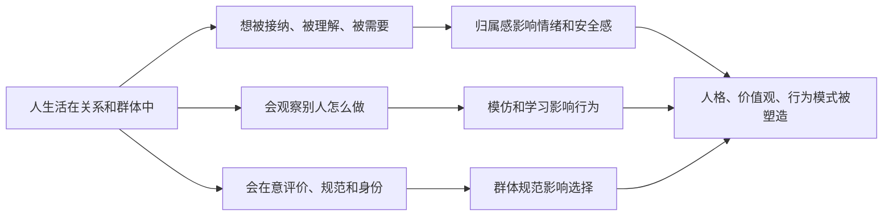

## 心理学思维筑基课: 人是社会性动物
  
### 作者  
digoal  
  
### 日期  
2026-05-05 
  
### 标签  
社会塑造 , 自我认识 , 价值判断 , 人格 , 行为  
  
----  
  
## 背景 
  
> 面向对象: 初中到高中学生  
> 核心问题: 为什么人的情绪、选择、身份和行为，会这么深地受到他人、群体和关系影响？  
> 先说结论: “人是社会性动物”说的是，人并不是孤立地活着。人的安全感、归属感、自我认识、价值判断和行为方式，都会受到他人、关系、群体规范、社会评价和身份认同的深刻影响。我们既依赖社会，也被社会塑造。

## 一张图先看懂



## 求真讲法

### 它到底说了什么

“人是社会性动物”可以先用一句最直白的话理解：

> 人不仅靠食物和空气活着，也靠关系、归属、合作、认可和群体生活活着。

这里的“社会性”不是说“人喜欢热闹”这么简单，而是说：

- 我们会在意别人怎么看自己。
- 我们会模仿别人怎么做。
- 我们会从群体里寻找归属和身份。
- 我们的很多情绪和决定，离不开人际关系和社会环境。

一个简单对比：

| 情况 | 不是社会性的解释 | 社会性的解释 |
|---|---|---|
| 学生不敢在班里发言 | “他就是胆小” | 他可能在意同学评价和群体氛围 |
| 一个人努力学习 | “只是为了分数” | 也可能为了认可、归属、角色期待 |
| 一群人跟着做同样选择 | “大家没主见” | 群体规范和从众会影响行为 |

所以，这条原则真正表达的是：

**人的很多行为，不只是个人内部决定的，还和“我跟谁在一起、别人怎么想、这个群体怎么运转”密切相关。**

### 它是怎么来的

这条原则之所以重要，是因为人类从进化、发展到日常生活，都离不开他人。

第一，**人类长期依赖群体生存。**  
合作、分工、照顾后代、共享信息，让群体生活对人类非常重要。

第二，**个体的心理发展离不开关系。**  
一个人怎么理解自己、怎么说话、怎么表达情绪、怎么相信别人，往往都在关系里学会。

第三，**社会环境会提供规范和反馈。**  
什么算好、什么算丢脸、什么该做、什么不该做，很多不是一个人凭空想出来的，而是从群体里吸收的。

第四，**归属感本身就是重要心理需要。**  
被接纳会带来安全感，被排斥会带来痛苦和威胁感。

可以用一个简单的 ASCII 图理解：

```text
别人怎么对我
   -> 我怎么理解自己
   -> 我怎么理解关系
   -> 我以后怎么行动
```

这就是为什么心理学常常既研究“个人内部”，也研究“人与人之间”。

### 它依赖哪些假设

“人是社会性动物”成立，依赖几个关键前提。

| 假设 | 含义 | 如果不成立会怎样 |
|---|---|---|
| 人需要归属和连接 | 关系对心理有真实意义 | 如果人完全不需要他人，社会性会大幅减弱 |
| 他人的反馈会进入自我认识 | 别人怎么看，会影响我怎么看自己 | 如果反馈完全进不来，社会塑造会变弱 |
| 人会学习和模仿 | 群体行为会传染和塑造个体 | 如果人完全不模仿，群体规范作用会变弱 |
| 群体中存在规则和角色 | 社会环境会引导行为 | 如果群体没有规范，社会影响会弱很多 |

这也说明一句关键的话：

> 人是社会性动物，不等于人没有独立性，而是说独立性本身也常在关系和社会环境里长出来。

### 常见误解

**误解一：社会性就是说人都爱交际。**  
不对。内向的人也有社会性，只是连接方式不同。

**误解二：人受群体影响，就说明没有自我。**  
不对。人会受影响，但也能反思、选择、抵抗和重建。

**误解三：社会性只和友情爱情有关。**  
不对。身份、规范、角色、权威、比较、舆论都属于社会性影响。

**误解四：只要一个人说“我不在乎别人怎么看”，他就真的不受影响。**  
不对。很多社会影响是隐性的，不一定能被本人立刻意识到。

## 求存讲法

### 它有什么用

这条原则最大的作用，是帮助你理解很多看似“个人问题”的事情，其实背后有社会和关系因素。

比如：

- 为什么被排斥会那么难受。
- 为什么班级氛围会影响学习表现。
- 为什么人会从众、模仿、讨好或反抗。
- 为什么社交评价会影响自尊和行为。

它提醒你：  
**一个人的行为，不只要看他“自己怎么想”，还要看他“在什么关系和群体里”。**

### 它怎么迁移到熟悉领域

这个原则在学生生活里到处都能看到。

| 场景 | 社会性如何起作用 |
|---|---|
| 上课发言 | 会在意同学和老师的眼光 |
| 穿衣和用语 | 会受同龄群体风格影响 |
| 学习动力 | 受家庭期待、同伴氛围、角色认同影响 |
| 情绪波动 | 会被关系冲突、冷落、点赞、比较牵动 |

迁移后的核心意思是：

> 很多“我为什么会这样”，答案里都有别人和群体的位置。

### 它的适用范围和边界

这条原则适合用于：

- 理解从众、归属、身份认同、群体规范和社会比较。
- 分析班级氛围、家庭关系、团队文化如何影响个体。
- 帮助自己识别哪些感受来自社会评价压力。
- 理解为什么“环境换了，人会变很多”。

但它也有边界。

第一，人是社会性动物，不代表人没有个人差异。  
不同气质、经历和反思能力，会让同样群体影响作用不同。

第二，不是所有行为都要用社会解释。  
睡眠不足、生理状态、认知风格也会直接影响行为。

第三，社会性有正面也有负面。  
群体能支持人，也能压迫人；能提供归属，也能制造羞耻和排斥。

第四，强社会影响不等于永远正确。  
群体规范有时会推动好行为，有时也会让人做出自己并不认同的事。

### 正例: 怎么用它提升能力

假设一个学生发现自己在安静独处时挺愿意学习，但一到某个同伴群体里，就会很快松散下来。

如果只说“我太不自律”，可能帮不到太多。  
如果用“人是社会性动物”去看，就会发现：

- 自己会自然受同伴节奏影响。
- 群体里“认真学习”可能不是被鼓励的角色。
- 被接纳的需要，暂时压过了原本的目标。

这时更有效的做法可能是：

- 换一个更支持学习的同伴环境。
- 提前设定边界，不让群体节奏完全接管自己。
- 找一个能一起努力的伙伴，而不是只靠个人硬扛。

这说明，改变行为有时不只是改自己，还要改自己所处的社会场。

### 反例: 前提不成立会怎样

假设有人说：“只要一个人足够强大，就完全不会受别人和群体影响。”

这句话的问题，是把人想得太孤立了。

可能真实情况是：

- 他照样会在意评价，只是未必承认。
- 他仍会被群体规范、身份角色和关系氛围影响。
- 即使再独立的人，也是在社会语言、价值和关系里形成自我的。

这里失败的根本原因，是忽略了“他人的反馈会进入自我认识”和“人会学习和模仿”这两个前提。  
把人想成完全独立的孤岛，反而会错过很多真正的影响来源。

## 思考

为什么很多人都想做“真正的自己”，却又总会被别人影响？

因为“自己”本来就不是在真空里长出来的。  
语言、价值观、边界感、羞耻感、理想、审美、勇气，很多都先在关系和群体中被塑造，再慢慢变成“我自己的东西”。

这也引出几个更深的问题：

- 你现在坚持的很多想法，哪些是自己想清楚的，哪些只是群体里流行的？
- 你所谓的“独立”，是不是建立在一个允许你独立的关系环境里？
- 你想成为什么样的人，需要进入什么样的群体氛围？

成熟的心理学思维，不是否认社会影响，也不是完全投降给群体，而是学会两件事：

- 看见自己正在被什么样的群体塑造。
- 主动选择更值得让它塑造自己的环境。

“人是社会性动物”真正教人的，是理解关系和群体不是背景板，它们本身就是人格与行为的重要力量。

## 最后记住

1. 人不是孤立运转的个体，关系、群体、评价和归属感会深刻影响心理和行为。
2. 社会性不仅体现在交朋友，也体现在模仿、从众、身份认同、比较和规范内化。
3. 很多所谓“个人问题”，背后其实有关系环境和群体氛围的作用。
4. 社会影响有正有负，既能支持成长，也能制造压力和扭曲。
5. 真正成熟的做法，不是幻想完全不受影响，而是学会识别并选择更健康的社会环境。

## 参考资料

- Elliot Aronson, *The Social Animal*, 关于人类社会行为、从众、归属和社会影响的经典社会心理学框架。
- Solomon Asch 相关从众研究，说明群体判断如何影响个体选择。
- David G. Myers, *Psychology*, 关于社会心理、归属需要、自我与群体关系的通用教材体系。
- 本文为面向学生的简化解释，基于通用社会心理学与发展心理学框架，不用于诊断或替代专业心理帮助。

  
  
#### [PostgreSQL 解决方案集合](../201706/20170601_02.md "40cff096e9ed7122c512b35d8561d9c8")
  
  
#### [德哥 / digoal's Github - 公益是一辈子的事.](https://github.com/digoal/blog/blob/master/README.md "22709685feb7cab07d30f30387f0a9ae")
  
  
#### [About 德哥](https://github.com/digoal/blog/blob/master/me/readme.md "a37735981e7704886ffd590565582dd0")
  
  

  
