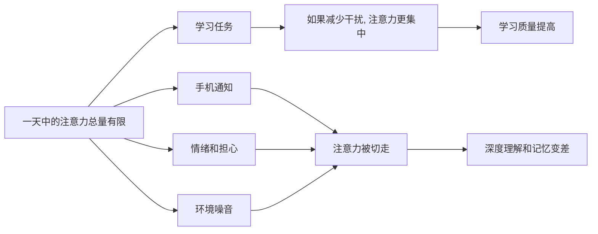

## 心理学思维筑基课: 注意力是有限资源
  
### 作者  
digoal  
  
### 日期  
2026-05-05 
  
### 标签  
注意力 , 碎片化 , 多任务 , 环境干扰  
  
----  
  
## 背景 
人不可能同时处理所有信息，所以会选择性注意、忽略、过滤和简化。  
  

> 面向对象: 初中到高中学生  
> 核心问题: 为什么明明一天有很多时间，却常常感觉真正能专心学习、思考和做事的时间很少？  
> 先说结论: 注意力是有限资源，意思是人的大脑不能同时高质量处理所有信息。你把注意力给了手机、焦虑、聊天、噪音或多任务，就会少一部分注意力留给学习、判断和记忆。注意力像认知预算，用在哪里，就会从别处减少。

## 一张图先看懂



## 求真讲法

### 它到底说了什么

“注意力是有限资源”可以先用一句简单的话理解：

> 人不能把同一份高质量注意力，同时完整给很多事情。

注意力不是单纯的“看见”或“听见”。  
它更像大脑的选择系统：在很多信息里，决定哪些进入重点处理，哪些暂时放到旁边。

比如你在写作业时，旁边手机亮了一下。你可能没有真正打开手机，但注意力已经被切走一部分：

- 你会想是谁发来的。
- 你会想是不是重要消息。
- 你需要重新回到题目里。

这个过程会产生切换成本。

一个简单对比：

| 状态 | 看起来 | 实际发生 |
|---|---|---|
| 专心做题 | 只处理一个主任务 | 注意力集中，理解更连续 |
| 边聊天边做题 | 好像同时处理两个任务 | 注意力来回切换，容易漏信息 |
| 开着很多提醒学习 | 好像没影响 | 大脑不断准备被打断 |

所以，这条原则真正表达的是：

**注意力不是无限水龙头，而是有限预算。每一次分心，都有成本。**

### 它是怎么来的

这条原则来自认知心理学对注意、工作记忆和任务切换的研究。

第一，**人的工作记忆容量有限。**  
工作记忆可以理解成大脑临时处理信息的“桌面”。桌面太小，东西太多，就会乱。

第二，**选择性注意会过滤信息。**  
大脑不可能把所有声音、画面、想法都同等处理，只能选择一部分作为重点。

第三，**任务切换会消耗成本。**  
从数学题切到消息，再切回数学题，不是瞬间无损切换。你要重新找回题目位置、思路和上下文。

第四，**情绪也会占用注意力。**  
焦虑、委屈、担心和兴奋都会争夺注意力。很多时候，人不是不想学，而是注意力被情绪占住了。

可以用一个简单的 ASCII 图理解：

```text
注意力预算 = 100

手机提醒 20
焦虑担心 30
环境噪音 10
留给学习 40

不是时间不够
而是注意力预算被分走了
```

这就是为什么同样坐在书桌前两小时，学习质量可能差很多。

### 它依赖哪些假设

“注意力是有限资源”成立，依赖几个关键前提。

| 假设 | 含义 | 如果不成立会怎样 |
|---|---|---|
| 大脑处理能力有限 | 不能无限并行处理复杂任务 | 如果处理能力无限，分心成本会消失 |
| 任务会争夺同一套资源 | 多个任务会互相挤占 | 如果任务完全不冲突，多任务影响会小 |
| 切换任务需要重新进入状态 | 上下文恢复有成本 | 如果切换无成本，多任务就没那么伤 |
| 注意力会被环境和情绪吸引 | 外部刺激和内部想法都会抢资源 | 如果注意力完全受意志控制，干扰会弱很多 |

这也说明一句关键的话：

> 保护注意力，不是矫情，而是在保护理解、记忆和判断的基础资源。

### 常见误解

**误解一：我能一心多用，所以注意力不是问题。**  
不对。很多“一心多用”其实是快速切换，只是自己感觉不到成本。

**误解二：只要时间够，注意力就够。**  
不对。人可能有时间坐着，却没有足够注意力进入深度状态。

**误解三：分心只是意志力差。**  
不对。环境设计、即时奖励、情绪压力都会影响注意力。

**误解四：注意力越集中越好，永远不能放松。**  
不对。注意力需要恢复，休息和切换节奏也很重要。

## 求存讲法

### 它有什么用

这条原则最大的作用，是让你不再只管理时间，还开始管理注意力。

如果你只问：

- 我今天学了多久？

还不够。你还要问：

- 我真正专注了多久？
- 中间被切走几次？
- 哪些刺激最容易抢走我？
- 我是不是把最好的注意力给了最不重要的事？

这会让学习和工作更接近真实效果，而不是只看表面时长。

### 它怎么迁移到熟悉领域

这个原则在学生生活中非常常见。

| 场景 | 注意力被谁占用 |
|---|---|
| 写作业时手机放旁边 | 消息提醒、想查看的冲动 |
| 听课时担心人际关系 | 焦虑和反复回想 |
| 复习时桌面很乱 | 视觉干扰和任务混杂 |
| 同时开多个学习资料 | 不知道先处理哪个，注意力分散 |

迁移后的核心意思是：

> 真正影响学习质量的，不只是你坐了多久，而是你的注意力有没有连续地留在关键任务上。

### 它的适用范围和边界

这条原则适合用于：

- 改善学习效率。
- 设计工作环境。
- 减少手机和社交媒体干扰。
- 理解为什么焦虑会影响表现。
- 训练深度阅读和复杂思考。

但它也有边界。

第一，不是所有多任务都一样糟。  
边走路边听轻松音频，和边解难题边回消息，消耗完全不同。

第二，熟练任务可以更自动化。  
越熟练的动作，占用的注意力可能越少。

第三，注意力不是靠硬撑无限延长的。  
长时间专注后，需要休息、睡眠和恢复。

第四，有些分心不是个人能单独解决。  
长期高压、家庭噪音、健康问题，也会持续消耗注意力。

### 正例: 怎么用它提升能力

假设一个学生要复习数学。

原来的做法是：

- 手机放桌上。
- 电脑开着多个网页。
- 一边复习一边回消息。

他觉得自己学了两小时，但真正连续思考的时间可能很少。

如果用“注意力是有限资源”来调整，可以这样做：

- 手机放到另一个房间。
- 一次只打开一份材料。
- 设定 25 到 40 分钟专注段。
- 专注段结束后再统一处理消息。

这不是靠意志力硬撑，而是减少注意力被抢走的入口。

### 反例: 前提不成立会怎样

假设有人说：“我边刷手机边听课也一样能学会。”

这句话可能在简单内容上短暂成立，但在需要理解、推理和记忆的内容上通常很危险。

原因是：

- 手机内容占用工作记忆。
- 信息切换打断课堂上下文。
- 大脑会漏掉关键解释。
- 自己可能因为“听到了一些词”而误以为听懂了。

这里失败的根本原因，是忽略了“大脑处理能力有限”和“切换任务需要重新进入状态”这两个前提。  
表面上人在教室里，实际上注意力已经不完整地留在课堂里。

## 思考

为什么现代人越来越容易觉得“我很忙，但没有真正完成什么”？

因为很多忙碌是在消耗注意力，而不是推进重要任务。  
消息、短视频、碎片信息、焦虑和多任务，会让人一直处在“被拉扯”的状态。  
这种状态很累，但不一定产生成果。

这也引出几个更深的问题：

- 你一天中最好的注意力，给了谁？
- 你是在管理时间，还是也在管理注意力？
- 哪些东西看似只占几秒，其实不断切碎你的思考？

成熟的心理学思维，不是责怪自己“为什么不够专注”，而是去设计：

- 减少干扰。
- 降低切换。
- 给深度任务留整块注意力。
- 给大脑安排恢复。

“注意力是有限资源”真正教人的，是把注意力当作需要保护和投资的核心资产。

## 最后记住

1. 注意力是有限资源，人不能把同一份高质量注意力同时完整给很多事情。
2. 多任务常常不是并行处理，而是快速切换，切换本身有成本。
3. 手机、噪音、焦虑和杂乱任务都会占用注意力预算。
4. 管理学习和工作，不能只看时间长度，还要看注意力质量。
5. 保护注意力不是靠硬撑，而是靠减少干扰、降低切换、安排恢复。

## 参考资料

- Daniel Kahneman, *Attention and Effort*, 关于注意力作为有限认知资源的经典讨论。
- Michael I. Posner 相关注意网络研究，关于警觉、定向和执行控制的注意系统框架。
- David G. Myers, *Psychology*, 关于注意、意识、工作记忆和多任务限制的通用教材体系。
- 本文为面向学生的简化解释，基于通用认知心理学教材框架，不用于诊断或替代专业心理帮助。

    
  
#### [PostgreSQL 解决方案集合](../201706/20170601_02.md "40cff096e9ed7122c512b35d8561d9c8")
  
  
#### [德哥 / digoal's Github - 公益是一辈子的事.](https://github.com/digoal/blog/blob/master/README.md "22709685feb7cab07d30f30387f0a9ae")
  
  
#### [About 德哥](https://github.com/digoal/blog/blob/master/me/readme.md "a37735981e7704886ffd590565582dd0")
  
  

  
