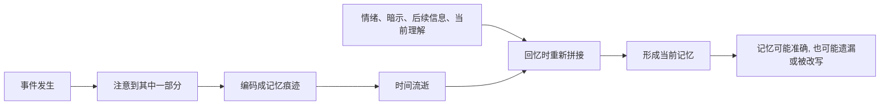

## 心理学思维筑基课: 记忆不是录像, 而是重建
  
### 作者  
digoal  
  
### 日期  
2026-05-05 
  
### 标签  
记忆 , 碎片 , 重建 , 录像 , 注意 , 编码 , 遗漏 , 改写 , 加重片段 , 模糊非焦 , 扭曲 , 补全  
  
----  
  
## 背景 
人的记忆会被情绪、暗示、当前立场和后续信息改写。  
  
> 面向对象: 初中到高中学生  
> 核心问题: 为什么我们明明很确定自己记得没错，后来却发现记忆可能被改写、补全甚至混淆了？  
> 先说结论: 记忆不是像摄像机一样完整保存过去，而是大脑在回忆时根据线索、情绪、已有知识和后续信息重新拼出来。记忆可以很有用，但它不是原始录像；越依赖主观回忆，越要警惕遗漏、扭曲和补全。

## 一张图先看懂



## 求真讲法

### 它到底说了什么

“记忆不是录像，而是重建”可以先用一句话理解：

> 回忆不是把过去原封不动播放出来，而是大脑根据留下的线索重新组合过去。

如果记忆像录像，那么我们每次回忆都应该能精确回放：

- 谁先说了什么。
- 当时每个细节在哪里。
- 自己当时真正想了什么。
- 后来别人说的话不会改变原始记忆。

但现实不是这样。  
人回忆时常常会：

- 忘掉细节。
- 用常识补全空白。
- 把后来听到的信息混进原本记忆。
- 因为情绪强烈而特别记住某部分，同时忽略其他部分。

一个简单对比：

| 录像式理解 | 重建式理解 |
|---|---|
| 记忆完整保存过去 | 记忆保存的是线索和片段 |
| 回忆就是播放 | 回忆是重新拼接 |
| 越自信越准确 | 自信不一定等于准确 |
| 后续信息不会改变记忆 | 后续信息可能参与重建 |

所以，这条原则真正表达的是：

**记忆是有解释、有选择、有补全的心理过程，不是纯粹复制过去。**

### 它是怎么来的

这条原则来自认知心理学和记忆研究中的大量观察。

第一，**注意力决定了最初记住什么。**  
如果事件发生时你根本没有注意到某个细节，后面就很难“真实回忆”它。

第二，**大脑会用已有知识补全空白。**  
比如你记得“去餐厅吃饭”，但可能并不记得服务员具体说了哪句话。回忆时，大脑会用“餐厅通常会发生什么”来补足场景。

第三，**后续信息会改变回忆。**  
别人后来怎么描述一件事、老师怎么提示、同学怎么讨论，都可能影响你后来怎么记得它。

第四，**情绪会改变记忆重点。**  
害怕、愤怒、羞耻、兴奋会让某些细节特别突出，也可能让其他细节被压低。

可以用一个简单的 ASCII 图理解：

```text
真实事件
  -> 我注意到的片段
  -> 我理解后的编码
  -> 后来信息和情绪参与加工
  -> 当前回忆
```

这就是为什么两个人经历同一件事，回忆版本可能差很多，而且两个人都可能真诚地相信自己记得对。

### 它依赖哪些假设

“记忆不是录像，而是重建”成立，依赖几个关键前提。

| 假设 | 含义 | 如果不成立会怎样 |
|---|---|---|
| 注意力有限 | 最初只能记住事件的一部分 | 如果能完整记录一切，重建误差会少很多 |
| 记忆会随时间变化 | 痕迹会减弱、混合或被改写 | 如果记忆永远固定，后续信息影响会很小 |
| 回忆需要线索 | 需要靠提示和背景重新提取 | 如果无需线索，回忆会更像直接播放 |
| 大脑追求意义连贯 | 会补全故事，使它更合理 | 如果不补全，很多回忆会很碎片化 |

这也说明一句关键的话：

> 记忆失真不一定代表撒谎，很多时候只是大脑正常工作的副作用。

### 常见误解

**误解一：我记得很清楚，所以一定准确。**  
不对。清晰感和准确性不是同一回事。

**误解二：记忆会失真，所以记忆完全不可信。**  
不对。记忆不是完美录像，但仍然能提供重要线索。

**误解三：记错就是故意骗人。**  
不对。人可以非常真诚地记错。

**误解四：情绪越强，记忆越准确。**  
不一定。强情绪可能让核心画面更深，也可能让边缘细节更模糊。

## 求存讲法

### 它有什么用

这条原则最大的作用，是让你在依赖记忆时更谨慎。

它会提醒你：

- 不要把“我很确定”直接等同于“事实一定如此”。
- 重要事情尽量及时记录。
- 发生争执时，允许不同人有不同记忆版本。
- 判断证词、传闻和回忆时，要看证据，而不是只看语气多坚定。

这不是让人怀疑一切，而是让人知道记忆有边界。

### 它怎么迁移到熟悉领域

这个原则在学生生活中非常常见。

| 场景 | 记忆重建如何出现 |
|---|---|
| 考试复盘 | 你以为题目是这样问的，实际不是 |
| 同学争吵 | 双方都记得对方“先挑衅”，版本不同 |
| 老师布置任务 | 后来同学讨论会改变你对原话的记忆 |
| 童年回忆 | 家人反复讲述的版本，会影响你怎么记得 |

迁移后的核心意思是：

> 重要信息不能只靠脑子记，越重要，越要留下外部记录。

### 它的适用范围和边界

这条原则适合用于：

- 理解学习中的遗忘和复习。
- 理解争执中为什么双方都觉得自己没错。
- 理解证人记忆、传闻和回忆的风险。
- 训练自己用记录、复盘和证据辅助记忆。

但它也有边界。

第一，记忆不是录像，不代表记忆没有价值。  
很多记忆大体方向仍然可靠。

第二，重建不等于随便编造。  
大脑通常是在已有片段基础上补全，而不是完全凭空造。

第三，有些记忆更稳定，有些更容易变。  
反复练习的知识、强关联的经历，通常比零散细节更稳。

第四，创伤记忆更复杂。  
有些细节特别鲜明，有些部分可能断裂或模糊，不能简单套一个规则解释。

### 正例: 怎么用它提升能力

假设一个学生听完老师布置任务后，觉得自己肯定记住了。

如果他知道“记忆不是录像”，就不会只靠脑子，而会做三件事：

- 当场写下关键要求。
- 用自己的话复述一遍。
- 第二天开始做之前再核对记录。

这不是因为他记忆力差，而是因为他知道：  
时间一过，记忆会被其他事情、同学讨论和自己的理解重新加工。

这种做法能显著减少“我以为老师是这么说的”带来的错误。

### 反例: 前提不成立会怎样

假设两个同学发生争执。

甲说：“我清楚记得是你先骂我的。”  
乙说：“不对，我明明记得是你先阴阳怪气。”

如果双方都把记忆当录像，就会认为：

- 我记得清楚，所以我一定对。
- 你和我不一样，所以你一定在撒谎。

这样冲突会升级。

但如果理解记忆是重建，就会多一种可能：  
双方都记住了对自己情绪最强的片段，也都可能忽略了自己之前说过的刺激性话语。

这里失败的根本原因，是忽略了“注意力有限”和“大脑追求意义连贯”这两个前提。  
人在冲突里，往往特别记得对方伤害自己的部分，而不一定完整记得自己做了什么。

## 思考

为什么人会如此相信自己的记忆？

因为记忆出现在脑中时，感觉不像“我正在重建”，而像“我正在看见过去”。  
这种真实感很强，让人很难意识到里面已经混入了理解、情绪和后续信息。

这也引出几个更深的问题：

- 你现在记得的，是事实本身，还是你后来形成的故事？
- 你对一件事越愤怒，是否越可能只记住支持自己立场的部分？
- 如果未来的你会重新解释今天，今天该留下什么记录？

成熟的心理学思维，不是否定记忆，而是给记忆配上证据意识：

- 及时记录。
- 多方核对。
- 区分事实、解释和感受。
- 允许自己和别人都可能真诚地记错。

“记忆不是录像，而是重建”真正教人的，是在相信体验的同时，也保持对事实的谦逊。

## 最后记住

1. 记忆不是原样播放过去，而是在回忆时根据线索重新组合。
2. 注意力、情绪、后续信息和已有知识，都会影响记忆内容。
3. 记得清楚不等于一定准确，自信和准确性不是同一回事。
4. 记忆失真不一定是撒谎，很多时候是正常认知机制的结果。
5. 越重要的事情，越不要只靠记忆，要靠记录、核对和证据辅助。

## 参考资料

- Elizabeth F. Loftus 相关错误记忆与误导信息研究，展示后续信息如何改变人的回忆。
- Frederic Bartlett, *Remembering*, 关于记忆作为建构和重建过程的经典研究。
- Daniel L. Schacter, *The Seven Sins of Memory*, 关于记忆常见失误和机制的通俗心理学框架。
- David G. Myers, *Psychology*, 关于记忆编码、储存、提取和遗忘的通用教材体系。
- 本文为面向学生的简化解释，基于通用认知心理学教材框架，不用于诊断或替代专业心理帮助。
  
  
#### [PostgreSQL 解决方案集合](../201706/20170601_02.md "40cff096e9ed7122c512b35d8561d9c8")
  
  
#### [德哥 / digoal's Github - 公益是一辈子的事.](https://github.com/digoal/blog/blob/master/README.md "22709685feb7cab07d30f30387f0a9ae")
  
  
#### [About 德哥](https://github.com/digoal/blog/blob/master/me/readme.md "a37735981e7704886ffd590565582dd0")
  
  

  
